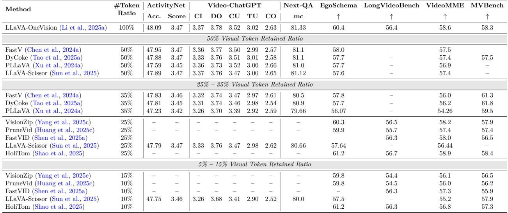
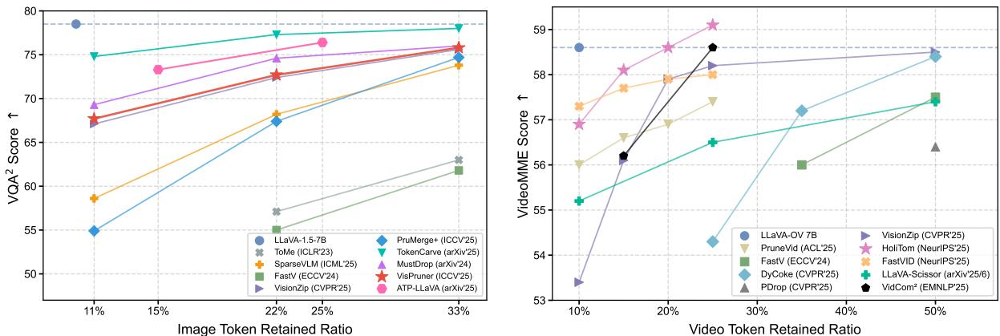

[← 返回 README](../README.md)

# 4 Video-centric Token Compression

## 📌 预览
视频相比图像多了时间维度的冗余。本章介绍视频 token 压缩的四类方法：Transformation（2D/3D 池化和卷积）、Similarity（帧聚类+token 合并）、Attention（编码器/解码器注意力剪枝）、Query（token 蒸馏和跨模态选择）。

---

Processing long high-definition (HD) videos poses significant challenges for VLMs due to the immense number of tokens generated, far exceeding those from high-resolution images. Unlike image-centric compression, video inherently possesses an additional temporal redundancy. While capturing complete temporal information typically requires a frame rate of at least 24 frames per second (FPS), processing a 10-minute HD video at even 1 FPS still yields token sequences orders of magnitude larger than those from high-resolution images, rendering conventional transformer-based MLLMs impractical for real-world deployment over the videos.

> 💡 **视频的特殊挑战**: 即使 1 FPS 采样 10 分钟 HD 视频，token 量仍远超高分辨率图像。视频有图像没有的**时间冗余**。

To address this, current video LLMs commonly employ a 1 FPS sampling rate to reduce token counts. Furthermore, unlike methods for single images, which often encode both the global image and a series of local patches for detailed feature extraction, video processing often foregoes this detailed frame-level segmentation to keep token numbers manageable. Even with these strategies, the quantity of video tokens remains substantial. During model training and understanding, transformation-based methods, such as the pooling technique used in LLaVA-Video (Zhang et al., 2024d), are usually employed to reduce tokens and aid the model's comprehension of video content.

> 💡 **当前视频 LLM 的基础策略**:
> 1. 采样率降到 1 FPS
> 2. 不做 local patch 细粒度编码（不像图像那样编码缩略图+裁切）
> 3. 训练时加 transformation 压缩（如 LLaVA-Video 的池化）
> 即便如此，token 量依然庞大。

Beyond training-time optimizations, alternative approaches primarily focus on post-training optimization. Specifically, similarity-based and attention-based methods offer generic compression techniques for pretrained video MLLMs. These methods process encoded token sequences without modifying model weights, enabling plug-and-play acceleration across diverse architectures. By dynamically identifying critical spatiotemporal regions and pruning redundant tokens, these techniques significantly enhance the practicality of video MLLMs for real-world applications.

> 💡 **Training-free vs Training-based**: Transformation 方法通常需要训练；Similarity 和 Attention 方法通常是 post-training（plug-and-play），更实用。

To fully grasp token compression for video LLMs, it is recommended to first review Section 3, which details spatial compression methods. Next, we will primarily discuss techniques addressing the temporal domain. Similar to image-centric methods, selected video-centric token compression methods are compared in Table 3.

*Table 3: Comparison of Training-Free Token Compression Methods for Video LLMs in Understanding Tasks*

> 💡 **Table 3 批读** — Video LLM 压缩方法对比（基于 LLaVA-OneVision）:
> - **50% 保留率**: DyCoke、FastV、LLaVA-Scissor 性能几乎无损（VideoMME ~57.5 vs 基线 58.6）
> - **25% 保留率**: HoliTom 表现最优（VideoMME 58.9，EgoSchema 61.2），甚至接近基线
> - **10% 保留率**: HoliTom 仍保持 VideoMME 56.8，展现极强的压缩鲁棒性
> - **关键发现**: 视频 token 冗余极高，保留 25% 即可接近无损；10% 仍能保持 ~97% 性能

---

## 4.1 Transformation-based Video-centric Compression

Like image LLMs, video LLMs use encoders for visual tokens. Consequently, transformation-based videocentric compression methods fundamentally operate on the principles established in Section 3.1, with the added capability of performing 3D transformations. A multitude of models showcase cross-modal applicability, performing effectively in both image and video inference tasks. Following the structure of Section 3.1, we will now detail transformation-based video-centric compression methods.

### 4.1.1 2D/3D Pooling

In video LLMs, token pooling is a crucial strategy for managing the high dimensionality of video data. While 2D spatial pooling, as seen in LLaVA-Video (Zhang et al., 2024d), can effectively reduce the token count within individual frames, its efficacy alone may be limited for long-duration videos. A growing number of video LLMs, including PLLaVA (Xu et al., 2024a), Video-ChatGPT (Maaz et al., 2024), SlowFastLLaVA (Xu et al., 2025d), and LongVLM (Weng et al., 2024), consequently emphasize temporal pooling, which involves downsampling at the frame level.

> 💡 **视频池化的两个维度**:
> - **空间池化 (2D)**: 减少每帧的 token 数（同图像）
> - **时间池化**: 减少帧数/帧级 token → 对长视频更关键

Notably, PLLaVA demonstrates that model performance exhibits greater sensitivity to temporal pooling than to spatial pooling, highlighting its critical role. For extremely long video sequences, LLaMA-VID (Li et al., 2024d) employs a more aggressive adaptive pooling approach. This method intelligently maintains original resolution for single-image inputs but compresses each video frame to a single token during extended sequence processing, achieving substantial data reduction while aiming to preserve essential information.

> 💡 **PLLaVA 的发现**: 模型对**时间池化**比空间池化更敏感！→ 时间维度压缩需更谨慎。LLaMA-VID 对长视频每帧压到 1 个 token，极限压缩。

This dual focus on spatial and increasingly on temporal pooling underscores their combined importance in enabling efficient processing and comprehensive understanding of video content, particularly as video durations extend. SlowFast-LLaVA (Xu et al., 2025d) incorporates a two-stream SlowFast projector into a LLaVA-style architecture, using a slow pathway to sample fewer, spatially rich frames and a fast pathway to sample more, spatially compressed frames, then concatenates both for the LLM—achieving efficient long-form video understanding with reduced token count while preserving spatiotemporal details.

> 💡 **SlowFast-LLaVA**: 借鉴视频理解经典 SlowFast 架构——Slow 路径（少帧、高空间分辨率）+ Fast 路径（多帧、低空间分辨率）→ 拼接后送入 LLM。兼顾空间细节和时间覆盖。

### 4.1.2 2D/3D Convolution

Similar to pooling, convolution can also be employed for downsampling video tokens, but it does so in a parameterized manner. Instead of simply aggregating information like pooling, convolution layers learn filters to process and condense spatial and temporal features. VideoLLaMA 2 (Cheng et al., 2024c), for instance, thoroughly investigated both 2D and 3D pooling and convolution approaches. Their experiments showed that 3D convolution yielded the best balance of performance and efficiency for video token downsampling. This suggests that learning intricate spatiotemporal relationships through convolutions is more effective for comprehensive video understanding compared to pooling alone.

> 💡 **VideoLLaMA 2 的实验结论**: 3D 卷积 > 2D 卷积 > 池化（在视频 token 下采样任务上）。3D 卷积能学习复杂时空关系，效果更好。

*Figure 4: Trade-off between Retained Ratio and Performance across Modalities. Left: We visualize changes in token retention and model performance on the VQA² (Goyal et al., 2017) for image LLMs using each method's reported setup with LLaVA-1.5-7B (Liu et al., 2023). Right: For video LLMs, we plot the video-token retention ratio and the corresponding performance deltas on the VideoMME benchmark (Fu et al., 2025a), following each method's reported configuration with LLaVA-OV-7B (Li et al., 2025a). As different methods target distinct compression regimes, we primarily report results at the compression rates specified in their original papers.*

> 💡 **Figure 4 批读** — Token 保留率 vs 性能权衡:
> - **图像 (左)**: 大多数方法在 25%~50% 保留率时性能降幅 <2 分。PruMerge+ 在 25% 保留率时几乎无损
> - **视频 (右)**: 类似趋势，但视频对压缩更鲁棒——10% 保留率时性能降幅仍可接受
> - **核心洞察**: 视频 token 冗余度显著高于图像，压缩空间更大

---

## 4.2 Similarity-based Video-centric Compression

Given the temporal redundancy inherent in video, where adjacent frames often exhibit high visual similarity, temporal compression is frequently prioritized over or integrated with spatial compression. To effectively handle this temporal redundancy, video frames are typically first clustered.

> 💡 **视频 similarity 方法的特点**: 先处理时间冗余（帧间相似性），再处理空间冗余。通常先聚类帧，再在帧内聚类 token。

Chat-UniVi (Jin et al., 2024) initially pools each video frame into a single frame-level representation token. It then utilizes DPC-KNN (Du et al., 2016; Rodriguez & Laio, 2014) (density peak clustering based on K-nearest neighbors) to amalgamate non-essential frames based on these frame representation tokens. Within each resulting cluster, tokens from multiple frames are further clustered to obtain concise spatiotemporal visual representations. Similarly, FastVID (Shen et al., 2025a) divides video frames solely based on the similarity of their adjacent frame representation tokens. It then employs DPC-KNN within these clustered frames to merge tokens, thereby reducing spatiotemporal redundancy. PruneVid (Huang et al., 2025c) adopts the same frame clustering methodology as Chat-UniVi. The key distinction is that it performs an initial merging of temporally static tokens before executing the spatiotemporal token consolidation. HoliTom (Shao et al., 2025) argues that relying on a single frame-level representation token for video frame clustering can lead to suboptimal detail capture, and that the preliminary merging of static temporal tokens is disconnected from the original frame clustering method. HoliTom re-conceptualizes temporal redundancy compression as an optimization problem aimed at maximizing the compressible temporal redundant features within all clustered frames, thus addressing temporal compression more holistically. DyCoke (Tao et al., 2025a) groups frames into sets of four, directly performing temporal pruning within each group.

> 💡 **视频 Similarity 方法演进**:
> - **Chat-UniVi**: 每帧 → 1 个代表 token → DPC-KNN 聚类帧 → 帧内 token 聚类
> - **FastVID**: 按相邻帧相似度分组 → DPC-KNN 合并 token
> - **PruneVid**: 先合并时间静态 token → 再做时空聚合（比 Chat-UniVi 多一步预处理）
> - **HoliTom**: 批评「单 token 代表一帧」不够好 → 把时间冗余压缩建模为优化问题
> - **DyCoke**: 简单分组（每 4 帧一组）→ 组内时间剪枝

While some methods do not explicitly cluster video frames, FrameFusion (Fu et al., 2025b), for example, acts as a token compression technique for video LLMs. It directly merges temporally redundant tokens exceeding a specific threshold in the shallow layers of the model.

> 💡 **FrameFusion**: 不做帧聚类，直接在 LLM 浅层合并时间冗余超过阈值的 token。更简洁直接。

---

## 4.3 Attention-based Video-centric Compression

Current attention-based token compression methods in video LLMs and image LLMs share significant similarities. When attention is applied within the encoder to guide token compression, videos are typically treated as a sequence of images fed into an image encoder, making these approaches similar to image-centric token compression. For a more concise discussion of such attention-based methods, please refer to Section 3.3.

In contrast, methods employing attention within the decoder process video frames sequentially, concatenating their tokens over time. For longer videos, particularly in the context of streaming video LLMs, windowed attention is commonly used to mitigate computational overhead by focusing on local temporal visual information. However, it's notable that even these windowed attention-based methods within the decoder often share the same foundational principles as those discussed in Section 3.3.

> 💡 **视频 Attention 方法**: 与图像方法高度相似。Encoder 内压缩时视频被当作图像序列处理；Decoder 内压缩时帧按时间拼接，长视频常用 windowed attention。详细方法论见 Section 3.3。

---

## 4.4 Query-based Video-centric Compression

### 4.4.1 Token Distillation

Token distillation in video LLMs commonly relies on specialized adaptor modules, such as the Q-former (Liu et al., 2023; Li et al., 2023c) or Token Turing Machines (Ryoo et al., 2023). These modules typically process video tokens with the learnable query tokens to be attended.

Token Turing Machines (TTMs) (Ryoo et al., 2023) maintain a compact external memory of summary tokens, sequentially compressing both new input tokens and memory at each timestep via a Transformerbased read/write mechanism, allowing scalable and efficient processing of long video sequences. BLIP-3-Video (Ryoo et al., 2024) introduces an explicit temporal encoder that abstracts hundreds of frame-level visual tokens into as few as 16–32 spatiotemporal tokens using learnable pooling and sequential models, enabling efficient video understanding with limited token usage. LinVT (Gao et al., 2024a) proposes a plug-and-play Linear Video Tokenizer, which linearly aggregates frame-level visual tokens into a compact set of video tokens through spatio-temporal scoring, multi-scale pooling, and text-conditioned aggregation, enabling existing image-LLMs to efficiently process videos and dynamically extract question-relevant information. LongVMNet (Gurukar & Kadav, 2025) accelerates long-form video understanding by using a neural sampler to select discriminative visual tokens from clips and storing them in a fixed-size memory bank for each video; downstream queries are answered by processing only these memory tokens, greatly reducing computational cost while preserving key spatiotemporal information. STORM (Jiang et al., 2025a) inserts a Mamba-based (Gu & Dao, 2024a) temporal encoder between the image encoder and LLM, using spatiotemporal scanning and pooling to inject temporal context into frame tokens and then aggressively compresses tokens by temporal and spatial pooling, enabling efficient long video understanding with minimal token loss. To understand more methods and applications of token distillation in video LLMs, please also refer to Section 3.4 for a detailed explanation.

> 💡 **视频 Token Distillation 方法**:
> - **TTM (Token Turing Machines)**: 维护外部 memory → 每个时间步读写压缩 → 可扩展处理长视频
> - **BLIP-3-Video**: 时间编码器把数百帧 token → 16~32 个时空 token
> - **LinVT**: 线性聚合 + 文本条件聚合 → plug-and-play，让 image-LLM 处理视频
> - **LongVMNet**: 神经采样器选 token → 固定大小 memory bank → query 只处理 memory
> - **STORM**: Mamba 时间编码器 + 激进的时空池化

### 4.4.2 Cross-Modal Selection

In video large language models (video LLMs), a query is commonly used to guide the selection of salient frames. In extreme cases, only a handful of frames are relevant to the posed question, allowing the tokens from the vast majority of remaining frames to be discarded. When dealing with an immense number of frames, finding query-relevant information can be akin to searching for a "needle in a haystack" for the LLM. Query-based token compression methods can pre-filter query-relevant tokens, significantly alleviating the computational burden on the LLM.

LongVU (Shen et al., 2025b) exemplifies this approach. It calculates the relevance of each video frame to the query via cross-modal interaction. This relevance score then dictates a lower compression ratio for key frames, better preserving critical information, all while ensuring the total number of tokens remains within the maximum context length of the LLM.

> 💡 **视频 Cross-Modal Selection**:
> - 视频中的"大海捞针"问题：可能只有几帧和问题相关
> - **LongVU**: 计算每帧与 query 的相关性 → 关键帧低压缩率、非关键帧高压缩率 → 总 token 数控制在 context window 内
> - 这种自适应压缩策略对长视频理解非常有价值

---

## 🔖 Section 总结

### 关键数字速查
| 指标 | 数值 |
|------|------|
| 视频当前采样率 | 通常 1 FPS |
| 25% 保留率性能 | VideoMME ~58.9 (vs 基线 58.6) |
| 10% 保留率性能 | VideoMME ~56.8 (仍可接受) |
| BLIP-3-Video 压缩 | 数百帧 → 16~32 tokens |

### 核心洞察
1. 视频 token 冗余度远高于图像，压缩空间更大（10% 保留率仍可接受）
2. 时间维度压缩比空间维度更重要（PLLaVA 实验验证）
3. Similarity 方法在视频中更突出——帧间相似性是天然的压缩信号
4. SlowFast 双路径架构是一种优雅的设计——空间细节和时间覆盖的权衡
