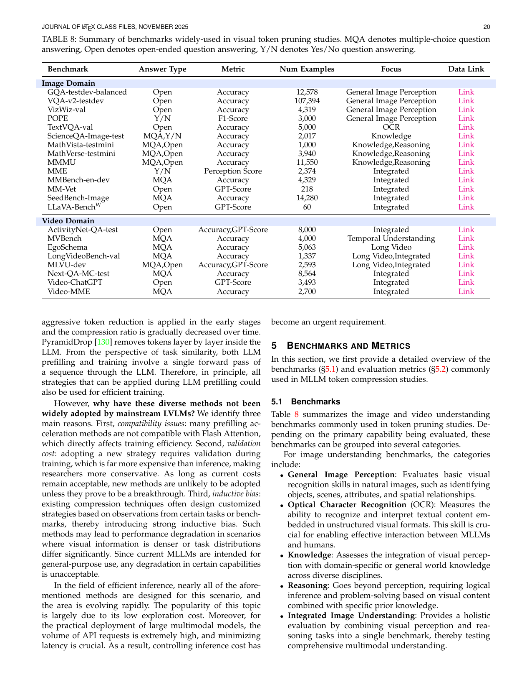

[← 返回 README](../README.md)

# 5. Benchmarks and Metrics

## 📌 预览
总结 token compression 研究中常用的评测 benchmark 和效率指标。

---

## 5.1 Benchmarks

*Table 8: Summary of benchmarks widely-used in visual token pruning studies.*

> 💡 **Table 8 批读**: 
> **图像 Benchmarks** 按能力分类：
> - **General Perception**: GQA, VQA-v2, VizWiz, POPE — 基础视觉识别
> - **OCR**: TextVQA — 图像中文字识别
> - **Knowledge**: ScienceQA, MathVista, MathVerse, MMMU — 知识推理
> - **Integrated**: MME, MMBench, MM-Vet, SeedBench, LLaVA-BenchW — 综合评测
> 
> **视频 Benchmarks**:
> - **Temporal**: MVBench — 时序理解
> - **Long Video**: EgoSchema, LongVideoBench, MLVU — 长视频理解
> - **Integrated**: ActivityNet-QA, Next-QA, Video-ChatGPT, Video-MME — 综合

For image understanding benchmarks, the categories include:
- **General Image Perception**: Evaluates basic visual recognition skills in natural images, such as identifying objects, scenes, attributes, and spatial relationships.
- **Optical Character Recognition (OCR)**: Measures the ability to recognize and interpret textual content embedded in unstructured visual formats.
- **Knowledge**: Assesses the integration of visual perception with domain-specific or general world knowledge across diverse disciplines.
- **Reasoning**: Goes beyond perception, requiring logical inference and problem-solving based on visual content combined with specific prior knowledge.
- **Integrated Image Understanding**: Provides a holistic evaluation by combining visual perception and reasoning tasks into a single benchmark.

For video understanding benchmarks:
- **Temporal Understanding**: Measures the ability to capture and interpret temporal dynamics, such as action sequences, motion patterns, and event localizations.
- **Long Video Understanding**: Evaluates the capacity to process and reason over long-form videos, ranging from several to tens of minutes.
- **Integrated Video Understanding**: Offers a holistic assessment of perception and reasoning skills in video contexts.

---

## 5.2 Metrics

The evaluation of MLLM token compression methods primarily considers two perspectives: downstream task performance (effectiveness) and computational efficiency (efficiency).

### 5.2.1 Effectiveness

Most benchmarks adopt **Accuracy** as the primary metric. For open-ended tasks without a single correct answer (e.g., image captioning), **GPT-Score** is employed.

### 5.2.2 Efficiency

Efficiency can be evaluated from several complementary aspects:

| 指标 | 描述 | 特点 |
|------|------|------|
| **Token Retention Count/Ratio** | 压缩后保留的 visual tokens 数量/比例 | 常用于方法对比，但相同保留率不保证相同延迟 |
| **Prefilling/Decoding FLOPs** | 理论计算量（浮点运算次数） | 硬件无关 |
| **Prefilling/Decoding Latency** | 实际墙钟时间 | 硬件相关 |
| **Memory Usage** | 峰值显存占用 | 部署关键，token 压缩可减少 KV-cache 和中间表征的内存 |

> 💡 **评测陷阱**: 相同的 Token Retention Ratio 不代表相同的推理延迟！因为压缩位置不同（VE vs. LLM），实际加速效果完全不同。VE 处压缩收益最大（下游全加速），LLM 浅层压缩则浅层仍需处理全部 tokens。

---

## 🔖 Section 总结

### 核心洞察
1. **Benchmark 覆盖面**: 图像 14 个 + 视频 8 个常用 benchmark，但仍缺乏细粒度任务分类
2. **效率指标多维**: FLOPs（理论）和 Latency（实际）可能不一致
3. **Memory Usage 对部署至关重要**: 尤其在边缘设备和长视频场景
