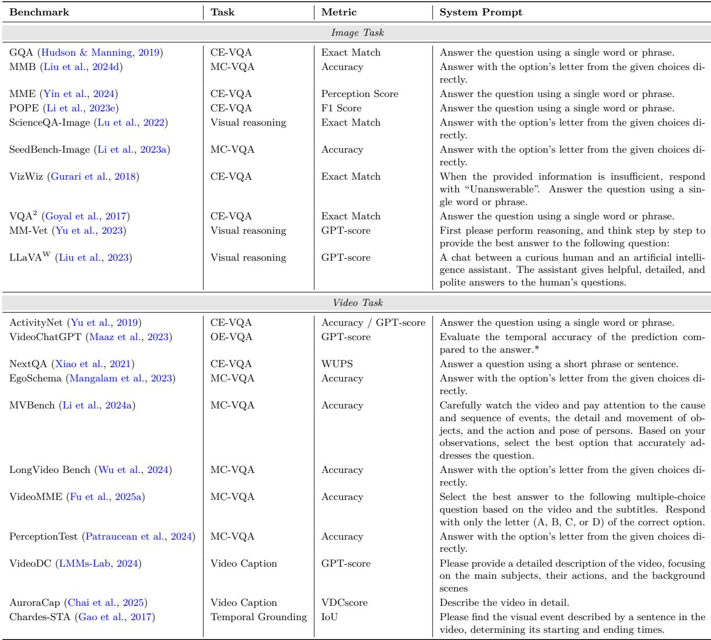

[← 返回 README](../README.md)

# 6 Discussions

## 📌 预览
本章讨论了 token 压缩与其他压缩方法的关系（权重压缩 vs token 压缩的正交性）、token 压缩超越效率的价值（模态对齐、信息表示、长上下文理解）、方法组合策略、跨模态压缩、当前挑战（性能退化、任务特异性、部署障碍、评估缺陷）、剪枝位置权衡，以及未来方向。

---

## 6.1 Synergies and Distinctions with Other Compression Methods

Beyond token compression, the research community has seen the emergence of several other compression methods, including model quantization (Lin et al., 2024b; Xiao et al., 2023a; Frantar et al., 2023; Shang et al., 2023; Sui et al., 2024a; Gholami et al., 2022), network pruning (Han et al., 2016; Ma et al., 2023; Sui et al., 2021; Cheng et al., 2024a), knowledge distillation (Hinton et al., 2015; Gou et al., 2021), and low-rank factorization (Yu et al., 2017; Yin et al., 2021; Xiao et al., 2023b; Sui et al., 2024b; Yang et al., 2024). These methods typically focus on directly compressing model weights to achieve efficiency.

For Transformer-based models, the computational cost (FLOPs) is mainly dominated by matrix multiplications, particularly in the self-attention and feed-forward layers. A simplified formulation is given as:

$$\text{FLOPs} \propto O(N \cdot D^2 + N^2 \cdot D),$$

where N is the number of tokens, D is the model dimension.

> 💡 **FLOPs 公式解读**: Transformer 的两大计算来源:
> - N·D²: FFN 层（线性于 token 数 N）
> - N²·D: Self-attention 层（**二次于 token 数 N**）
> 权重压缩减 D，token 压缩减 N，两者正交。

### 6.1.1 Weight-Focused Compression Methods

These methods mainly target the model dimension (D) by reducing the effective size or complexity of the model weights. Model Quantization reduces weight precision, directly impacting the memory associated with D. A key limitation is that highly aggressive quantization (e.g., 4-bit) often compromises accuracy, meaning there's no "free lunch" when it comes to achieving lossless performance. Furthermore, effectively accelerating these lower bit-rates often necessitates specialized hardware. Network Pruning removes redundant connections, effectively reducing the active parameters contributing to D. For LLMs, aggressive structured pruning (e.g., beyond 20% for downstream tasks) often leads to significant performance degradation or near-collapse due to the difficulty in preserving architectural integrity. Knowledge Distillation trains a smaller student model (with a smaller D) to mimic a larger teacher (Hinton et al., 2015). Its main limitation is the "knowledge gap", as the student may struggle to fully capture the teacher's comprehensive knowledge, leading to performance disparities, especially on complex or out-of-distribution data. Low-Rank Factorization decomposes weight matrices into lower-rank approximations, thus reducing parameters related to D. The challenge lies in finding an optimal low-rank approximation for diverse tasks without performance loss, as this is often task-dependent and complex to apply consistently across deep networks.

> 💡 **权重压缩四类方法及其局限**:
> | 方法 | 目标 | 局限 |
> |------|------|------|
> | 量化 | 降低权重精度 | 4-bit 损精度、需特殊硬件 |
> | 网络剪枝 | 移除冗余连接 | LLM 结构化剪枝 >20% 容易崩 |
> | 知识蒸馏 | 小模型模仿大模型 | 「知识鸿沟」——复杂任务性能差 |
> | 低秩分解 | 矩阵低秩近似 | 任务相关、难以跨层一致应用 |

### 6.1.2 Token Compression

In contrast, token compression directly targets the sequence length (N) by reducing the number of tokens processed for long contexts. By reducing N, token compression significantly impacts FLOPs:

$$\text{FLOPs} \propto O(M \cdot D^2 + M^2 \cdot D),$$

where M ≪ N represents the reduced sequence length after token compression.

This approach offers benefits like greater efficiency for long context processing, overcoming context window limitations, and closer alignment with API cost reduction, as many LLM APIs charge by token count.

> 💡 **Token 压缩的独特优势**:
> 1. 长上下文处理效率提升（M² << N²）
> 2. 突破 context window 限制
> 3. **直接降低 API 成本**（按 token 计费）— 这个很实用！

### 6.1.3 Complementary Nature and Synergistic Gains

The methods for compressing model weights and token compression are structurally orthogonal and can be effectively combined for superior results. For example: NVILA (Liu et al., 2025e) pushes inference latency reduction and throughput maximization to the extreme by simultaneously applying quantization and token compression. CoreMatching (Wang et al., 2025b) achieves synergistic acceleration by concurrently compressing both neurons (a form of pruning/weight reduction) and tokens.

This orthogonality means that combining these approaches holds the potential for compounded efficiency gains that are greater than applying either method in isolation.

> 💡 **正交 = 可以叠加**:
> - **NVILA**: 量化 + token 压缩 → 极致推理加速
> - **CoreMatching**: 神经元压缩 + token 压缩 → 协同加速
> - 核心洞察：减 D 和减 N 互不冲突，组合收益 > 单独使用

---

## 6.2 Token Compression: Efficiency and Beyond

Token compression is often perceived solely as a training-free method to boost efficiency. However, its significance extends far beyond this, having been intrinsically incorporated into the design of MLLM, particularly within the modality transition modules (e.g., adapter). This integration not only facilitates superior modality alignment but also enhances the quality of information, leading to more efficient and stable training.

> 💡 **Token 压缩不只是提速工具**——它已经深入到 MLLM 架构设计中（如 adapter），还能改善模态对齐和信息质量。

### 6.2.1 Enhanced Modality Alignment

Effectively aligning and comprehending information from disparate modalities remains a significant challenge. Traditional encoders segment and tokenize all multimodal information to align with linguistic representations. However, low-quality and low-density multimodal representations expand the alignment space, complicating the task of modality matching. Token compression addresses this by enabling a more precise correspondence between language representations and multimodal information.

A prime example is the Q-Former (Liu et al., 2023; Li et al., 2023c), which employs a trainable vector to distill visual tokens, achieving direct alignment of the modality simultaneously. Similarly, M³ (Cai et al., 2024a) adopts a coarse-to-fine semantic granularity training approach, empowering MLLMs to align with and interpret visual representations at various levels.

> 💡 **压缩促进对齐**: 低质量、低密度的多模态表示增大了对齐空间，使模态匹配更难。Token 压缩通过提炼信息密度，让视觉和语言表示更容易精确对应。Q-Former 就是压缩+对齐的一体化设计。

### 6.2.2 Improved Information Representation

The sheer volume of multimodal information often leads to inefficient training and inference, with an overabundance of multimodal tokens that potentially degrade the capabilities of the text modality (BellverSoler et al., 2025). This issue is compounded by inherent redundancies within multimodal data itself: (1) Feature Redundancy arises from similar backgrounds in visual data or silent segments in audio. (2) Task-Irrelevant Redundancy is evident in tasks like visual question answering (VQA), where a significant portion of multimodal representations may be irrelevant to deriving the correct answer. (3) Attention Computation Redundancy emerges from two aspects: first, due to the nature of attention mechanisms, tokens positioned later in a sequence often receive disproportionately higher attention (Wen et al., 2025), suggesting potential computational redundancy for tokens not at the sequence's end; and second, because multimodal information receives inherently less attention than textual data (Chen et al., 2024a; Song et al., 2025a), an abundance of multimodal tokens can still introduce substantial computational redundancy.

> 💡 **三类冗余与对应方法**:
> | 冗余类型 | 来源 | 对应方法 |
> |---------|------|---------|
> | 特征冗余 | 相似背景/静音 | Transformation + Similarity |
> | 任务无关冗余 | VQA 中无关区域 | Query-based |
> | 注意力计算冗余 | 多模态 token 注意力天然低 | Attention-based |

Addressing these issues, the method classifications discussed earlier directly correspond to these types of data redundancy. Specifically, the transformation-based methods along with similarity-based approaches, are effective in mitigating the feature redundancy. Furthermore, attention-based methods play a crucial role in minimizing attention computation redundancy. Lastly, query-based methods are designed to reduce task-irrelevant redundancy.

### 6.2.3 Enable One-Shot Long-Context Understanding

Limited by the inherent length of the context, MLLMs are unable to comprehend real-world scenarios involving extremely long contexts, such as understanding entire code repositories or extended video and audio sequences (Qu et al., 2025). However, token compression significantly condenses and abstracts original information representations, making it possible for MLLMs to understand these long contexts in a single pass.

Traditional methods for handling long contexts in MLLMs, like FlashAttention (Dao et al., 2022; Dao, 2024) or RingAttention (Liu et al., 2024a), involve architectural changes to the model's attention mechanism to directly accommodate longer sequences. While effective, these require fundamental model modifications. Token compression offers a different, often simpler, route. Instead of redesigning the model to fit more tokens, it focuses on making each token more powerful. By creating information-dense tokens, we pack more meaning into fewer pieces of data. This lets existing MLLM architectures process significantly longer conceptual contexts without major overhauls. It's a more efficient and accessible way to achieve that crucial one-shot understanding of vast, complex real-world information (Song et al., 2025b).

> 💡 **Token 压缩 vs 长上下文架构改进**:
> - FlashAttention/RingAttention: 改模型来容纳更多 token
> - Token 压缩: 让每个 token 更「信息密集」→ 不改模型也能理解更长上下文
> - 后者更简单、更通用、更容易部署

---

## 6.3 Combining Different Token Compression Methods

In Section 6.2.2, we explored three distinct types of redundancy and the corresponding methods to reduce them. This raises a natural question: can we combine multiple token compression methods to achieve a synergistic effect?

We observe that while certain approaches operate orthogonally, others may exhibit conflicts.

For instance, we can first eliminate structural redundancy by addressing feature redundancy, and subsequently filter out task-irrelevant redundancy by selecting tokens most pertinent to the user query. Since these strategies address distinct dimensions of the data, this combination is fundamentally orthogonal.

Similarly, strategic combinations can yield superior performance through careful design. VisionZip (Yang et al., 2025c), for example, prioritizes tokens with high attention scores in the ViT to preserve critical information, while consolidating the remaining tokens via similarity-based merging. This approach safeguards key features from being diluted by similarity-based aggregation. Although these methods are not strictly orthogonal, a tailored design enables them to complement each other effectively.

Conversely, certain combinations may conflict, such as pairing external query-based pruners with attentionbased selection in the decoder. Since the decoder's cross-attention naturally acts as a text-guided filter for multimodal tokens, applying an external query-based compressor beforehand often yields diminishing returns. This occurs because the specific information required to answer a query dictates a lower bound on the token count, limiting the potential for further compression.

> 💡 **方法组合的三种情况**:
> 1. ✅ **正交组合**: 先消除特征冗余（transformation/similarity）→ 再消除任务无关冗余（query）
> 2. ✅ **互补组合**: VisionZip = attention 保留关键 token + similarity 合并其余（需精心设计）
> 3. ❌ **冲突组合**: 外部 query 压缩 + decoder 内 attention 压缩 → 收益递减（decoder cross-attention 本身就是 query-guided filter）

---

## 6.4 Cross-modal token compression

For the joint compression of token across modalities, the prevalent paradigm utilizes the textual modality to compress visual or audio representations. This approach underpins the vast majority of query-based attention methods (See Section 3.4, 4.4, and 5.4).

Conversely, some approaches leverage the visual modality to guide text token compression; for instance, SparseVLM (Zhang et al., 2024c) employs mutual supervision between text and visual modalities to compress tokens in both. Additionally, OmniZip (Tao et al., 2025b) introduces a "listen-to-prune" mechanism, utilizing audio cues to jointly guide the compression of audio and video tokens. Furthermore, given the inherent and distinct redundancies within each modality, orthogonal compression strategies can be stacked to further maximize token reduction. To the best of our knowledge, literature exploring strategies beyond text-guided compression remains scarce; consequently, cross-modal joint optimization represents a promising direction for future research.

> 💡 **跨模态压缩**:
> - **主流**: 文本引导视觉/音频压缩（query-based 方法）
> - **反向**: SparseVLM 用视觉引导文本压缩（双向互监督）
> - **新方向**: OmniZip 用音频引导视频+音频压缩（"listen-to-prune"）
> - **研究空白**: 非文本引导的跨模态压缩研究很少 → 未来机会

---

## 6.5 Current Challenges

### 6.5.1 Performance Degradation

While token compression can effectively condense multimodal features, it also introduces a risk of performance degradation. Current research on visual MLLMs, for example, shows that for models like LLaVA-OV-7B (Li et al., 2025a), near-lossless performance can be achieved by retaining as few as 10% of the original tokens. However, performance declines sharply when the compression rate is pushed further. This challenge is more pronounced for larger and more recent models such as Qwen2.5-VL (Bai et al., 2025), LLaVA-Video-7B (Zhang et al., 2024d), and LLaVA-OV-72B (Li et al., 2025a), where achieving lossless compression seems to be more difficult.

This increased difficulty may stem from the models' enhanced representational capabilities. It has been suggested that less capable models are inherently less sensitive to information loss from aggressive compression, as their weaker understanding already struggles to process the complex, uncompressed data fully. In contrast, more sophisticated models, which possess a more nuanced and holistic comprehension of multimodal tokens, are more susceptible to the subtle degradation caused by compression. For these models, achieving high performance requires a far more delicate and precise approach to preserve the token.

> 💡 **更强的模型更难压缩**:
> - 弱模型（LLaVA-1.5）对压缩不敏感——它本来就没能充分利用所有 token
> - 强模型（Qwen2.5-VL, LLaVA-OV-72B）对压缩更敏感——它能理解更多细微信息
> - 这是一个反直觉但合理的发现：能力越强，对信息损失越敏感

### 6.5.2 Task-Specific Challenges

Token compression, while beneficial for efficiency, can be destructive to performance on tasks that demand high representational fidelity. For optical character recognition (OCR), which requires a high information density within local regions, compression often leads to the loss of critical details and a subsequent drop in performance. This is particularly evident on benchmarks like RefCOCO (Yu et al., 2016), where the model's ability to ground objects based on fine-grained textual cues is compromised.

A similar challenge arises in preserving temporal perception. Video and audio are fundamentally structured by fixed sampling rates (Liu et al., 2025d). By merging adjacent frames or sequential tokens, compression methods disrupt this inherent temporal consistency, hindering the model's ability to reason about motion, pace, and other crucial temporal dynamics essential for a complete understanding of the content.

> 💡 **任务特异性问题**:
> - **OCR/Grounding**: 需要局部高信息密度 → 压缩丢失关键细节（RefCOCO 性能下降）
> - **时间感知**: 合并相邻帧/token 破坏了固定采样率的时间一致性 → 运动推理受损

### 6.5.3 Deployment Hurdles

Despite their potential, many token compression methods face barriers to real-world deployment, stemming from a fundamental incompatibility with current large-scale model architectures and applications.

A major challenge lies in their integration with modern acceleration libraries (Dao et al., 2022; Dao, 2024). Methods that rely on explicit attention scores to prune tokens cannot be seamlessly integrated into current optimized frameworks, as these libraries fuse matrix multiplication and softmax operations to maximize throughput and minimize memory usage, thus making those scores inaccessible. This creates a critical gap, as these compression methods cannot leverage the performance gains of state-of-the-art deployment pipelines.

Furthermore, task-aware token compression methods are not suit for multi-turn conversational tasks. Methods that perform token compression internally within the model's backbone or rely on cross-modal fusion are not natively compatible with this type of application. They lack an efficient mechanism to carry over and update a compressed representation across turns, instead requiring a costly re-computation of the entire conversation history for each new query.

> 💡 **部署障碍**:
> 1. **FlashAttention 不兼容**: Attention-based 方法需要显式 attention scores，但 FlashAttention 不暴露
> 2. **多轮对话不友好**: Task-aware 方法每轮都需重新压缩整个对话历史

### 6.5.4 Evaluation Challenges

Rethinking Evaluation Metrics. Current evaluation methods for token compression techniques face limitations, hindering accurate and comprehensive comparisons.

*Table 4: Common Benchmarks for Performance Evaluation of Image-Language and Video-Language Tasks.*

> 💡 **Table 4 批读**: 列出了图像和视频任务的常见评估 benchmark，包括 VQA、视觉推理、视频理解等。注意 system prompt 的差异会影响评估公平性。

For methods requiring training, various factors like training data and methodologies make it challenging to isolate and directly compare the effectiveness of different methods.

For training-free token compression methods, current evaluations often rely on metrics such as the number of compressed tokens and FLOPs. However, these metrics offer an incomplete picture. While the number of compressed tokens provides a preliminary classification, the compression location significantly impacts the downstream computational load; earlier pruning generally leads to greater reductions. Similarly, FLOPs, while useful for theoretical computational estimates, frequently do not accurately reflect actual inference speed. Therefore, for training-free methods, more practical metrics like Time To First Token (TTFT) and decoding latency per token are crucial for a more accurate assessment of real-world inference acceleration.

> 💡 **评估指标的不足**:
> - Token 数 / FLOPs ≠ 实际推理速度
> - **更好的指标**: TTFT (首 token 时间) 和每 token 解码延迟
> - 压缩位置也很重要：越早剪枝，后续节省越多

Evaluation Benchmarks Gap. Current evaluation datasets for MLLM token compression often rely on general multimodal benchmarks (Table 4), provide insufficient granularity. For example, in challenging long video understanding tasks, performance hinges more on sparse frame sampling, capturing key frames, than on the specific token compression method. This can obscure the true impact of token compression, making its efficacy appear negligible. Furthermore, relying solely on VQA datasets that demand only low-fidelity information is insufficient, as they lack the fine-grained sensitivity required to evaluate token compression.

This reveals a critical gap: current datasets often fail to isolate and precisely measure the effect of token compression. Therefore, adopting specific designed evaluation methodologies like EffiVLM-Bench (Wang et al., 2025c), VTC-Bench (Liao et al., 2025) and challenging benchmarks such as OCR (Yu et al., 2016) and temporal grounding (Gao et al., 2017) benchmarks, is crucial for accurately assessing the true efficacy and nuanced benefits of token compression methods.

> 💡 **评估 Benchmark 的 Gap**:
> - 通用 benchmark（如 VideoMME）粒度不够，无法隔离 token 压缩的效果
> - 长视频任务中，帧采样策略的影响可能大于 token 压缩方法本身
> - **推荐 benchmark**: EffiVLM-Bench、VTC-Bench、OCR、temporal grounding

---

## 6.6 Pruning Location and Trade-offs

Given the cascaded architecture of current MLLMs, the placement of the pruning operation directly influences the trade-off between computational efficiency and performance.

Pruning tokens at an early stage, such as within the encoder or projector, can dramatically shorten the sequence length. This significantly reduces the computational burden on the downstream LLM, leading to faster inference. However, this early compression carries a higher risk of discarding critical information, which can negatively impact model performance.

Conversely, token compression at a later stage, within the LLM's internal modules, is more computationally demanding. However, it reduces the risk of erroneous judgment because the tokens have already undergone initial processing and feature extraction, thereby retaining more refined information. The optimal location for token compression within these architectures remains an open question, warranting further investigation.

> 💡 **剪枝位置的权衡**:
> | 位置 | 优势 | 劣势 |
> |------|------|------|
> | 早期（Encoder/Projector） | 加速效果最大 | 风险高，可能丢关键信息 |
> | 晚期（LLM 内部） | 风险低，信息更精炼 | 加速效果有限 |
> 
> 最优位置仍是 open question。

---

## 6.7 Future Directions

### 6.7.1 Joint Token Compression for Multimodal Settings

While distinct modalities exhibit unique redundancy patterns requiring specialized handling, the field is rapidly evolving towards Omnimodal Large Language Models (omni LLMs) capable of real-time, joint inference (Xu et al., 2025b; Tong et al., 2025; Xu et al., 2025c; Xie & Wu, 2024; Tang et al., 2025; Yang et al., 2025b; Ge et al., 2025; Fu et al., 2024; Shu et al., 2025a; Sun et al., 2024a; Li et al., 2024c). However, singlemodal deployments remain constrained by their unimodal inputs. As established in Sections 3, 4, and 5, fundamental algorithmic principles (including transformation-based, similarity-based, attention-based, and query-based approaches) demonstrate transmodal applicability, indicating the viability of developing a unified multimodal token compression framework. A promising future direction lies in exploiting cross-modal synergy to reduce the aggregate token count. Pioneering efforts like OmniZip (Tao et al., 2025b) have begun to explore this by utilizing audio cues to guide visual pruning, underscoring the predictive utility of one modality over another. Future research should further investigate deep joint compression mechanisms, where the redundancy of audio, video, and textual tokens is evaluated holistically, enabling efficient, long-context interaction for next-generation omni LLMs.

> 💡 **未来方向 1 — 联合多模态压缩**: Omni LLM 需要同时处理视频+音频+文本。四大类方法具有跨模态通用性 → 统一压缩框架可行。OmniZip 是先驱（音频引导视觉剪枝）。深度联合压缩是关键方向。

### 6.7.2 Improved Architecture

Current token compression methods are often employed as a remedial measure to process long contexts efficiently. However, a more valuable approach might involve designing model architectures that intrinsically account for data redundancy during their initial conception. By doing so, the number of tokens could be reduced during the abstraction of data features. This is particularly relevant for current architectures, especially those of video LLMs, where generated tokens still exhibit significant redundancy. Therefore, exploring architectural designs that inherently foster more condensed information abstraction from the outset represents a promising research direction.

Furthermore, recent architectures utilizing linear attention (Gu & Dao, 2024b; Peng et al., 2023; Sun et al., 2023; Qiu et al., 2025) have emerged as a parallel solution, mitigating the computational explosion associated with increasing token counts through linear complexity. However, determining how to effectively identify and eliminate input redundancy within these novel frameworks to achieve more compact data representations remains a promising avenue for future exploration.

> 💡 **未来方向 2 — 架构改进**:
> - 从「补救措施」→「内建设计」：从架构设计之初就考虑数据冗余
> - **线性注意力**（Mamba, RWKV, RetNet）：从根本上解决 O(N²) 问题，但如何在其中做 token 压缩仍是 open question

---

## 🔖 Section 总结

### 核心洞察
1. **Token 压缩与权重压缩正交** → 可叠加使用（NVILA = 量化 + token 压缩）
2. **Token 压缩不只是提速**: 还改善模态对齐、信息质量、长上下文理解能力
3. **更强模型更难压缩**: Qwen2.5-VL/LLaVA-OV-72B 对压缩更敏感
4. **FlashAttention 不兼容**是 attention-based 方法的部署瓶颈
5. **评估体系不完善**: 需要 TTFT/解码延迟等实际指标 + 专用 benchmark
6. **未来方向**: 联合多模态压缩、内建压缩架构、线性注意力 + token 压缩
