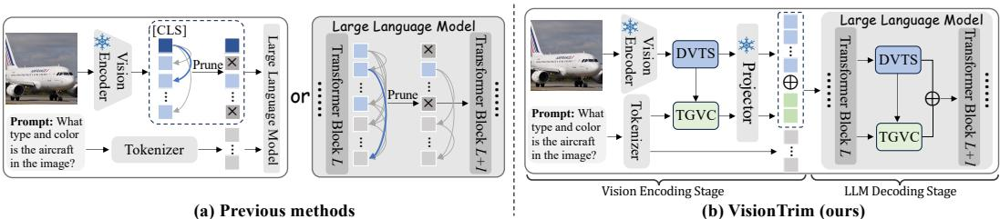
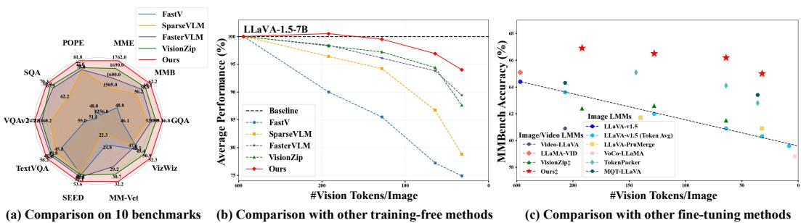

[← 返回 README](../README.md)

# 1 Introduction

## 📌 预览
Introduction 讲了三层递进的动机：(1) MLLM 的视觉 token 开销问题；(2) 现有压缩方法只在 pipeline 的某一个阶段做，且忽略文本对齐；(3) VisionTrim 的两模块方案 + 三点贡献。

---

With the recent advancements in large language models (LLMs) (Vicuna, 2023; Touvron et al., 2023; Bai et al., 2023a; Achiam et al., 2023), significant efforts (Bai et al., 2023b; Chen et al., 2024c; Reid et al., 2024) have been devoted to extending their impressive reasoning and interaction capabilities to vision-language tasks. Current multimodal large language models (MLLMs) typically integrate visual signals as sequential tokens, which are processed by an LLM to enable visual perception of the world.

> 💡 **批注**: 标准的 MLLM 范式：ViT encode → projector → LLM。视觉信息以 token 序列的形式被 LLM 处理。

---

Despite their promising performance, the extensive use of visual tokens, which dominate the input sequence of LLMs, substantially increases the computational complexity and cost associated with inference in MLLMs. This issue is particularly pronounced in high-resolution methods (Liu et al., 2024a;b; Chen et al., 2024c; Li et al., 2024b) and video-based models (Zhang et al., 2024b; Cheng et al., 2024; Shen et al., 2024), where the increased token length exacerbates computational overhead and severely restricts the practical deployment potential of VLMs (Jin et al., 2024b).

> 💡 **批注**: 高分辨率（如 LLaVA-NeXT 的 2880 token）和视频（Video-LLaVA 的 2048 token）场景尤为严重。

---

Recent studies (Wang et al., 2024a; 2025a; Ye et al., 2025; Zhong et al., 2024; Jin et al., 2025) have focused on accelerating the inference of MLLMs by reducing visual tokens while preserving essential information. For instance, FasterVLM (Zhang et al., 2024a) and VisionZip (Yang et al., 2025) perform global dominant visual token selection after vision encoding, whereas FastV (Chen et al., 2024a) and SparseVLM (Zhang et al., 2025b) prune tokens based on attention weights during LLM decoding. While these methods yield promising results, they tend to focus primarily on specific individual components of the MLLM framework, typically either the vision encoding or LLM decoding phases. Though the concurrent work VScan (Zhang et al., 2025a) adopts a two-stage pruning approach, it overlooks the essential role of the text query in aiding visual token selection during the vision encoding stage and directly uses the attention distribution between all visual tokens and the final instruction token for pruning during the LLM decoding stage, causing the potential loss of crucial text-related visual tokens. Furthermore, existing text-agnostic approaches like PyramidDrop (Xing et al., 2024) frequently overlook the necessity of aligning visual token selection with textual information. This oversight can result in the loss of textual context, which is essential for accurate LLM decoding, ultimately leading to a substantial degradation in performance.

> 💡 **现有方法分类与不足**:
>
> | 方法 | 压缩阶段 | 文本引导 | 不足 |
> |------|----------|---------|------|
> | FasterVLM, VisionZip | Vision Encoding | ❌ | 只在 encoder 端 |
> | FastV, SparseVLM | LLM Decoding | ❌/部分 | 只在 decoder 端 |
> | VScan | 两阶段 | ❌ | 忽略文本引导 |
> | PyramidDrop | LLM 渐进 | ❌ | Text-agnostic |
>
> **VisionTrim 的定位**: 两阶段 + text-guided，填补上述空白。

---

*Figure 1: Comparison of previous methods with VisionTrim. (a) Previous methods focus solely on a specific part of the MLLM framework, typically the vision encoding or LLM decoding stages. (b) In contrast, VisionTrim optimizes the entire MLLM pipeline by introducing two plug-and-play modules, Dominant Vision Token Selection (DVTS) and Text-Guided Vision Complement (TGVC), to effectively reduce visual tokens in both the vision encoding and LLM decoding phases.*

> 💡 **Figure 1 批读**:
> - **(a) 对比**: 之前的方法要么只在 ViT 后面做（如 VisionZip），要么只在 LLM 某层做（如 FastV），是"局部优化"
> - **(b) VisionTrim**: 在 ViT 和 LLM 两个阶段都插入模块，是"全局优化"
> - DVTS 模块在前（选 dominant token），TGVC 模块在后（text-guided complement），二者可以分别独立插入到 ViT 或 LLM 的任意两层之间
> - 这个 figure 是理解全文的关键路线图

---

To tackle these issues, we propose a unified vision token compression framework, named VisionTrim, for training-free acceleration of MLLMs. As illustrated in Figure 1, in contrast to previous methods that focus exclusively on visual token compression during either vision encoding or LLM decoding, our approach considers the entire forward propagation of the MLLM. We introduce two plug-and-play modules that effectively accelerate both the vision encoding and LLM decoding processes, which can be seamlessly inserted between any two layers of the vision encoder and the LLM. Specifically, our proposed method primarily consists of two key components: the Dominant Vision Token Selection (DVTS) and the Text-Guided Vision Complement (TGVC) modules.

> 💡 **批注**: "seamlessly inserted between any two layers" — 这是 plug-and-play 的核心含义：不需要改架构，不需要训练，直接在推理时插进去。

---

Firstly, within the DVTS module, we consider both global semantics and local spatial continuity to filter visual tokens that convey essential visual information. Beyond utilizing [CLS] token's attention scores for global semantic importance, we develop the Local Token Affinity Measurement (LTAM) algorithm to simultaneously capture feature similarity and spatial proximity among visual tokens. This approach ensures that critical visual details are retained while reducing redundancy. Secondly, in the TGVC module, we leverage textual information to guide the clustering and merging of pruned visual tokens relevant to the input text instructions. These tokens are then employed to complement the dominant visual tokens from the DVTS module. By integrating textual context into the visual token reduction process, our method enhances the implicit alignment between visual and textual representations, thereby improving the overall efficiency and performance of the pruned MLLM. As shown in Figure 2, our approach consistently surpasses previous techniques across a range of reduction ratios, offering significant advantages in both efficiency and accuracy for various image- and video-based MLLMs. In summary, the contributions of our work are threefold:

> 💡 **DVTS vs TGVC 对比**:
> - **DVTS**: 纯视觉端，global（[CLS] attention）+ local（LTAM 空间亲和度）→ 选 top-K dominant token
> - **TGVC**: 利用 CLIP text encoder 的文本特征，对被 DVTS 丢弃的 token 做 text-guided 聚类合并 → 生成 R 个 complement token
> - 最终保留 K+R 个 token，兼顾视觉完整性和文本对齐

---

*Figure 2: Performance of VisionTrim. (a) Comparison across 10 benchmarks using the standard LLaVA-1.5-7B, with an 88.9% reduction in visual tokens. (b) & (c) Performance vs. efficiency of various methods with a range of visual tokens, in both training-free and fine-tuning scenarios, respectively.*

> 💡 **Figure 2 批读**:
> - **(a) 雷达图**: LLaVA-1.5-7B 上 88.9% 压缩率（576→64 token），VisionTrim 在 10 个 benchmark 上全面超过 SparseVLM、VisionZip、PyramidDrop
> - **(b) Training-free**: 在不同 token 数量下，VisionTrim 的性能-效率 Pareto 前沿最优
> - **(c) Fine-tuning**: VisionTrim‡（加少量微调）进一步提升
> - **关键数字**: 88.9% 压缩 → 保留 98.8% 性能（64 token setting）

---

• We introduce VisionTrim, a unified framework for vision token compression that enables training-free MLLM acceleration, optimizing the entire MLLM pipeline. • We present two effective plug-and-play modules, DVTS and TGVC, designed to accelerate the forward processes of both the vision encoder and the LLM backbone, seamlessly integrable between any two layers. • Extensive experiments conducted on a variety of multimodal benchmarks, spanning both standard and high-resolution, as well as image- and video-based MLLMs, clearly demonstrate the superiority of our VisionTrim over previous state-of-the-art counterparts.

> 💡 **三点贡献总结**:
> 1. **统一框架**: 第一个在 ViT + LLM 两个阶段都做 token 压缩的 training-free 方法
> 2. **两个模块**: DVTS（global-local 选择）+ TGVC（text-guided 补充）
> 3. **广泛验证**: 标准分辨率 / 高分辨率 / 视频，多个 MLLM backbone

---

## 🔖 Section 总结

### 核心洞察
1. **Pain point 定位精准**: 现有方法的两个盲点——单阶段 + 无文本引导
2. **DVTS + TGVC 互补**: DVTS 做"选"（保留最重要的），TGVC 做"补"（把被丢掉但与文本相关的 merge 回来）
3. **vs VScan**: 最直接的竞品，同为两阶段 training-free，但 VScan 缺 text-guided merging
