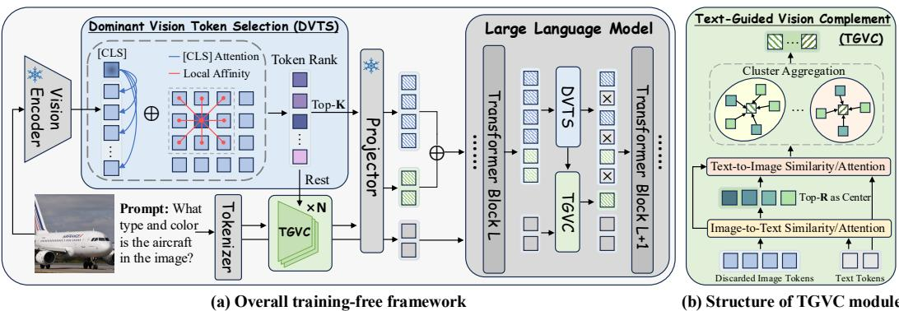

[← 返回 README](../README.md)

# 3 Methodology

## 📌 预览
方法分三部分：(1) DVTS: global [CLS] attention + local LTAM 亲和度，adaptive 加权选 top-K dominant token；(2) TGVC: 用 CLIP text encoder 计算 text-visual similarity，选 clustering center → token assignment → weighted merge，生成 R 个 complement token；(3) Multi-stage pruning：在 ViT 和 LLM 两个阶段都应用。

---

As illustrated in Figure 3, our approach comprehensively considers the entire pipeline of MLLM, comprising two key components that simultaneously accelerate the vision encoder and LLM forward processes. The first component, Dominant Vision Token Selection (DVTS) module, meticulously filters tokens to preserve vital visual information, focusing particularly on their significance for global semantics and local spatial continuity. The second component, Text-Guided Vision Complement (TGVC) module, leverages textual context to guide the clustering and merging of discarded visual tokens relevant to the input text instructions. This process complements the dominant visual tokens by integrating critical visual details. Both DVTS and TGVC are designed as plug-and-play modules that can be seamlessly integrated between any two layers of either the vision encoder or the LLM.

> 💡 **Section 概览**: VisionTrim = DVTS（选） + TGVC（补），二者串联执行：
> ```
> 全部 N 个 token → DVTS → K 个 dominant token + (N-K) 个剩余 token
>                          ↓                              ↓
>                      保留                           TGVC → R 个 complement token
>                          ↓                              ↓
>                          └──────── concat ────────────────┘
>                                      ↓
>                              V_final = K + R 个 token
> ```

---


*Figure 3: (a) Overview of VisionTrim featuring the detailed DVTS module, and (b) the structure of the TGVC module. Both DVTS and TGVC modules can be generally utilized in both the vision encoding stage and the LLM decoding stage.*

> 💡 **Figure 3 批读**:
> - **(a) DVTS 详细流程**: 输入 visual tokens → 同时算 Global Score（[CLS] attention）和 Local Score（LTAM dual-kernel）→ Adaptive Variance Weighting 融合 → 选 top-K
> - **(b) TGVC 流程**: 剩余 token + Text Feature（CLIP text encoder）→ 算 text-visual similarity → 选 top-R clustering center → Token Assignment → Weighted Merge → R 个 complement token
> - 关键：两个模块都可以在 ViT 层间或 LLM 层间使用

---

## 3.1 Dominant Vision Token Selection (DVTS)

To preserve visual integrity during visual token compression, we introduce a novel scoring mechanism for selecting dominant vision tokens. This mechanism thoroughly incorporates both global semantic significance and local spatial continuity. Initially, we utilize [CLS] token's attention scores relative to other visual tokens to assess global semantic importance. Then, we develop the Local Token Affinity Measurement (LTAM) algorithm, which employs a dual-kernel method to capture feature similarity and spatial proximity, thereby ensuring local spatial continuity. These complementary metrics are subsequently integrated using an adaptive variance-based weighting scheme to prioritize the reliable visual tokens.

> 💡 **3.1 要点预览**: DVTS 的三步走：
> 1. **Global**: [CLS] attention score → 全局语义重要性
> 2. **Local**: LTAM (dual-kernel: feature similarity + spatial proximity) → 局部空间连续性
> 3. **Fusion**: Adaptive variance-based weighting → 自动平衡 global 和 local

---

**Global Semantic Importance.** Motivated by previous methods (Yang et al., 2025; Zhang et al., 2024a), the [CLS] token's attention distribution across all image tokens serves as a natural measure of global semantic significance. We extract the attention weights from the penultimate layer of the CLIP-based vision encoder and leverage the attention patterns from the [CLS] token. The self-attention computation for the [CLS] token is expressed as follows:

$\mathbf{Q}_{[\text{CLS}]} = \mathbf{W_Q} X_{[\text{CLS}]}^{L-1}, \quad \mathbf{K}_i = \mathbf{W_K} X_i^{L-1}$

$A_{[\text{CLS}],i}^{L-1} = \text{softmax}(\mathbf{Q}_{[\text{CLS}]} \mathbf{K}_i^T / \sqrt{d_k}), \quad i \in [1, N]$

Here, $X_{[\text{CLS}]}^{L-1}$ and $X_i^{L-1}$ denote the hidden states of the [CLS] token and the $i$-th visual token at the $(L-1)$-th layer, respectively. $\mathbf{W_Q}$ and $\mathbf{W_K}$ are learnable projection matrices, and $d_k$ is the dimension of key vector. $N$ represents the total number of visual tokens. The global importance score $S_i^g$ for the $i$-th visual token is the average attention score across all $H$ heads:

$S_i^g = \frac{1}{H} \sum_{h=1}^{H} A_{[\text{CLS}],i,h}^{L-1}, \quad i \in [1, N]$

This formulation effectively assesses each visual token's contribution to the global semantic representation of the image based on the [CLS] token's attention mechanism. The computed global scores $\{S_i^g\}_{i=1}^N$ are then normalized to yield a probability distribution over all visual tokens, i.e. $\hat{S}_i^g = \exp(S_i^g) / \sum_{j=1}^N \exp(S_j^g)$.

> 💡 **Global Score 批注**:
> - 和 VisionZip、FasterVLM 一样用 [CLS] token attention 作为全局重要性
> - 用倒数第二层（L-1 layer）的 attention，多头平均
> - 最后做 softmax 归一化成概率分布
> - **局限**: 只看 [CLS] 会丢失局部细节，这就是为什么需要下面的 LTAM

---

**Local Spatial Continuity.** Inspired by (Ru et al., 2022; Li et al., 2023b), we introduce the Local Token Affinity Measurement (LTAM) algorithm to effectively capture the local spatial continuity of visual tokens. LTAM utilizes a dual-kernel affinity mechanism to simultaneously account for feature similarity and positional proximity. For the $i$-th token at position $(x, y)$, its local importance $S_i^l$ is determined by computing the affinity with neighboring tokens within a local kernel $\mathcal{N}(x, y)$ of size $k \times k$. For tokens positioned at $(x, y)$ and $(u, v)$, the affinity kernel $\kappa^*$ is defined as a weighted combination of a feature-based term $\kappa_{feat}$ and a position-based term $\kappa_{pos}$:

$\kappa_{feat}^{xy,uv} = -\left(\frac{\|F_{xy} - F_{uv}\|}{w_1 \sigma_f}\right)^2, \quad \kappa_{pos}^{xy,uv} = -\left(\frac{\|P_{xy} - P_{uv}\|}{w_2 \sigma_p}\right)^2$

$\kappa^{*xy,uv} = \kappa_{feat}^{xy,uv} + w_3 \kappa_{pos}^{xy,uv}$

where $F_{xy} \in \mathbb{R}^d$ and $P_{xy} \in \mathbb{R}^2$ denote the feature vector and spatial coordinates of the token at $(x, y)$, respectively. $\sigma_f$ and $\sigma_p$ represent the standard deviations of the feature and positional differences. The pair $(h, w)$ is sampled from the neighborhood set $\mathcal{N}(x, y)$, and $w_1, w_2$, and $w_3$ are balancing parameters. The local importance $S_i^l$ of the $i$-th token at $(x, y)$ is then computed by averaging the affinity scores $\kappa^*$ over all neighboring tokens and converting to a probability distribution.

> 💡 **LTAM 批注**:
> - **灵感来源**: 弱监督语义分割中的 affinity propagation（Ru et al., 2022; Li et al., 2023b）
> - **Dual-kernel 设计**:
>   - $\kappa_{feat}$: 特征空间距离（token 的 hidden state 差异）
>   - $\kappa_{pos}$: 空间位置距离（token 在图像网格中的位置差异）
>   - 两者加权组合
> - **直觉**: 如果一个 token 和它周围的邻居都很相似（feature + position），说明这个区域是"连续的"，应该保留代表性 token
> - **vs VisionZip**: VisionZip 只用 [CLS] attention，没有考虑空间局部性；DVTS 加了 LTAM 后能保留更好的空间覆盖

---

**Adaptive Variance-based Weighting.** To integrate global and local importance scores, we present an adaptive variance-based weighting mechanism:

$S_i = \alpha \hat{S}_i^g + (1 - \alpha) S_i^l, \quad \text{where} \quad \alpha = \sigma_l^2 / (\sigma_g^2 + \sigma_l^2)$

$\sigma_g^2$ and $\sigma_l^2$ denote the variances of the global and local importance scores, respectively. This adaptive weighting scheme automatically prioritizes more reliable signals based on their consistency, ensuring robust token selection. The final importance scores, $\{S_i\}_{i=1}^N$, are used to select the top-$K$ informative tokens $\mathbf{V}_{dom} \in \mathbb{R}^{K \times d}$ from the complete set $\mathbf{V} \in \mathbb{R}^{N \times d}$. This selection process ensures the preservation of both semantic relevance and spatial continuity.

> 💡 **Adaptive Weighting 批注**:
> - **关键洞察**: 方差大的信号不可靠，给它更小的权重
> - 当 $\sigma_l^2$ 大（local score 分散）→ $\alpha$ 大 → 更信任 global score
> - 当 $\sigma_g^2$ 大（global score 分散）→ $\alpha$ 小 → 更信任 local score
> - 实验（Table 5）表明这种 adaptive weighting 比 element-wise max、geometric mean 都好
> - **vs CDPruner**: CDPruner 用 DPP 做多样性选择，VisionTrim 用 variance-based weighting 更简洁

---

## 3.2 Text-Guided Vision Complement (TGVC)

Selected dominant tokens, while capturing primary visual information, may not fully reflect their relevance to the input instructions, potentially leading to misalignment with the textual information and loss of crucial visual elements. To address this issue, we introduce the Text-Guided Vision Complement (TGVC) module, which utilizes text instructions to complement the selected dominant vision tokens. By leveraging CLIP's text encoder, we calculate the similarity between the remaining visual tokens and text tokens, identifying the top-$R$ tokens as clustering centers. These centers then direct the allocation of remaining visual tokens to $R$ clusters. Each cluster is merged to yield the final $R$ visual tokens most relevant to the text, which we term the vision complement tokens.

> 💡 **3.2 要点预览**: TGVC 的核心思路——"废物利用"：
> - DVTS 丢掉了 N-K 个 token，里面可能有与文本相关的重要信息
> - TGVC 用 text 作为引导，从这些"废弃"token 中提取 R 个与文本最相关的 complement token
> - 三步：选 clustering center → 分配 token → 加权合并

---

**Clustering Centers.** Given the remaining visual tokens $\mathbf{V}_r \in \mathbb{R}^{(N-K) \times d}$ after dominant token selection, we begin by calculating their similarity $S_{t2v} \in \mathbb{R}^{L \times (N-K)}$ with the text features $T \in \mathbb{R}^{L \times d}$ to identify potential clustering centers:

$S_{t2v} = \text{softmax}(T \mathbf{V}_r^T / \sqrt{d})$

Next, token-level importance scores $s \in \mathbb{R}^{N-K}$ are obtained by averaging the similarity scores across all text tokens, expressed as $s = \frac{1}{L} \sum_{i=1}^L S_{t2v_i}$. The top-$R$ tokens are then selected as clustering centers, denoted as $C = \{c_1, ..., c_R\}$.

> 💡 **Clustering Center 选择**:
> - 用 CLIP text encoder 编码 text prompt → 得到 text feature $T$
> - 计算 text→visual similarity（softmax 归一化），对所有 text token 取平均
> - 选 top-R 个与文本最相关的 remaining token 作为 cluster center
> - **关键**: 用的是 CLIP 的 text encoder，不是 LLM 的 text embedding

---

**Token Assignment.** For each remaining token $v_i \in \mathbf{V}_r \setminus C$, we compute its assignment score for each clustering center using text-guided similarity. Specifically, for a center $c_j$, the similarity scores are calculated as follows:

$S_{v2t}^i = \text{softmax}(v_i T^T / \sqrt{d}), \quad S_{t2c}^j = \text{softmax}(T c_j^T / \sqrt{d})$

The assignment score $a_{ij}$ is then determined by $a_{ij} = S_{v2t}^i S_{t2c}^j$. Each token is assigned to the clustering center with the highest similarity score:

$\text{cluster}(v_i) = \arg\max_j a_{ij}$

> 💡 **Token Assignment 批注**:
> - 赋值分数 $a_{ij}$ = (token $v_i$ 与文本的相似度) × (文本与 center $c_j$ 的相似度)
> - 直觉：如果 token $v_i$ 和 center $c_j$ 都与相同的文本 token 高度相关，它们就应该被分到一组
> - 这是一种 **text-mediated clustering**：文本作为桥梁连接 visual token

---

**Cluster Aggregation.** For each cluster centered at $c_j$, we aggregate the assigned tokens through weighted averaging based on their text-guided similarities:

$v_j^{com} = c_j + \sum_{v_i \in \text{cluster}(j)} \frac{a_{ij}}{\sum_{v_k \in \text{cluster}(j)} a_{kj}} v_i$

> 💡 **Aggregation 批注**:
> - 加权平均 + 残差连接（加上 center $c_j$ 本身）
> - 权重是归一化的 assignment score
> - 这是 **merge** 而非 prune：信息被压缩保留，而不是直接丢弃

---

This process is repeated for $T$ iterations to refine the clusters. The final vision complement tokens $\mathbf{V}_{com} = \{v_1^{com}, v_2^{com}, ..., v_R^{com}\}$ are then concatenated with the dominant tokens to form the complete visual representation:

$\mathbf{V}_{final} = [\mathbf{V}_{dom}; \mathbf{V}_{com}] \in \mathbb{R}^{(K+R) \times d}$

This text-guided complement mechanism ensures that visual tokens effectively capture key visual details of the image while remaining aligned with the textual instruction.

> 💡 **TGVC 总结**:
> - 迭代 $T$ 次细化聚类（类似 K-means 的迭代）
> - 最终 $K$ 个 dominant + $R$ 个 complement = $K+R$ 个 token
> - **vs VisionZip 的 merging**: VisionZip 的 complement token 基于 visual similarity 合并，text-agnostic；TGVC 用 text 引导，更对齐

---

## 3.3 Multi-Stage Pruning Strategy

Our Dominant Vision Token Selection (DVTS) and Text-Guided Vision Complement (TGVC) modules provide a versatile approach to token reduction that can be effectively applied at two stages of the MLLM pipeline.

**1) Vision Encoding Stage:** Before LLM processing, DVTS and TGVC can reduce the initial visual token sequence $\mathbf{V} = \{\mathbf{v}_1, \mathbf{v}_2, ..., \mathbf{v}_N\}$ to a more compact representation $\mathbf{V}' = \{\mathbf{v}_1', \mathbf{v}_2', ..., \mathbf{v}_{K+R}'\}$, where $K + R < N$.

**2) LLM Decoding Stage:** DVTS and TGVC can be integrated between any two transformer layers during LLM decoding, enabling dynamic token pruning while preserving cross-modal alignment. Specifically, instead of using the [CLS] token, we leverage the attention distribution of the first generated token as a natural measure of the global semantic significance over all image tokens. At layer $l$, global semantic scores $\mathbf{S}^g$ for DVTS and cross-modal attention scores A between visual and textual tokens for TGVC are computed as follows:

$\mathbf{S}^g = \text{softmax}(\frac{\mathbf{H}_{gen}^l \mathbf{H}_v^{lT}}{\sqrt{D}}) \in \mathbb{R}^{1 \times N_v}$

$\mathbf{A} = \text{softmax}(\frac{\mathbf{H}_v^l \mathbf{H}_t^{lT}}{\sqrt{D}}) \in \mathbb{R}^{N_v \times N_t}, \quad \alpha_i = \frac{1}{N_t} \sum_{j=1}^{N_t} \mathbf{A}_{i,j}$

where $\mathbf{H}_{gen}^l \in \mathbb{R}^{1 \times D}$, $\mathbf{H}_v^l \in \mathbb{R}^{N_v \times D}$ and $\mathbf{H}_t^l \in \mathbb{R}^{N_t \times D}$ represent the first generated token, visual tokens, and textual tokens at layer $l$, respectively. $\alpha_i$ denotes the average cross-modal attention score for the $i$-th visual token. Using these scores along with the local spatial affinity scores $\mathbf{S}^l$ from the LTAM mechanism, we first select the top-$K$ tokens $\mathbf{V}_{dom}$ in DVTS and then perform top-$R$ token complement $\mathbf{V}_{com}$ in TGVC. Finally, we obtain $\mathbf{V}_{final} = [\mathbf{V}_{dom}; \mathbf{V}_{com}]$. The multi-stage application of our proposed DVTS and TGVC modules refines the visual representation, while ensuring both computational efficiency and effective cross-modal alignment.

> 💡 **Multi-Stage Pruning 批注**:
> - **Vision Encoding 阶段**: 用 [CLS] token attention（CLIP encoder 的）做 global score
> - **LLM Decoding 阶段**: 用 **first generated token** 的 attention 做 global score（替代 [CLS]），用 visual-textual cross attention 做 TGVC
> - **默认配置**: 在 ViT 倒数第二层 + LLM 第 2-3 层之间各做一次（Table 15 的 ablation 表明浅层更好）
> - **vs FastV**: FastV 只在 LLM 第 2 层做一次 pruning；VisionTrim 在 ViT + LLM 各做一次，压缩更彻底
> - **vs VScan**: VScan 在 LLM 用最后一个 instruction token 的 attention，VisionTrim 用 first generated token，哪个更好有待讨论

---

## 🔖 Section 总结

### 关键数字速查
| 参数 | 说明 |
|------|------|
| K | DVTS 选出的 dominant token 数 |
| R | TGVC 生成的 complement token 数（通常 K:R ≈ 3:1） |
| K+R | 最终保留的 token 总数 |
| T | TGVC 聚类迭代次数 |
| k×k | LTAM 局部窗口大小 |

### 核心洞察
1. **DVTS 的 global-local 互补**: [CLS] attention 捕捉语义显著性，LTAM 保证空间连续性，variance-based weighting 自动平衡
2. **TGVC 的 "废物利用" 思路**: 被 prune 的 token 不直接丢弃，而是 text-guided merge 后补回来，这比纯 pruning 更好
3. **Multi-stage 的优势**: 在 ViT 端先做粗压缩（减少 LLM 输入），在 LLM 浅层再做精压缩（利用 cross-modal 信息），两次压缩互补
4. **LLM 阶段的巧妙设计**: 用 first generated token 替代 [CLS] 做 global scoring，用 visual-textual attention 替代 CLIP text encoder 做 TGVC
