[← 返回 README](../README.md)

# 4 Experiment

## 📌 预览
实验覆盖四个维度：(1) 标准分辨率（LLaVA-1.5）、高分辨率（LLaVA-NeXT）、视频（Video-LLaVA）、更多模型（Qwen2-VL/2.5-VL）；(2) 组件 ablation；(3) DVTS ensemble 策略；(4) TGVC 效果；(5) 效率分析。

---

## 4.1 Experimental Settings

**Datasets and Benchmarks.** We conduct a comprehensive evaluation across 10 widely-used image-based benchmarks to assess the multimodal understanding and reasoning capabilities of our proposed approach. These benchmarks include common visual question answering tasks, like GQA (Hudson & Manning, 2019), VQAV2 (Goyal et al., 2017) and VizWiz (Gurari et al., 2018), as well as other multimodal benchmarks such as POPE (Li et al., 2023c), MMBench (Liu et al., 2025), MME (Fu et al., 2023) and MM-Vet (Yu et al., 2023). Additionally, we experiment with 4 widely used video-based multimodal understanding tasks: TGIF-QA (Jang et al., 2017), MSVD-QA (Xu et al., 2017), MSRVTT-QA (Xu et al., 2017), and ActivityNet-QA (Yu et al., 2019).

**Implementation Details.** We apply our approach to various open-source MLLMs, including the classic LLaVA-1.5 (Liu et al., 2024a) model for normal-resolution images, LLaVA-NeXT (Liu et al., 2024b) for high-resolution images, Video-LLaVA (Lin et al., 2023) for video-based tasks, and Qwen2-VL (Wang et al., 2024b) and Qwen2.5-VL (Bai et al., 2025) for broader validation. To ensure a fair comparison, we adopt the default settings and evaluation metrics as reported in their respective papers. We compare our approach with SparseVLM (Zhang et al., 2025b), VisionZip (Yang et al., 2025), PyramidDrop (Xing et al., 2024), and VScan (Zhang et al., 2025a). Following the same spirit, we design different algorithms for multiple stages of the MLLM pipeline.

> 💡 **实验设置批注**:
> - **10 个图像 benchmark** + **4 个视频 benchmark** = 非常全面
> - **5 个 MLLM backbone**: LLaVA-1.5, LLaVA-NeXT, Video-LLaVA, Qwen2-VL, Qwen2.5-VL
> - **4 个 baseline**: SparseVLM, VisionZip, PyramidDrop, VScan
> - 所有实验都是 training-free 设置（除了 VisionTrim‡ 做了少量微调）

---

## 4.2 Main Results

### Normal Resolution

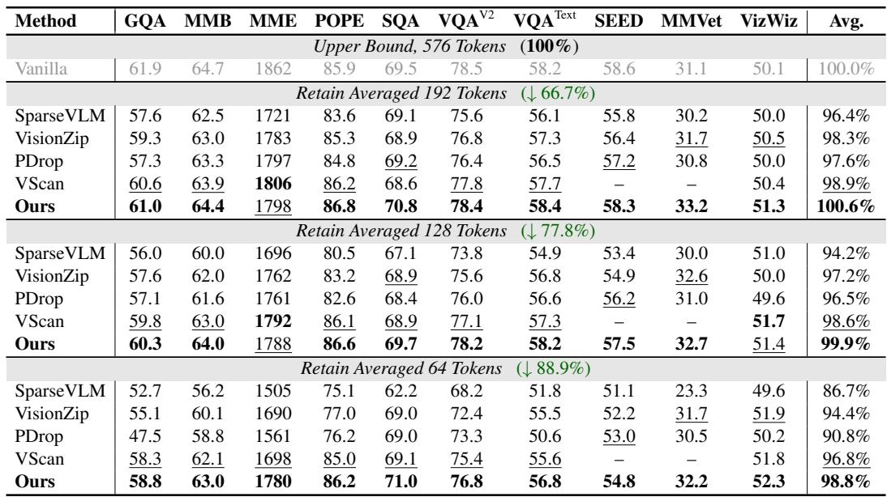
*Table 1: Comparison with other methods on LLaVA-1.5-7B. The vanilla visual token count is 576.*

> 💡 **Table 1 批读**:
> - **192 tokens (↓66.7%)**: VisionTrim 达到 **100.6%** 原始性能！超过了不压缩的 baseline
> - **128 tokens (↓77.8%)**: VisionTrim 达到 **99.9%**，几乎无损
> - **64 tokens (↓88.9%)**: VisionTrim 达到 **98.8%**，比 VScan 高 2.0%，比 VisionZip 高 4.4%
> - **POPE 和 SQA 上甚至超过 vanilla**: 说明视觉 token 冗余确实会干扰 LLM 推理
> - **VScan 缺 SEED 和 MMVet 数据**: 不太公平的比较

As shown in Table 1, we first evaluate our approach on LLaVA-1.5-7B (Liu et al., 2024a) under the normal-resolution setting. VisionTrim consistently surpasses previous methods across all token configurations (192, 128, and 64). In benchmarks, such as POPE, SQA, and TextVQA, VisionTrim not only maintains its performance without degradation but also achieves improvements, highlighting the severe redundancy present in visual tokens fed to the LLM.

---

### High Resolution

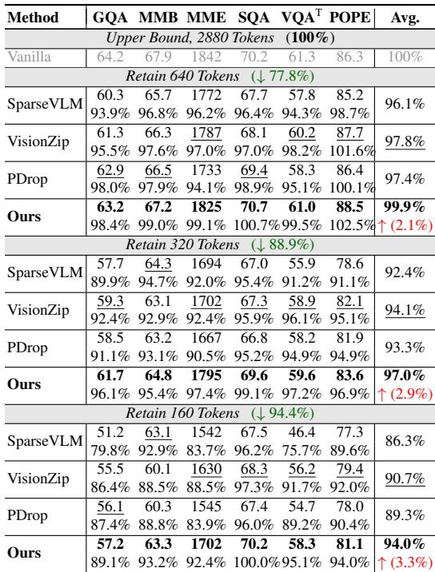
*Table 2: Performance comparisons across various token counts on LLaVA-NeXT-7B.*

> 💡 **Table 2 批读**:
> - **640 tokens (↓77.8%)**: 99.9% 性能，相比 vanilla 的 2880 tokens
> - **320 tokens (↓88.9%)**: 97.0%，比第二名 VisionZip 高 2.9%
> - **160 tokens (↓94.4%)**: 94.0%，比 VisionZip 高 3.3%
> - 高分辨率场景下优势更明显，因为冗余更多

High Resolution. Our approach minimizes token count while maintaining performance on LLaVA-NeXT-7B (Liu et al., 2024b) with high-resolution inputs. As demonstrated in Table 2, VisionTrim retains 99.9% of the original performance using only 22.2% visual tokens. With nearly 95% token reduction, it achieves 94.0% performance without training, surpassing the previous state-of-the-art method, VisionZip (Yang et al., 2025), by 3.3%. These results validate the superior efficacy of VisionTrim for high-resolution inputs.

---

### Video

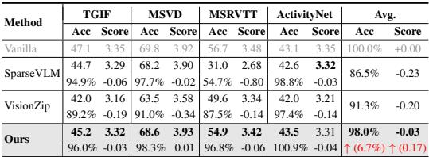
*Table 3: Comparison with previous state-of-the-art methods on Video-LLaVA-7B.*

> 💡 **Table 3 批读**:
> - **93.4% 压缩率**（2048→136 tokens），保留 **98.0%** 性能
> - 在 MSRVTT 上 SparseVLM 崩塌（31.0 Acc），VisionTrim 保持 54.9（96.8%）
> - VisionZip 在视频上表现一般（91.3%），说明纯 vision-based 方法在视频中不够
> - **VisionTrim 在视频场景的优势最大**: 比 VisionZip 高 6.7%

Video. To assess the generalization of our approach on video-based scenarios, we apply it to Video-LLaVA-7B (Lin et al., 2023), which processes 8 frames from a video and generates 2048 visual tokens. Following SparseVLM (Zhang et al., 2025b), we reduce the visual tokens to 136. As shown in Table 3, VisionTrim achieves 98.0% of the original performance with a 93.4% pruning ratio, outperforming all other methods across four benchmarks. Furthermore, VisionTrim consistently exceeds 96.0% in performance, demonstrating its effectiveness and robustness. Our method excels even with high pruning ratios, effectively balancing inference speed and accuracy in video tasks.

---

### Broader Validation

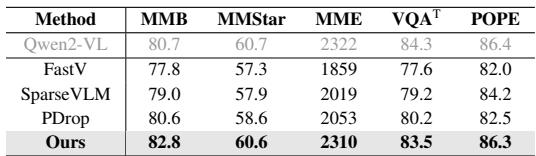
*Table 6: Experiment results of deploying VisionTrim on Qwen2-VL-7B and Qwen2.5-VL-7B over several benchmarks. For both models, approximately 1/3 of the original input tokens are used.*

> 💡 **Table 6 批读**:
> - Qwen2-VL 上 VisionTrim **超过 vanilla** 在 MMB（82.8 vs 80.7）！
> - 只用 1/3 token，性能损失约 0.1%
> - 说明 VisionTrim 对非 LLaVA 系列的 MLLM 也有效（Qwen2-VL 用的是 ViT-600M，不是 CLIP-ViT）

Broader Validation. To further evaluate the effectiveness of VisionTrim, we deploy it to the state-of-the-art open-source MLLMs, Qwen2-VL-7B (Wang et al., 2024b) and Qwen2.5-VL-7B (Bai et al., 2025), using approximately 1/3 of the original input tokens. As shown in Table 6, VisionTrim exhibits competitive performance with only about a 0.1% performance loss across several cases, and even occasionally outperforms the baseline MLLM. Notably, VisionTrim exceeds the vanilla Qwen2-VL (Wang et al., 2024b) by 2.1% on the MMBench dataset, confirming its effectiveness in reducing visual redundancy. Please refer to the Appendix for more experiments on other tasks to further assess VisionTrim's generalization capabilities.

---

## 4.3 Ablation Study

### Component-wise Analysis

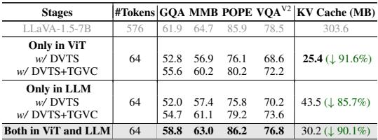
*Table 4: Ablation of pruning at vision encoding and LLM decoding stages.*

> 💡 **Table 4 批读**:
> - **Only ViT (DVTS+TGVC)**: GQA 55.6, VQAV2 72.2, KV cache ↓91.6%
> - **Only LLM (DVTS+TGVC)**: GQA 57.4→61.1, 更好但 KV cache 只降 85.7%
> - **Both**: GQA 58.8, VQAV2 76.8, KV cache ↓90.1% — **性能和效率最佳平衡**
> - 在 LLM 端做效果更好（有 cross-modal 信息），但在 ViT 端做 KV cache 压缩更大
> - 两阶段结合 > 任何单阶段

We conduct a thorough ablation study to evaluate our approach for both vision encoding and LLM decoding stages, as presented in Table 4. We reduce image tokens to 64 for an 88.9% reduction (the same below). Initially, applying DVTS and TGVC modules solely in the vision encoder improves multimodal processing and reduces KV cache memory by 91.6%. For a fair comparison, we also implement the DVTS and TGVC modules only in LLM's decoding stage, yielding performance gains of 5.4% and 4.9% over SparseVLM (Zhang et al., 2025b) on VQAV2 and MMBench datasets, respectively. When applied to both vision encoding and LLM decoding stages, VisionTrim outperforms approaches that target only specific stages and achieves higher performance with a 90.1% reduction in memory usage, significantly surpassing existing state-of-the-art methods.

---

### Ensemble Strategy in DVTS

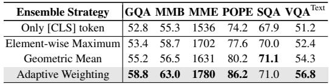
*Table 5: Ablation study of various ensemble strategies in the DVTS module.*

> 💡 **Table 5 批读**:
> - Only [CLS]: GQA 52.8, MME 1536（baseline）
> - Element-wise Maximum: +0.6 GQA, +166 MME
> - Geometric Mean: +2.4 GQA, +95 MME
> - **Adaptive Weighting: +6.0 GQA, +244 MME** — 远超其他策略
> - Adaptive variance-based weighting 的优势非常显著

---

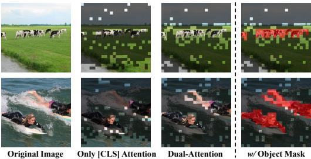
*Figure 5: Visualization of retained visual patches with and without the dual-attention mechanism in the DVTS module. Black-masked areas indicate discarded visual tokens.*

> 💡 **Figure 5 批读**:
> - 只用 [CLS] attention: 集中在少数显著区域，丢失了很多细节（如 baseball 图中的背景被大面积丢弃）
> - 加 LTAM: 保留更均匀的空间覆盖，关键区域和上下文都保留了
> - 直观验证了 local spatial continuity 的必要性

---

### Visual Token Complement of TGVC

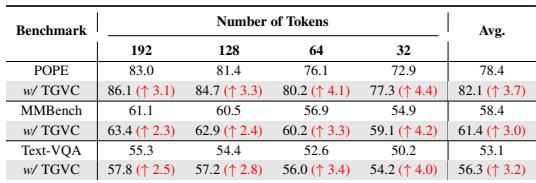
*Table 7: Ablation study on TGVC module.*

> 💡 **Table 7 批读**:
> - TGVC 在所有 token 数量下都有显著提升
> - **token 越少，TGVC 收益越大**: 32 tokens 时 POPE +4.4, MMBench +4.2, TextVQA +4.0
> - 说明当 dominant token 不够时，text-guided complement 的价值更高
> - 这是 VisionTrim 的核心创新点之一

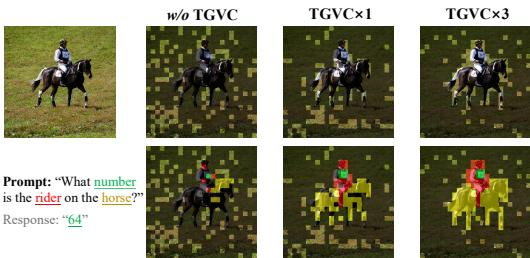
*Figure 6: Visualization of retained visual patches with and without TGVC module. We show the correspondence between the salient visual regions and text in different colors.*

> 💡 **Figure 6 批读**:
> - 不同颜色对应不同的文本 token
> - Without TGVC: 只有 dominant token，丢失了与文本相关的区域
> - With TGVC: complement token 补回了与文本描述相关的视觉区域
> - 可视化清楚展示了 text-guided complement 的效果

---

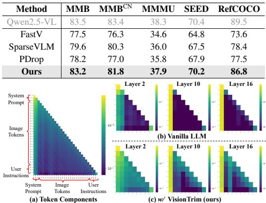
*Figure 4: Comparison of attention maps during LLM forward processing, with and without our proposed VisionTrim.*

> 💡 **Figure 4 批读**:
> - **Vanilla**: attention 高度冗余，大量 token 几乎不被关注
> - **With VisionTrim**: attention 分布更均匀，cross-modal alignment 更好
> - 说明 VisionTrim 不仅减少了 token 数量，还改善了 attention 质量

Moreover, Figure 4 shows attention maps with and without VisionTrim, highlighting that the vanilla LLM exhibits high redundancy and suboptimal cross-modal alignment. In contrast, VisionTrim improves cross-modal alignment and reduces visual redundancy without performance compromise. Please refer to the Appendix for more ablation studies and visualization results.

---

**The Usage of Textual Prompts.** In VisionTrim, token compression has two stages: dominant visual tokens are selected via a dual-attention mechanism, and discarded tokens are utilized with text-guided cues. (1) Without textual prompts, VisionTrim runs in a text-agnostic mode using DVTS, which relies on global [CLS] attention and local affinity; as shown in Table 10 in Appendix D.3, this maintains most accuracy while improving efficiency. (2) When prompts are irrelevant or misleading, text–image similarities become uniformly low, making textual initialization effectively random. Due to the semantic redundancy of visual tokens, the system behaves like unsupervised visual clustering (similar to ToMe (Bolya et al., 2022)), naturally grouping meaningful tokens. Since VisionTrim merges rather than prunes tokens, essential semantics are preserved even under poor textual cues.

> 💡 **Robustness 讨论**:
> - **无文本时**: 退化为 text-agnostic 模式（只用 DVTS），仍然有效
> - **文本误导时**: TGVC 退化为类似 ToMe 的无监督 merging，因为 merge 而非 prune，信息不会丢失
> - 这个设计很聪明：worst case 不会比 text-agnostic 方法差

---

## 4.4 Efficiency Analysis

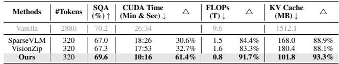
*Table 8: Efficiency analysis of our method on LLaVA-NeXT-7B.*

> 💡 **Table 8 批读**:
> - **CUDA Time**: 26:34 → 10:16（**↓61.4%**），比 SparseVLM 快 44.3%
> - **FLOPs**: 9.6T → 0.8T（**↓91.7%**），比 VisionZip 少 50%
> - **KV Cache**: 1512.1MB → 101.8MB（**↓93.3%**）
> - **SQA 性能**: 70.2 → 69.6（99.1%）
> - VisionTrim 在效率指标上全面碾压，因为它在 ViT 端就做了大幅压缩

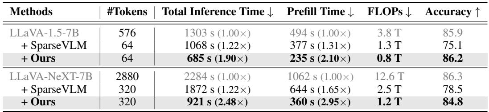
*Table 9: Additional efficiency results on the POPE benchmark.*

> 💡 **Table 9 批读**:
> - LLaVA-1.5-7B: 总推理 1303s → 685s（**1.90× 加速**），Prefill 494s → 235s（**2.10× 加速**）
> - LLaVA-NeXT-7B: 总推理 2284s → 921s（**2.48× 加速**），Prefill 1062s → 360s（**2.95× 加速**）
> - 高分辨率模型加速比更大，因为 token 压缩比更高

We evaluate the efficiency of our method by measuring CUDA time, FLOPs, and storage memory, and compare it with vanilla LLaVA-NeXT-7B (Liu et al., 2024b) and other techniques, as shown in Table 8. At an 88.9% reduction ratio, our method reduces CUDA time by 61.4%, FLOPs by 91.7%, and storage memory by 93.3%, while maintaining 99.1% accuracy on SQA. Notably, when retaining the same token count, our method is 44.3% faster in inference time compared to SparseVLM (Zhang et al., 2025b) and requires 50.0% less computational budget than VisionZip (Yang et al., 2025), while also minimizing KV cache memory usage. These results demonstrate the high efficiency of our approach. Additionally, as shown in Table 9, we provide further efficiency analyses on the POPE benchmark, including both the overall end-to-end latency and prefill time, demonstrating that VisionTrim is highly effective at accelerating MLLM inference.

---

## 🔖 Section 总结

### 关键数字速查
| 设置 | 压缩率 | 性能保持 | 加速比 |
|------|--------|---------|--------|
| LLaVA-1.5, 64 tokens | 88.9% | 98.8% | 1.90× |
| LLaVA-NeXT, 320 tokens | 88.9% | 97.0% | 2.48× |
| LLaVA-NeXT, 160 tokens | 94.4% | 94.0% | — |
| Video-LLaVA, 136 tokens | 93.4% | 98.0% | — |
| Qwen2-VL, ~1/3 tokens | ~66.7% | ~99.9% | — |

### 核心洞察
1. **标准分辨率**: 88.9% 压缩几乎无损（98.8%），甚至在 POPE/SQA 上超过原始模型
2. **高分辨率**: 优势更明显，因为冗余更多
3. **视频**: 最大的优势场景（比 VisionZip 高 6.7%），多帧带来大量冗余
4. **Ablation 证明**: DVTS 的 adaptive weighting 和 TGVC 的 text-guided complement 都是关键组件
5. **效率**: 不仅性能好，推理速度也显著优于竞品（相同 token 数下比 SparseVLM 快 44.3%）
