[← 返回 README](../README.md)

# Appendix

## 📌 预览
Appendix 包含大量补充实验：个案分析、实现细节、极端压缩（1 token）、更多模型/任务泛化、OCR-heavy 任务、层选择 ablation、可视化等。

---

## A Individual Case Performance Analysis

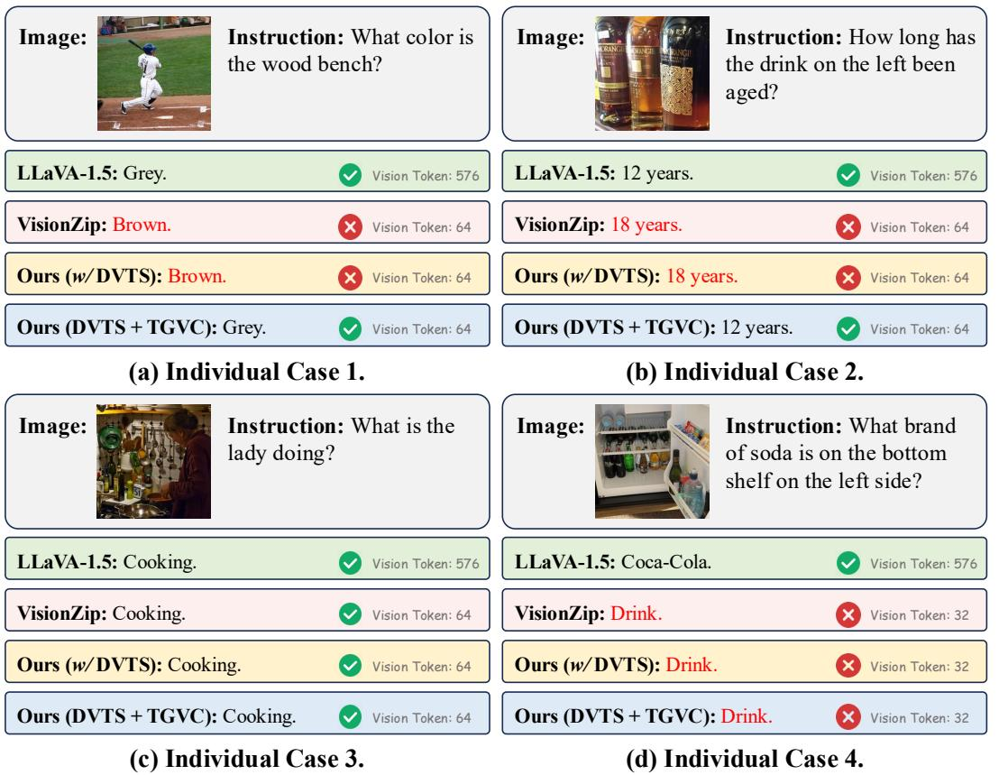
*Figure 7: Visualized individual-case performance analysis concerning the phenomenon of knowledge boundary drift. Outputs highlighted in red indicate factual errors.*

> 💡 **Figure 7 批读**:
> - **Knowledge boundary drift（知识边界漂移）**: token pruning 后模型给出错误答案的现象
> - 例子：VisionZip 或只用 DVTS 时，关键视觉线索被丢弃导致错误
> - 加入 TGVC 后，text-related token 被补回，纠正了错误
> - 这是 TGVC "废物利用" 思路的直接证据

During the discussion phase, we conducted a detailed case study under an 88.9% token reduction ratio on LLaVA-1.5-7B, progressively applying the DVTS and TGVC modules, as shown in Figure 7. We observed an interesting pattern from the failure cases: when using only DVTS, knowledge boundary drift occurs in certain cases—i.e., the original model gives a correct answer, but after token pruning, the response becomes incorrect. However, after incorporating the TGVC module, the discarded tokens from DVTS are leveraged, and text-related visual tokens are explicitly complemented. This prevents the loss of critical information in the input to the model, thereby correcting the responses and mitigating knowledge boundary drift to some extent.

For example, in Figure 7(a) and (b), the original model provides correct answers, but applying VisionZip or the DVTS module alone leads to errors due to the loss of key visual cues. In contrast, combining DVTS with TGVC enables the model to recover the correct responses, highlighting TGVC's role in restoring essential text-related tokens. We attribute this behavior to VisionTrim's two-stage token compression process: DVTS first extracts dominant visual tokens via a dual-attention mechanism that captures global semantics and local spatial continuity, while TGVC complements discarded tokens using text guidance to mitigate the potential loss of critical visual information. Although DVTS pruning may remove some visual information, TGVC clusters and merges these tokens to preserve critical text-related features. This design allows VisionTrim to maintain the original model's performance while minimizing knowledge boundary drift.

---

## B Additional Implementation Details

### B.1 Computational Budget Estimation

In a typical MLLM framework (Liu et al., 2023; 2024a; Zhu et al., 2023), the LLM decoder utilizes the causal self-attention mechanism (Vaswani et al., 2017), where each token attends only to the past tokens. For the entire LLM, the computational metric FLOPs after the $K$-th layer is estimated as:

$\text{FLOPs}_{0:K-1} = K \times (4nd^2 + 2n^2d + 2ndm)$

where $n$ denotes the token number, $d$ is the hidden state size, and $m$ is the intermediate size of FFN.

> 💡 **FLOPs 分析**: 计算复杂度对 token 数 $n$ 是二次的（$2n^2d$ 项），所以减少 token 数量的收益是超线性的。

### B.2 Theoretical Computation Reduction

The theoretical FLOPs reduction ratio $F$, given a token reduction rate $\gamma = (K+R)/N$, is:

$F = 1 - \frac{8\gamma N d^2 + 4(\gamma N)^2 d + 6\gamma N d m}{8Nd^2 + 4N^2 d + 6Ndm}$

> 💡 **批注**: 当 $\gamma = 0.111$（88.9% 压缩），理论 FLOPs 减少 > 90%，与实验结果（91.7%）吻合。

---

## C More Experimental Results

### C.1 Token Number Configurations

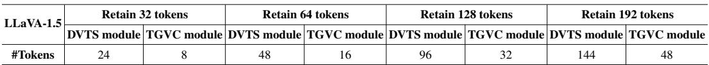
*Table 11: Token number settings for VisionTrim in LLaVA-1.5.*

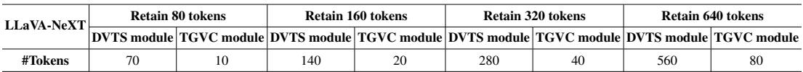
*Table 12: Token number settings for VisionTrim in LLaVA-NeXT.*

> 💡 **Token 分配比例**: DVTS:TGVC ≈ 3:1（如 64 tokens = 48 DVTS + 16 TGVC），这个比例在所有配置中保持一致。

### C.2 More Quantitative Results

#### C.2.1 Extreme Token Count Setting

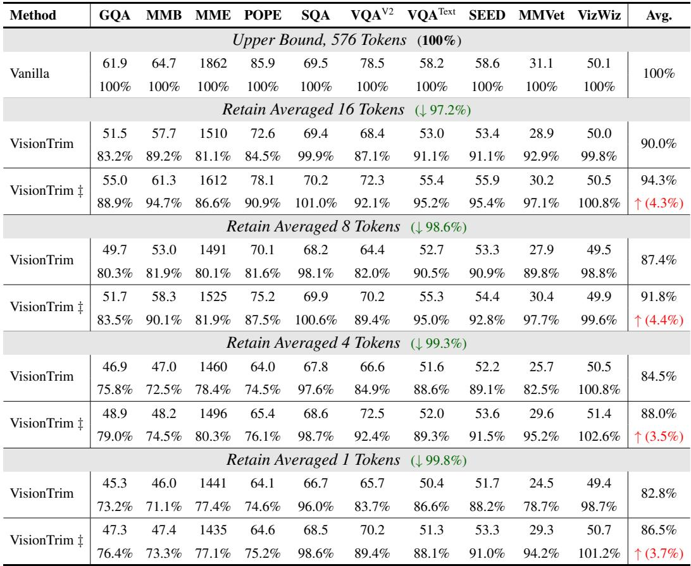
*Table 13: Results of our VisionTrim across different configurations of token counts on LLaVA-1.5-7B.*

> 💡 **极端压缩 批读**:
> - **16 tokens (↓97.2%)**: training-free 仍保留 **90.0%** 性能
> - **8 tokens (↓98.6%)**: 87.4%
> - **4 tokens (↓99.3%)**: 84.5%
> - **1 token (↓99.8%)**: 82.8%！仅一个 token 还能保留 82.8% 性能，令人惊讶
> - Fine-tune 版本（VisionTrim‡）在 1 token 时达到 86.5%
> - 这些极端实验是很好的 sanity check，说明视觉冗余确实极高

#### C.2.2 Additional Task Generalization

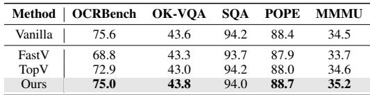
*Table 14: Performance comparison with other methods on InternVL2-2B (70.0% token reduction ratio).*

> 💡 **InternVL2-2B**: 在非 LLaVA 架构上也有效，OCRBench 75.0 vs vanilla 75.6（几乎无损）。

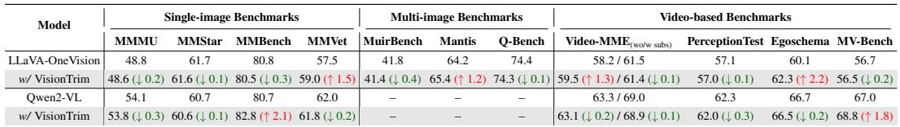
*Table 16: Experiment results of deploying VisionTrim on LLaVA-OneVision-7B and Qwen2-VL-7B over single-/multi-image and video benchmarks.*

> 💡 **Table 16 批读**: 多图/视频 benchmark 上也有效。LLaVA-OneVision 上 MMVet 甚至 +1.5%，Egoschema +2.2%。

#### C.2.3 More Efficiency Analysis

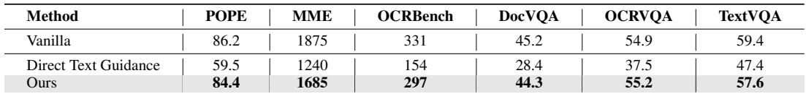
*Table 20: More efficiency analysis on LLaVA-NeXT-7B/13B.*

> 💡 **Table 20 批读**:
> - **13B + VisionTrim (320 tokens) 比 7B vanilla (2880 tokens) 还快**！826s vs 2080s
> - 这意味着可以用更大的模型 + VisionTrim 达到更好的效果且更快

---

### C.3 More Ablation Study

#### C.3.1 Layer Selection

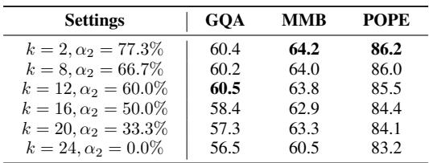
*Table 15: Ablation experiment of different inserted LLM layers across various datasets on LLaVA-1.5-7B.*

> 💡 **层选择**: k=2（第2层后插入）效果最好。越深的层效果越差，与 FastV 的发现一致：浅层的 attention 信息量更大。

#### C.3.2 OCR-Heavy Tasks

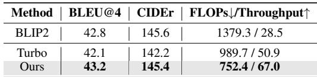
*Table 21: Evaluation results on OCR-Heavy datasets with LLaVA-1.5-13B (32 tokens).*

> 💡 **OCR-heavy**: VisionTrim 保持 96.3% 性能，VisionZip 只有 71.4%。OCR 需要更多细节 token，TGVC 的 text-guided 补充在此尤为关键。

#### C.3.3 Inter-frame Token Compression

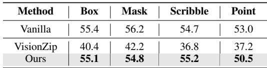
*Table 22: Comparison results on Video-LLaVA-7B between VisionTrim for inter-frame token compression and uniform sampling.*

> 💡 **帧间压缩**: VisionTrim 做帧间冗余压缩比 uniform sampling 更好（ActivityNet 46.0 vs 43.5）。

#### C.3.4 Comparison with Direct Text-Guided Methods

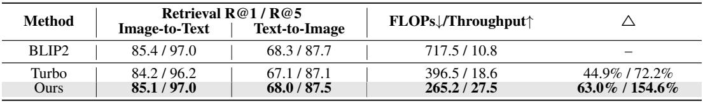
*Table 23: Experimental results comparing VisionTrim with the direct text-guided method on LLaVA-1.5-13B (32 tokens).*

> 💡 **vs 直接 text-guided**: Direct text guidance POPE 只有 59.5（幻觉严重），VisionTrim 84.4。验证了"先选后补"比"直接用文本选"更稳健。

#### C.3.5 Random Pruning / C.3.6 Non-CLIP Encoders

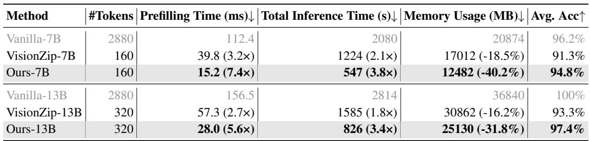
*Table 24: Comparison of VisionTrim vs. Random Pruning on LLaVA-1.5-7B (32 tokens).*

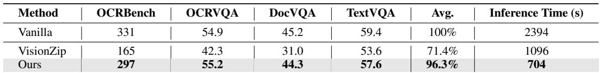
*Table 25: Evaluation results on LLaVA-1.5-7B using DINOv2 as the vision encoder (32 tokens).*

> 💡 **DINOv2 泛化**: VisionTrim 对非 CLIP encoder 也有效（SEED 58.5 vs 60.6 vanilla），说明方法不依赖 CLIP 特定属性。

---

## C.5 More Visualization Results

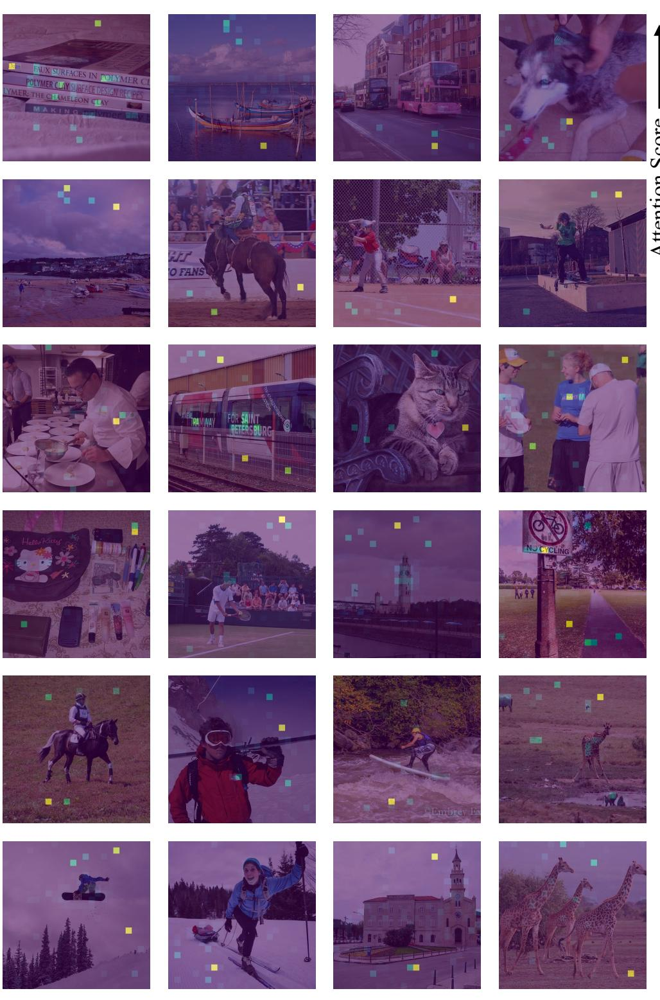
*Figure 9: Visualization of redundancy in the penultimate layer of the vision encoder (CLIP Model).*

> 💡 **Figure 9 批读**: 只有少数 token 接收到高 attention，大部分 token 贡献极低 — 视觉 token 冗余的直接证据。

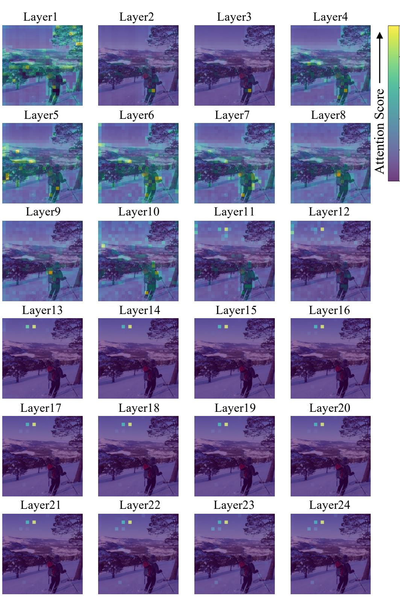
*Figure 12: Visualization of attention distribution change in vision encoder (CLIP Model).*

> 💡 **Figure 12 批读**: 浅层 attention 分散 → 深层 attention 集中到少数 token。第 23 层（倒数第二层）attention 最集中，所以用它来做 token selection。

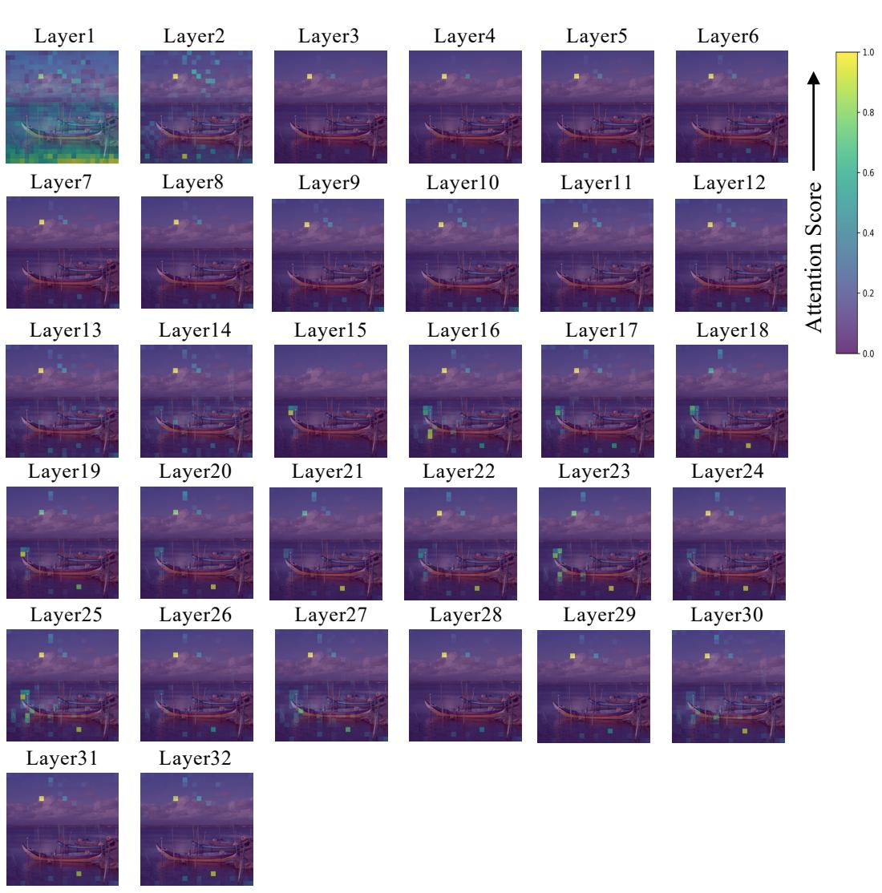
*Figure 13: Visualization of changes in attention distribution across all 32 layers in LLM.*

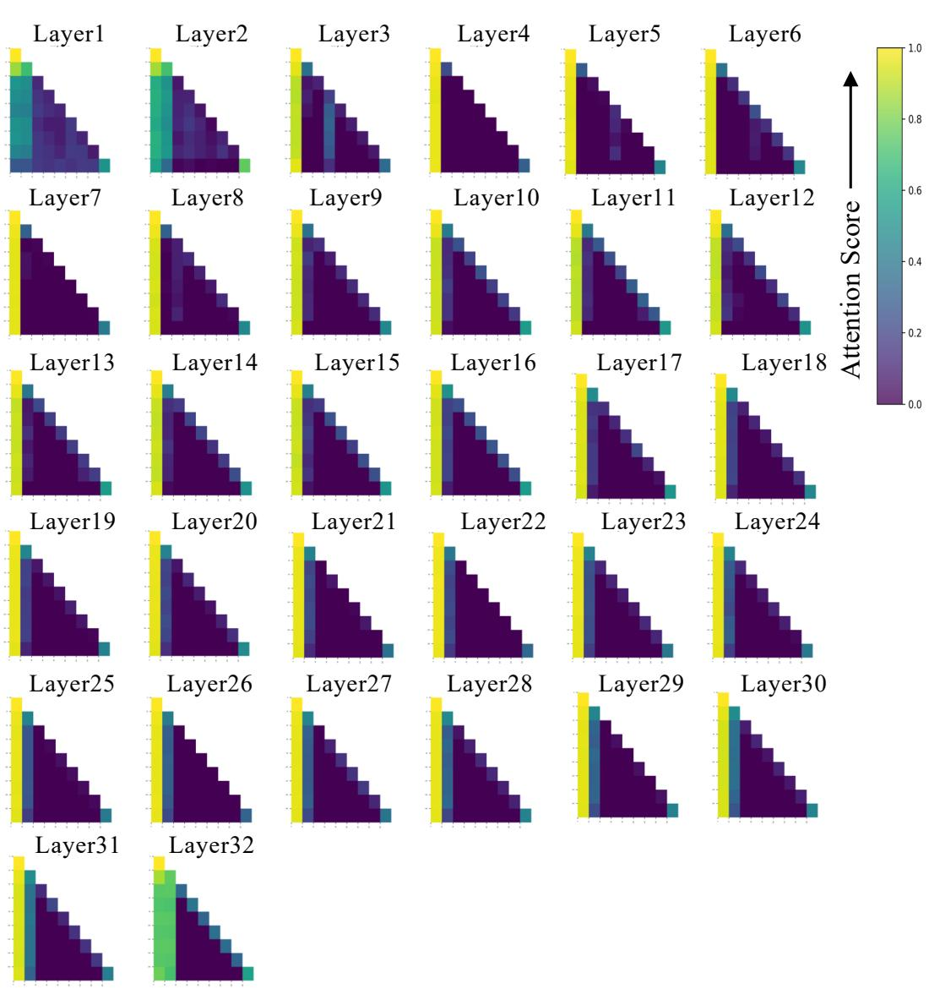
*Figure 14: Visualization of attention maps across all 32 layers in vanilla LLM processing.*

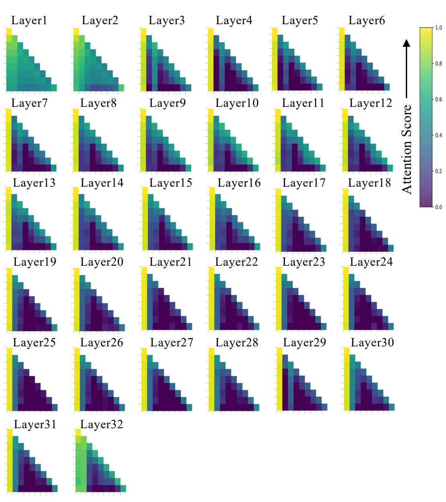
*Figure 15: Visualization of attention maps across all 32 layers in LLM processing with our proposed VisionTrim.*

> 💡 **Figure 14 vs 15 批读**:
> - **Vanilla (Fig 14)**: 大量 visual token 在深层几乎不被关注，冗余严重
> - **With VisionTrim (Fig 15)**: 保留的 token 都被有效利用，cross-modal alignment 更好
> - 这组可视化是论文最有说服力的定性结果之一

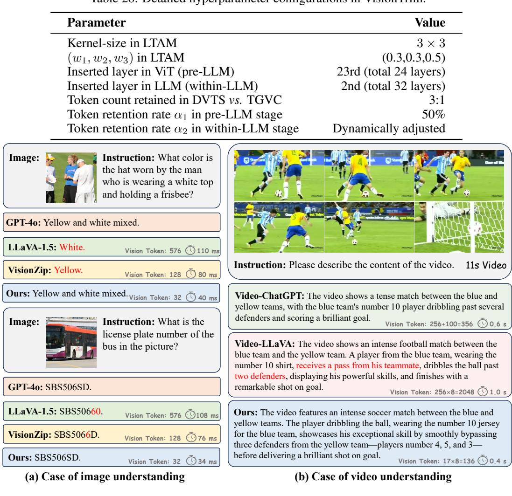
*Figure 8: Visual examples showcasing VisionTrim's ability to accurately capture detailed visual information in both images and video. Outputs highlighted in red indicate factual errors.*

> 💡 **Figure 8 批读**: 定性对比 — VisionTrim 能正确识别图像细节（如车牌号、人物区分），视频中也能准确描述时序动态，而 Video-LLaVA vanilla 会出现幻觉。

---

## D Broader Impacts

This paper introduces a training-free method, named VisionTrim, designed to accelerate Multimodal Large Language Models (MLLMs) through two plug-and-play modules. On the positive side, our approach has the potential to significantly benefit the efficient deployment of MLLMs for real-world image and video understanding tasks, offering a clear reduction in training and inference costs while maintaining competitive performance. However, due to the inherent robustness challenges of large multimodal models, some erroneous outputs may result in misinformation or safety concerns. To mitigate these risks, we recommend implementing a stringent security protocol to address potential failures of our approach in practical multimodal applications.

---

## E Asset License and Consent

All datasets are publicly available and free for academic research. Table 27 lists the resources used in this research work along with their associated licenses.

---

## 🔖 Appendix 总结

### 核心洞察
1. **极端压缩能力**: 1 个 token 还能保留 82.8% 性能，证明视觉冗余极高
2. **TGVC 在 OCR-heavy 任务上优势巨大**: 96.3% vs VisionZip 的 71.4%
3. **13B + VisionTrim 比 7B vanilla 更快更好**: 实际部署的重要结论
4. **Direct text-guidance 会导致幻觉**: VisionTrim 的"先选后补"策略更稳健
5. **对非 CLIP encoder (DINOv2) 也有效**: 方法泛化性好
