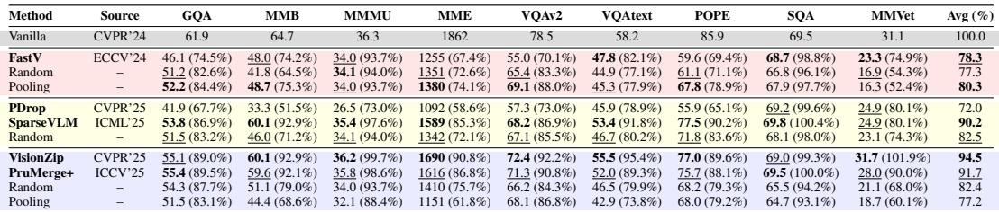
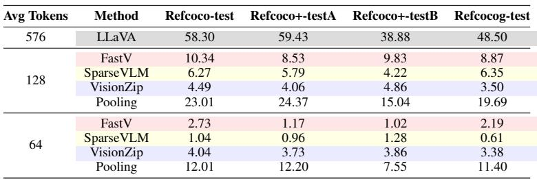
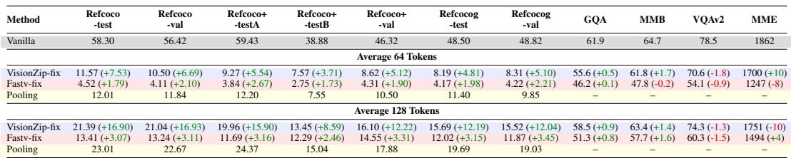

[← 返回 README](../README.md)

# 2 Dissecting the Visual Processing Pipeline: From Semantic Flow to Spatial Integrity

## 📌 预览
本节是全文的分析核心，通过三组实验回答 Introduction 提出的三个问题：(1) Sec 2.1 对比 simple baseline 与 advanced pruning，发现 VQA 上差距不大但 VG 全崩；(2) Sec 2.2 通过 attention flow 和 gradient-weighted attribution 揭示 VLM 的多阶段视觉处理流水线；(3) Sec 2.3 通过位置重建实验证明空间完整性是 VG 的关键。三个 Finding 逐步推导出方法设计的动机。

---

In this section, we first perform a systematic analysis $( { \mathrm { S e c } } 2 . 1 )$ of existing pruning methods to address two key questions. We then examine the visual information processing pipeline (Sec 2.2) in VLMs through two analytical experiments, tracing the progression from global attention mechanisms to local processing paradigms. Finally, position reconstruction experiments (Sec 2.3) uncover the root causes of performance degradation in grounding tasks, thereby providing insights for the design of pruning methods.

> 💡 **批注**: 整个 Section 2 的结构非常清晰：先验证问题存在（2.1），再分析原因（2.2），最后定位根因（2.3）。这种"诊断式"写法是分析型论文的典范。

---

## 2.1 Evaluating Competitive Advantages: Simple Baselines versus Advanced Pruning Methods

Recent research (Wen et al., 2025; Endo et al., 2024) has questioned the effectiveness of existing visual token pruning methods. To investigate two key aspects — (1) Generalization: whether advanced methods consistently outperform simple baselines, and (2) Robustness: whether performance remains stable across tasks with diverse requirements, we conduct a comprehensive crosstask evaluation.

Experimental Setup We conduct a comprehensive evaluation across 12 datasets, covering a broad spectrum of capabilities including image grounding, fine-grained understanding, and complex reasoning. To facilitate a systematic comparison, we categorize mainstream visual token pruning methods into three distinct families based on their architectural placement and operation stage: Vision Encoder-Side Pruning, which focuses on reducing redundancy within or at the output of the vision encoder to save memory early on (e.g., VisionZip (Yang et al., 2024), PruMerge (Shang et al., 2024)); LLM Single-Layer Pruning, which applies a one-time, fixed-ratio pruning operation at specific layers within the LLM (e.g., FastV (Chen et al., 2024)); and LLM Multi-Layer Pruning, which dynamically identifies and removes non-essential vision tokens across consecutive LLM layers (e.g., PyramidDrop (Xing et al., 2024), SparseVLM (Zhang et al., 2025b)). To ensure a fair and rigorous assessment, we benchmark these sophisticated methods against two simple yet effective baselines, random sampling and average pooling, to determine the value of complex pruning designs.

> 💡 **批注**: 三类方法 + 两个 simple baseline 的实验设计非常公正。关键洞察：每类方法都配对了自己的 random/pooling baseline，避免了不同 pruning 位置带来的混淆。

---

*Table 1: Performance comparison of various vision token pruning methods on LLAVA1.5-7B. Including LLM Single-Layer Pruning, LLM Multi-Layer Pruning, and Vision Encoder-Side Pruning.*

> 💡 **Table 1 批读**:
> - **LLM Single-Layer**: FastV (78.3%) 仅略优于 Random (77.3%)，Pooling (80.3%) 反超！
> - **LLM Multi-Layer**: SparseVLM (90.2%) 显著优于 Random (82.5%)，这类方法确实有价值
> - **Vision Encoder-Side**: VisionZip (94.5%) 最强，但 Random (82.4%) 也不差
> - 核心发现：在 VQA 上 Pooling 是非常强的 baseline，encoder-side 方法整体优于 LLM-side

---

*Table 2: Performance comparison on RefCOCO series datasets.*

> 💡 **Table 2 批读**: 这是全文最震撼的表格！
> - 128 tokens 下：FastV 10.34, SparseVLM 6.27, VisionZip 4.49 → **全部崩溃**（原始 58.30）
> - **Pooling 23.01 远超所有方法**，验证了空间结构的重要性
> - 64 tokens 更惨：所有方法 ≤4.04，而 Pooling 仍有 12.01
> - 说明：精心设计的 pruning metric 在 VG 上还不如简单的平均池化！

---

Our results reveal key patterns across task types. On general-purpose VQA benchmarks (Table 1), simple baselines achieve competitive performance, often matching advanced pruning methods. In contrast, on object-centric grounding tasks (Table 2), all methods show systematic

performance degradation, regardless of design complexity. Notably, average pooling yields the best results among pruning approaches, likely because it partially preserves spatial structural features.

> 💡 **批注**: Pooling 保持空间结构的解释很关键——pooling 在粗网格上聚合时隐式维持了全局拓扑，这直接启发了 Nüwa 的 region partition 设计。

---

Finding 1 Advanced pruning methods provide limited benefits over simple baselines on VQA tasks, whereas all methods suffer systematic degradation on grounding tasks, with average pooling achieving the best performance.

> 💡 **Finding 1 解读**: 这个发现挑战了领域内的假设——精心设计的 attention-based / similarity-based pruning 在 VG 上甚至不如 random。这说明 pruning metric 的选择不是问题的关键，空间结构的保持才是。

---

## 2.2 Unveiling Task-Dependent Visual Processing Pipeline

Building on the task-dependent performance degradation observed in Sec. 2.1, prior explainability studies on LLMs and VLMs (Selvaraju et al., 2016; Ding et al., 2017; Zhang et al., 2024; Yin et al., 2025) have not sufficiently explored how visual processing adapts to shifts in task focus, such as from VQA to VG. To address this, we conduct two analytical experiments: visualizing attention flows from the final token to vision tokens during decoding, and applying gradient-weighted attribution methods to trace critical visual information pathways across tasks. Additionally, we evaluate the model's object-centric perception at different stages using two fine-grained metrics.

---

*Figure 3: (a) to (d) show different types of attention flows (First row) and gradient-weighted attention flows (Second row), where A-to-B means the degree of attention A pays to B. (e) shows the differences in Last-to-Vision attention maps across different tasks. VLMs exhibit a two-stage visual processing pipeline, with task-independent multimodal interactions in early layers and task-specific processing in middle layers.*

> 💡 **Figure 3 批读**:
> - **(a) Vision-to-Vision**: 前期全局，中期收敛——对应 VAE 下降
> - **(b) Last-to-Vision**: VQA 和 VG 在中层出现分歧（gradient-weighted 更明显）
> - **(c) Vision-to-Text**: 早期 task-independent 的多模态交互
> - **(d) Text-to-Text**: VG 任务对文本信息的依赖更强
> - **(e)** 直观展示 VG 在中层需要更多视觉信息
> - 核心发现：**中间层是 VG 和 VQA 分道扬镳的关键阶段**

---

Figure 3 depicts task-dependent characteristics of visual processing in VLMs. Panels (a) and (b) at the first row show that attention flows exhibit distinct early and mid-stage phases. However, gradientweighted analysis (Second row) reveals a pronounced task-dependent divergence in the mid-stage, underscoring the model's sensitivity to task requirements during visual integration — with VG tasks showing greater reliance on vision tokens. Panel (c) highlights a task-independent aspect: early multimodal interactions, suggesting universal visual processing in initial stages. Panel (d) illustrates task-varying differences in text information handling. Further experiments on attention blocking (Appendix B.5) indicate that, in VG tasks, textual cues extract critical visual details, resulting in unique last-to-text attention patterns.

---

Visual Attention Entropy And Object-Centric Cohesion: Attention flows offer insights into the model's information processing dynamics. To further quantify the multi-stage visual processing pipeline identified in the prior analysis and its task-dependent characteristics, we introduce two finegrained metrics: Visual Attention Entropy (VAE) and Object-Centric Cohesion (OCC). VAE measures the distribution of information in the visual self-attention mechanism by computing the average Shannon entropy across visual tokens (Eq. (1)). High VAE values indicate diffuse, global attention patterns, whereas low values reflect concentrated, local focus. Complementing this, OCC assesses object-level feature cohesion by calculating the Intersection over Union (IoU) between ground-truth object tokens and the top- $k$ tokens most similar to the object's center token (Eq. (2)). Higher OCC scores denote stronger localization of features to relevant objects, capturing fine-grained processing.

> 💡 **批注**: VAE 和 OCC 是本文提出的两个分析指标，非常巧妙：
> - **VAE**（视觉注意力熵）衡量全局 vs 局部：高→全局散布，低→局部聚焦
> - **OCC**（目标中心一致性）衡量目标特征聚合程度
> - 两者结合可以追踪"从全局到目标"的特征演化过程

---

*Figure 4: Visualization of VLM's Two-Stage Vision Tokens Processing: (a) Layer-wise Analysis of VAE and OCC Metrics; (b) Layer-wise Instance Heatmap Visualization. Both demonstrate fine-grained feature extraction at the mid-stage.*

> 💡 **Figure 4 批读**:
> - **VAE 曲线**: ViT 中间层下降（全局→局部），LLM decoder 先升后波动（重组特征）
> - **OCC 曲线**: ViT 和 LLM 的中间层都出现峰值——目标级表征在此形成
> - **热力图**: 直观可见中间层的目标聚焦效应
> - 这解释了为什么 pruning 在中间层之前进行会严重损害 VG：目标表征尚未形成就被剪掉了

---

As shown in Figure 4, the VAE of the ViT encoder exhibits a decreasing trend in the middle stage, indicating a gradual shift from global context integration to fine-grained feature extraction. In contrast, the VAE of the LLM decoder fluctuates after a sharp initial increase, suggesting a more complex process of reorganizing visual features and integrating them into the textual semantic space. The OCC scores provide a clearer explanation — they peak in the middle stage of both ViT and LLM, signifying the formation of object-level representations. This phenomenon also effectively explains the earlier observation: why grounding tasks demand such high levels of visual information at this stage.

---

Finding 2 Visual processing in VLMs unfolds through a multi-stage pipeline, progressing from global semantic integration to fine-grained object-centric focus, with task-specific reliance on vision tokens. Grounding tasks require heightened visual integration during middle stages for spatial reasoning, in contrast to the reduced demands in image understanding tasks.

> 💡 **Finding 2 解读**: 这个发现为 Nüwa 的设计提供了直接指导：Stage 1 在 ViT encoder 做空间保持的粗剪（全局阶段），Stage 2 在 LLM 中间层做 text-guided 细剪（精细阶段后）。pruning 时机与处理流水线对齐。

---

## 2.3 Spatial Integrity: Reconstructing the Global Reference Frame

Building on the mid-stage visual integration demands in Sec. 2.2, where pruning disrupts taskspecific vision reliance, we hypothesize that spatial integrity — via the Global Spatial Reference Frame from position embeddings — is essential for spatial perception, as pooling methods' superior grounding performance indicates. To validate this, we design experiments restoring integrity through modified position embedding strategies.

> 💡 **批注**: 从 Finding 1（pooling 最好）和 Finding 2（中间层关键）出发，提出假设：**位置编码的完整性**是空间感知的基础。这是全文最重要的洞察。

---

### 2.3.1 A Taxonomy of Position Embedding Strategies

To rigorously test our hypothesis, we first deconstruct the implicit position embedding (PE) handling strategies within existing pruning methods, as shown in Figure 5, abstracting them into three distinct paradigms:

Position Embedding Range Compression (PERC): Compresses the PE of pruned tokens into a tiny range, missing the global reference frame, like Visionzip.

Position Embedding Sparse Preservation (PESP): Retains the original PE for each pruned token, forming a sparse subset within an incomplete spatial frame, like FastV.

Relative Position Mapping Extension (RPME): Preserves the relative spatial distance of the pruned tokens and extends their PE via linear mapping, to span the entire original range and retain the spatial integrity.

> 💡 **批注**: PE 策略分类非常精辟：
> - **PERC** (VisionZip)：压缩到小范围 → 完全丢失全局坐标，模型以为整张图就这么大
> - **PESP** (FastV)：保留原始坐标但有空洞 → 空间不连续，除非目标恰好在右下角
> - **RPME** (本文提出)：线性映射恢复全局范围 → 修复空间完整性

---

*Figure 5: Sketch of different Position Embedding Strategies. RPME retains the spatial integrity.*

> 💡 **Figure 5 批读**: 三种策略的直观对比。PERC 把 576 个位置压到连续的 64 个位置（0-63），PESP 保留原始的稀疏位置（如 0, 9, 18, ...），RPME 将稀疏位置线性拉伸回 0-575。

---

Experiment Setup We select two representative methods, VisionZip (PERC) and FastV (PESP), replacing their PE strategy with RPME, and then evaluate the performance of these "fixed" models on visual grounding benchmarks.

*Table 3: Position Reconstruction Experiment on Refcoco series and VQA Benchmarks. The symbols $\cdot _ { + } \cdot$ and $\cdot _ { - } ,$ indicate changes relative to the pre-reconstruction values showed in Table 2.*

> 💡 **Table 3 批读**:
> - **VisionZip-fix** (PERC→RPME)：64 tokens 下 RefCOCO 从 4.49→10.50 (+6.69)，128 tokens 从 4.49→21.39 (+16.90)，巨幅提升！
> - **FastV-fix** (PESP→RPME)：提升较小（+1.8%~+3.2%），因为 PESP 本身保留了部分位置信息
> - **VQA 基本不受影响**：GQA、MMB 变化在 1% 以内，说明 RPME 是"免费"的修复
> - **Pooling 仍然最强**：说明仅靠 RPME 不够，还需要保持空间拓扑（即区域聚合）

---

Results in Table 3 show that RPME yields notable improvements across benchmarks: VisionZip achieves gains of $5 . 6 \%$ and $1 3 . 4 \%$ in two settings, while FastV sees more modest increases of $1 . 8 \%$ and $3 . 2 \%$ . These differences confirm our analysis: PERC in VisionZip eliminates positional information, whereas PESP in FastV preserves absolute coordinates but disrupts spatial continuity. Gains grow with larger token budgets, underscoring the increasing importance of complete spatial frameworks for richer visual organization. Pooling methods outperform others consistently by aggregating features on coarse grids that implicitly maintain global topology, reinforcing that reconstructing continuous spatial coordinates is vital for grounding tasks. This strategy has a negligible impact on image understanding and reasoning benchmarks, indicating broad applicability.

---

Finding 3 The degradation of VLMs on grounding tasks is principally driven by the loss of Global Spatial Reference Frame within token pruning strategies, which can be restored by preserving global position embedding.

> 💡 **Finding 3 解读**: 这是全文的核心结论，也是 Nüwa 设计的理论基础。三个 Finding 的逻辑链：
> 1. **Finding 1**: 所有 pruning 方法在 VG 上崩溃，pooling 最好 → 问题存在
> 2. **Finding 2**: VLM 有多阶段处理流水线，VG 依赖中间层空间信息 → 问题定位
> 3. **Finding 3**: 根因是全局空间参考系丢失，可通过位置重建修复 → 解决方向

---

## 🔖 Section 总结

### 三大 Finding 速查
| Finding | 核心结论 | 实验基础 |
|---------|---------|---------|
| Finding 1 | Advanced pruning ≈ random baseline on VQA; 全部崩溃 on VG; pooling 最好 | Table 1, 2 |
| Finding 2 | VLM 多阶段流水线：全局→精细→任务特定; VG 依赖中间层 | Figure 3, 4 + VAE/OCC |
| Finding 3 | VG 退化根因 = 全局空间参考系丢失; RPME 可部分修复 | Table 3 + PE 分类 |

### 对方法设计的启示
1. 必须保持**空间均匀覆盖**（→ region partition）
2. 必须保持**全局位置编码完整性**（→ RPME 风格的位置处理）
3. 冗余聚合应在**视觉语义空间**进行（→ Stage 1 在 ViT encoder）
4. 任务相关筛选应在**多模态对齐后**进行（→ Stage 2 在 LLM 中间层）
