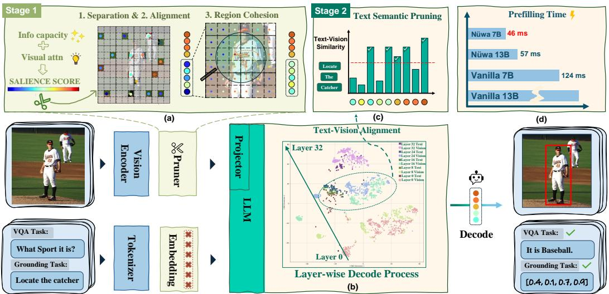

[← 返回 README](../README.md)

# 3 Methodology

## 📌 预览
Nüwa 的两阶段框架：Stage 1 在 vision encoder 侧通过 Separation（网格分区）→ Alignment（显著性选择）→ Aggregation（空间邻近聚合）实现空间保持的 token 压缩；Stage 2 在 LLM 中间层通过 text-visual cosine similarity 做 task-relevant 筛选。核心创新在于 Pillar Token（高 L2-norm register token 不参与聚合）和空间邻近性约束的加权聚合。

---

Our analysis reveals that existing token pruning methods fail on spatial localization tasks by disrupting the global spatial reference frame. This motivates three core design principles for effective visual token compression: (1) preserving spatial uniformity to ensure consistent coverage; (2) aggregating redundant information in a vision-centric, cohesive manner while retaining local salience (Stage1); and (3) applying text-modulated fine-grained filtering to select task-relevant tokens based on textual semantics (Stage2). We apply these principles in Nuwa, a two-stage pruning framework. ¨

> 💡 **批注**: 三条设计原则直接对应三个 Finding：空间均匀性（Finding 3）、视觉语义聚合（Finding 2 ViT 阶段）、文本引导过滤（Finding 2 LLM 阶段）。

---

## 3.1 Stage 1: Spatial Cohesion Pruning in the Vision Encoder

This stage reduces the initial $N ^ { 2 }$ visual tokens in the vision encoder to a dense, spatial-preserving sequence via three sequential operations.

### 3.1.1 Separation via Grid Partitioning

To maintain spatial integrity, we partition the input token grid $\mathcal { T } = \{ t _ { 1 } , t _ { 2 } , \dots , t _ { N ^ { 2 } } \}$ into $M \times M$ non-overlapping local regions $\mathcal { R } _ { i , j }$ . Subsequent selection and aggregation occur at the region level, enabling a complete global coordinate system.

> 💡 **批注**: 网格分区是 Nüwa 保持空间完整性的根基。通过确保每个区域都有代表 token，实现了比 RPME 更强的空间保持——不仅位置连续，而且空间均匀覆盖。这就是为什么 Table 3 中 RPME 仍不如 Pooling，而 Nüwa 可以超越 Pooling（Table 6）。

---

### 3.1.2 Alignment via Salience Identification

Within each region $\mathcal { R }$ , we select representative benchmark tokens as aggregation centers. These tokens should exhibit high global salience; we initially use attention scores from the [CLS] token. However, analysis indicates sparse distributions in deeper vision encoder layers. To mitigate this, we incorporate information capacity, defined as the L2-norm of the token's key vector $( \left. \mathbf { k } _ { i } \right. _ { 2 } )$ , as a secondary criterion. The resulting salience score $S ( t _ { i } )$ for token $t _ { i }$ is the product of its global attention score and information capacity:

$$
S ( t _ { i } ) = \alpha _ { \mathrm { c l s } , i } \cdot | \mathbf { k } _ { i } | _ { 2 }
$$

where $\alpha _ { \mathrm { c l s } , i }$ is the attention weight from the [CLS] token. In each local region $\mathcal { R } _ { k }$ , we select the $k$ tokens with the highest salience scores to form the Benchmark Token set $\mathcal { T } _ { B }$ .

> 💡 **批注**: 双指标选择（CLS attention × L2-norm）比单一的 attention score 更鲁棒。CLS attention 反映全局重要性，L2-norm 反映信息容量（与 register token 相关）。两者相乘避免了深层 attention 稀疏的问题。

---


*Figure 6: The Framework of Nuwa: (a) Stage 1 Pruning regarding Separation, Alignment and Cohesion; (b) Layer-wise 2D visualization of text-visual token similarity during LLM; (c) Stage2 pruning based on text semantics at LLM mid-stage; (e) prefill time of Nuwa across different scales.*

> 💡 **Figure 6 批读**:
> - **(a)** 完整展示 Stage 1 流程：24×24 grid → M×M regions → 每个 region 选 top-n → 聚合
> - **(b)** Layer-wise similarity heatmap 验证了 Sec 2.2 的发现：中间层多模态对齐完成
> - **(c)** Stage 2 在对齐完成后的 LLM 中间层执行
> - **(e)** 不同模型规模的 prefill 时间，Nüwa 开销极小（+1ms）

---

### 3.1.3 Aggregation via Spatial Proximity

This operation merges features from other tokens into the benchmark set $\mathcal { T } _ { B }$ , guided by role assignment and spatial proximity, yielding a semantically rich and spatially complete token sequence.

Role Assignment: Pillars and Collectors. We differentiate benchmark tokens in $\mathcal { T } _ { B }$ by information capacity. Recent works (Darcet et al., 2024; Lappe & Giese, 2025) identify high-norm tokens in ViTs as registers — frequently attended during decoding and often task-agnostic. Modifications to these can shift feature distributions and affect predictions. Thus, we classify tokens with $\| \mathbf { k } _ { i } \| _ { 2 }$ in the top quartile as Pillar Tokens $( \mathcal { T } _ { P } )$ , whose features remain unmodified. The rest are Collector Tokens $( \mathcal { T } _ { C } )$ , which aggregate from spatial neighbors.

$$
\begin{array} { r } { \mathcal { T } _ { P } = \big \{ t _ { i } \in \mathcal { T } _ { B } \ | \ | \mathbf { k } _ { i } | _ { 2 } \geq \mathrm { Q u a n t i l e } \big ( \{ | \mathbf { k } _ { j } | _ { 2 } \} _ { t _ { j } \in \mathcal { T } _ { B } } , 0 . 7 5 \big ) \big \} ; \quad \mathcal { T } _ { C } = \mathcal { T } _ { B } \setminus \mathcal { T } _ { P } } \end{array}
$$

> 💡 **批注**: Pillar Token 的设计基于 ViT register token 的发现（Darcet et al., 2024）。这些高 L2-norm token 是全局信息的"锚点"，修改它们会导致特征分布偏移。因此保持不变（Kronecker delta），只让 Collector Token 聚合邻居信息。这是一个非常精细的设计，避免了聚合操作对关键 token 的破坏。

---

Weighted Aggregation. High semantic similarity does not imply aggregability; relying solely on it for global features is inadequate, as it risks disrupting object-centric representations by merging

spatially distant tokens. Thus, we balance it with spatial proximity to form a weight matrix ${ \textbf { W } } \in$ RK×N2, where $K = | T _ { B } |$ , combining semantic and proximity matrices.

Semantic Similarity Matrix (A): We consider only positively correlated semantic information. Element $A _ { i j }$ is defined as Eq. (5):

$$
A _ { i j } = \operatorname { R e L U } \left( \sin ( \mathbf { v } _ { i } , \mathbf { v } _ { j } ) \right) = \operatorname { R e L U } \left( { \frac { \mathbf { v } _ { i } \cdot \mathbf { v } _ { j } } { | \mathbf { v } _ { i } | | \mathbf { v } _ { j } | } } \right)
$$

Spatial Proximity Matrix $\mathbf { \Pi } ^ { ( \mathbf { P } ) }$ : To penalize long range aggregation, we define a proximity matrix allowing each benchmark token to aggregate features within an extended local neighborhood, enabling limited cross-region interaction. Element $P _ { i j }$ is computed as Eq. (6):

$$
P _ { i j } = 1 - \operatorname* { m a x } \left( 1 , \frac { d ( p _ { i } , p _ { j } ) } { d _ { \mathrm { t h r e s h } } } \right)
$$

where $d ( p _ { i } , p _ { j } )$ is the Euclidean distance between $p _ { i }$ and $p _ { j }$ , and $d _ { \mathrm { t h r e s h } }$ is a predefined threshold.

> 💡 **批注**: 聚合权重 = 语义相似度 × 空间邻近度。这两个约束缺一不可：
> - 仅语义相似度 → 可能把图像两端的相似 token 合并（如两只同色猫），破坏空间
> - 仅空间邻近度 → 可能合并语义无关的 token（如物体和背景的边界处）
> - ReLU 截断确保只聚合正相关信息，避免反义特征的破坏性合并

---

Based on role assignment, the final aggregation weight $W _ { i j }$ is defined as:

$$
\begin{array} { r } { W _ { i j } = \left\{ \begin{array} { l l } { \delta _ { i j } } & { \mathrm { i f ~ } t _ { i } \in \mathcal { T } _ { P } \mathrm { ( P i l l a r ~ T o k e n ) } } \\ { A _ { i j } \cdot P _ { i j } } & { \mathrm { i f ~ } t _ { i } \in \mathcal { T } _ { C } \mathrm { ( C o l l e c t o r ~ T o k e n ) } } \end{array} \right. } \end{array}
$$

where $\delta _ { i j }$ is the Kronecker delta, ensuring Pillar Tokens only aggregate from themselves.

The weight $\hat { \mathbf { W } }$ is row-normalized from W, the original feature matrix is $\mathbf { V } \in \mathbb { R } ^ { N ^ { 2 } \times D }$ . The updated feature matrix for benchmark tokens, $\mathbf { V } _ { B } ^ { \prime } \in \mathbb { R } ^ { K \times D }$ , is computed as $\mathbf { V } _ { B } ^ { \prime } = \hat { \mathbf { W } } \mathbf { V }$ .

> 💡 **批注**: 最终聚合是一次矩阵乘法 $\hat{W}V$，计算高效。Pillar Token 行只有对角线为 1（保持原始特征），Collector Token 行是归一化的语义×空间权重。整个 Stage 1 只需在 ViT 最后一层做一次 attention 计算，兼容 FlashAttention。

---

## 3.2 Stage 2: Text-Modulated Pruning in the LLM

Following Stage 1, the aggregated vision tokens $\mathbf { V } _ { B } ^ { \prime }$ are fed into the LLM for multimodal feature interaction. We apply a second round of task-oriented pruning at an intermediate layer, after initial multimodal alignment (Shukor & Cord, 2024), where textual and visual features converge in a shared space. To guide this pruning, we first derive a holistic textual query vector $\bar { \bf q }$ by average-pooling the embeddings $\left\{ \mathbf { q } _ { 1 } , \dots , \mathbf { q } _ { K } \right\}$ of text tokens:

$$
\bar { \mathbf { q } } = \frac { 1 } { K } \sum _ { k = 1 } ^ { K } \mathbf { q } _ { k }
$$

We calculate a relevance score $R _ { i }$ for each visual token $t _ { i } ^ { \prime }$ (with updated feature vector $\mathbf { v } _ { i } ^ { \prime }$ , the $i$ -th token of $\mathbf { V } _ { B } ^ { \prime }$ ) by measuring its cosine similarity to the query vector in the shared embedding space:

$$
R _ { i } = \mathrm { s i m } ( \mathrm { p r o j } ( \mathbf { v } _ { i } ^ { \prime } ) , \bar { \mathbf { q } } ) = \frac { \mathrm { p r o j } ( \mathbf { v } _ { i } ^ { \prime } ) \cdot \bar { \mathbf { q } } } { | \mathrm { p r o j } ( \mathbf { v } _ { i } ^ { \prime } ) | \cdot | \bar { \mathbf { q } } | }
$$

where $\mathrm { p r o j } ( \cdot )$ denotes the multimodal projection layer mapping visual features into the common text-vision embedding space. Finally, we retain only the top- $K _ { \mathrm { f i n a l } }$ visual tokens with the highest relevance scores $R _ { i }$ , passed to subsequent LLM layers for final reasoning and response generation.

> 💡 **批注**: Stage 2 本质上是 FastV 的改进版：
> - FastV 用 attention score 剪枝（在单层执行）
> - Nüwa Stage 2 用 text-visual cosine similarity（在多模态对齐完成后的中间层执行）
> - 选择中间层的依据：Figure 4/6(b) 显示多模态对齐在 LLM 前几层完成
> - text query 用 average pooling 而非 CLS，更适合变长 text
> - Stage 2 的实际压缩量较小（如 112→16），主要任务是精调

---

## 🔖 Section 总结

### Nüwa 流程概览
```
输入: 576 vision tokens (24×24)
  ↓ Stage 1 (Vision Encoder)
  │ 1. Separation: 24×24 → M×M regions
  │ 2. Alignment: 每个 region 选 top-n (CLS attn × L2-norm)
  │ 3. Aggregation: Pillar 不变, Collector 聚合邻居 (semantic × spatial)
  ↓ 输出: K benchmark tokens (e.g., 112)
  ↓ LLM 前几层: multimodal alignment
  ↓ Stage 2 (LLM mid-layer)
  │ text-visual cosine similarity → 保留 top-K_final
  ↓ 输出: K_final tokens (e.g., 16)
  ↓ LLM 后续层: reasoning + generation
```

### 关键设计选择
| 设计 | 选择 | 原因 |
|------|------|------|
| 分区方式 | 非重叠网格 | 保证空间均匀覆盖 |
| 代表选择 | CLS attn × L2-norm | 双指标避免深层 attention 稀疏 |
| 角色分类 | Pillar (top 25% L2) vs Collector | 保护 register token |
| 聚合权重 | ReLU(cos_sim) × spatial_proximity | 语义+空间双约束 |
| Stage 2 位置 | LLM 中间层 | 多模态对齐完成后 |
| Stage 2 指标 | text-visual cosine similarity | 任务相关性筛选 |
