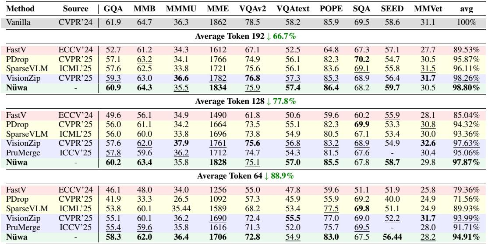
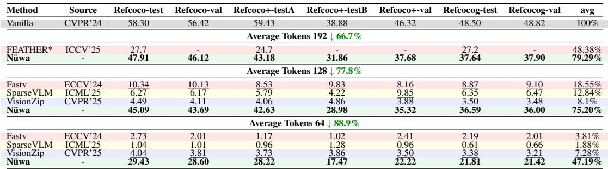
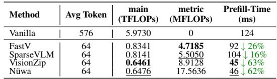
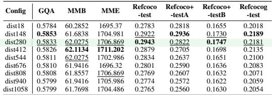
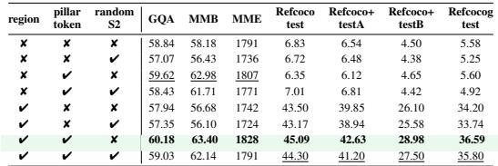

[← 返回 README](../README.md)

# 4 Experiment

## 📌 预览
在 LLaVA-1.5-7B、LLaVA-NeXT-7B 上验证：10 个 VQA benchmark + 3 个 VG benchmark (RefCOCO 系列)。Nüwa 在 VQA 上达到 94.91%~98.80% 保持率（SOTA），在 VG 上从前作的 ~7% 跃升到 47.19%（64 tokens）和 75.20%（128 tokens）。效率方面：TFLOPs 仅增加 0.01，prefill 增加 1ms。消融实验验证了 region partition 对 VG 的决定性作用。

---

Experimental Setup: To validate the generality and effectiveness of our method, we conduct experiments on multiple VLMs and diverse benchmarks for image understanding and visual grounding tasks. The evaluated models are LLaVA-1.5, LLaVA-NeXT. We use 10 VQA benchmarks (e.g., GQA, TextVQA) and 3 VG benchmarks (RefCOCO, etc.). All experiments are run on NVIDIA A100-40G GPUs. Detailed configurations are in the Appendix B.2.

> 💡 **批注**: 实验覆盖全面：2 个模型 × 13 个数据集 × 3 种 token 预算。后续 Appendix 还有 Qwen2.5-VL 的结果。

---

## 4.1 Main Result

Performance on VQA Tasks: We apply Nuwa during the inference stage of LLaVA-1.5-7B. More ¨ results in Table 5 demonstrate that Nuwa achieves optimal performance across nearly all bench- ¨ marks, with average performance further improving upon existing SOTA methods. On more VLM models with different scales, such as LLaVA-NeXT-7B, Nuwa consistently demonstrates perfor- ¨ mance gains, establishing its strong generalizability. Results can be found in Appendix B.2. Performance on Visual Grounding Tasks: Visual grounding tasks are highly sensitive to spatial information in tokens, constituting a critical evaluation dimension for compression methods. On RefCOCO series visual grounding benchmarks, as shown in Table 6, our method substantially outperforms alternative approaches, achieving approximately $3 5 \%$ performance improvement over previous methods under 64 average tokens configuration. When retaining 192 tokens, our method maintains $79 \%$ of the original model's performance.

---

*Table 5: VQA performance comparison On LLava-1.5 7B. Best and second-best results are highlighted.*

> 💡 **Table 5 批读**:
> - **192 tokens** (66.7%↓): Nüwa 98.80% vs VisionZip 98.26% vs SparseVLM 96.11% → 小幅领先
> - **128 tokens** (77.8%↓): Nüwa 97.87% vs VisionZip 97.63% → 基本持平
> - **64 tokens** (88.9%↓): Nüwa 94.91% vs VisionZip 93.99% → 约 1% 优势
> - 关键观察：VQA 上各方法差距不大（VisionZip 已经很强），Nüwa 的真正价值在 VG

---

*Table 6: Performance comparison on the RefCOCO series benchmark On LLava-1.5 7B. Best and second-best results are highlighted.*

> 💡 **Table 6 批读**: 这是 Nüwa 最亮眼的实验！
> - **64 tokens**: Nüwa **47.19%** vs VisionZip 7.28% vs FastV 3.81% vs SparseVLM 1.88%
>   - RefCOCO-test: Nüwa 29.43 vs 最好的前作 4.04 → **7倍提升**
> - **128 tokens**: Nüwa **75.20%** vs VisionZip 8.1% → **9倍提升**
> - **192 tokens**: Nüwa **79.29%** vs PruMerge+ 48.38%
> - 这说明 region partition + spatial aggregation 对 VG 是决定性的

---

Efficiency Analysis: As shown in Table 4, we evaluate efficiency from two dimensions: theoretical computational complexity and actual prefill latency. Nuwa introduces negligi- ¨ ble computational overhead, with TFLOPs increasing by only 0.01 and prefill stage latency increasing by $1 \ \mathrm { m s }$ , compared with previous SOTA. Nuwa's design requires executing atten- ¨ tion computation only once on tokens from the final layer of the vision encoder, enabling seamless FlashAttention compatibility through simple code modifications.

*Table 4: Comparison of Model Efficiency. "main" and "metric" mean the standard Transformer pipeline and the additional computational load of pruning metric.*

> 💡 **Table 4 批读**:
> - Nüwa metric overhead: 117.6 MFLOPs vs VisionZip 8.9 MFLOPs → 13x 更高，但绝对值极小
> - main TFLOPs: Nüwa 0.6476 ≈ VisionZip 0.6461 → 几乎相同
> - Prefill: Nüwa 47ms vs VisionZip 46ms → 仅 +1ms
> - vs Vanilla (576 tokens): 0.6476 vs 5.9730 TFLOPs → **89% 减少**
> - 结论：Nüwa 的额外计算可忽略不计，因为它只在 ViT 最后一层做一次操作

---

## 4.2 Ablation Study

Ablation on Spatial Proximity Threshold To enable aggregation based on spatial proximity, we define local neighborhoods via a distance threshold $\tau$ . Empirical evaluation (Table 7) shows that performance peaks at $\tau = 2 6 \%$ of the maximum distance. Smaller values restrict aggregation scope, leading to suboptimal results, while larger values incorporate noise from distant regions, also degrading performance. These results confirm the effectiveness of localized aggregation in preserving spatial integrity. Ablation on Key Components Experimental results in Table 8 show that region partitioning is essential for grounding tasks, as it implements a more precise RPME strategy, but has negligible effects on VQA tasks. The L2-norm criterion positively enhances baseline token selection across all tasks, consistent with our analysis in Sec. 3.1.3. For two-stage pruning, gains over random pruning remain modest. Notably, combining random pruning with region partitioning substantially degrades performance, as the partitioning introduces potentially task-irrelevant tokens that random selection may retain.

---

*Table 7: Ablation Study On cohesion distance. The best-performing result in each column is bolded, and the second-best is underlined.*

> 💡 **Table 7 批读**:
> - 最优距离阈值 dist280 (约 26% max distance)：RefCOCO-test 0.2943
> - 太小 (dist18): 0.2783 → 聚合范围太窄，信息不足
> - 太大 (dist1058): 0.2765 → 聚合范围太广，引入噪声
> - VQA 指标 (GQA, MMB) 对距离不敏感，变化 <1%
> - 说明这个超参数主要影响 VG，且有清晰的"甜蜜点"

---

*Table 8: Ablation Study on each design. Include Pillar-token selecting, Stage2 Random Pruning and Region Separation.*

> 💡 **Table 8 批读**: 最有信息量的消融表！
> - **Region partition 是 VG 的决定性因素**: 无 region 时 RefCOCO 6.35-7.01；有 region 时 43.50-45.09
> - **Pillar token 对所有任务正向**: 无 pillar 时 GQA 57.94-58.84；有 pillar 时 59.62-60.18
> - **Random S2 vs text-guided S2**: text-guided 在有 region + pillar 时更好 (45.09 vs 44.30)
> - **Region + Random S2 = 灾难**: 因为 region 确保空间覆盖但引入了任务无关 token，random S2 无法有效筛选
> - 核心结论：region partition 解决 VG，pillar token 提升全局质量，text-guided S2 做精调

---

## 🔖 Section 总结

### 关键数字速查
| 配置 | VQA 保持率 | VG 保持率 | TFLOPs | Prefill |
|------|----------|----------|--------|---------|
| 192 tokens (66.7%↓) | 98.80% | 79.29% | - | - |
| 128 tokens (77.8%↓) | 97.87% | 75.20% | - | - |
| 64 tokens (88.9%↓) | 94.91% | 47.19% | 0.65 (↓89%) | 47ms (↓62%) |

### 消融洞察
1. **Region partition**: VG 必需（+37%），VQA 中性
2. **Pillar token (L2-norm)**: 全面正向（VQA +1.5%, VG +1.5%）
3. **Text-guided S2**: 比 random 好但提升有限（+0.8% VG）
4. **距离阈值**: 最优 26% max distance，对 VQA 不敏感
