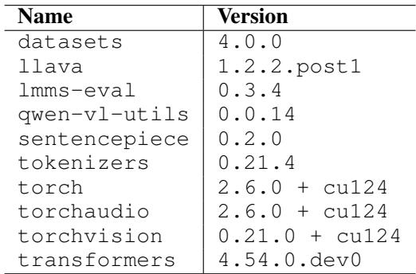
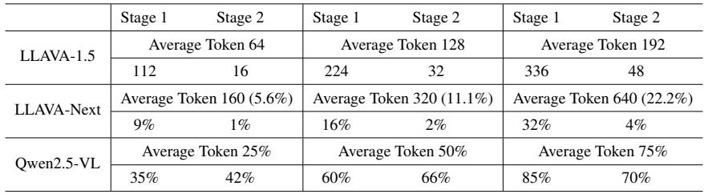
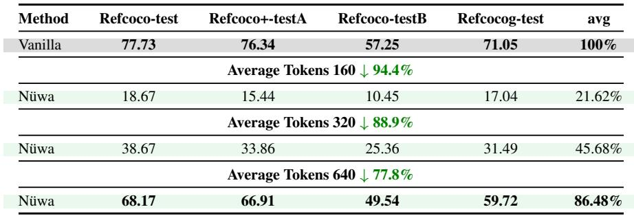
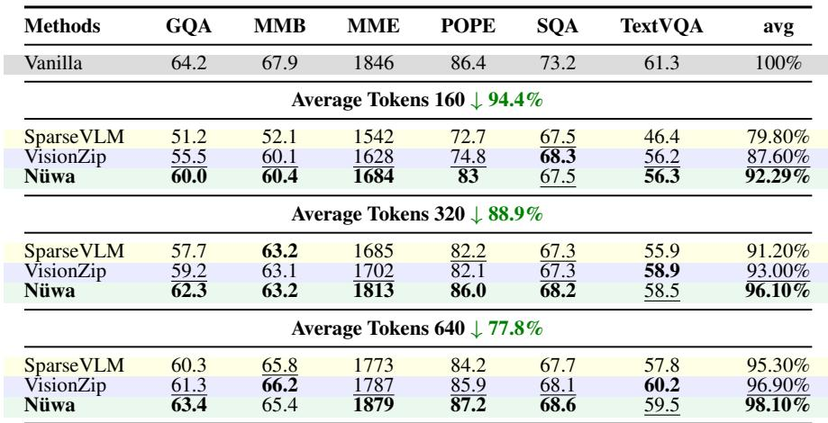
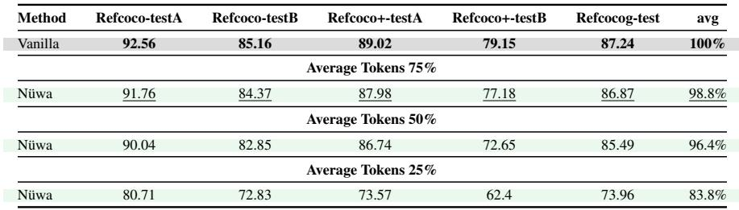
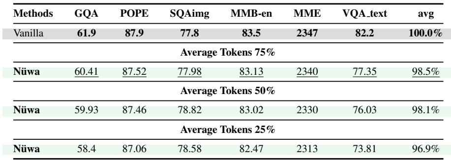
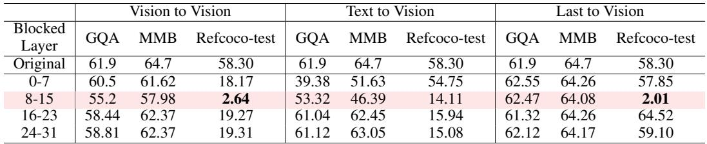

[← 返回 README](../README.md)

# Appendix B-E: Supplementary Experiments & Visualizations

## 📌 预览
Appendix 包含：(B) 详细实验设置与算法伪代码、多模型结果 (LLaVA-NeXT, Qwen2.5-VL)、attention blocking 实验；(C) FLOPs 详细计算；(D) 可视化结果；(E) Case Study（region partition、RPME、失败案例）。

---

## B.1 Implementation Details

*Table 9: Important packages in the Conda Environment.*

> 💡 **批注**: 基于 PyTorch 2.6 + Transformers 4.54.0.dev0 + lmms-eval 0.3.4。使用 Hugging Face 官方权重。

---

## B.2 Main Experiment: Algorithm & Multi-Model Results

*Table 10: Nuwa two-stage pruning setting on different VLMs.*

> 💡 **Table 10 批读**: 三个模型的两阶段配置：
> - **LLaVA-1.5**: 64 tokens = S1(112) + S2(16)；128 = S1(224) + S2(32)
> - **LLaVA-NeXT**: 按比例，如 160 tokens = S1(9%) + S2(1%)
> - **Qwen2.5-VL**: 按百分比，如 25% = S1(35%) + S2(42%)
> - Stage 1 保留较多 token，Stage 2 做精调性的细剪

---

### LLaVA-NeXT 7B Results

*Table 11: Refcoco series Benchmarks performance comparison On LLaVA-Next 7B.*

*Table 12: VQA Benchmarks performance comparison On LLaVA-Next 7B.*

> 💡 **Tables 11-12 批读**: LLaVA-NeXT 上的跨模型验证：
> - VG: 320 tokens 下 45.68% → 与 LLaVA-1.5 的 128 tokens 47.19% 类似（NeXT 原始 token 更多）
> - VQA: 320 tokens 下 96.10% → SparseVLM 91.20%, VisionZip 93.00% → 全面领先
> - 640 tokens: VG 86.48%, VQA 98.10% → 接近无损
> - Nüwa 在不同模型上泛化良好

---

### Qwen2.5-VL 7B Results

*Table 13: Refcoco series Benchmarks performance comparison On QWEN-2.5 VL 7B.*

*Table 14: VQA Benchmarks performance comparison On QWEN-2.5 VL 7B.*

> 💡 **Tables 13-14 批读**: Qwen2.5-VL 结果更令人振奋：
> - VG 75% tokens: **98.8%** 保持率！50%: 96.4%, 25%: 83.8%
> - VQA 75%: 98.5%, 50%: 98.1%, 25%: 96.9%
> - 相比 LLaVA-1.5，Qwen2.5-VL 对 pruning 更鲁棒（可能因为更强的 backbone）
> - 注意：这里没有其他方法的对比，只有 Nüwa 自己

---

## B.5 Attention Blocking Experiment

*Table 15: Attention Blocking Experiments on LLAVA-1.5 7B.*

> 💡 **Table 15 批读**: 三组 attention blocking 实验揭示了深层机制：
>
> **Vision-to-Vision blocking**:
> - VQA: 中度影响（GQA 61.9→55.2 at layers 8-15）
> - VG: **毁灭性**（RefCOCO 58.30→2.64 at layers 8-15）
> - → VG 强依赖 vision token 之间的空间关系
>
> **Last-to-Vision blocking**:
> - VQA: 几乎无影响（GQA 62.55 vs 61.9）→ VQA 不需要直接从 vision 取信息
> - VG: layers 8-15 致命（2.01）但 16-23 反而提升到 64.52！
> - → VG 在中层提取空间信息，后续层的视觉干扰反而有害
>
> **Text-to-Vision blocking**:
> - VQA: 早期 blocking 最致命（GQA 39.38 at 0-7）→ 早期多模态交互是关键
> - VG: 8-15 和 16-23 都致命（14.11, 15.94）→ VG 需要持续的多模态交互
>
> 核心结论：VQA = 早期特征提取 + 后续语言推理；VG = 持续的空间-语义交互

---

## D. Visualization Results

*Figure 7: Complete Attention Flow for VQA and VG Tasks on LLAVA-1.5 7B.*

> 💡 **批注**: Figure 3 的完整版，展示所有 token 类型之间的 attention flow。

---

*Figure 8: Two-Dimensional Visualization of Vision-Text Similarity.*

*Figure 9: Visualization results of Layer-wise Vision-Text Similarity Heatmap.*

> 💡 **Figures 8-9 批读**: 直观展示多模态对齐过程。早期层 vision 和 text 在不同空间，中间层开始对齐，支撑了 Stage 2 放在中间层的设计决策。

---

*Figure 10: Visualization of "register" token and making significant contributions to the prediction (gradient-weighted attention values).*

> 💡 **Figure 10 批读**: 验证 Pillar Token 设计——高 L2-norm token 与 VQA/VG 任务中贡献最大的 token 有 72%/66% 重叠率。这些 token 确实是全局信息锚点，不应被修改。

---

*Figure 11: Visualization results of Pruning results.*

> 💡 **Figure 11 批读**: Nüwa 的 pruning 结果可视化——保留的 token 均匀覆盖全图，维持了空间完整性。

---

## E. Case Study

*Figure 15: A comparison between the original Nuwa setting and the token selection setting without regional partitioning.*

> 💡 **Figure 15 批读**: 无 region partition 时，保留的 token 聚集在语义显著区域，导致四角无覆盖，预测偏向左上角。有 region partition 时，四角都有 token，预测更准。

---

*Figure 16: A comparison between the token selection setting without regional partitioning and the setting with RPME.*

> 💡 **Figure 16 批读**: RPME 修复了位置偏移（不再系统偏向左上角），但 bounding box 形状不准——因为线性拉伸导致"图像畸变"。这也解释了为什么 RPME 是必要但不充分的，还需要 region partition。

---

*Figure 17: Localization failure attributable to the model's comprehension.*

> 💡 **Figure 17 批读**: 失败案例分析——模型把远处戴棒球手套的人误认为目标，并给该区域分配了极高 attention。这不是 pruning 的问题，而是模型理解的问题。诚实的失败案例分析，加分。
