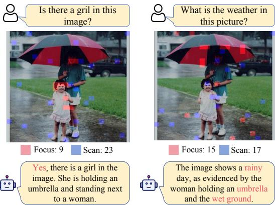
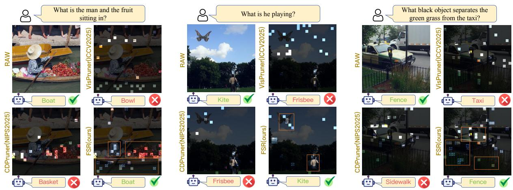

[← 返回 README](../README.md)

# 1 Introduction

## 📌 预览
Introduction 梳理 VLM visual token 的效率瓶颈，将现有 pruning 方法分为三类（attention-based / similarity-based / joint），指出各自局限，进而提出人类认知启发的 FSR 三阶段框架。

---

With the rapid progress of large language models (LLMs) OpenAI et al. (2024); Touvron et al. (2023); Jiang et al. (2023); Qwen et al. (2025), vision–language models (VLMs) have advanced substantially in multimodal perception and reasoning Radford et al. (2021); Alayrac et al. (2022); Li et al. (2023a); Dai et al. (2023); Liu et al.

(2023); Zhu et al. (2023); Chen et al. (2024b); OpenAI (2023); Team et al. (2025). A typical VLM encodes an image into a sequence of visual tokens, concatenates them with text tokens, and performs autoregressive decoding with an LLM. To preserve fine details, modern VLMs increasingly adopt high-resolution encoders and tiling strategies Bai et al. (2023); Li et al. (2024a); Chen et al. (2024b), which often produce massive visual tokens. Since Transformer attention scales quadratically with sequence length Vaswani et al. (2017), these tokens greatly increase latency and memory, becoming a key bottleneck for deployment Team et al. (2024); Hu et al. (2024). A practical remedy is training-free visual token pruning, which reduces visual tokens under a fixed budget. Existing methods can be categorized by the signals they exploit: (i) Attention-based pruning selects tokens with high cross-attention or [CLS]- based attention, and thus tends to favor locally salient regions Chen et al. (2024a); Shang et al. (2024); (ii) Similarity-based pruning relies on inter-token similarity to encourage token diversity, and therefore tends to retain tokens that provide global scene coverage Alvar et al. (2025); Wen et al. (2025); (iii) Joint attention–similaritybased pruning combine both cues Yang et al. (2025b); Zhang et al. (2025a,b); Zou et al. (2025), but still struggle to balance local evidence and global context under high reduction ratios.

> 💡 **三类方法的本质对立**:
> - Attention-based → 偏局部（salient but potentially query-irrelevant）
> - Similarity-based → 偏全局（diverse but may miss fine-grained details）
> - Joint → 试图兼顾但在高压缩率下仍 struggle
> - FSR 的定位：动态分配而非静态混合

---

*Fig. 1 Dynamic allocation of local evidence and global context. Red tokens denote Focus (local evidence) and blue tokens denote Scan (global context). FSR dynamically reallocates the 32 token budget across tasks: for a simple existence query, it concentrates on a small local region (Focus = 9, Scan = 23), whereas for a reasoning-intensive query (weather inference), it attends to multiple cues (e.g., umbrella and wet ground), increasing local evidence coverage (Focus = 15, Scan = 17).*

> 💡 **Figure 1 批读**:
> - 仅 32 tokens 的极端 budget 下展示动态分配
> - 简单问题（"Is there a dog?"）→ Focus 少（9）、Scan 多（23）
> - 复杂推理（天气推断）→ Focus 多（15），需要多个局部线索
> - 这种**自适应**是 FSR 区别于 static heuristics 的核心

---

Importantly, the desired allocation between local and global tokens is task-dependent. Tasks involving multiple objects, relations, or reasoning typically require collecting multiple local cues across different regions, while fine-grained recognition often depends on a small set of concentrated evidence. Without a proper balance, the retained tokens are often incomplete for the target question, leaving the LLM with insufficient evidence or context for reliable reasoning.

> 💡 **动机核心**: 局部/全局分配不是固定比例，而是 task-dependent

---

Studies of human perception in visual question answering tasks show that humans selectively focus on task relevant regions, expand attention to scan the global context, and integrate peripheral cues via ensemble coding for a holistic representation Velichkovsky; (2010); Ding and Yu (2025); Henderson (2003); Alvarez (2011). Inspired by this cognitive process, we propose the Focus-Scan-Refine (FSR) pruning framework, which follows a simple three-stage design. (i) Focus: we employ a dual-pathway scoring mechanism that fuses visual saliency with instruction relevance to identify critical local evidence, keeping top tokens until a cumulative information density threshold is met. (ii) Scan: conditioned on the focused set, we select complementary tokens that are most different from the focused evidence and diverse among themselves, ensuring the added tokens cover missing context without redundancy. (iii) Refine: we further strengthen global context by merging nearby informative tokens into scan anchors via similarity-based assignment and scoreweighted aggregation, while keeping the token budget unchanged.

> 💡 **认知科学依据**:
> - **Focus** ← 人类优先注视 task-relevant 区域（Yarbus 经典发现）
> - **Scan** ← 当局部证据不足时扩大视野扫描（Henderson 2003）
> - **Refine** ← 大脑对外周信息的 ensemble coding（Alvarez 2011）
> - 三阶段对应人类 VQA 的三个认知步骤

---

Overall, FSR dynamically adjusts the allocation between local evidence and global context according to the complexity of the input task, as illustrated in Figure 1. Compared with prior methods, FSR achieves a more effective balance between local and global information, as further demonstrated in Figure 2. The main contributions are summarized as follows:

• We propose FSR, a human-inspired, trainingfree pruning framework that dynamically allocates a fixed token budget between local evidence and complementary global context, rather than relying on static local/global heuristics. We introduce a comprehensive pipeline comprising a dual-pathway scoring mechanism for local evidence, a conditional sampling strategy for global context, and an aggregation module for texture refinement, ensuring efficient and non-redundant token selection. Extensive experiments demonstrate that FSR consistently outperforms prior visual token pruning methods. The improvement arises from its ability to balance local evidence and global context more effectively.

> 💡 **三大贡献**:
> 1. 动态分配框架（vs. 静态 heuristics）
> 2. 完整 pipeline: dual-pathway Focus + conditional Scan + aggregation Refine
> 3. 全面实验验证，多模型多 benchmark SOTA

---

*Fig. 2 Visualization-based analysis of FSR on relational visual reasoning tasks. Highlighted tokens indicate the selected visual tokens, while tokens with blue borders denote those used for refinement; a fixed budget of 24 visual tokens is retained for all methods. In the three examples, FSR captures (i) the man, fruit, boat, as well as the surrounding water, (ii) the man and the butterfly-shaped kite he is playing with, and (iii) multiple interacting entities such as the taxi, grass, and fence. By contrast, VisPruner, HoloV, and CDPruner often over focus on a single local region, failing to preserve enough information to answer the question.*

> 💡 **Figure 2 批读**:
> - 24 token budget 下的可视化对比
> - VisPruner/HoloV/CDPruner 都倾向于 over-focus 单一局部区域
> - FSR 同时覆盖了多个交互实体 + 背景上下文
> - 蓝色边框 = Refine 阶段聚合的 token，说明 Refine 在补充细节

---

## 🔖 Section 总结

### 核心洞察
1. 现有 pruning 三大类方法的根本矛盾：局部 vs 全局
2. 最优分配比例是 task-dependent，不应写死
3. 人类认知的 focus → scan → refine 自然对应这一需求
4. FSR 用动态阈值（ρ）自动确定 Focus 集大小，剩余给 Scan
