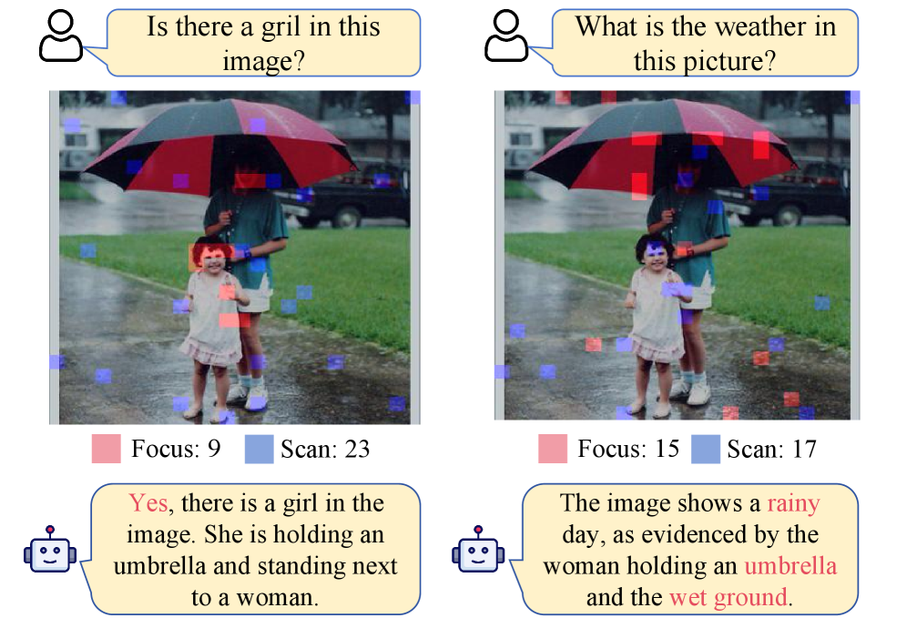
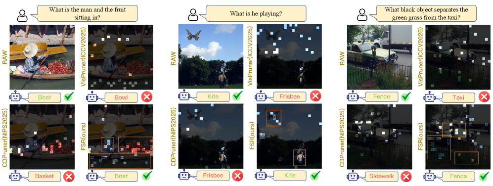

[← 返回 README](../README.md)

# 1 Introduction

## 📌 预览
从 VLM 推理瓶颈出发，梳理现有 token pruning 三大类方法的不足，引出 FSR 的人类视觉认知灵感和三阶段设计。

---

*Figure 1: Dynamic allocation of local evidence and global context. Red tokens denote Focus (local evidence) and blue tokens denote Scan (global context). FSR dynamically reallocates the 32 token budget across tasks: for a simple existence query, it concentrates on a small local region (Focus = 9, Scan = 23), whereas for a reasoning-intensive query (weather inference), it attends to multiple cues (e.g., umbrella and wet ground), increasing local evidence coverage (Focus = 15, Scan = 17).*

> 💡 **Figure 1 批读**: 这张图直观展示了 FSR 的核心卖点——**task-dependent 动态分配**。同一张图、同样 32 个 token budget，不同 query 导致 Focus/Scan 比例完全不同。简单问题（Is there a girl?）Focus 少（9个，集中在女孩区域），Scan 多（23个，覆盖全局）；推理问题（天气推断）Focus 多（15个，需要看伞、湿地面等多个线索），Scan 少（17个）。这种动态性来自 Eq.4 的 cumulative density threshold ρ。

---

With the rapid progress of large language models (LLMs), vision–language models (VLMs) have advanced substantially in multimodal perception and reasoning. A typical VLM encodes an image into a sequence of visual tokens, concatenates them with text tokens, and performs autoregressive decoding with an LLM. To preserve fine details, modern VLMs increasingly adopt high-resolution encoders and tiling strategies, which often produce massive visual tokens. Since Transformer attention scales quadratically with sequence length, these tokens greatly increase latency and memory, becoming a key bottleneck for deployment.

> 💡 **背景**: 标准问题陈述。高分辨率 VLM（如 LLaVA-NeXT 2880 tokens、Qwen2.5-VL 动态分辨率）的 visual token 数量是推理瓶颈的核心来源。二次方复杂度让问题随 token 数量急剧恶化。

---

*Figure 2: Visualization-based analysis of FSR on relational visual reasoning tasks. Highlighted tokens indicate the selected visual tokens, while tokens with blue borders denote those used for refinement; a fixed budget of 24 visual tokens is retained for all methods. In the three examples, FSR captures (i) the man, fruit, boat, as well as the surrounding water, (ii) the man and the butterfly-shaped kite he is playing with, and (iii) multiple interacting entities such as the taxi, grass, and fence. By contrast, VisPruner, HoloV, and CDPruner often over focus on a single local region, failing to preserve enough information to answer the question.*

> 💡 **Figure 2 批读**: 三个关系推理任务的可视化对比，budget 仅 24 tokens。竞争方法（VisPruner、HoloV、CDPruner）的共同问题是 **over-focus on a single local region**——只关注一个物体而忽略关系中的另一方。FSR 的优势在于 Scan 阶段补充了互补的全局上下文，使得回答关系型问题时能同时看到多个相关实体。

---

A practical remedy is training-free visual token pruning, which reduces visual tokens under a fixed budget. Existing methods can be categorized by the signals they exploit: (i) Attention-based pruning selects tokens with high cross-attention or [CLS]-based attention, and thus tends to favor locally salient regions; (ii) Similarity-based pruning relies on inter-token similarity to encourage token diversity, and therefore tends to retain tokens that provide global scene coverage; (iii) Joint attention–similarity-based pruning combine both cues, but still struggle to balance local evidence and global context under high reduction ratios.

> 💡 **方法分类**: 这个三分法非常清晰：
> - **Attention-based** (FastV, PruMerge, SparseVLM, PyramidDrop) → 偏 local，容易遗漏全局上下文
> - **Similarity-based** (DivPrune, DART) → 偏 global，可能忽略细粒度局部细节
> - **Joint** (VisionZip, VisPruner, CDPruner, HoloV) → 试图平衡但在极端压缩下仍不够
>
> FSR 的创新在于**不是简单地融合两个信号**，而是按认知科学的阶段性处理来组织：先 Focus 确定局部，再 Scan 补充全局，最后 Refine 聚合细节。

---

Importantly, the desired allocation between local and global tokens is task-dependent. Tasks involving multiple objects, relations, or reasoning typically require collecting multiple local cues across different regions, while fine-grained recognition often depends on a small set of concentrated evidence.

> 💡 **关键洞察**: Task-dependent 的动态分配是 FSR 的核心卖点。这不是一个新观察（CDPruner 也提到了 instruction relevance），但 FSR 把它做到了极致——通过 Eq.4 的 cumulative density threshold ρ 自动决定 Focus/Scan 的比例分配。

---

Without a proper balance, the retained tokens are often incomplete for the target question, leaving the LLM with insufficient evidence or context for reliable reasoning.

> 💡 这句话精准概括了所有现有方法的痛点：保留的 token 对于目标问题来说**不完整**。

---

Studies of human perception in visual question answering tasks show that humans selectively focus on task relevant regions, expand attention to scan the global context, and integrate peripheral cues via ensemble coding for a holistic representation. Inspired by this cognitive process, we propose the Focus-Scan-Refine (FSR) pruning framework, which follows a simple three-stage design. (i) Focus: we employ a dual-pathway scoring mechanism that fuses visual saliency with instruction relevance to identify critical local evidence, keeping top tokens until a cumulative information density threshold is met. (ii) Scan: conditioned on the focused set, we select complementary tokens that are most different from the focused evidence and diverse among themselves, ensuring the added tokens cover missing context without redundancy. (iii) Refine: we further strengthen global context by merging nearby informative tokens into scan anchors via similarity-based assignment and score-weighted aggregation, while keeping the token budget unchanged.

> 💡 **认知科学映射**:
> - Focus → 选择性注意（selective attention）：人类先看与问题最相关的区域
> - Scan → 外周视觉扫描（peripheral scanning）：局部不够时扩展视野
> - Refine → 集成编码（ensemble coding）：大脑将外周信息聚合为统计摘要
>
> 三个阶段的设计非常自然：Focus 用双通道打分（saliency + relevance），Scan 用条件最远点采样（CCS），Refine 用加权聚合。

---

Overall, FSR dynamically adjusts the allocation between local evidence and global context according to the complexity of the input task, as illustrated in Figure 1. Compared with prior methods, FSR achieves a more effective balance between local and global information, as further demonstrated in Figure 2. The main contributions are summarized as follows:

- We propose FSR, a human-inspired, training-free pruning framework that dynamically allocates a fixed token budget between local evidence and complementary global context, rather than relying on static local/global heuristics.

- We introduce a comprehensive pipeline comprising a dual-pathway scoring mechanism for local evidence, a conditional sampling strategy for global context, and an aggregation module for texture refinement, ensuring efficient and non-redundant token selection.

- Extensive experiments demonstrate that FSR consistently outperforms prior visual token pruning methods. The improvement arises from its ability to balance local evidence and global context more effectively.

> 💡 **三大贡献**: 
> 1. **动态分配框架**（vs. 静态启发式）
> 2. **完整的三阶段 pipeline**（dual-pathway + CCS + aggregation）
> 3. **SOTA 实验结果**（多模型、多 benchmark、多压缩比）
>
> 最值得关注的是第一点——动态分配。这意味着 FSR 的 Focus budget K_F 不是固定的超参数，而是根据输入自动决定的。
