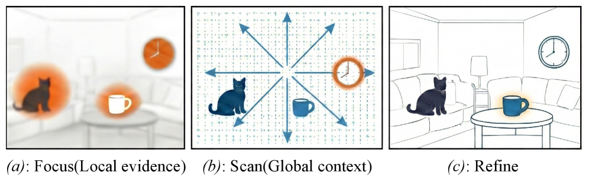
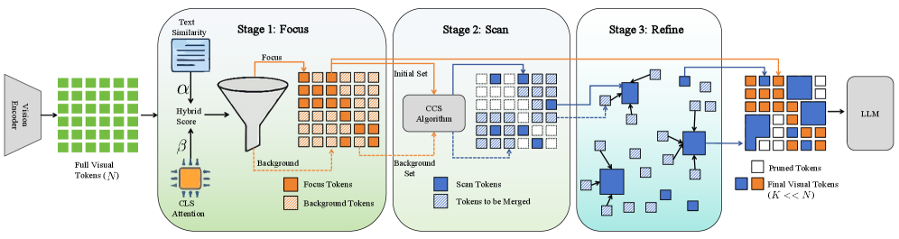

[← 返回 README](../README.md)

# 3 Proposed Method

## 📌 预览
FSR 框架的完整技术细节：人类视觉感知启发 → Focus（双通道打分 + 累积密度阈值）→ Scan（条件上下文采样 CCS + 理论覆盖保证）→ Refine（相似度分配 + 分数加权聚合）。

---

*Figure 3: Human Visual Perceptual Strategy under Limited Attention. (a) Constrained by finite attentional capacity, humans prioritize local regions that are most relevant to the query. (b) To acquire complementary information, humans expand their field of view to scan the global layout and background context. (c) The brain utilizes ensemble coding to aggregate peripheral signals into summary statistics, forming a robust global representation.*

> 💡 **Figure 3 批读**: 这张概念图很好地展示了认知科学的三阶段映射。(a) Focus: 有限注意力下优先处理与 query 相关的局部区域（猫、钟、杯子）；(b) Scan: 扩展视野扫描全局布局；(c) Refine: 大脑通过集成编码将外周信号聚合为摘要统计量。这为 FSR 的三阶段设计提供了认知科学的合理性。

---

*Figure 4: Overview of the FSR framework. Given input visual tokens and a query, FSR progressively compresses information into a fixed budget K: (1) Focus: Identifies critical local evidence (ℱ) via a dual-pathway scoring mechanism fusing visual saliency and instruction relevance. (2) Scan: Captures complementary global context (𝒮) using the Conditional Context Sampling (CCS) algorithm to maximize information gain. (3) Refine: Enriches the sparse context anchors by aggregating relevant discarded details via weighted merging, ensuring a holistic representation for the LLM.*

> 💡 **Figure 4 批读**: 框架总览图。注意几个关键细节：
> - Focus 阶段的双通道打分：text similarity (α) + CLS attention (β) → fused priority score φ
> - Scan 阶段：CCS 算法从 Background tokens 中选择与 Focus set 最不同的 token
> - Refine 阶段：只对 Scan anchors 做聚合，Focus tokens 保持不变（保护局部证据的保真度）
> - 最终输出 K 个 token = K_F (Focus) + K_S (Scan)

---

## 3.1 Inspiration from the Human Visual Perception

Our methodology is inspired by how the human visual system allocates perceptual resources under limited attention. Cognitive science research indicates that when answering visual questions, humans do not process the entire scene with equal fidelity; instead, they prioritize extracting information from local regions highly relevant to the query. Reliance on local cues alone is often insufficient for complex tasks; when initial local evidence fails to yield a confident answer, humans scan the global context to find more cues. Subsequently, rather than discarding the remaining peripheral information, the brain utilizes ensemble coding to aggregate it into summary statistics, ensuring a complete yet efficient scene representation. Figure 3 provides a high-level illustration of this general organization of human visual processing.

> 💡 **认知科学基础**: 三个关键参考：
> - Yarbus (1967): 眼动追踪证明人类根据 task 选择性地注视不同区域
> - Henderson (2003): 场景感知中的全局扫描行为
> - Alvarez (2011): 集成编码（ensemble coding）——大脑能从外周视觉中提取统计摘要（如平均大小、方向）而不需要逐个处理
>
> 这些认知科学发现为 FSR 的三阶段设计提供了生物学合理性，不仅仅是 engineering intuition。

---

Inspired by this perceptual strategy of progressively allocating attention from local evidence to global context, we propose the FSR framework (see Figure 4 for an overview) to simulate this progressive process. To mathematically instantiate this progressive process, we model the task as identifying an optimal subset of tokens within an explicitly constrained budget.

> 💡 从认知科学灵感到数学建模的过渡。

---

Given an input image, a vision encoder outputs a sequence of visual tokens **V** = {**v**_i}_{i=1}^N where **v**_i ∈ ℝ^d. Given a query **q** and a token budget K (K ≪ N), our objective is to identify a compressed subset **Ṽ** ⊂ **V** with |**Ṽ**| = K. Unlike static pruning, FSR dynamically constructs **Ṽ** by first locking onto key local evidence (Focus) and then expanding the field of view (Scan & Refine) to get more contextual information.

> 💡 **问题形式化**: 从 N 个 visual tokens 中选 K 个（K ≪ N）。关键区别于静态方法：FSR **动态构建**这个子集，Focus 和 Scan 的比例根据输入自动调整。

---

## 3.2 Stage I: Focus on local evidence

The Focus stage aims to identify and retain the most critical local visual evidence, mimicking the focus mechanism in human visual perception. To avoid the potential bias of relying solely on a single signal, we employ a dual-pathway scoring mechanism fusing both visual saliency and instruction relevance, ensuring that the selected tokens are not only visually salient but also semantically aligned with the user's instruction.

> 💡 **Focus 阶段设计动机**: 单一信号的偏差问题——
> - 只用 visual saliency → 选到显著但与 query 无关的 token（如背景中的高对比度物体）
> - 只用 instruction relevance → CLIP 的 text-image 匹配可能不精确
> - 双通道融合 → 互补

---

We first identify inherently salient regions (e.g., foreground objects) using the attention map from the vision encoder. Denote by **A** ∈ ℝ^{H×(N+1)×(N+1)}, the attention map from the [CLS] token to other tokens in a selected layer. The saliency score s_i for the i-th token is computed as:

$$s_i = \frac{1}{H} \sum_{h=1}^{H} \mathbf{A}_h[\text{CLS}, i] \tag{1}$$

> 💡 **Saliency score**: 用 vision encoder（如 CLIP ViT）中 [CLS] token 对其他 token 的注意力权重作为 saliency。H 个 head 取平均。这与 FasterVLM、HiRED 类似，但 FSR 只将其作为双通道之一。

---

To ensure that the selected tokens are relevant to the user's instruction, we compute the semantic similarity between visual tokens and the text instruction. We encode the textual query **q** into an embedding **t** using the pre-trained CLIP text encoder. The relevance score r_i is defined as the cosine similarity:

$$r_i = \cos(\bar{\mathbf{v}}_i, \bar{\mathbf{t}}), \quad \text{where } \bar{\mathbf{v}}_i = \mathbf{v}_i / \|\mathbf{v}_i\|_2, \; \bar{\mathbf{t}} = \mathbf{t} / \|\mathbf{t}\|_2 \tag{2}$$

> 💡 **Relevance score**: 用 CLIP text encoder 编码 query，然后与每个 visual token 做 cosine similarity。这与 CDPruner 的 instruction relevance 计算方式相同。注意这里复用了 VLM 自带的 CLIP 编码器，没有额外计算开销。
>
> **潜在问题**: 对于 Qwen2.5-VL 这类没有 CLIP text encoder 的模型，需要做适配（后文 4.2.3 节提到了）。

---

We further normalize both scores to [0,1] (denoted by the hat notation) and compute a fused priority score φ_i to generate a unified priority map:

$$\phi_i = \hat{r}_i^{\alpha} \hat{s}_i^{\beta} \tag{3}$$

where α and β control the trade-off between relevance and saliency.

> 💡 **融合公式**: 乘法融合而非加法！这意味着如果某个 token 的 relevance 或 saliency 任一接近 0，其 priority score 会很低。这种**门控效应**确保了选出的 token 同时满足两个条件。
>
> 默认 α=3, β=1，即 **instruction relevance 权重更高**（三次方 vs 一次方）。这符合直觉：与 query 无关的 token 再显著也不应该被选中。

---

Tokens are then sorted by φ in descending order, denoted by the permutation π. To determine the dynamic budget K_F, we select the minimum number of tokens required to preserve a ratio ρ (default 0.9) of the total information mass Z = Σ_{i=1}^N φ_i:

$$K_F = \min\{k \mid \sum_{j=1}^{k} \phi_{\pi(j)} \geq \rho Z\} \tag{4}$$

The resulting set ℱ = {π(1), …, π(K_F)} constitutes the local evidence.

> 💡 **动态 budget K_F**: 这是 FSR 最核心的创新之一！K_F 不是固定值，而是根据 priority score 的分布自动决定的。
> - 如果 score 集中在少数 token 上（简单场景/明确目标）→ K_F 小，留更多 budget 给 Scan
> - 如果 score 分散（复杂场景/多物体关系）→ K_F 大，Focus 需要更多 token
> - ρ=0.9 意味着保留 90% 的信息质量
>
> **与 CDPruner 的区别**: CDPruner 的 DPP 一步到位选所有 token，没有这种 Focus/Scan 的动态分配。

---

## 3.3 Stage II: Scan for global context

### 3.3.1 Conditional Context Sampling

Relying solely on local evidence ℱ often results in missing critical background information required for holistic reasoning. The Scan stage addresses this by expanding the attentional window to capture broader global context when local information is insufficient.

> 💡 直接指出 Focus-only 的局限性：缺少背景信息导致推理不完整。

---

We introduce a Conditional Context Sampling (CCS) algorithm to select K_S = K − K_F supplementary anchors. To maximize information gain, these anchors must be complementary to the focused set ℱ and diverse among themselves. Specifically, we initialize the available anchor set as 𝒜 = ℱ. In each iteration, we identify the token i* that is maximally different from the current anchor set 𝒜 in the feature space:

$$\Delta(i, \mathcal{A}) = \min_{j \in \mathcal{A}} (1 - \cos(\bar{\mathbf{v}}_i, \bar{\mathbf{v}}_j)) \tag{5}$$

$$i^* = \arg\max_{i \notin \mathcal{A}} \Delta(i, \mathcal{A})$$

We update 𝒜 ← 𝒜 ∪ {i*} and repeat this process for K_S iterations. This strategy ensures that the newly captured tokens are different from the salient objects and minimizes redundancy, thereby optimizing the utility of the token budget. Finally, the specific set of scanned context tokens is obtained as 𝒮 = 𝒜 \ ℱ.

> 💡 **CCS 算法**: 本质上是 **Farthest Point Sampling (FPS)**，但以 Focus 集合作为初始锚点。
> - 初始化：𝒜 = ℱ（Focus 集合作为已知信息）
> - 每步选离当前集合最远的 token（cosine distance）
> - 重复 K_S 次
>
> **与 DivPrune 的区别**: DivPrune 也是 max-min diversity selection，但它从空集开始。FSR 的 CCS 是 **conditioned on Focus set**，确保 Scan tokens 与 Focus tokens 互补而非重复。
>
> **计算复杂度**: O(K_S × N × d)，与 DivPrune 相同量级，但由于 K_S 通常很小（几十个），实际开销很低。

---

### 3.3.2 Theoretical Coverage Guarantee

While the CCS strategy is greedy, it admits a formal coverage guarantee, ensuring that the selected context tokens provide bounded approximation to the optimal global coverage.

> 💡 理论保证是这篇论文的一个亮点，虽然不是核心贡献但增加了方法的可信度。

---

The CCS procedure in Eq. (5) can be viewed as a variant of Farthest Point Sampling in the feature space, where the focus set ℱ is treated as a fixed set of initial centers. Let V denote the set of all visual tokens, equipped with the distance metric d(x,y) = 1 − cos(x,y). Given a total budget K and the fixed focus set ℱ, we define the optimal conditional covering radius as

$$R_{\text{opt}}(\mathcal{F}) = \min_{S': |S'| = K - |\mathcal{F}|} \max_{v \in V} d(v, \mathcal{F} \cup S') \tag{6}$$

This quantity represents the minimum achievable worst-case distance when extending ℱ with K_S additional tokens. By classical results on greedy k-center clustering with fixed centers, the token set 𝒦 = ℱ ∪ 𝒮 selected by CCS satisfies:

$$\max_{v \in V} \min_{u \in \mathcal{K}} d(v, u) \leq 2 R_{\text{opt}}(\mathcal{F}) \tag{7}$$

which bounds the information loss incurred by pruning. This guarantee implies that CCS attains a near globally optimal solution, ensuring that every unselected token lies within a bounded distance of the selected token set.

> 💡 **2-近似覆盖保证**: 基于经典的 greedy k-center clustering 理论（Hochbaum & Shmoys 1985）。
> - CCS 的最坏情况覆盖半径不超过最优解的 2 倍
> - 这意味着每个被丢弃的 token 在特征空间中都有一个距离有界的"代表"
> - 实际意义：CCS 虽然是贪心的，但理论上接近全局最优
>
> **注意**: 这个保证是在 cosine distance 空间中的，是否能直接推广到语义信息保留还有 gap。但作为工程方法的理论背书已经足够。

---

## 3.4 Stage III: Refine by aggregation

Directly discarding the unselected tokens 𝒟 = **V** \ (ℱ ∪ 𝒮) leads to a loss of fine-grained background details. The Refine stage addresses this by aggregating information from the discarded set 𝒟 into the selected context anchors.

> 💡 Refine 阶段的动机：直接丢弃 = 信息损失。通过聚合可以在不增加 token 数的情况下恢复部分信息。

---

Crucially, to preserve the high fidelity of the salient objects, we keep the focus set ℱ unchanged. We treat only the global context tokens 𝒮 as semantic anchors for aggregation.

> 💡 **关键设计决策**: 只对 Scan tokens 做聚合，Focus tokens 保持不变！这保证了局部证据的保真度不被聚合操作模糊。非常合理的设计。

---

First, for each discarded token i ∈ 𝒟, we identify its semantically nearest anchor j* within the scan set 𝒮 and compute their similarity:

$$j^*(i) = \arg\max_{j \in \mathcal{S}} \cos(\bar{\mathbf{v}}_i, \bar{\mathbf{v}}_j) \tag{8}$$

To mitigate noise and prevent over-smoothing, we do not aggregate all discarded tokens. Instead, we select the top-M tokens from the discarded set 𝒟 that possess the highest similarity scores to their assigned anchors. The total aggregation budget is dynamically determined by the size of the scan set as M = κ|𝒮|, where κ is a hyperparameter set to 1 by default.

> 💡 **选择性聚合**: 不是所有丢弃的 token 都被聚合，只选与 anchor 最相似的 top-M 个。M = κ|𝒮| 意味着每个 Scan anchor 平均只吸收 κ 个 token 的信息。κ=1 时，总共聚合 |𝒮| 个 token。
>
> 这个设计避免了 over-smoothing：如果聚合太多不相关的 token，anchor 的语义会被稀释。

---

Let 𝒟_top denote this subset of highly relevant discarded tokens. We update the anchors by absorbing information only from 𝒟_top. For each i ∈ 𝒟_top, its feature is aggregated into its nearest anchor **v**_{j*} weighted by its priority score φ_i (from Eq. (3)), as defined below:

$$\mathbf{v}_{j^*} \leftarrow \frac{w_{j^*} \mathbf{v}_{j^*} + w_i \mathbf{v}_i}{w_{j^*} + w_i}, \quad w_{j^*} \leftarrow w_{j^*} + w_i \tag{9}$$

where weights are initialized as w_j = φ_j. This step enables the sparse context anchors to capture the essential texture and semantics of their neighborhoods. The final compressed token set is the union of the intact focus tokens and the refined context tokens: **Ṽ** = ℱ ∪ 𝒮, which contains exactly K_F + K_S = K tokens.

> 💡 **加权聚合公式**: 
> - 权重初始化为 priority score φ（Eq.3 的 saliency × relevance 融合分数）
> - 聚合采用加权平均，权重累加
> - 这意味着 priority 高的 token 对聚合后的表示贡献更大
>
> **与 PruMerge 的 Merge 对比**: PruMerge 也做 token merging，但它是对所有 token 统一做，没有 Focus/Scan 的分离。FSR 只对 Scan anchors 做聚合，Focus tokens 保持原样。
>
> **最终输出**: K 个 token = K_F (原封不动的 Focus) + K_S (聚合增强的 Scan)。整个过程不改变 token 数量。
