[← 返回 README](../README.md)

# 3 Proposed Method

## 📌 预览
FSR 方法详解：人类视觉感知启发 → Focus（双通道评分+动态阈值）→ Scan（条件上下文采样CCS+理论保证）→ Refine（相似度分配+加权聚合）。

---

# 3.1 Inspiration from the Human Visual Perception

Our methodology is inspired by how the human visual system allocates perceptual resources under limited attention. Cognitive science research indicates that when answering visual questions, humans do not process the entire scene with equal fidelity; instead, they prioritize extracting information from local regions highly relevant to the query Velichkovsky; (2010); Ding and Yu (2025). Reliance on local cues alone is often insufficient for complex tasks; when initial local evidence fails to yield a confident answer, humans scan the global context to find more cues Henderson (2003); Wolfe and Horowitz (2017). Subsequently, rather than discarding the remaining peripheral information, the brain utilizes ensemble coding to aggregate it into summary statistics, ensuring a complete yet efficient scene representation Alvarez (2011). Figure 3 provides a high-level illustration of this general organization of human visual processing.

> 💡 **认知科学三阶段**:
> 1. **Focal attention** → 优先处理 query-relevant 区域（Yarbus/Velichkovsky）
> 2. **Contextual scanning** → 扩大视野搜索补充信息（Henderson, Wolfe & Horowitz）
> 3. **Ensemble coding** → 外周信息压缩为统计摘要（Alvarez 2011）
> - 这不是生硬的类比，而是有心理学实验支撑的认知模型

---

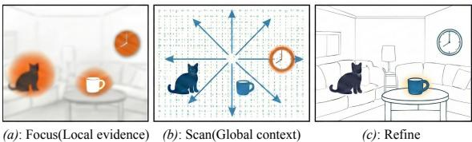
*Fig. 3 Human Visual Perceptual Strategy under Limited Attention. (a) Constrained by finite attentional capacity, humans prioritize local regions that are most relevant to the query. (b) To acquire complementary information, humans expand their field of view to scan the global layout and background context. (c) The brain utilizes ensemble coding to aggregate peripheral signals into summary statistics, forming a robust global representation.*

> 💡 **Figure 3 批读**: 三栏分别对应 Focus/Scan/Refine，直观展示认知过程到算法设计的映射

---

Inspired by this perceptual strategy of progressively allocating attention from local evidence to global context, we propose the FSR framework (see Figure 4 for an overview) to simulate this progressive process. To mathematically instantiate this progressive process, we model the task as identifying an optimal subset of tokens within an explicitly constrained budget.

Given an input image, a vision encoder outputs a sequence of visual tokens $\mathbf { V } = \{ \mathbf { v } _ { i } \} _ { i = 1 } ^ { N }$ where $\mathbf { v } _ { i } ~ \in ~ \mathbb { R } ^ { d }$ . Given a query $\mathbf { q }$ and a token budget $K$ ( $K \ll N$ ), our objective is to identify a compressed subset $\overset \sim { \mathbf { V } } \subset \mathbf { V }$ with $| \widetilde { \mathbf { V } } | = K$ . Unlike static pruning, FSR dynamically constructs $\widetilde { \mathbf { V } }$ by first locking onto key local evidence (Focus) and then expanding the field of view (Scan & Refine) to get more contextual information.

> 💡 **问题形式化**: 给定 N 个 visual token 和 budget K，选 K 个最优子集。FSR 的特点是**动态构造**而非一次性选择。

---

# 3.2 Stage I: Focus on local evidence

The Focus stage aims to identify and retain the most critical local visual evidence, mimicking the focus mechanism in human visual perception. To avoid the potential bias of relying solely on a single signal, we employ a dual-pathway scoring mechanism fusing both visual saliency and instruction relevance, ensuring that the selected tokens are not only visually salient but also semantically aligned with the user's instruction.

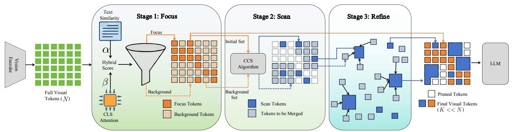
*Fig. 4 Overview of the FSR framework. Given input visual tokens and a query, FSR progressively compresses information into a fixed budget K: (1) Focus: Identifies critical local evidence (F) via a dual-pathway scoring mechanism fusing visual saliency and instruction relevance. (2) Scan: Captures complementary global context (S) using the Conditional Context Sampling (CCS) algorithm to maximize information gain. (3) Refine: Enriches the sparse context anchors by aggregating relevant discarded details via weighted merging, ensuring a holistic representation for the LLM.*

> 💡 **Figure 4 批读（核心架构图）**:
> - 流程清晰：V → Focus(F) → Scan(S) → Refine → F∪S = K tokens
> - Focus 使用 vision encoder 的 [CLS] attention + CLIP text similarity
> - Scan 用 CCS（类似 Farthest Point Sampling）
> - Refine 只修改 S 中的 token，F 保持不变（保护局部高保真）

---

We first identify inherently salient regions (e.g., foreground objects) using the attention map from the vision encoder. Denote by ${ \textbf { A } } \in$ $\mathbb { R } ^ { H \times ( N + 1 ) \times ( N + 1 ) }$ , the attention map from the [CLS] token to other tokens in a selected layer. The saliency score $s _ { i }$ for the $i$ -th token is computed as:

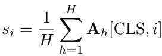

> 💡 **Saliency score**: 来自 vision encoder（非 LLM），跨 head 平均的 [CLS] attention。与 FasterVLM/HiRED 相同的信号源。

---

To ensure that the selected tokens are relevant to the user's instruction, we compute the semantic similarity between visual tokens and the text instruction Zhang et al. (2025b). We encode the textual query q into an embedding $\mathbf { t }$ using the pretrained CLIP text encoder. The relevance score $r _ { i }$ is defined as the cosine similarity:

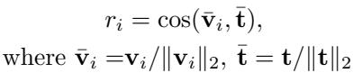

> 💡 **Relevance score**: 用 CLIP text encoder 编码 query，与 visual token 做 cosine similarity。
> - 这与 CDPruner 的做法类似
> - **注意**: 需要 CLIP text encoder 可用 → 对 Qwen2.5-VL 等无 CLIP text encoder 的架构需要适配（后文 4.2.3 确实省略了此项）

---

We further normalize both scores to $[ 0 , 1 ]$ (denoted by the hat notation ˆ·) and compute a fused priority score $\phi _ { i }$ to generate a unified priority map:

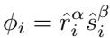

where $\alpha$ and $\beta$ control the trade-off between relevance and saliency. Tokens are then sorted by $\phi$ in descending order, denoted by the permutation $\boldsymbol { \mathscr { U } }$ . To determine the dynamic budget $K _ { \mathrm { F } }$ , we select the minimum number of tokens required information mass to preserve a ratio $\begin{array} { r } { Z = \sum _ { i = 1 } ^ { N } \phi _ { i } } \end{array}$ $\rho$ (default 0.9) of the total :

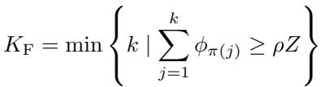

The resulting set ${ \mathcal F } = \{ \pi ( 1 ) , \ldots , \pi ( K _ { \mathrm { F } } ) \}$ constitutes the local evidence.

> 💡 **Focus 阶段核心设计**:
> - **融合方式**: $\phi_i = \hat{r}_i^\alpha \cdot \hat{s}_i^\beta$，乘法融合（非加法）
> - 默认 α=3, β=1 → **instruction relevance 权重远大于 saliency**
> - **动态阈值 ρ=0.9**: 保留累计信息量 90% 所需的最少 token → K_F 自动确定
>   - 简单问题：少数 token 即可达到 90% → K_F 小，K_S 大
>   - 复杂问题：需要更多 token → K_F 大，K_S 小
> - 这就是"动态分配"的数学机制！非常 elegant

---

# 3.3 Stage II: Scan for global context

# 3.3.1 Conditional Context Sampling

Relying solely on local evidence $\mathcal { F }$ often results in missing critical background information required for holistic reasoning. The Scan stage addresses this by expanding the attentional window to capture broader global context when local information is insufficient.

We introduce a Conditional Context Sampling (CCS) algorithm to select $K _ { \mathrm { { S } } } = K - K _ { \mathrm { { F } } }$ supplementary anchors. To maximize information gain, these anchors must be complementary to the focused set $\mathcal { F }$ and diverse among themselves. Specifically, we initialize the available anchor set as $A = F$ . In each iteration, we identify the token $i ^ { \star }$ that is maximally different from the current anchor set $\boldsymbol { A }$ in the feature space:

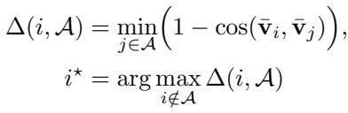

We update ${ \mathcal { A } }  { \mathcal { A } } \cup \{ i ^ { \star } \}$ and repeat this process for $K _ { \mathrm { S } }$ iterations. This strategy ensures that the newly captured tokens are different from the salient objects and minimizes redundancy, thereby optimizing the utility of the token budget. Finally, the specific set of scanned context tokens is obtained as $\textstyle S = A \setminus { \mathcal { F } }$ .

> 💡 **CCS 算法 = Farthest Point Sampling (FPS) with fixed initial centers**:
> - 初始化 A = F（Focus 集作为已有锚点）
> - 每次选距 A 最远的 token → 保证互补性 + 多样性
> - 复杂度 O(K_S × N)，线性可接受
> - **与 DivPrune 的区别**: DivPrune 从空集开始 FPS，CCS 从 Focus 集开始 → 条件化的多样性

---

# 3.3.2 Theoretical Coverage Guarantee

While the CCS strategy is greedy, it admits a formal coverage guarantee, ensuring that the selected context tokens provide bounded approximation to the optimal global coverage.

The CCS procedure in Eq. (5) can be viewed as a variant of Farthest Point Sampling Gonzalez (1985) in the feature space, where the focus set $\mathcal { F }$ is treated as a fixed set of initial centers. Let $V$ denote the set of all visual tokens, equipped with the distance metric $d ( x , y ) = 1 - \cos ( x , y )$ . Given a total budget $K$ and the fixed focus set $\mathcal { F }$ , we define the optimal conditional covering radius as

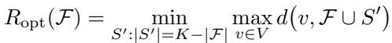

This quantity represents the minimum achievable worst-case distance when extending $\mathcal { F }$ with $K _ { \mathrm { S } }$ additional tokens. By classical results on greedy $k$ - center clustering with fixed centers Hochbaum and Shmoys (1985), the token set $K = { \mathcal { F } } \cup S$ selected by CCS satisfies:

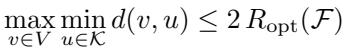

which bounds the information loss incurred by pruning. This guarantee implies that CCS attains a near globally optimal solution, ensuring that every unselected token lies within a bounded distance of the selected token set.

> 💡 **理论保证**:
> - 2-近似保证：greedy k-center 的经典结论（Hochbaum & Shmoys 1985）
> - 任意未选 token 到最近已选 token 的距离 ≤ 2×最优解
> - 这给了 FSR 一个**信息损失上界**
> - **注意**: 这是 cosine distance 空间的 covering 保证，不直接等于 task performance 保证

---

# 3.4 Stage III: Refine by aggregation

Directly discarding the unselected tokens $\mathcal { D } =$ $\mathbf { V } \setminus ( \mathcal { F } \cup \mathcal { S } )$ leads to a loss of fine-grained background details. The Refine stage addresses this by aggregating information from the discarded set $\mathcal { D }$ into the selected context anchors.

Crucially, to preserve the high fidelity of the salient objects, we keep the focus set $\mathcal { F }$ unchanged. We treat only the global context tokens $\boldsymbol { S }$ as semantic anchors for aggregation. First, for each discarded token $i \in \mathcal { D }$ , we identify its semantically nearest anchor $j ^ { \star }$ within the scan set $\boldsymbol { S }$ and compute their similarity:

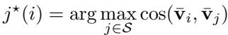

> 💡 **关键设计**: 只 merge 到 Scan 锚点，**Focus 集保持不动**
> - 这保护了局部证据的 high fidelity
> - 与 LLaVA-PruMerge 的 merge 策略不同：PruMerge 对所有保留 token 做 merge

---

To mitigate noise and prevent over-smoothing, we do not aggregate all discarded tokens. Instead, we select the top- $M$ tokens from the discarded set $\mathcal { D }$ that possess the highest similarity scores to their assigned anchors. The total aggregation budget is dynamically determined by the size of the scan set as $M = \kappa | \boldsymbol { S } |$ , where $\kappa$ is a hyperparameter set to 1 by default. Let $\mathcal { D } _ { \mathrm { t o p } }$ denote this subset of highly relevant discarded tokens. We update the anchors by absorbing information only from $\mathcal { D } _ { \mathrm { t o p } }$ . For each $i \in \mathcal { D } _ { \mathrm { t o p } }$ , its feature is aggregated into its nearest anchor ${ \bf v } _ { j ^ { \star } }$ weighted by its priority score $\phi _ { i }$ (from Eq. (3)), as defined below:

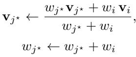

where weights are initialized as $w _ { j } ~ = ~ \phi _ { j }$ . This step enables the sparse context anchors to capture the essential texture and semantics of their neighborhoods. The final compressed token set is the union of the intact focus tokens and the refined context tokens: $\widetilde { \mathbf { V } } = \mathcal { F } \cup \mathcal { S }$ , which contains exactly $K _ { \mathrm { F } } + K _ { \mathrm { S } } = K$ tokens.

> 💡 **Refine 详解**:
> - 不是所有丢弃 token 都参与聚合 → 只选 top-M 个（M = κ|S|，默认 κ=1）
> - 权重 = priority score φ_i → 高优先级的丢弃 token 贡献更大
> - 加权平均合并（类似 ToMe 的做法）
> - **κ=1 是甜蜜点**: κ=5 会 over-smooth（消融实验验证）
> - 最终输出 K = K_F + K_S 个 token，budget 严格不变

---

## 🔖 Section 总结

### 算法流程速查
```
Input: V (N tokens), q (query), K (budget)
  
1. Focus:
   - s_i = avg CLS attention (vision encoder)
   - r_i = cos(v_i, CLIP_text(q))
   - φ_i = r̂_i^α · ŝ_i^β  (α=3, β=1)
   - K_F = min k s.t. Σ φ ≥ 0.9 × total
   - F = top-K_F tokens by φ

2. Scan:
   - K_S = K - K_F
   - CCS: FPS starting from F, select K_S anchors
   - S = selected anchors

3. Refine:
   - For discarded D = V \ (F∪S):
     - Assign each d∈D to nearest s∈S
     - Select top-M (M=κ|S|) by similarity
     - Weighted merge into S anchors
   
Output: V̄ = F ∪ S (K tokens)
```

### 超参数总结
| 参数 | 默认值 | 含义 |
|------|--------|------|
| α | 3 | instruction relevance 指数 |
| β | 1 | visual saliency 指数 |
| ρ | 0.9 | Focus 累计信息阈值 |
| κ | 1 | Refine 聚合比例 |
