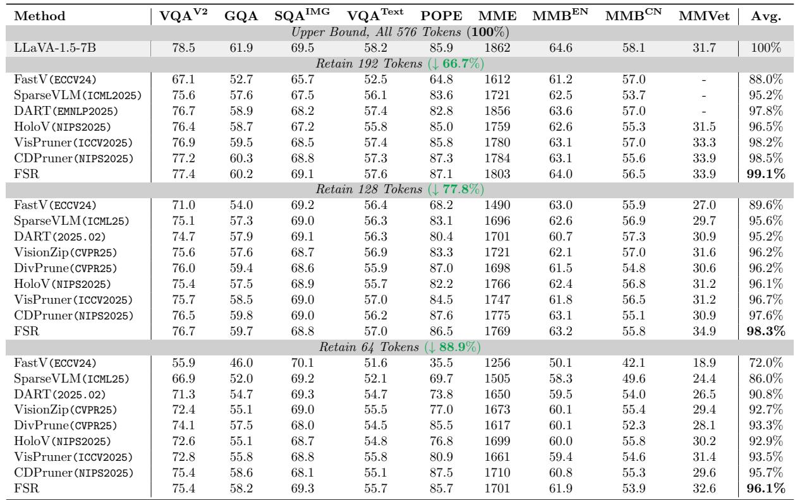
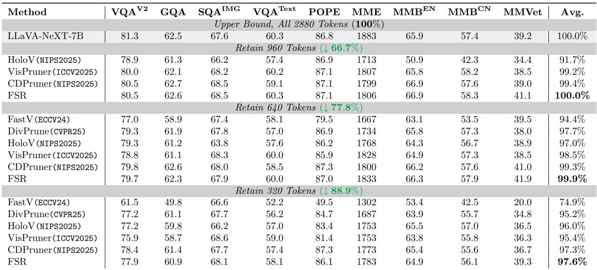
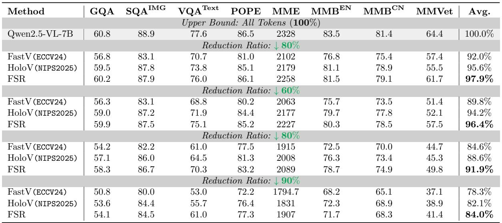
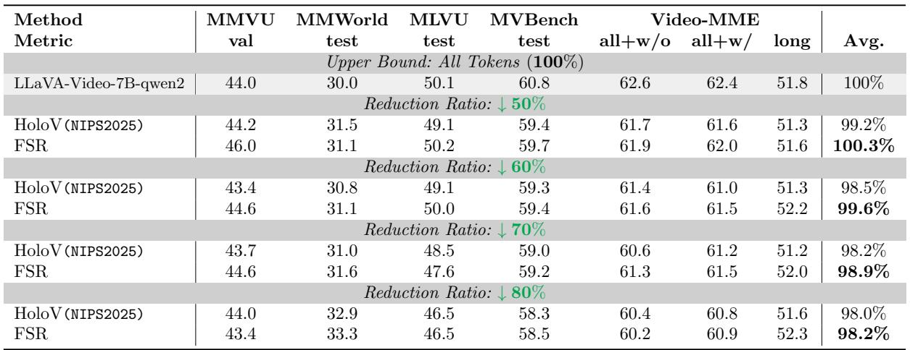
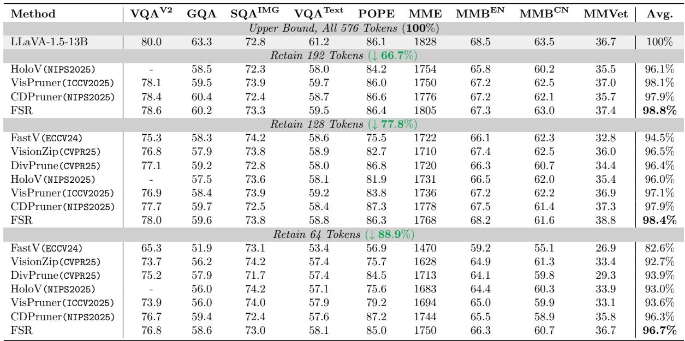
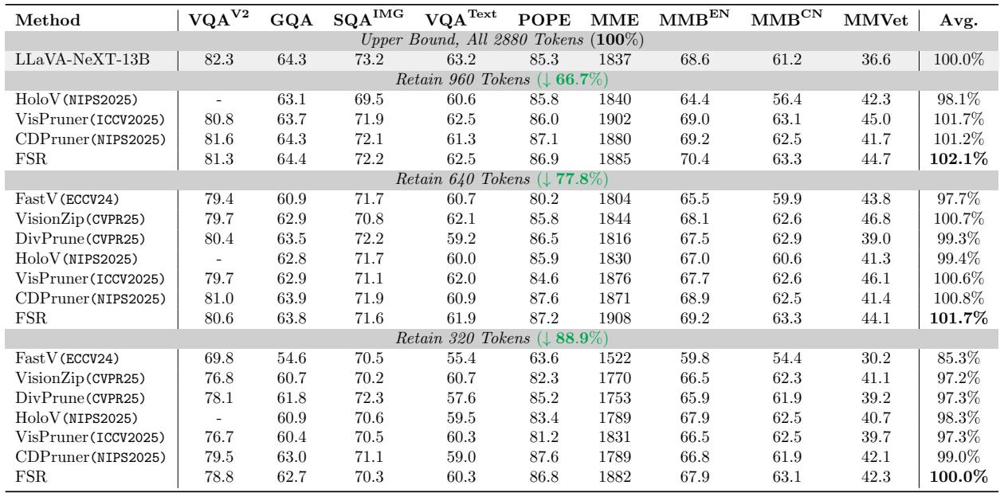
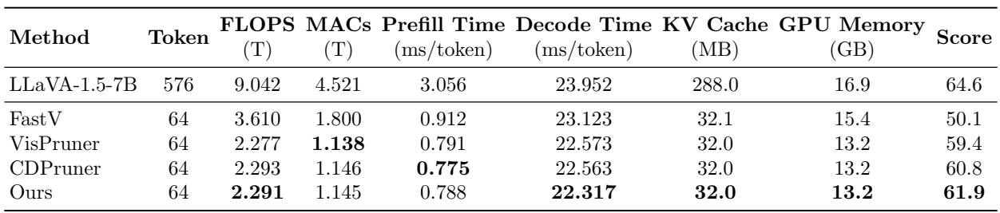
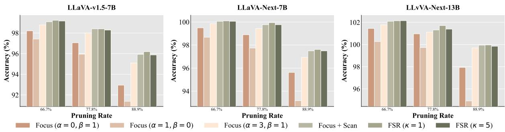

[← 返回 README](../README.md)

# 4 Experiment

## 📌 预览
全面实验：6个 VLM backbone × 多个 benchmark × 多个压缩比，外加效率分析和消融实验。

---

# 4.1 Experimental setup

In this section, we describe the experimental configurations used to evaluate the proposed FSR framework, including the model architectures, implementation details, and benchmarks.

Model architectures. We evaluate FSR on a diverse set of VLMs covering both image and video modalities. For static image understanding, we use the LLaVA series (LLaVA-1.5-7B/13B, LLaVA-NeXT-7B/13B) and Qwen2.5-VL-7B. For video understanding, we extend our evaluation to LLaVA-Video-7B-Qwen2. FSR is applied in a fully training-free, plug-and-play manner at inference time, without modifying any model weights.

> 💡 **实验覆盖面**:
> - 6 个模型：LLaVA-1.5-7B/13B, LLaVA-NeXT-7B/13B, Qwen2.5-VL-7B, LLaVA-Video-7B
> - 图像 + 视频两大模态
> - 全部 training-free、plug-and-play

---

Implementation Details. All experiments were implemented using PyTorch 2.1.2 and Python 3.10 with CUDA 12.4. Regarding hardware configurations, experiments on 7B parameter models were conducted on NVIDIA GeForce RTX 3090 (24GB). Experiments involving larger architectures(13B) and video models (LLaVA-Video7B-Qwen2) were performed on NVIDIA GPUs with 48GB memory. The default hyperparameters for FSR are set as follows: $\alpha = 3$ , $\beta = 1$ , $\rho = 0 . 9$ , and $\kappa = 1$ , unless otherwise specified.

Evaluation benchmarks. We conduct experiments on comprehensive benchmarks spanning image and video tasks. For image understanding, we cover open-ended QA (VQAv2 Goyal et al. (2017)), compositional reasoning (GQA Hudson and Manning (2019), ScienceQA Lu et al. (2022)), OCR (TextVQA Singh et al. (2019)), and general capability assessment (POPE Li et al. (2023b), MME Fu et al. (2025a),

MMBench Liu et al. (2024), MM-Vet Yu et al. (2023)). For video understanding, we employ three recent benchmarks: MLVU Zhou et al. (2025) for multi-task long video analysis, MVBench Li et al. (2024b) for fine-grained temporal perception, and Video-MME Fu et al. (2025b) for comprehensive multimodal evaluation. To further assess expert-level and world-model-oriented video understanding, we additionally evaluate on MMVU Zhao et al. (2025) and MMWorld He et al. (2024). To ensure fair comparison, we standardize the evaluation setup by strictly applying the same prompts, post-processing steps, and metrics across all models.

> 💡 **Benchmark 覆盖**:
> - **图像** (8个): VQAv2, GQA, ScienceQA, TextVQA, POPE, MME, MMBench(EN/CN), MM-Vet
> - **视频** (5个): MLVU, MVBench, Video-MME, MMVU, MMWorld
> - 总共 13 个 benchmark，非常全面

---

# 4.2 Main Results

## 4.2.1 FSR for Standard Benchmarks (LLaVA-1.5-7B)

*Table 1: Performance comparison of different pruning methods on LLaVA-1.5-7B.*

> 💡 **Table 1 核心数据速查 (LLaVA-1.5-7B)**:
> - 64 token 下 FastV 只有 72.0%，FSR 96.1% → **差距巨大**
> - MMVet（复杂推理）: FSR 32.6 vs CDPruner 29.6（64 tokens）→ 复杂任务优势明显

---

## 4.2.2 FSR for High-Resolution Inputs (LLaVA-NeXT-7B)

*Table 2: Performance comparison of different pruning methods on LLaVA-NeXT-7B.*

> 💡 **Table 2 核心数据速查 (LLaVA-NeXT-7B, 2880 tokens)**:
> - 高分辨率输入冗余更多 → FSR 的动态分配更有效
> - 960 token 时达到 100% → 说明 2880 tokens 中 2/3 是冗余的

---

## 4.2.3 FSR for Advanced Architectures (Qwen2.5-VL-7B)

To further evaluate the generality of FSR beyond LLaVA-style architectures, we conduct experiments on Qwen2.5-VL-7B, a more advanced VLM that supports dynamic image resolution and native token merging. These built-in efficiency designs inherently reduce token redundancy, making training-free token pruning more challenging in practice. Despite this stronger baseline, FSR still achieves the best accuracy–efficiency tradeoff. To ensure a fair and architecture-compatible evaluation, we apply a minimal adaptation of FSR to Qwen2.5-VL-7B: the Focus-stage scores are derived by aggregating the self-attention map of visual tokens, and the instruction relevance term is omitted due to the absence of text encoder.

Table 3 reports the results under different token reduction ratios, ranging from moderate ( $5 0 \%$ , $6 0 \%$ ) to aggressive ( $8 0 \%$ , $9 0 \%$ ) pruning. Across all reduction ratios, FSR consistently outperforms representative baselines, including FastV and HoloV. Under moderate compression ( $5 0 \%$ and $6 0 \%$ ), FSR preserves nearly all of the original performance, achieving average scores of $9 7 . 9 \%$ and $9 6 . 4 \%$ , respectively, while maintaining clear margins over competing methods. As the compression ratio increases, the advantage of FSR becomes more pronounced. With $8 0 \%$ of visual tokens removed, FSR retains $9 1 . 9 \%$ performance, surpassing HoloV by $3 . 3 \%$ . At the extreme setting of $9 0 \%$ token reduction, FSR still achieves $8 4 . 0 \%$ of the original performance, compared to $8 2 . 1 \%$ for HoloV and $7 8 . 3 \%$ for FastV.

The benefits of FSR are particularly evident on benchmarks that require integrated multimodal reasoning and robust global understanding. For example, on MMVet and MME, FSR consistently maintains superior performance even under aggressive compression, demonstrating its exceptional robustness in preserving critical information for complex reasoning tasks.

*Table 3: Performance comparison on Qwen2.5-VL-7B.*

> 💡 **Table 3 核心数据速查**:
> - Qwen2.5-VL 自带 dynamic resolution + native token merging → 更难的 baseline
> - FSR 适配：Focus 用 self-attention map（无 CLIP text encoder）
> - 90% 压缩: FSR 84.0% vs HoloV 82.1% vs FastV 78.3%
> - **注意**: 只和 FastV/HoloV 比，baseline 较少（可能其他方法难以适配 Qwen2.5-VL）

---

## 4.2.4 FSR for Video Understanding (LLaVA-Video-7B)

We further assess the generalization of FSR to the video domain on LLaVA-Video-7B-Qwen2, utilizing 32 frames per video to capture temporal dynamics. As presented in Table 4, FSR consistently outperforms the state-of-the-art method HoloV across varying pruning ratios ranging from $5 0 \%$ to $8 0 \%$ . Notably, at $6 0 \%$ pruning ratio, FSR retains $9 9 . 6 \%$ of the original performance, significantly surpassing HoloV $( 9 8 . 5 \% )$ and effectively serving as a highly efficient substitute for the full token set. Even under aggressive compression where 80% of tokens are removed, FSR demonstrates superior robustness, maintaining an average score of $9 8 . 2 \%$ compared to $9 8 . 0 \%$ for HoloV. This indicates that FSR's strategy of balancing local evidence and global context effectively extends to the temporal dimension, enabling robust preservation of critical spatiotemporal cues in challenging benchmarks.

*Table 4: Performance comparison on LLaVA-Video-7B.*

> 💡 **Table 4 核心数据速查**:
> - 32 frames/video, 50%-80% 压缩
> - 60% pruning: FSR 99.6% vs HoloV 98.5%
> - 80% pruning: FSR 98.2% vs HoloV 98.0%
> - 50% pruning 时 FSR 甚至超过 full tokens（100.3%）→ 剪枝去噪

---

## 4.2.5 FSR for Large-Scale Models (13B)

We further evaluate the effectiveness of FSR on larger scale VLMs, including LLaVA-1.5-13B and the more advanced LLaVA-NeXT-13B. The results are summarized in Tables 5 and 6, respectively, under multiple token budgets ranging from moderate to aggressive pruning.

On LLaVA-1.5-13B, FSR consistently achieves the best accuracy–efficiency trade-off across all pruning ratios. Even with $8 8 . 9 \%$ of visual tokens removed, FSR retains $9 6 . 7 \%$ of the original performance, clearly outperforming representative baselines such as VisPruner and CDPruner. More notably, on LLaVA-NeXT-13B, FSR exhibits an interesting behavior. When retaining only 640 visual tokens ( $7 7 . 8 \%$ reduction), FSR slightly outperforms the unpruned baseline, achieving an average score of $1 0 1 . 7 \%$ . This result suggests that the original dense visual token set contains substantial redundancy, which may introduce noise and interfere with multimodal reasoning. By selectively preserving informative local evidence while maintaining sufficient global context, FSR effectively filters out distracting tokens, leading to more focused and accurate reasoning.

*Table 5: Performance comparison on LLaVA-1.5-13B.*

*Table 6: Performance comparison on LLaVA-NeXT-13B.*

> 💡 **Table 5&6 亮点**:
> - LLaVA-1.5-13B, 64 tokens: FSR 96.7% vs CDPruner 96.3%
> - **LLaVA-NeXT-13B, 960 tokens: FSR 102.1%** → 剪枝后超过 full token baseline！
> - LLaVA-NeXT-13B, 640 tokens: FSR 101.7% → 仍然超过 baseline
> - 说明大模型中冗余 token 实际是噪声，pruning = denoising

---

# 4.3 Efficiency Analysis

We evaluate the efficiency of FSR in terms of computational cost, inference latency, and memory footprint on a single NVIDIA RTX 3090 GPU. As shown in Table 7, retaining only 64 tokens, FSR yields substantial resource savings compared to the LLaVA-1.5-7B baseline: FLOPs are reduced by approximately 75%, and KV cache memory is compressed by nearly ${ \bf 9 } \times$ . These reductions translate into significant runtime benefits, achieving a $\mathbf { 3 . 9 \times }$ speedup in the prefill stage.

Crucially, FSR achieves the most superior accuracy–efficiency trade-off among all compared methods. FSR maintains the lowest decode latency (22.317 ms) and matches the prefill speed of state-of-the-art pruners like CDPruner, confirming that our pipeline introduces negligible system overhead. While purely efficiency-oriented methods like FastV suffer severe accuracy drops, FSR delivers the highest score in MMBenchEN, validating its suitability for practical, highperformance deployment.

*Table 7: Comparison of efficiency and performance metrics on LLaVA-1.5-7B.*

> 💡 **Table 7 效率数据 (LLaVA-1.5-7B, 64 tokens)**:
> - FSR vs CDPruner: Prefill 速度相当，decode 更快，Score 更高（61.9 vs 60.8）
> - FSR pipeline 几乎无额外系统开销

---

# 4.4 Ablation Study

We conduct ablation studies on LLaVA-v1.5- 7B, LLaVA-NeXT-7B, and LLaVA-NeXT-13B to examine the contribution of each component in FSR across varying pruning ratios. The results are summarized in Figure 5. Starting from single-cue baselines, we progressively validate the efficacy of the proposed Focus–Scan–Refine pipeline.

Impact of hyperparameters $\alpha$ and $\beta$ . We first investigate the trade-off between instruction relevance $( \hat { r } )$ and visual saliency (sˆ) by varying the exponents in Eq. 3 $\phi _ { i } = \hat { r } _ { i } ^ { \alpha } \hat { s } _ { i } ^ { \beta }$ ). As shown in Figure 5, relying solely on visual saliency ( $\alpha =$ $0 , \beta = 1$ ) or instruction relevance ( $\alpha = 1 , \beta =$ 0) leads to noticeable performance degradation, especially under aggressive reduction (88.9%). For instance, instruction relevance alone often fails to capture background context, while visual saliency may miss task-specific targets. In contrast, the dual-pathway strategy ( $\alpha = 3 , \beta = 1$ ) consistently achieves the highest accuracy across all models. This demonstrates that visual saliency and semantic relevance provide complementary signals—one capturing intrinsic visual prominence and the other ensuring instruction-level alignment.

Effectiveness of focus-conditioned scan. Building upon the dual-pathway selection, introducing the second-stage Scan mechanism boosts performance. Compared to using focused tokens alone, this stage effectively supplements complementary global context conditioned on the local evidence. This addition proves crucial for multiobject understanding and reasoning-heavy queries where local cues are insufficient. Notably, the performance gains are most pronounced under aggressive compression, where the information captured by the Focus stage becomes limited and the Scan stage plays a critical role in supplementing sufficient global context.

Impact of aggregation refinement. The Refine stage provides a further performance boost, which becomes increasingly valuable under extreme reduction ratios. By aggregating discarded but relevant tokens into the scan anchors, FSR recovers missing details without expanding the token budget. However, we observe that the gain saturates when the merge ratio is excessive ( $\kappa ~ = ~ 5$ ), as merging too many tokens tends to blur the aggregated representation. A moderate refine ratio ( $\kappa = 1$ ) achieves the optimal trade-off, delivering consistent gains by enriching context without over-smoothing features. Interestingly, we note that this benefit is less pronounced on larger models like LLaVA-NeXT-13B, suggesting that stronger LLM backbones possess higher tolerance for minor information loss in peripheral regions.

*Fig. 5 Ablation study on LLaVA-1.5-7B, LLaVA-NeXT-7B, and LLaVA-NeXT-13B across varying pruning ratios, validating the impact of dual-pathway hyperparameters (α, β), focus-conditioned scanning, and aggregation refinement ratio (κ).*

> 💡 **消融实验要点**:
>
> **1. α 和 β 的影响**:
> - 仅 saliency (α=0,β=1): 性能差 → 不关注 query
> - 仅 relevance (α=1,β=0): 也差 → 缺少视觉显著性
> - α=3,β=1 最优 → relevance 主导但 saliency 不可缺
>
> **2. Scan 阶段的贡献**:
> - Focus + Scan > Focus alone，尤其在高压缩率下
> - 高压缩率时 Scan 更关键（Focus 预算有限）
>
> **3. Refine 阶段 (κ)**:
> - κ=1 最优; κ=5 过度 smooth 反而降性能
> - 大模型(13B) 对 Refine 不太敏感 → 大模型更 robust

---

## 🔖 Section 总结

### 关键数字速查
| 指标 | 数值 |
|------|------|
| LLaVA-1.5-7B, 64 tokens | 96.1% avg retained |
| LLaVA-NeXT-7B, 960 tokens | 100.0% (无损) |
| LLaVA-NeXT-13B, 960 tokens | 102.1% (超越 baseline) |
| FLOPs reduction (64 tokens) | ~75% |
| KV cache compression | 9× |
| Prefill speedup | 3.9× |
| 最优超参 | α=3, β=1, ρ=0.9, κ=1 |

### 核心洞察
1. FSR 在所有模型、所有压缩率上都是 SOTA 或 near-SOTA
2. 高分辨率和大模型场景下优势更明显（冗余越多越有效）
3. 有时 pruning 能超越 full tokens → token 冗余 = 噪声
4. 三阶段各有贡献，缺一不可，但在不同条件下贡献比例不同
