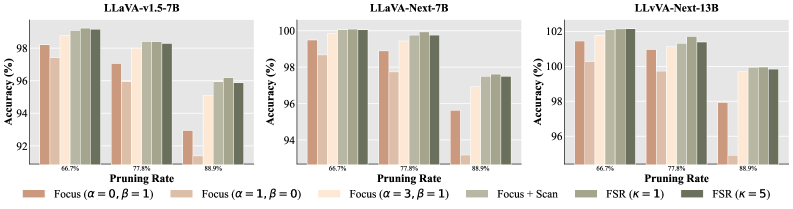

[← 返回 README](../README.md)

# 4 Experiment

## 📌 预览
全面的实验评估：LLaVA-1.5-7B/13B、LLaVA-NeXT-7B/13B、Qwen2.5-VL-7B、LLaVA-Video-7B，覆盖 66.7%~90% 压缩比，9 个图像 benchmark + 5 个视频 benchmark，外加效率分析和消融实验。

---

## 4.1 Experimental setup

In this section, we describe the experimental configurations used to evaluate the proposed FSR framework, including the model architectures, implementation details, and benchmarks.

> 💡 实验设置概览。

---

**Model architectures.** We evaluate FSR on a diverse set of VLMs covering both image and video modalities. For static image understanding, we use the LLaVA series (LLaVA-1.5-7B/13B, LLaVA-NeXT-7B/13B) and Qwen2.5-VL-7B. For video understanding, we extend our evaluation to LLaVA-Video-7B-Qwen2. FSR is applied in a fully training-free, plug-and-play manner at inference time, without modifying any model weights.

> 💡 **模型覆盖**: 6 个模型，涵盖了不同架构（LLaVA vs Qwen2.5-VL）、不同规模（7B/13B）、不同分辨率（LLaVA-1.5: 576 tokens, LLaVA-NeXT: 2880 tokens, Qwen2.5-VL: 动态分辨率）、不同模态（图像/视频）。这个覆盖面相当全面。

---

**Implementation Details.** All experiments were implemented using PyTorch 2.1.2 and Python 3.10 with CUDA 12.4. Regarding hardware configurations, experiments on 7B parameter models were conducted on NVIDIA GeForce RTX 3090 (24GB). Experiments involving larger architectures(13B) and video models (LLaVA-Video-7B-Qwen2) were performed on NVIDIA GPUs with 48GB memory. The default hyperparameters for FSR are set as follows: α=3, β=1, ρ=0.9, and κ=1, unless otherwise specified.

> 💡 **超参数**: α=3, β=1（instruction relevance 权重是 saliency 的 3 倍）, ρ=0.9（保留 90% 信息质量）, κ=1（聚合 budget = Scan 数量）。这些在消融实验中被验证。

---

**Evaluation benchmarks.** We conduct experiments on comprehensive benchmarks spanning image and video tasks. For image understanding, we cover open-ended QA (VQAv2), compositional reasoning (GQA, ScienceQA), OCR (TextVQA), and general capability assessment (POPE, MME, MMBench, MM-Vet). For video understanding, we employ three recent benchmarks: MLVU for multi-task long video analysis, MVBench for fine-grained temporal perception, and Video-MME for comprehensive multimodal evaluation. To further assess expert-level and world-model-oriented video understanding, we additionally evaluate on MMVU and MMWorld. To ensure fair comparison, we standardize the evaluation setup by strictly applying the same prompts, post-processing steps, and metrics across all models.

> 💡 **Benchmark 覆盖**: 
> - 图像: 9 个 benchmark（VQAv2, GQA, ScienceQA, TextVQA, POPE, MME, MMBench-EN/CN, MM-Vet）
> - 视频: 5 个 benchmark（MLVU, MVBench, Video-MME w/ & w/o subtitles, MMVU, MMWorld）
> - 公平性: 统一 prompt、后处理和评估指标

---

## 4.2 Main Results

### 4.2.1 FSR for Standard Benchmarks

We first evaluate FSR on LLaVA-1.5-7B, a widely adopted benchmark model for visual token pruning. Table 1 presents the performance of different pruning methods under three token budgets: retaining 192, 128, and 64 visual tokens, corresponding to reduction ratios of 66.7%, 77.8%, and 88.9%, respectively. When retaining 192 tokens (66.7% reduction), most pruning methods preserve competitive performance. FSR achieves the highest average score of 99.1%, outperforming strong baselines such as CDPruner (98.5%) and VisPruner (98.2%), incurring negligible performance drop compared to the full token set. As the token budget tightens to 128 tokens (77.8% reduction), FSR maintains a robust average of 98.3%, with gains of 0.7% and 1.6% over CDPruner and VisPruner, respectively.

> 💡 **Table 1 (LLaVA-1.5-7B) 要点**:
> - 192 tokens (↓66.7%): FSR 99.1% vs CDPruner 98.5%，差距不大，大多数方法都还行
> - 128 tokens (↓77.8%): FSR 98.3% vs CDPruner 97.6%，优势开始显现
> - **关键趋势**: 压缩越激进，FSR 的优势越大——这正是 local/global 平衡的价值

---

When the budget is further reduced to 64 tokens (88.9% reduction), FSR demonstrates superior stability. In this extreme setting, while attention-based methods suffer severe degradation and joint-strategy methods struggle to balance informativeness, FSR consistently maintains its lead, preserving 96.1% of the original performance and outperforming CDPruner (95.7%) and VisPruner (93.5%). This robustness is particularly evident in complex reasoning tasks. Specifically, on complex benchmarks requiring holistic understanding and reasoning, such as MMVet and MMBench-EN, FSR consistently outperforms baselines under high compression (e.g., on MMVet with 64 tokens, 32.6 vs. 29.6 for CDPruner). This indicates that our strategy effectively balances salient local details with background context, preventing information fragmentation and preserving the semantic completeness for complex tasks.

> 💡 **64 tokens (↓88.9%) 分析**:
> - FSR 96.1% vs CDPruner 95.7%（差 0.4%）、VisPruner 93.5%（差 2.6%）
> - FastV 仅 72.0%——纯 attention-based 在极端压缩下崩溃
> - **MMVet 亮点**: FSR 32.6 vs CDPruner 29.6（+3.0），说明 FSR 在需要综合推理的任务上优势最大
> - DivPrune 在 POPE 上 85.5 非常强（因为 POPE 是二分类，diversity 策略有利），但其他 benchmark 不如 FSR

---

### 4.2.2 FSR for High-Resolution Inputs

Modern VLMs increasingly adopt high-resolution encoders to capture fine-grained details, leading to a massive increase in visual tokens and substantial spatial redundancy. To evaluate the scalability of our method, we apply FSR to LLaVA-NeXT-7B. Following prior work, we fix the input resolution to 672×672, resulting in 2,880 visual tokens. As shown in Table 2, when retaining 960 tokens (66.7% reduction), FSR achieves performance comparable to the full-token upper bound (100.0% retention), effectively eliminating massive redundancy. As the reduction ratio increases to retaining 640 tokens (77.8% reduction), FSR remains the top performer, retaining 99.9% of the original performance.

> 💡 **LLaVA-NeXT-7B (2880 tokens) 要点**:
> - 960 tokens (↓66.7%): FSR **100.0%**——与不剪枝完全相同！说明 2880 tokens 中有大量冗余
> - 640 tokens (↓77.8%): FSR 99.9%——几乎无损

---

Even under the most aggressive setting of retaining 320 tokens (88.9% reduction), FSR continues to lead with 97.6% performance retention, consistently surpassing CDPruner (97.3%) and VisPruner (95.4%). This result highlights that FSR is particularly well-suited for high-resolution scenarios. Unlike low-resolution inputs where details are blurred, high-resolution images provide sharper fine-grained features. FSR effectively capitalizes on this by accurately capturing these clearer local evidences during the Focus stage, while the Scan and Refine stages ensure the preservation of the global context. Compared to other approaches, FSR's dynamic allocation proves more effective in leveraging the clarity of high-resolution features to maintain high accuracy even with a limited token budget.

> 💡 **高分辨率场景的独特优势**: FSR 在高分辨率场景下表现特别好，原因是：
> - 高分辨率 → 更清晰的局部特征 → Focus 阶段能更精准地识别关键证据
> - 更多冗余 → Scan/Refine 有更大的信息整合空间
> - 320 tokens vs 2880 tokens = 88.9% 压缩率下仍保持 97.6% 性能

---

### 4.2.3 FSR for Advanced Architectures

To further evaluate the generality of FSR beyond LLaVA-style architectures, we conduct experiments on Qwen2.5-VL-7B, a more advanced VLM that supports dynamic image resolution and native token merging. These built-in efficiency designs inherently reduce token redundancy, making training-free token pruning more challenging in practice. Despite this stronger baseline, FSR still achieves the best accuracy–efficiency trade-off. To ensure a fair and architecture-compatible evaluation, we apply a minimal adaptation of FSR to Qwen2.5-VL-7B: the Focus-stage scores are derived by aggregating the self-attention map of visual tokens, and the instruction relevance term is omitted due to the absence of text encoder.

> 💡 **Qwen2.5-VL 适配**: 
> - Qwen2.5-VL 没有独立的 CLIP text encoder → 不能计算 instruction relevance r_i
> - 适配方案：Focus 阶段只用 visual self-attention 聚合分数，去掉 relevance term
> - 这也说明 FSR 框架的灵活性——核心是 Focus-Scan-Refine 的阶段性设计，具体的打分方式可以根据架构调整

---

Table 3 reports the results under different token reduction ratios, ranging from moderate (50%, 60%) to aggressive (80%, 90%) pruning. Across all reduction ratios, FSR consistently outperforms representative baselines, including FastV and HoloV. Under moderate compression (50% and 60%), FSR preserves nearly all of the original performance, achieving average scores of 97.9% and 96.4%, respectively, while maintaining clear margins over competing methods. As the compression ratio increases, the advantage of FSR becomes more pronounced. With 80% of visual tokens removed, FSR retains 91.9% performance, surpassing HoloV by 3.3%. At the extreme setting of 90% token reduction, FSR still achieves 84.0% of the original performance, compared to 82.1% for HoloV and 78.3% for FastV.

> 💡 **Qwen2.5-VL-7B 结果 (Table 3)**:
> - 50% → 97.9%, 60% → 96.4%, 80% → 91.9%, 90% → 84.0%
> - FSR vs HoloV: 在 80% 压缩下差 3.3%，在 90% 压缩下差 1.9%
> - **注意**: Qwen2.5-VL 本身就有 native token merging，baseline 更强，所以压缩更难。FSR 在这种情况下仍有明显优势。

---

The benefits of FSR are particularly evident on benchmarks that require integrated multimodal reasoning and robust global understanding. For example, on MMVet and MME, FSR consistently maintains superior performance even under aggressive compression, demonstrating its exceptional robustness in preserving critical information for complex reasoning tasks.

> 💡 MMVet 和 MME 这类需要综合推理能力的 benchmark 上，FSR 的优势最为明显。

---

### 4.2.4 FSR for Video Understanding

We further assess the generalization of FSR to the video domain on LLaVA-Video-7B-Qwen2, utilizing 32 frames per video to capture temporal dynamics. As presented in Table 4, FSR consistently outperforms the state-of-the-art method HoloV across varying pruning ratios ranging from 50% to 80%. Notably, at 60% pruning ratio, FSR retains 99.6% of the original performance, significantly surpassing HoloV (98.5%) and effectively serving as a highly efficient substitute for the full token set. Even under aggressive compression where 80% of tokens are removed, FSR demonstrates superior robustness, maintaining an average score of 98.2% compared to 98.0% for HoloV. This indicates that FSR's strategy of balancing local evidence and global context effectively extends to the temporal dimension, enabling robust preservation of critical spatiotemporal cues in challenging benchmarks.

> 💡 **视频理解 (Table 4, LLaVA-Video-7B)**:
> - 32 frames/video → 大量 visual tokens
> - 60% 压缩: FSR 99.6% vs HoloV 98.5%（+1.1%）
> - 80% 压缩: FSR 98.2% vs HoloV 98.0%（差距缩小到 0.2%）
> - FSR 的 Focus-Scan-Refine 策略在时间维度上同样有效
>
> **注意**: 视频场景下只比较了 HoloV，没有 CDPruner、VisPruner 等。这可能是因为其他方法不支持视频输入。

---

### 4.2.5 FSR for Large-Scale Models

We further evaluate the effectiveness of FSR on larger scale VLMs, including LLaVA-1.5-13B and the more advanced LLaVA-NeXT-13B. The results are summarized in Tables 5 and 6, respectively, under multiple token budgets ranging from moderate to aggressive pruning.

On LLaVA-1.5-13B, FSR consistently achieves the best accuracy–efficiency trade-off across all pruning ratios. Even with 88.9% of visual tokens removed, FSR retains 96.7% of the original performance, clearly outperforming representative baselines such as VisPruner and CDPruner.

> 💡 **LLaVA-1.5-13B (Table 5)**: 
> - 88.9% 压缩: FSR 96.7% vs CDPruner 96.3% vs VisPruner 93.6%
> - 趋势与 7B 模型一致

---

More notably, on LLaVA-NeXT-13B, FSR exhibits an interesting behavior. When retaining only 640 visual tokens (77.8% reduction), FSR slightly outperforms the unpruned baseline, achieving an average score of 101.7%. This result suggests that the original dense visual token set contains substantial redundancy, which may introduce noise and interfere with multimodal reasoning. By selectively preserving informative local evidence while maintaining sufficient global context, FSR effectively filters out distracting tokens, leading to more focused and accurate reasoning.

> 💡 **LLaVA-NeXT-13B (Table 6) 的惊人发现**: 
> - 640 tokens (↓77.8%): FSR **101.7%** — 超过了不剪枝的 baseline！
> - 320 tokens (↓88.9%): FSR **100.0%** — 剪掉 88.9% 的 token 后性能完全不降
> - **解读**: 原始的 2880 tokens 包含大量噪声/冗余，反而干扰了 LLM 的推理。FSR 的"剪枝即降噪"效果在大模型+高分辨率场景下尤为显著。
> - 这也支持了 FastV 的早期观察：LLM 深层对 visual tokens 的注意力很低。

---

## 4.3 Efficiency Analysis

We evaluate the efficiency of FSR in terms of computational cost, inference latency, and memory footprint on a single NVIDIA RTX 3090 GPU. As shown in Table 7, retaining only 64 tokens, FSR yields substantial resource savings compared to the LLaVA-1.5-7B baseline: FLOPs are reduced by approximately 75%, and KV cache memory is compressed by nearly **9×**. These reductions translate into significant runtime benefits, achieving a **3.9×** speedup in the prefill stage.

> 💡 **效率数据 (Table 7, 64 tokens)**:
> - FLOPs: ↓~75%
> - KV cache: ↓~9×
> - Prefill speedup: 3.9×
> - 这些数据与 FastV、CDPruner 等类似——因为都是保留 64 tokens，效率主要取决于保留数而非方法本身

---

Crucially, FSR achieves the most superior accuracy–efficiency trade-off among all compared methods. FSR maintains the lowest decode latency (22.317 ms) and matches the prefill speed of state-of-the-art pruners like CDPruner, confirming that our pipeline introduces negligible system overhead. While purely efficiency-oriented methods like FastV suffer severe accuracy drops, FSR delivers the highest score in MMBench-EN, validating its suitability for practical, high-performance deployment.

> 💡 **系统开销**: FSR 的 Focus-Scan-Refine pipeline 引入的额外计算开销可以忽略不计。decode latency 22.317 ms 是所有方法中最低的。这说明 FSR 的三阶段计算（dual-pathway scoring + CCS + aggregation）主要发生在 prefill 阶段，不影响 decoding。

---

## 4.4 Ablation Study

We conduct ablation studies on LLaVA-v1.5-7B, LLaVA-NeXT-7B, and LLaVA-NeXT-13B to examine the contribution of each component in FSR across varying pruning ratios. The results are summarized in Figure 5.Starting from single-cue baselines, we progressively validate the efficacy of the proposed Focus–Scan–Refine pipeline.

---

*Figure 5: Ablation study on LLaVA-1.5-7B, LLaVA-NeXT-7B, and LLaVA-NeXT-13B across varying pruning ratios, validating the impact of dual-pathway hyperparameters (α,β), focus-conditioned scanning, and aggregation refinement ratio (κ).*

> 💡 **Figure 5 批读**: 消融实验的可视化。分组条形图清晰展示了各组件的贡献。

---

**Impact of hyperparameters α and β.** We first investigate the trade-off between instruction relevance (r̂) and visual saliency (ŝ) by varying the exponents in Eq. 3 (φ_i = r̂_i^α ŝ_i^β). As shown in Figure 5, relying solely on visual saliency (α=0, β=1) or instruction relevance (α=1, β=0) leads to noticeable performance degradation, especially under aggressive reduction (88.9%). For instance, instruction relevance alone often fails to capture background context, while visual saliency may miss task-specific targets. In contrast, the dual-pathway strategy (α=3, β=1) consistently achieves the highest accuracy across all models. This demonstrates that visual saliency and semantic relevance provide complementary signals—one capturing intrinsic visual prominence and the other ensuring instruction-level alignment.

> 💡 **α/β 消融要点**:
> - α=0, β=1（只用 saliency）：在 88.9% 压缩下性能明显下降
> - α=1, β=0（只用 relevance）：同样下降，且 background context 不足
> - α=3, β=1（默认）：最优
> - **为什么 α > β？** 因为 instruction relevance 是 task-specific 的，给它更高的权重可以确保选出与 query 最相关的 token。saliency 是 task-agnostic 的辅助信号。

---

**Effectiveness of focus-conditioned scan.** Building upon the dual-pathway selection, introducing the second-stage Scan mechanism boosts performance. Compared to using focused tokens alone, this stage effectively supplements complementary global context conditioned on the local evidence. This addition proves crucial for multi-object understanding and reasoning-heavy queries where local cues are insufficient. Notably, the performance gains are most pronounced under aggressive compression, where the information captured by the Focus stage becomes limited and the Scan stage plays a critical role in supplementing sufficient global context.

> 💡 **Scan 阶段的消融**:
> - Focus + Scan > Focus alone，尤其在高压缩比下
> - Scan 的条件性（conditioned on Focus set）是关键——不是随机选全局 token，而是选与 Focus 最互补的
> - 在 88.9% 压缩下提升最大，因为此时 Focus budget 很小，Scan 的补充信息至关重要

---

**Impact of aggregation refinement.** The Refine stage provides a further performance boost, which becomes increasingly valuable under extreme reduction ratios. By aggregating discarded but relevant tokens into the scan anchors, FSR recovers missing details without expanding the token budget. However, we observe that the gain saturates when the merge ratio is excessive (κ=5), as merging too many tokens tends to blur the aggregated representation. A moderate refine ratio (κ=1) achieves the optimal trade-off, delivering consistent gains by enriching context without over-smoothing features. Interestingly, we note that this benefit is less pronounced on larger models like LLaVA-NeXT-13B, suggesting that stronger LLM backbones possess higher tolerance for minor information loss in peripheral regions.

> 💡 **Refine 阶段的消融**:
> - κ=1: 最优（每个 Scan anchor 平均聚合 1 个丢弃 token）
> - κ=5: 过度聚合，性能反而下降（over-smoothing）
> - **有趣发现**: 大模型（LLaVA-NeXT-13B）对 Refine 的依赖更小 → 更强的 LLM backbone 对信息损失更鲁棒
> - **实际意义**: κ=1 是一个安全的默认值，不需要调参
