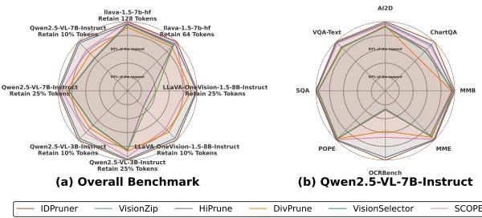
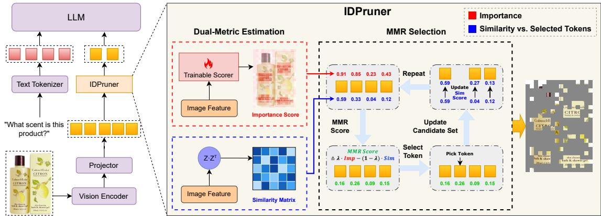

[← 返回 README](../README.md)

# 1. Introduction

## 📌 预览

Introduction 从 MLLM 推理效率问题出发，指出现有重要性-based 和多样性-based 方法各自的缺陷，以及 Hybrid 方法缺乏系统分析框架的问题。随后引出 IDPruner，并用 Figure 1（四架构八 benchmark 雷达图）展示其优越性。最后总结三大贡献。

---

Multimodal Large Language Models (MLLMs) have achieved significant success in artificial intelligence. These models typically encode images or videos into sequences of visual tokens, which are then processed together with textual inputs by the language model to generate text responses (Liu et al., 2023b,a). For instance, Qwen2.5-VL generates approximately 2,691 visual tokens when processing a single 1080p image (1920×1080), with each token representing a 28×28 pixel patch. The high number of visual tokens creates a heavy computational burden, limiting the efficiency and practical deployment of MLLMs (Zhou et al., 2024). Thus, visual token pruning (Wang et al., 2025; Shao et al., 2025), which aims to reduce the number of visual tokens while maintaining model performance, has emerged as a critical technique for achieving efficient MLLM inference.

> 💡 **问题规模感**: Qwen2.5-VL 处理一张 1080p 图片产生约 2691 个视觉 token，每个 token 对应 28×28 像素的 patch。这个数字说明了问题的严重性。

*Figure 1: Performance comparison across four architectures and eight benchmarks. IDPruner (outermost boundary) consistently outperforms baselines in both (a) aggregated performance across four diverse MLLM architectures and (b) fine-grained benchmark breakdown for Qwen2.5-VL. This demonstrates the superior cross-architecture generalization and task-specific robustness of our method.*

> 💡 **Figure 1 批读**: 雷达图是展示多维 benchmark 的经典方式。左图是 4 个架构的聚合结果，右图是 Qwen2.5-VL 的精细分解。IDPruner（最外圈）在两图中均是最大范围，视觉上非常有说服力。注意：这种 "outermost boundary" 图对比对读者心理影响很强，但需要注意所有方法都在同等设置下比较。

Existing pruning strategies generally fall into two categories: importance-based and diversity-based methods. Importance-based approaches (Chen et al., 2024a; Yang et al., 2025b,a) select salient tokens, focusing on foreground objects, but often sacrificing the background context essential for global reasoning. In contrast, diversity-based methods (Alvar et al., 2025; Zou et al., 2025) maximize semantic coverage to reduce redundancy but risk retaining task-irrelevant noise while missing fine-grained details. Recent hybrid approaches (Zhang et al., 2024c, 2025a; Li et al., 2025) attempt to combine these complementary criteria but lack rigorous analysis, relying on intuition-based integration that yields suboptimal performance. Therefore, a systematic analytical framework is needed to characterize the interaction between importance and diversity and derive optimal integration strategies.

> 💡 **三类方法的缺陷总结**:
> - **Importance-based**: 抓住显著 token（前景），但丢失背景上下文
> - **Diversity-based**: 最大化语义覆盖，但可能保留无关噪声，错过精细细节
> - **Hybrid**: 缺乏严格分析，依赖直觉组合，次优
>
> 这个分类框架很清晰，IDPruner 的定位就是解决「Hybrid 方法缺乏系统框架」的问题。

*Figure 2: Overview of the IDPruner framework. Left: Integration of our one-shot visual token pruning into the MLLM inference pipeline. Right: The core mechanism computes Importance Scores (Red) and a Similarity Matrix (Blue), utilizing an MMR selection process to harmonize importance and diversity. This approach operates without attention maps and remains compatible with FlashAttention.*

> 💡 **Figure 2 批读**: 左图展示系统集成方式（one-shot，在 ViT 后、LLM 前一次性剪枝），右图展示核心机制（重要性分数 + 相似度矩阵 → MMR 选择）。关键工程要点：不需要 attention map，因此与 FlashAttention 完全兼容。这对工业部署非常重要——FlashAttention 是现代 LLM 推理的标配。

To address this, we first conduct a systematic analysis to investigate the trade-off between token importance and semantic diversity. As shown in Figure 3, our analysis reveals that current approaches fail to effectively balance these two critical dimensions. To overcome this limitation, we introduce the Importance and Diversity Pruner (IDPruner), a novel pruning strategy designed to balance these criteria optimally. Specifically, as illustrated in Figure 2, we cast visual token pruning as a re-ranking problem in information retrieval and adapt the Maximal Marginal Relevance (MMR) (Carbonell and Goldstein-Stewart, 1998) algorithm to model the interplay between token importance and semantic diversity explicitly. This approach selects tokens that jointly maximize both importance and diversity.

> 💡 **洞察：跨领域迁移**: 将视觉 token 剪枝重新表述为**信息检索中的重排序问题**，借用 MMR 算法（1998 年提出，用于文档摘要/检索结果去重），这是一个优雅的跨领域类比。MMR 在信息检索领域已有成熟的理论基础，迁移到视觉 token 剪枝赋予了方法理论支撑。

IDPruner achieves state-of-the-art performance, as demonstrated by comprehensive evaluations on multimodal benchmarks. Notably, on the Qwen2.5-VL-7B-Instruct model, even under an extreme compression ratio of 90%, our method retains **86.40%** of the baseline performance, significantly outperforming existing competitive approaches. Crucially, unlike progressive pruning strategies that dynamically change sequence lengths, IDPruner performs one-shot pruning at an early stage, which makes it easier to integrate into inference engines like vLLM (Kwon et al., 2023). Furthermore, our method works without requiring attention information, ensuring full compatibility with FlashAttention (Dao et al., 2022) to maximize inference efficiency.

> 💡 **One-shot vs. Progressive**: 渐进式剪枝（每层都剪）虽然灵活，但动态改变序列长度使其难以与 vLLM 等引擎集成（这些引擎假设序列长度固定或可预测）。One-shot 在 ViT 后一次性剪枝，序列长度确定后不再变化，便于批处理和 KV cache 管理。

The main contributions of this work are summarized as follows:

• We conduct a systematic analysis to characterize the trade-off between token importance and semantic diversity, providing a theoretical basis for their integration.

• We propose IDPruner, which adapts the Maximal Marginal Relevance (MMR) algorithm to visual token pruning, enabling the optimal harmonization of importance and diversity.

• Extensive experiments demonstrate that our method achieves state-of-the-art performance and exceptional cross-architecture generalization, as visualized in Figure 1, while supporting one-shot pruning and FlashAttention acceleration, offering a practical solution for efficient MLLM deployment.

> 💡 **贡献分析**:
> 1. 分析框架（Hopkins Statistic + Pareto Frontier）— 这是论文的学术贡献
> 2. IDPruner 算法（MMR 适配）— 这是技术贡献
> 3. 工程属性（one-shot + FlashAttention）— 这是实用贡献
>
> 三条贡献相互独立，覆盖了学术、技术、实用三个维度，这是写贡献的好方式。

## 🔖 Section 总结

Introduction 的逻辑链非常清晰：问题规模 → 现有方法分类及缺陷 → 提出 IDPruner（MMR 算法 + 系统分析） → 实验结果亮点 → 三大贡献。值得注意的是，IDPruner 在 introduction 就强调了两个工程属性（no attention maps + one-shot），说明作者非常清楚工业部署的痛点。
