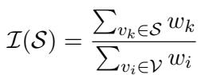
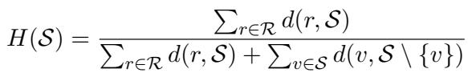
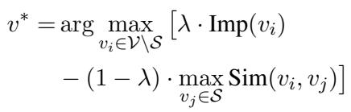
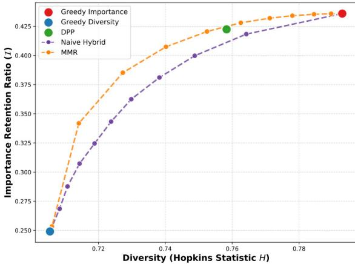

[← 返回 README](../README.md)

# 3. An Empirical Analysis of the Importance-Diversity Trade-off

## 📌 预览

这一节是论文的理论分析核心。分四部分：(1) 定义重要性保留率和多样性度量（Hopkins Statistic）；(2) 在真实 token 流形上仿真不同选择策略；(3) 介绍 MMR 机制；(4) Pareto 前沿比较，证明 MMR 最优。

---

## 3.1 Quantifying Importance and Diversity

Visual token pruning strategies typically focus on either importance-based selection or diversity preservation; however, balancing these two goals remains challenging. To systematically analyze the relationship between these two paths, we first reformulate the visual token pruning problem.

**Definition 1 (Visual Token Pruning).** Let V = {v_1, v_2, ..., v_N} denote the set of N visual tokens, where each token v_i ∈ R^d represents a d-dimensional feature vector. Visual token pruning aims to select a subset S ⊂ V with |S| = K < N tokens, where K is a pre-defined budget constraint.

> 💡 **形式化的意义**: 先把问题形式化，然后才能对比不同选择策略。这是做分析的标准做法。

To decouple the combining strategy from any specific importance estimator, we pre-define an importance vector **w** representing the weight of each token, regardless of how **w** is calculated. Based on this, we define the retention metric:

**Definition 2 (Importance Retention Ratio).** The importance retention ratio of a subset S is defined as the normalized sum of retained scores:

This metric quantifies the proportion of total information retained by the subset, ranging from 0 to 1.

> 💡 **解耦设计**: 定义重要性向量 **w** 时，刻意不指定 w 怎么来（可以是 CLS attention、L2 norm、VisionSelector 输出等）。这样分析框架是通用的，不依赖于具体的重要性估计器。这个设计让理论分析更有普适性。

In contrast to importance, which focuses on individual token utility, we characterize the spatial distribution of the selected subset using the Hopkins Statistic (Hopkins and Skellam, 1954), a measure that quantifies the degree of clustering in a dataset. A high Hopkins value indicates strong clustering, meaning that selected tokens concentrate in specific semantic regions and thus exhibit high redundancy.

**Definition 3 (Diversity Metric via Hopkins Statistic).** Let S denote the selected token subset with |S| = m. We construct a reference set R by randomly sampling m points from the same feature space as S. Let d(x, y) denote the cosine distance from point x to its nearest neighbor in set V. The Hopkins Statistic is defined as:

In this formulation, S\{v} denotes the set difference, representing the subset S excluding the specific token v to ensure the distance is calculated against its nearest neighbor.

Intuitively, H(S) → 1 indicates high redundancy due to significant clustering, while H(S) → 0 signifies a regularly spaced distribution with maximal semantic diversity.

> 💡 **Hopkins Statistic 选择理由**: Hopkins Statistic 最初用于空间生态学（植物分布均匀性检验），这里被创造性地用于 token 特征空间的聚类度量。与标准差/方差等直接统计量相比，Hopkins Statistic 对 token 流形结构更鲁棒。H→1 表示 token 高度聚集（冗余），H→0 表示均匀分布（多样）。
>
> 💡 **理论巧妙点**: 用「随机参考点」对比「选中点」的最近邻距离——如果选中的点之间的距离比随机点到这些选中点的距离更小，说明选中点高度聚集（冗余）。这是一个非常优雅的度量设计。

## 3.2 Simulation on Real Token Manifolds

To identify the optimal strategy for harmonizing importance and diversity, we conduct a systematic analysis to explore their interaction. Specifically, we employ real visual tokens extracted from the Vision Transformer of the Qwen2.5-VL-7B-Instruct model as feature vectors. Real features are essential as they preserve complex manifold structures—such as semantic clustering and sparsity—that synthetic data typically fails to capture.

For token importance, we adopt a randomized approach where the score for each token is sampled independently from a uniform distribution U(0, 1). This setup decouples the evaluation of selection strategies from the bias of any specific pre-trained importance scorer.

> 💡 **实验设计的公平性**: 用随机均匀分布的重要性分数，消除了重要性估计器的偏差影响，专注于比较选择策略本身。用真实 Qwen2.5-VL ViT 提取的 token 特征，保留了真实流形结构。这个设计非常公平。

We evaluate five representative strategies that make different trade-offs between importance and diversity:

• **Greedy Importance**: Selects tokens with the highest importance scores, ignoring diversity.

• **Greedy Diversity**: Iteratively selects the token that maximizes distance to the current subset via Farthest Point Sampling (Resende et al., 2010), prioritizing diversity over importance.

• **Naive Hybrid**: A two-stage approach that first selects top-k tokens by importance, then applies Farthest Point Sampling within this subset.

• **Determinantal Point Processes (DPP)**: Models diversity probabilistically via the determinant of a kernel matrix (Macchi, 1975).

• **Maximal Marginal Relevance (MMR)**: A joint optimization framework that explicitly balances importance and redundancy. We provide the detailed formulation of this mechanism in Section 3.3.

> 💡 **五种策略的覆盖面**: 这五种策略很好地覆盖了整个设计空间——从纯重要性（Greedy Importance）到纯多样性（Greedy Diversity），再到不同程度的混合（Naive Hybrid, DPP, MMR）。这个对比框架很完整。
>
> 💡 **Naive Hybrid 的问题**: 两阶段方法先按重要性筛出 top-k，再在 top-k 内用 FPS 增加多样性。缺陷：top-k 内的候选已经是高度语义相关的（都是重要区域），FPS 在这个子集内能提供的多样性有限，而且完全丧失了多样性对 token 选择的引导作用。

## 3.3 The Maximal Marginal Relevance (MMR) Mechanism

Maximal Marginal Relevance (MMR) (Carbonell and Goldstein-Stewart, 1998) provides a framework for this joint optimization. Initially proposed for information retrieval, the core idea of MMR is that an ideal result set should balance two criteria: high relevance to the query and low redundancy among selected items.

Adapting this principle to visual token pruning, the algorithm iteratively selects the token v* from the candidate set V\S that maximizes the following objective:

where V represents the set of all visual tokens, S denotes the currently selected subset, Imp(·) represents the normalized importance score, Sim(·, ·) measures the pairwise similarity between tokens, and λ is a hyperparameter balancing the two terms.

By subtracting the maximum similarity between the candidate and the current subset S, the algorithm explicitly penalizes tokens that are semantically close to any already selected token, while prioritizing important tokens.

> 💡 **MMR 公式解读**:
> - λ · Imp(v_i)：正向奖励——token 越重要越好
> - (1 - λ) · max_{v_j ∈ S} Sim(v_i, v_j)：负向惩罚——token 与已选 token 越相似越差
> - 迭代选择：每次选 score 最高的候选，选后更新相似度惩罚项
>
> 关键洞察：通过 max similarity 而不是 average similarity 来惩罚，确保新选的 token 与所有已选 token 都保持距离，而不仅仅是平均距离。这比 DPP 的全局行列式优化更直觉、更高效。
>
> 💡 **λ = 0.5 的含义**: 重要性和多样性各占 50%。消融实验表明这是最优点（倒 U 形曲线，详见 Appendix B）。

## 3.4 Comparative Analysis against Heuristic Baselines

We conducted the simulation on 200 randomly sampled images from the MMBench dataset (Liu et al., 2023c) to systematically evaluate the efficacy of the proposed strategies.

Figure 3 illustrates the trade-off between importance retention and diversity for each strategy. The theoretical optimum resides in the top-left corner, corresponding to subsets that maximize T while minimizing H, thereby maximizing diversity. As illustrated, the single-objective baselines occupy the sub-optimal extremes: Greedy Importance (Red node) achieves maximum T at the cost of a high Hopkins Statistic (H ≈ 1), whereas Greedy Diversity (Blue node) minimizes H but suffers from a low Importance Retention Ratio.

*Figure 3: Pareto Frontier Analysis. We visualize the trade-off between the Hopkins Statistic (H) and the Importance Retention Ratio (T). The ideal pruning strategy should approach the top-left corner, achieving a high Importance Retention Ratio (T → 1) while minimizing the Hopkins Statistic (H → 0). The MMR mechanism (Orange) constructs a superior Pareto frontier that strictly dominates the Naive Hybrid strategy (Purple) and envelopes the DPP solution (Green).*

> 💡 **Figure 3 批读（论文核心图）**: 这是整篇论文最关键的图。
> - **X 轴**: Hopkins Statistic H（越小越好 = 越多样）
> - **Y 轴**: Importance Retention Ratio T（越大越好 = 保留更多重要信息）
> - **理想点**: 左上角（高 T + 低 H）
> - **轨迹含义**: 每条曲线代表一种策略在不同 K（保留 token 数）下的轨迹
>
> 关键发现：
> 1. MMR（橙色曲线）形成**更优的 Pareto 前沿**，严格支配 Naive Hybrid（紫色曲线）
> 2. MMR 有效地"包络"了 DPP（绿点）
> 3. 这从理论上证明了 MMR 是这些方法中最优的权衡机制

Crucially, the trajectory generated by MMR (Orange curve) forms a superior Pareto Frontier. It strictly dominates the Naive Hybrid strategy (Purple curve), maintaining a higher T for any given level of H, confirming the efficacy of our joint optimization framework. Furthermore, it effectively envelopes the DPP solution (Green node), demonstrating that our joint optimization framework provides the most robust mechanism for harmonizing these conflicting objectives.

> 💡 **Pareto 严格支配的意义**: "严格支配"意味着对于任意给定的 H 值（多样性约束），MMR 都能提供更高的 T（重要性保留）。这是一个很强的声明，从分析图上直观可见。但需要注意：这里的"重要性"使用了随机均匀采样，实际中重要性分数的分布会不同。

## 🔖 Section 总结

Section 3 是论文的理论基础。核心贡献：(1) 用 Hopkins Statistic 量化多样性，提供了一个与重要性可以同时可视化的度量；(2) 通过 Pareto 前沿分析，从理论上证明 MMR 优于 Naive Hybrid 和 DPP；(3) 仿真设置（随机重要性 + 真实 token 特征）公平可靠。这一节为 Section 4 的 IDPruner 设计奠定了理论依据。
