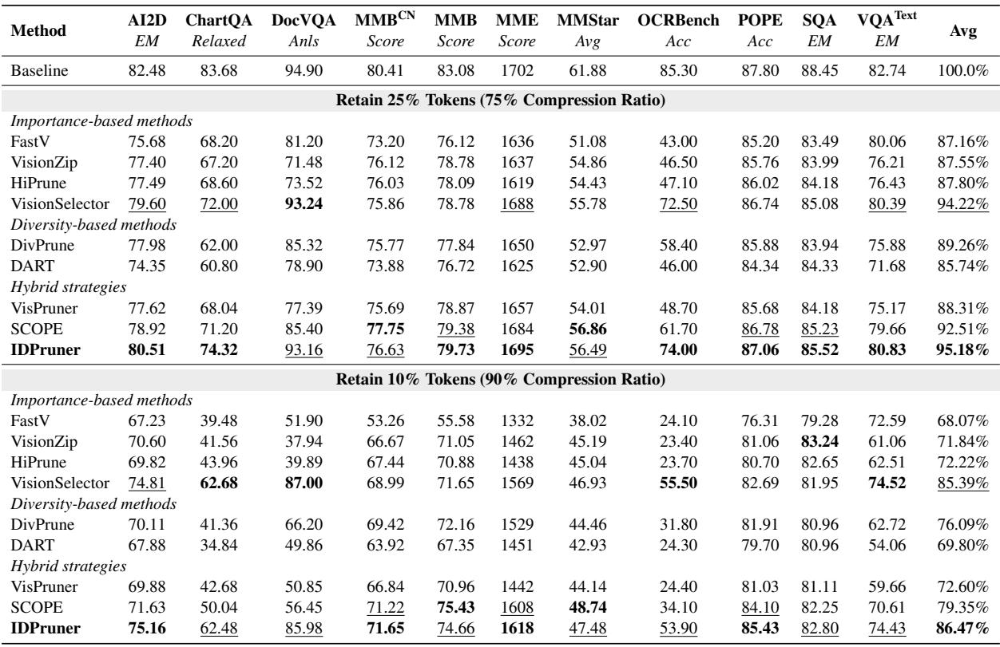
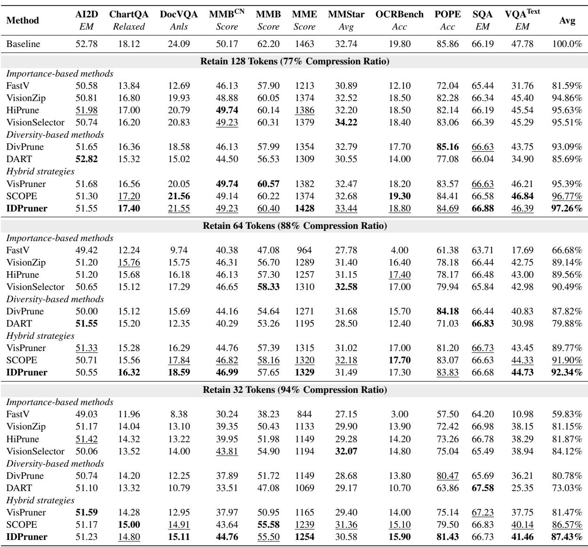
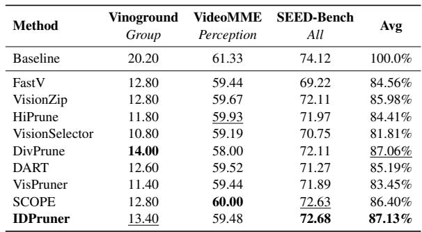
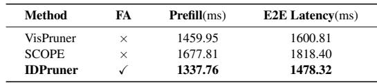

[← 返回 README](../README.md)

# 5. Experiments

## 📌 预览

实验章节覆盖图像和视频两类任务，在四种架构（Qwen2.5-VL-7B、LLaVA-1.5-7B，附录中还有 Qwen2.5-VL-3B 和 LLaVA-OV）上评测。核心结论：IDPruner 在所有设置下均达到 SOTA，尤其在高压缩比（90%）下优势明显。

---

## 5.1 Experimental Setup

**Model Architectures.** We conduct our main experiments on widely adopted MLLMs, including Qwen2.5-VL-7B-Instruct (Bai et al., 2025) and LLaVA-1.5-7B (Liu et al., 2023b).

**Evaluation benchmarks.** We conduct comprehensive evaluations on image and video understanding tasks. For image-language understanding, we employ 10 widely-used datasets: MME (Fu et al., 2023), MMBench (Liu et al., 2023c), MMStar (Chen et al., 2024b), POPE (Li et al., 2023), ScienceQA (Lu et al., 2022), AI2D (Kembhavi et al., 2016), TextVQA (Singh et al., 2019), ChartQA (Masry et al., 2022), DocVQA (Mathew et al., 2020), and OCRBench (Liu et al., 2024b). For video-language understanding, we include 3 benchmarks: Vinoground (Zhang et al., 2024a), VideoMME (Fu et al., 2025), and SEED-Bench (Li et al., 2024b). To ensure fair comparison and reproducibility, we utilize the LMMs-Eval framework (Zhang et al., 2024b), strictly following the default settings and metrics for each task.

> 💡 **Benchmark 覆盖分析**: 10 个图像 benchmark 覆盖了不同难度：
> - **文档/OCR 类**（DocVQA, OCRBench, ChartQA）：依赖细节信息，高压缩比下损失大
> - **常识/推理类**（ScienceQA, MMStar, AI2D）：需要全局理解
> - **幻觉检测**（POPE）：需要背景理解，避免幻觉
> - **综合类**（MME, MMBench）：混合评测

**Comparison methods.** We compare IDPruner with representative state-of-the-art approaches across different paradigms, including importance-based methods like FastV (Chen et al., 2024a), VisionZip (Yang et al., 2025b), HiPrune (Liu et al., 2025), and VisionSelector (Zhu et al., 2025a), diversity-based methods like DivPrune (Alvar et al., 2025) and DART (Wen et al., 2025), as well as hybrid strategies that combine multiple criteria, such as VisPruner (Zhang et al., 2024c), and SCOPE (Deng et al., 2025).

**Implementation Details.** Unless otherwise specified, the hyperparameter λ of IDPruner, which balances importance and diversity, is set to 0.5.

> 💡 **对比基线的选择**: 覆盖了三类方法（importance/diversity/hybrid），且每类包含最新 SOTA。VisionSelector 是 IDPruner 重要性模块的来源，对比这个方法可以直接体现 MMR 多样性带来的增益。

## 5.2 Main Results

### Results on Qwen2.5-VL-7B-Instruct

We evaluate our method on Qwen2.5-VL-7B-Instruct under 25% and 10% token retention settings. As shown in Table 1, IDPruner achieves state-of-the-art average scores of 95.18% and 86.47%, respectively.

*Table 1: Comparison results on comprehensive Image-Language benchmarks on Qwen2.5-VL-7B-Instruct.*

> 💡 **Table 1 批读（核心实验表）**:
>
> **75% 压缩比（保留 25% token）**:
> - IDPruner: **95.18%** ← SOTA
> - VisionSelector: 94.22% ← 第二，是 IDPruner 的基础重要性模块
> - SCOPE: 92.51%
> - DivPrune: 89.26%
> - Naive importance (FastV, VisionZip, HiPrune): 87-88%
>
> **分析**: IDPruner 比 VisionSelector 高约 1%，这个增量来自 MMR 多样性平衡。在 OCRBench（细节相关）上 IDPruner 排前两位（74.00 vs VisionSelector 72.50），在 POPE（幻觉检测，需背景理解）上 IDPruner (87.06) 高于 VisionSelector (86.74)。说明 IDPruner 确实既保了细节又保了背景。
>
> **90% 压缩比（保留 10% token）**:
> - IDPruner: **86.47%** ← SOTA
> - VisionSelector: 85.39%
> - SCOPE: 79.35%
> - 其他方法急剧下降（68-76%）
>
> **分析**: 在极端压缩比下，IDPruner 相比 VisionSelector 的优势依然稳定（~1%），说明多样性平衡在高压缩比下同样有效。而纯 importance-based 方法在高压缩比下急剧恶化，原因是过度集中于前景导致背景信息完全丢失。

Compared to existing strategies, our method achieves a better balance between keeping fine details and maintaining global context. Specifically, for tasks requiring fine details, such as OCRBench, our method ranks among the top two, while also maintaining global information to surpass VisionSelector on hallucination benchmarks, including POPE. Consequently, on benchmarks such as MME and AI2D, which require both overall understanding and detailed capture, IDPruner demonstrates a clear lead over other methods.

### Results on LLaVA-1.5-7B

We extend our experiments to the LLaVA-1.5-7B model, which operates with a fixed resolution of 576 visual tokens per image. Accordingly, we evaluate performance under three distinct retention settings: 128, 64, and the extreme 32 tokens.

*Table 2: Comparison results on comprehensive Image-Language benchmarks on LLaVA-1.5-7B.*

> 💡 **Table 2 批读**:
>
> LLaVA-1.5-7B 有 576 个视觉 token（静态分辨率），评测三个保留量：128（77% 压缩）/ 64（88% 压缩）/ 32（94% 压缩）。
>
> **128 tokens（77% 压缩）**:
> - IDPruner: **97.26%** ← SOTA
> - SCOPE: 96.77%（第二）
> - 注意：SCOPE 在 LLaVA-1.5 上比 VisionSelector 好，说明 SCOPE 在这个架构上更适配
>
> **64 tokens（88% 压缩）**:
> - IDPruner: **92.34%** ← SOTA
> - SCOPE: 91.90%（第二）
>
> **32 tokens（94% 压缩，极端）**:
> - IDPruner: **87.43%** ← SOTA
>
> **关键发现**: SCOPE 在 LLaVA-1.5 上超过 VisionSelector，但 IDPruner 依然领先。这验证了 IDPruner 的跨架构鲁棒性。VisionSelector 在 LLaVA-1.5 上表现不如在 Qwen2.5-VL 上好，这是 IDPruner 论文指出的"架构特异性脆弱性"的例子。

In summary, our method exhibits remarkable performance consistency across a diverse range of architectures. Notably, strong baselines exhibit architecture-specific vulnerabilities; for instance, VisionSelector underperforms on LLaVA-1.5, whereas SCOPE loses competitiveness on the advanced LLaVA-OneVision-1.5, as detailed in Appendix A. In contrast, IDPruner maintains exceptional robustness. It consistently achieves state-of-the-art results across all evaluated models, validating the universality of our framework in harmonizing token importance and diversity.

> 💡 **架构特异性脆弱性**: 这是 IDPruner 论文的一个有趣观察——每个强 baseline 都有架构弱点：
> - VisionSelector 在 LLaVA-1.5 上差（可能因为训练分布不匹配）
> - SCOPE 在 LLaVA-OV-1.5 上差
> - IDPruner 在所有架构上都稳定
>
> IDPruner 泛化好的原因：MMR 框架是通用的，不依赖特定架构的 attention 模式或 token 结构。

## 5.3 IDPruner for Video Understanding

Beyond static image benchmarks, we extend IDPruner to video understanding tasks, evaluating its performance on Vinoground, VideoMME, and SEED-Bench at a 75% pruning ratio.

*Table 3: Comparison results on Video-Language benchmarks on Qwen2.5-VL-7B-Instruct with 25% token retention.*

> 💡 **Table 3 批读（视频实验）**:
>
> | 方法 | Vinoground | VideoMME | SEED-Bench | Avg |
> |------|-----------|---------|-----------|-----|
> | IDPruner | 13.40 | 59.48 | 72.68 | **87.13%** |
> | DivPrune | 14.00 | 58.00 | 72.11 | 87.06% |
> | VisionSelector | 10.80 | 59.19 | 70.75 | 81.81% |
>
> 关键发现：
> 1. 视频任务中**时序冗余**是主要问题（相邻帧 token 高度相似），纯 importance-based 方法（FastV, VisionZip, VisionSelector）性能下降严重
> 2. DivPrune（纯 diversity）在视频上表现强（87.06%），因为视频时序冗余恰好需要多样性约束
> 3. IDPruner（87.13%）微弱超过 DivPrune，说明在视频上重要性信息也有一定价值
> 4. VisionSelector 在视频上最差（81.81%），因为训练时针对图像，视频时序冗余没有 prior

As shown in Table 3, purely importance-based methods exhibit significant performance degradation. This is primarily due to their inability to handle the high temporal redundancy in videos. In contrast, diversity-based methods maintain strong performance with an average score of 87.06%. Notably, IDPruner achieves the best average performance of 87.13% by jointly considering both the preservation of important details and the reduction of temporal redundancy.

## 5.4 Efficiency and Practicality

We compare the efficiency of hybrid pruning strategies on Qwen2.5-VL-7B using the Vinoground benchmark at a 75% pruning ratio.

*Table 4: Efficiency analysis on Vinoground on Qwen2.5-VL-7B-Instruct with 25% token retention. FA: FlashAttention compatibility.*

> 💡 **Table 4 批读（效率分析）**:
>
> | 方法 | FlashAttention | Prefill (ms) | E2E Latency (ms) |
> |------|---------------|-------------|-----------------|
> | IDPruner | ✅ | **1337.76** | **1478.32** |
> | VisPruner | ❌ | 1459.95 | 1600.81 |
> | SCOPE | ❌ | 1677.81 | 1818.40 |
>
> IDPruner 的效率优势来自两方面：
> 1. **无需 attention map** → 兼容 FlashAttention → 更快的 prefill
> 2. **O(KN) 的轻量 diversity 计算** → overhead 小
>
> VisPruner 和 SCOPE 因为需要 attention map，不兼容 FlashAttention，prefill 时间更长（FlashAttention 约有 2-4x 加速，这里大约对应 ~20% 的差距）。
>
> 💡 **工业部署价值**: FlashAttention 兼容性 + vLLM 集成（one-shot 剪枝）+ 低开销，使 IDPruner 成为生产环境中最实用的方法之一。

As shown in Table 4, IDPruner achieves the best efficiency among hybrid strategies, due to its lightweight diversity calculation and being attention-map-free. This design ensures full compatibility with FlashAttention, yielding the lowest prefill time of 1337.76ms and an end-to-end latency of 1478.32ms.

## 🔖 Section 总结

实验全面覆盖了图像（2 个主要架构 + 附录 2 个架构）和视频任务，在所有设置下 IDPruner 均达到 SOTA。关键优势集中在：(1) 高压缩比下（90%）显著超越竞品；(2) 跨架构一致性（其他方法有架构特异性弱点）；(3) 效率最优（FlashAttention + 最低延迟）。
