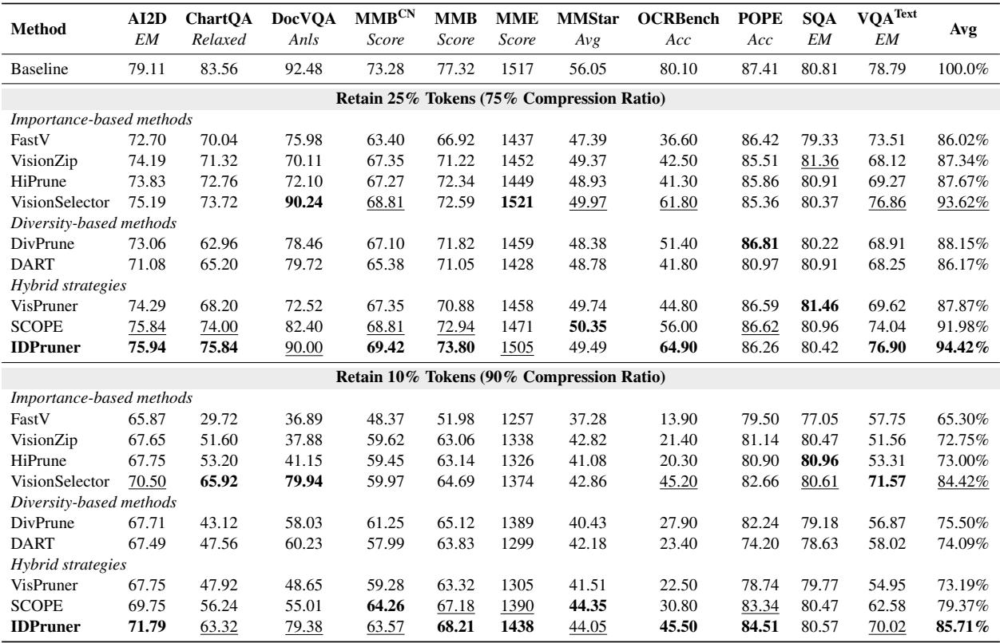
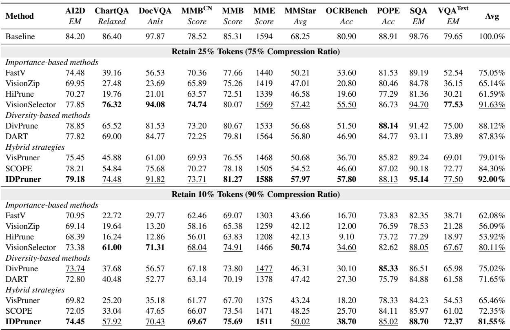
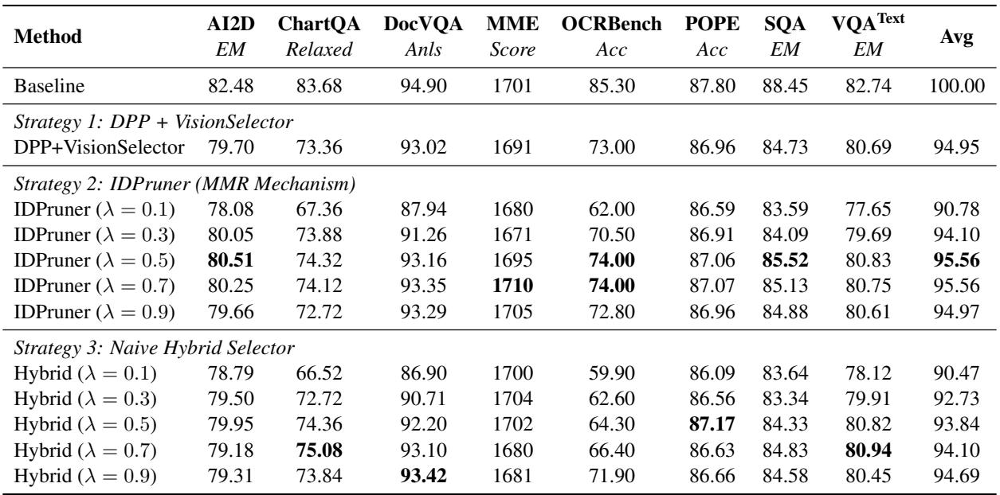
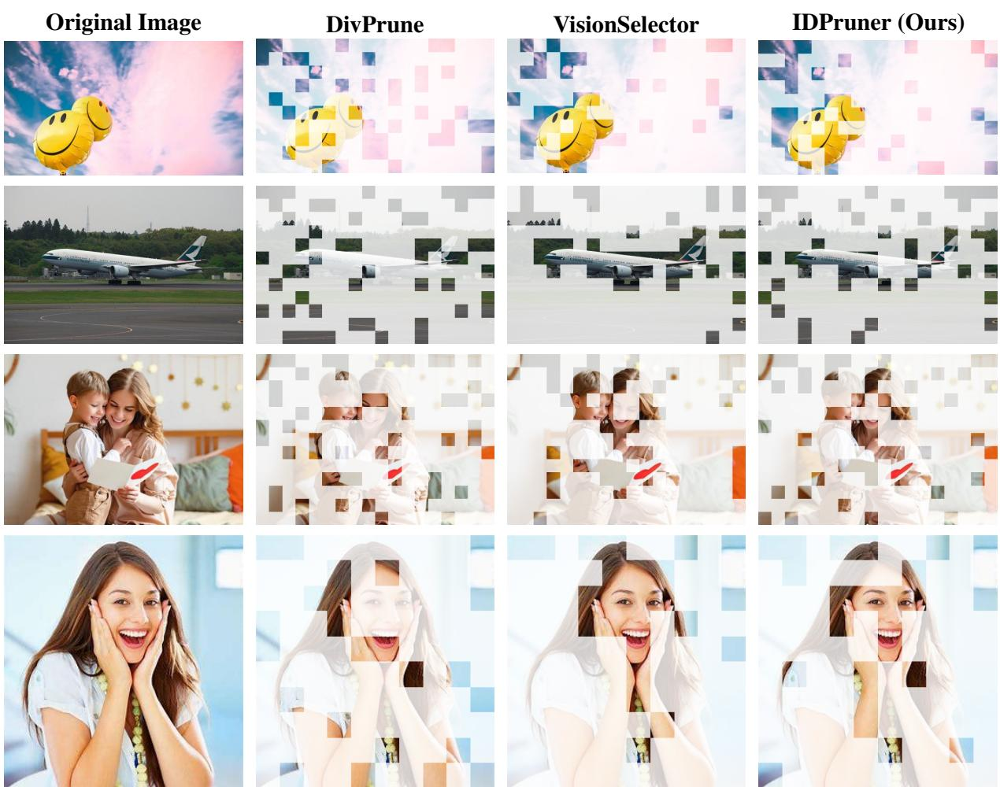
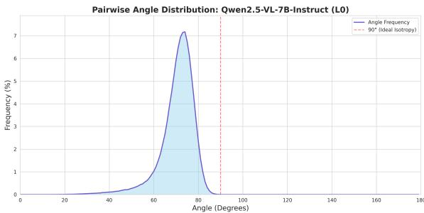

[← 返回 README](../README.md)

# Appendix

## 📌 预览

Appendix 包含六个部分：A（更多架构实验：Qwen2.5-VL-3B 和 LLaVA-OV-1.5）、B（消融研究：集成策略 + λ 超参数）、C（局限性）、D（可视化分析）、E（余弦相似度非负性验证）、F（AI 辅助声明）。

---

## A. Additional Experimental Results

### A.1 Results on Qwen2.5-VL-3B-Instruct

To evaluate the scalability of our method on smaller language models, we conduct experiments on Qwen2.5-VL-3B-Instruct.

*Table 5: Comparison results with different methods on Qwen2.5-VL-3B-Instruct.*

> 💡 **Table 5 批读（3B 模型实验）**:
>
> **25% token 保留**:
> - IDPruner: **94.42%** ← SOTA（几乎等于未剪枝基线！）
> - VisionSelector: 93.62%（第二）
>
> **10% token 保留**:
> - IDPruner: **85.71%** ← SOTA
> - VisionSelector: 84.42%（第二）
> - IDPruner 超 VisionSelector 1.29%
>
> 结论：IDPruner 在小模型（3B）上同样有效，泛化性好。

As shown in Table 5, IDPruner consistently outperforms competitive baselines at both 25% and 10% token retention ratios. Notably, when retaining 25% of the tokens, our method achieves an average score of 94.42%, effectively matching the unpruned baseline. Even under the aggressive 10% retention setting, IDPruner maintains a high average performance of 85.71%, outperforming the second-best method (VisionSelector) by 1.29%.

### A.2 Results on LLaVA-OneVision-1.5-8B-Instruct

We further assess the cross-architecture generalization on LLaVA-OneVision-1.5-8B-Instruct, which integrates advanced visual encoding strategies.

*Table 6: Comparison results with different methods on LLaVA-OneVision-1.5-8B-Instruct.*

> 💡 **Table 6 批读（LLaVA-OV-1.5 实验）**:
>
> LLaVA-OV-1.5-8B 是更先进的架构（集成了高分辨率编码策略）。
>
> **25% token 保留**:
> - IDPruner: **92.00%** ← SOTA
> - VisionSelector: 91.63%（第二）
> - SCOPE: 84.30%（SCOPE 在这个架构上显著下滑！）
> - DivPrune: 88.12%（纯 diversity 在 LLaVA-OV 上表现不错）
>
> **10% token 保留**:
> - IDPruner: **81.55%** ← SOTA
> - VisionSelector: 80.11%（第二）
> - SCOPE: 72.35%（SCOPE 大幅下滑，印证了"架构特异性脆弱性"）
>
> 这验证了 SCOPE 的"架构特异性脆弱性"：SCOPE 在 Qwen2.5-VL 上有竞争力，但在 LLaVA-OV-1.5 上显著下滑。IDPruner 则保持一致的 SOTA。

As shown in Table 6, IDPruner achieves the best results among existing state-of-the-art methods. Under the 25% retention setting, our method achieves an average score of 92.00%, outperforming the strongest baseline, VisionSelector, by 0.37%. In the more challenging 10% retention scenario, IDPruner exhibits strong robustness, achieving an average score of 81.55%. It significantly outperforms purely importance-based methods such as VisionZip and HiPrune, which suffer from severe degradation due to the loss of global context. Additionally, it surpasses the competitive VisionSelector by 1.44%, confirming that harmonizing importance and diversity is particularly effective for advanced architectures.

---

## B. Ablation Study: Integration Strategies and Hyperparameters

We investigate the efficacy of different integration strategies and the impact of the hyperparameter λ, which controls the trade-off between token importance and diversity. Using VisionSelector as the fixed base importance estimator, we compare our IDPruner (MMR) mechanism against two representative baselines: a determinantal point process based method (DPP) and a Naive Hybrid strategy that combines importance filtering with Farthest Point Sampling (FPS).

*Table 7: Ablation study of integration strategies on Qwen2.5-VL-7B-Instruct with 25% token retention. We use VisionSelector as the base importance scorer. λ controls the trade-off between importance and diversity.*

> 💡 **Table 7 批读（消融实验 — 最重要的设计验证）**:
>
> **三种策略对比**（固定 VisionSelector 重要性估计器）:
>
> | 策略 | 最佳 Avg |
> |------|---------|
> | DPP + VisionSelector | 94.95% |
> | Naive Hybrid (λ=0.5) | 93.84% |
> | **IDPruner/MMR (λ=0.5)** | **95.56%** |
>
> 1. **MMR > DPP**: 95.56% vs 94.95%，MMR 比 DPP 好 0.61%，同时计算开销更低
> 2. **MMR > Naive Hybrid**: 95.56% vs 93.84%（最佳 Naive Hybrid），差距 ~1.7%
> 3. **Naive Hybrid 的本质问题**: 先取 top-k 再 FPS，两阶段各自独立，不能联合优化
>
> **λ 超参数分析（IDPruner）**:
> - λ=0.1（极端多样性）: 90.78%（最差）
> - λ=0.5（均衡）: **95.56%**（最好）
> - λ=0.9（极端重要性）: 94.97%
> - 呈**倒 U 形**，λ=0.5 或 0.7 时最优
>
> **λ 超参数分析（Naive Hybrid）**:
> - λ=0.9 时最好（93.84%），说明 Naive Hybrid 偏向重要性更好
> - 相比之下 IDPruner 在 λ=0.5 已达最优，不需要偏向任一极端
>
> 关键洞察：Naive Hybrid 需要更大的 λ 才能表现好，说明其多样性机制（FPS in top-k）效果有限，必须更多依赖重要性；而 IDPruner 的联合优化使得两者同等重要。

**Superiority of MMR Mechanism.** The integration strategy plays a pivotal role in model performance. As evidenced in Table 7, IDPruner consistently outperforms the Naive Hybrid strategy across comparable λ settings and also surpasses the DPP-based baseline. The Naive Hybrid approach typically prioritizes tokens with the highest importance scores before applying Farthest Point Sampling (FPS) to enhance diversity. However, this two-stage paradigm fails to address the inherent redundancy among high-importance tokens, resulting in a selected subset that lacks sufficient diversity. In contrast, IDPruner employs a unified scoring mechanism that simultaneously manages importance and redundancy. By dynamically penalizing semantically repetitive tokens during selection, our method achieves a more effective balance, thereby demonstrating superior robustness over heuristic hybrid strategies.

**Hyperparameter Selection.** The hyperparameter λ controls the balance between token importance and semantic diversity. For IDPruner, the performance follows an inverted U-shape pattern, peaking at λ = 0.5 with an average performance of 95.56%. This confirms that setting λ = 0.5 successfully strikes an optimal balance between token importance and semantic diversity, enabling IDPruner to leverage both properties for maximum performance.

---

## C. Limitations

Despite the promising results achieved by IDPruner, we acknowledge certain limitations in this study. First, constrained by computational resources, we have not yet evaluated our method on long-context video understanding benchmarks. This restricts the comprehensive verification of our method's effectiveness in scenarios involving extremely long temporal sequences, thereby limiting the scope of applicable scenarios. Second, due to time constraints, we did not conduct a fine-grained measurement or exhaustive search for the hyperparameter λ. While the current settings demonstrate strong robustness, a more thorough optimization could potentially yield further performance improvements.

> 💡 **局限性分析**:
> 1. **长视频缺失**: 当前只评测了 Vinoground/VideoMME/SEED-Bench，没有测 EgoSchema/MVBench 等长视频 benchmark。对极长时序序列（>1000 帧），IDPruner 的时序多样性能否有效？未知。
> 2. **λ 未精细搜索**: 默认 0.5 已经稳定，但理论上精细调参可能有 0.5-1% 的提升空间。
> 3. **未明说但重要的局限**: IDPruner 依赖 VisionSelector（需要训练），对新架构泛化时可能需要重新训练。这是论文中一直没有明确讨论的最大局限。

---

## D. Visualization

To intuitively understand how IDPruner harmonizes importance and diversity compared to existing approaches, we visualize the spatial distribution of retained visual tokens across multiple samples.

*Figure 4: Visualization of retained visual tokens across different samples from MMBench. Columns from left to right: Original Image, DivPrune, VisionSelector, and IDPruner. DivPrune maintains global coverage but often neglects the semantic subject. VisionSelector clusters heavily on salient objects, resulting in redundancy and background loss. IDPruner achieves a superior balance, preserving intricate details of the subject while maintaining essential background context for global reasoning.*

> 💡 **Figure 4 批读（可视化分析）**:
>
> 这是非常直观的对比图，四列：原图 / DivPrune 保留的 token / VisionSelector 保留的 token / IDPruner 保留的 token。
>
> - **DivPrune（纯多样性）**: 均匀分布，覆盖背景，但主体（重要前景）的精细 token 稀疏
> - **VisionSelector（纯重要性）**: 高度集中于前景主体，背景几乎完全丢弃，选中 token 之间高度相似（冗余）
> - **IDPruner（MMR hybrid）**: 在前景主体处保留一定密度的 token（重要性），同时在背景保留稀疏 token（多样性），平衡最佳
>
> 这个可视化直接对应了 Section 3 的 Pareto 分析：DivPrune 在图中对应左下角（高多样性低重要性），VisionSelector 对应右上角（高重要性高冗余），IDPruner 对应左上角（高重要性低冗余）。

Figure 4 presents a comparison of token selection masks under a 25% retention ratio. As consistently observed across diverse scenes, DivPrune tends to produce a uniform distribution, often overlooking semantic details. VisionSelector overly concentrates on foreground objects at the expense of background information coverage. In contrast, IDPruner successfully balances both, capturing salient features while maintaining essential background context necessary for global reasoning.

---

## E. Empirical Verification of Non-Negative Similarity

A potential concern regarding the MMR mechanism is the behavior of the redundancy penalty term, (1 - λ) · Sim(v_i, v_j). If the cosine similarity Sim(v_i, v_j) were to yield negative values (implying an angle θ > 90° between feature vectors), the intended penalty would transform into a reward.

To address this validity concern, we empirically analyzed the geometric properties of the visual token space. We randomly selected 100 images from the MMBench dataset and computed the pairwise angles between all visual tokens extracted from the Qwen2.5-VL-7B-Instruct model.

*Figure 5: Distribution of pairwise angles between visual tokens. We calculated the angles for all token pairs across 100 images from MMBench using Qwen2.5-VL-7B. The distribution is entirely concentrated within the acute angle range (< 90°), peaking around 74°. The absence of obtuse angles (> 90°, right of the red dashed line) guarantees that the cosine similarity metric remains strictly non-negative.*

> 💡 **Figure 5 批读（余弦相似度非负性验证）**:
>
> 这是一个重要的理论完整性验证。MMR 公式里有 (1-λ)·max Sim(v_i, v_j) 作为惩罚项，如果余弦相似度为负（即 token 特征夹角 > 90°），这个「惩罚」就会变成「奖励」，整个框架的逻辑就崩了。
>
> 实验发现：
> - Qwen2.5-VL 视觉 token 特征之间的夹角 100% 集中在 [0°, 85°]，峰值约 74°
> - 没有任何 pair 超过 90°（红色虚线处概率密度为 0）
> - 因此余弦相似度恒为非负，MMR 惩罚项始终有效
>
> 这验证了 IDPruner 在 Qwen2.5-VL 上的理论正确性。但注意：此验证只针对 Qwen2.5-VL，其他架构的 token 特征空间可能不同，作者没有对 LLaVA-1.5 等架构做同样的验证。

As illustrated in Figure 5, the distribution of pairwise angles exhibits a distinct pattern. The distribution is overwhelmingly concentrated within the range of [0°, 85°], with a peak density at approximately 74°. Crucially, there is zero probability mass beyond the 90° threshold (indicated by the red dashed line).

Since Sim(v_i, v_j) = cos(θ_ij) and cos(θ) ≥ 0 for all θ ∈ [0°, 90°], this empirical evidence confirms that all similarity scores in our framework are strictly non-negative. Consequently, the term (1 - λ) · Sim(v_i, v_j) consistently functions as a redundancy penalty, validating the theoretical soundness of our IDPruner formulation.

---

## F. Statement on the Use of AI Assistants

In accordance with the ACL submission policies, we hereby declare the use of AI assistants in the preparation of this manuscript. We utilized AI assistants for writing refinement, including grammar correction, vocabulary enhancement, and proofreading to improve readability. We emphasize that all scientific claims, experimental designs, core concepts, and logical arguments presented in this work are the original contributions of the authors. All AI-generated content was meticulously reviewed and verified by the authors to ensure accuracy and adherence to academic standards; the authors assume full responsibility for the content of this paper.

> 💡 **AI 辅助声明**: 作者遵循 ACL 政策声明使用了 AI 辅助写作（语法/词汇/润色）。这个声明现在已经越来越常见了。

## 🔖 Appendix 总结

Appendix 提供了四类补充：(1) 更多架构实验（3B 模型 + LLaVA-OV-1.5），进一步验证跨架构泛化；(2) 消融研究，证明 MMR > DPP > Naive Hybrid，λ=0.5 最优；(3) 可视化，直观展示三种方法的 token 分布；(4) 理论验证（余弦相似度非负性）。
