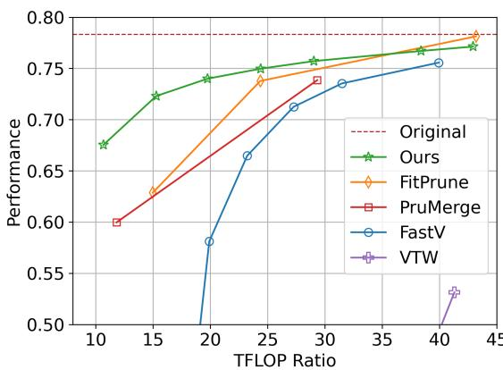

[← 返回 README](../README.md)

# 1. Introduction

## 📌 预览
Introduction 阐述了 LMM 推理效率问题、现有 token pruning 方法的不足，以及 DivPrune 的动机和贡献。

---

Following the success of Large Language Models (LLMs) in language understanding [1, 6, 43], Large Multimodal Models (LMMs) [21, 24, 25, 55] have emerged to handle diverse data types like images and video, by leveraging the foundational capabilities of LLMs. Typically, LMMs encode text and visual modalities into tokens, also known as embeddings. These tokens are then combined and processed by an integrated LLM. The inclusion of visual tokens significantly increases the total number of tokens, often adding thousands to the combined set. Since the running time and memory requirements scale quadratically with input size [7, 8, 17, 41], the addition of visual tokens can substantially raise the running time for LMMs. Hence, many of these models often struggle to meet the demands of low-latency applications, particularly in resource-constrained environments [49].

> 💡 **批注**: LMM 的核心瓶颈在于视觉 token 数量巨大——例如 LLaVA 1.5 用 576 个、LLaVA 1.6 用 2000+ 个视觉 token。由于 Transformer 的 attention 计算复杂度是 $O(n^2)$，这些额外的视觉 token 会显著增加推理时间和显存。

---

*Figure 1. Comparison of different visual token pruning methods across various pruning ratios for LLaVA 1.5-7B. The y-axis is the performance averaged on COCO (CIDEr), OKVQA (Acc), POPE (F1), and MMBench (Acc). The x-axis is the TFLOP ratio of the model after token pruning compared to the original model before pruning.*

> 💡 **Figure 1 批读**:
> - 这张图是全文最核心的结果总览：DivPrune 在各种压缩比下显著优于所有 baseline
> - **关键观察**: 当 TFLOP ratio < 25% 时（极端压缩），baseline 方法性能急剧下降，而 DivPrune 仍保持较高性能
> - FitPrune 在高 TFLOP ratio 时略优，但它需要额外的校准步骤
> - 性能差距在低 TFLOP ratio 时越来越大，说明 DivPrune 在高压缩场景下优势最明显

---

Previous research [4, 38, 50] has demonstrated that there is a high degree of redundancy in the visual information processed by LMMs. As a result, visual token pruning has emerged as a promising solution to address the computational complexity challenges faced by LMMs. Specifically, previous research has demonstrated that reducing the number of visual tokens by 50% [4] to 95% [38] can significantly enhance the inference speed of LMMs.

> 💡 **批注**: 视觉 token 冗余度很高——之前的研究表明可以删除 50%-95% 的视觉 token 而不显著影响性能。这为 token pruning 方法提供了理论基础。

---

While promising, token pruning methods have certain shortcomings. For example, the works in [3, 19, 23, 50] require calibration or finetuning for each model which is costly and time-consuming to implement. FastV [4] and PruMerge [38] use attention scores to identify less important tokens for pruning. However, it is shown that using attention scores is not optimal, as some important tokens are overlooked [23]. Additionally, attention-based pruning tends to retain tokens that are similar to each other, leading to redundancy. At high compression ratio, this redundancy prevents the selection of a sufficient number of unique tokens to accurately represent the original tokens. In line with this observation, our findings indicate that pruning a large portion of visual tokens using these methods, without subsequent fine-tuning, results in a significant drop in the performance of LMMs across various tasks (Fig. 1).

> 💡 **批注**: 现有方法的两大缺陷：
> 1. **需要校准/微调**: M³, TokenPacker, VTW, FitPrune 都需要额外步骤
> 2. **基于 attention score 选择不优**: FastV、PruMerge 根据 attention 分数选 token，但 attention 高的 token 往往彼此相似（都是「重要」但冗余的），导致高压缩比下覆盖不足
>
> 这正是 DivPrune 的动机：不是选「最重要的」，而是选「最多样的」。

---

To address the above-mentioned issues, we formulate token pruning as a Max-Min Diversity Problem (MMDP) [37]. In an MMDP, the objective is to select a subset of elements such that the diversity among them is maximized. We apply this concept to token pruning, which we call DivPrune, aiming to maximize the diversity of the selected tokens by increasing the minimum distance between them. By ensuring high diversity, DivPrune captures a broader range of visual tokens, making it inherently more robust compared to attention-based methods that focus only on token importance scores. Increasing the diversity also helps ensure that the selected tokens better represent the original set of tokens, enabling effective performance even at high pruning ratios without the need for fine-tuning.

> 💡 **批注**: MMDP 的核心思想：在所有可能的子集中，找到一个子集使得其中**最近的两个元素之间的距离最大化**。直觉上就是「选的点尽量分散」，类似于在地图上选代表城市时要尽量覆盖所有区域。

---

DivPrune also offers practical advantages that make it a highly useful solution in real-world scenarios. DivPrune is a plug-and-play solution that can be used without requiring offline optimization with a calibration set, or fine-tuning of the model, which are often time-consuming and computationally expensive. DivPrune is applicable to LMMs with any LLM architecture and vision encoder. Additionally, DivPrune is compatible with inference optimization techniques, such as KV caching, resulting in practical speedup in real-world applications. In summary, our major contributions are as follows:

• We introduce DivPrune, a token pruning method based on MMDP that maximizes diversity among visual tokens, effectively reducing redundancy and ensuring a highly representative subset.
• DivPrune is a training-free, calibration-data-free, plug-and-play solution that can be seamlessly integrated with off-the-shelf LMMs.
• We conduct evaluations using 16 datasets on image- and video-language models with image and video understanding tasks. DivPrune achieves state-of-the-art performance, with noticeable gains under extreme pruning (i.e., ratio ≥ 80%).
• DivPrune reduces GPU memory usage and inference latency while maintaining comparable accuracy compared to the original model across most datasets.

> 💡 **贡献总结**:
> 1. **方法创新**: 基于 MMDP 的多样性最大化剪枝
> 2. **实用性强**: training-free + calibration-free + plug-and-play
> 3. **评测全面**: 16 个数据集，图像+视频，多种 LMM
> 4. **效率提升**: 减少显存和延迟

---

## 🔖 Section 总结

### 核心洞察
1. 现有 token pruning 方法的根本问题是「选重要的 token」导致冗余——attention 高的 token 往往聚集在一起
2. DivPrune 从「多样性」角度出发，选最分散的 token 子集，天然避免冗余
3. 方法的实用价值在于 plug-and-play：无需训练、无需校准数据、兼容任意 LMM 架构
