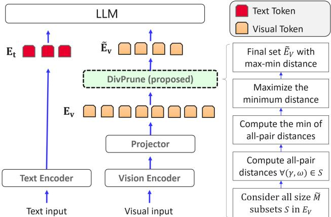
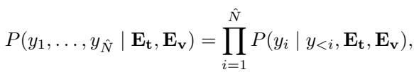
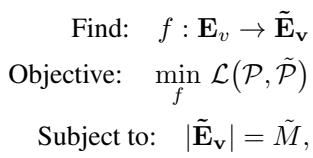
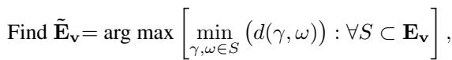
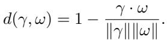
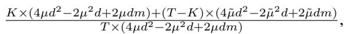

[← 返回 README](../README.md)

# 3. Proposed Method

## 📌 预览
Method 分三部分：LMM 背景、token pruning 问题定义、DivPrune 方法（基于 MMDP 的多样性最大化选择算法）。

---

In this section, we briefly discuss how LMMs work. Then, the token pruning problem is defined, followed by a detailed presentation of the proposed method.

---

## 3.1. Large Multimodal Models (LMMs)

An LMM typically processes a pair of inputs, denoted as $(T, V)$, where $T$ is the text input and $V$ is the visual input such as image or video. The text input is mapped to $N$ textual tokens $E_t = \{t_1, \ldots, t_N\}$ using a text encoder. Similarly, the visual input is processed by a corresponding vision encoder. Specifically, it takes visual information $V$ as input and outputs image features, that are further converted to $M$ (generally $M \gg N$) vision tokens $E_v = \{v_1, \dots, v_M\}$ using a projector layer (Fig. 2).

> 💡 **批注**: LMM 的标准流程：文本 → text encoder → $N$ 个 text tokens；图像/视频 → vision encoder + projector → $M$ 个 vision tokens。关键点是 $M \gg N$，视觉 token 远多于文本 token。

---

*Figure 2. An overview of the LMM architecture, with DivPrune applied to visual tokens. The blocks on the right-hand side illustrate the steps of the method.*

> 💡 **Figure 2 批读**:
> - 左侧是标准 LMM 流程：Image → Vision Encoder → Projector → Visual Tokens → 与 Text Tokens 拼接 → LLM
> - 右侧是 DivPrune 的插入位置：在 Projector 输出后、送入 LLM 前，用 MMDP 算法选择子集
> - 这是一个完全不侵入模型的设计——只是在中间加了一个筛选步骤

---

The textual tokens and visual tokens are then combined to be fed to an LLM to generate the prediction in an autoregressive manner. Specifically, $\hat{N}$ output tokens $Y = \{y_1, \dotsc, y_{\hat{N}}\}$ are generated as follows:

where $P(\cdot)$ is the conditional probability obtained at the output of the LLM.

> 💡 **批注**: 标准的自回归生成公式——每个 output token 的生成依赖于之前的 token 和所有输入 token（text + visual）。视觉 token 越多，每一步的 attention 计算就越贵。

---

## 3.2. Token Pruning

Reducing the number of input tokens in an integrated LLM within LMMs helps to lower memory usage and inference latency. Since visual tokens tend to have more redundancy, they are generally selected for pruning.

In this context, the problem of token pruning can be defined as follows: given a set of visual tokens $E_v$ with $|E_v| = M$ and the subset size $\tilde{M}$ ($\tilde{M} < M$), the goal is to select a subset, $\tilde{E}_v$, while preserving key information necessary for accurate predictions. To mathematically formulate the token pruning problem, we define a mapping function $f$, which maps the original set of visual tokens, $E_v$, to a subset, $\tilde{E}_v = \{\tilde{v}_1, \hdots, \tilde{v}_{\tilde{M}}\}$, where $|\tilde{E}_v| = \tilde{M}$. The objective is to identify a mapping function $f$ that minimizes the difference in the model's output before and after pruning while ensuring the reduced set still captures the essential information from the original set:

where $\mathcal{P} = P(y_1, \ldots, y_{\hat{N}} \mid E_t, E_v)$ and $\tilde{\mathcal{P}} = P(y_1, \ldots, y_{\hat{N}} \mid E_t, f(E_v))$. Here, $\mathcal{L}$ represents a loss function that measures the difference in the model's output with and without pruning, and $\tilde{M}$ indicates the number of retained tokens. Next, we propose a novel diversity-based solution for the introduced token pruning problem.

> 💡 **批注**: Token pruning 的形式化定义：找一个映射 $f$，把 $M$ 个 token 映射到 $\tilde{M}$ 个，使得模型输出尽可能不变。问题在于 $\mathcal{L}$ 是黑盒的（依赖整个 LLM），无法直接优化。DivPrune 的巧妙之处在于用 **多样性** 作为代理目标来近似这个优化问题。

---

## 3.3. DivPrune: Method Overview

> 💡 **3.3 要点预览**: DivPrune 的核心是将 token pruning 转化为 Max-Min Diversity Problem (MMDP)，然后用贪心算法求解。

We proposed a diversity-based token pruning method by reformulating the problem in (2) to select a subset of $\tilde{M}$ elements that maximizes the diversity, thereby reducing redundancy. Specifically, we define token pruning as Max–Min Diversity Problem (MMDP) [34] where the goal is to find the set $\tilde{E}_v$ among all possible sets with $\tilde{M}$ samples in $E_v$ that has the maximum minimum distance between its elements. So, MMDP is defined as:

where $S$ is an arbitrary set in $E_v$ with $\tilde{M}$ elements and $(\gamma, \omega)$ are arbitrary elements in $S$. The distance is measured by $d(.,.)$ which is defined using the cosine distance as follows:

> 💡 **批注**: MMDP 的直觉理解：
> - 想象在一堆点中选 $\tilde{M}$ 个点，使得「最近的两个点之间的距离」尽可能大
> - 用 cosine distance（1 - cosine similarity）衡量距离
> - 这保证了选出的 token 尽可能「分散」，覆盖原始 token 空间的各个角落

---

A solution for the MMDP problem in (3) is a subset of $E_v$ that maximizes diversity by minimizing redundancy between elements. In the literature, several solutions including exact and heuristic methods are proposed to solve the MMDP problem [31, 37]. Since the number of tokens is generally limited (e.g., 576 in LLaVA 1.5 [24]) and the solvers are not generally designed for GPU acceleration, we obtain exact solution for the problem. Notably, the overhead of the selection process using GPU is negligible compared to the computations within the LLM. Detailed steps of the proposed method is summarized in Algorithm 1. Once the selected tokens are identified, the remaining visual tokens are discarded. The selected tokens along with the textual tokens are passed to the LLM.

> 💡 **批注**: 由于 token 数量有限（如 LLaVA 1.5 只有 576 个），可以直接求精确解。选择过程的开销（一次矩阵乘法计算距离矩阵）相比 LLM 推理几乎可以忽略。

---

**Algorithm 1: DivPrune**

> 💡 **Algorithm 1 批读**:
> - **初始化**: 选中集合 $\tilde{E}_v = []$，候选集合 $R = E_v$（所有视觉 token）
> - **第一阶段（选第一个 token）**: 对候选集中每个 token $i$，计算它与其他所有候选 token 的最小距离 $d_{min}$；选择 $d_{min}$ 最大的 token（即「离所有人都最远的那个点」）
> - **第二阶段（迭代选后续 token）**: 对候选集中每个 token $i$，计算它与**已选集合**中所有 token 的最小距离；选择该最小距离最大的 token 加入选中集合
> - **终止**: 当 $|\tilde{E}_v| = \tilde{M}$ 时停止
>
> 这本质上是一个**贪心算法**：每步都选「离已选 token 最远」的新 token。类似于 k-center clustering 的贪心近似。
>
> **优化**: 预先用一次矩阵乘法计算完整的距离矩阵，避免迭代中重复计算。

---

As shown in Algorithm 1, the proposed method has two stages after the initialization. The selected subset, $\tilde{E}_v$, is initialized as empty, and the candidate list $R$ is initialized with all the visual tokens. In the first stage, the first token of the selected subset is chosen based on the pairwise distance between the tokens of the candidate list. Then, the chosen token is moved from the candidate list to the selected list. In the second stage, similar to the first stage, the pairwise distance of the tokens in $\tilde{E}_v$ and the tokens in $R$ is used to add samples to $\tilde{E}_v$ iteratively. Finally, once the number of tokens in $\tilde{E}_v$ reaches the specified subset size, the selection procedure is terminated and the $\tilde{E}_v$ is returned. To avoid repeated distance calculations over iterations a distance matrix is initially calculated by one matrix multiplication.

---

The proposed method can also be applied to the features (i.e., hidden states) in the intermediate layers of the LLM. In this case, our method is not applied to the visual tokens, but to the features corresponding to the visual tokens obtained from a decoder layer to select a subset before feeding them to the subsequent layers. In either case, our method obtains the highest diversity for the selected elements. Ablation studies are provided in the next section to analyze the effect of pruning different elements at different layers.

> 💡 **批注**: DivPrune 不仅可以在 LLM 输入端剪枝（Layer 0），也可以在 LLM 中间层剪枝。消融实验（Table 3）会显示 Layer 0 效果最好。

---

## 🔖 Section 总结

### 关键数字速查
| 指标 | 数值 |
|------|------|
| LLaVA 1.5 视觉 token 数 | 576 |
| LLaVA 1.6 视觉 token 数 | 3-5× more than 1.5 |
| LLaVA-NeXT-Video token/帧 | 144 |
| 距离度量 | Cosine distance |

### 核心洞察
1. DivPrune 将 token pruning 从「重要性选择」转化为「多样性最大化」（MMDP）
2. 算法是贪心的：每步选离已选集合最远的 token，类似 k-center 聚类
3. 计算开销极低：一次距离矩阵计算 + 贪心迭代，远小于 LLM 推理开销
4. 方法可应用于 LLM 输入端或中间层，但 Layer 0 效果最好
