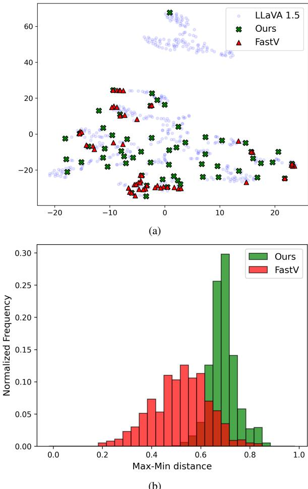
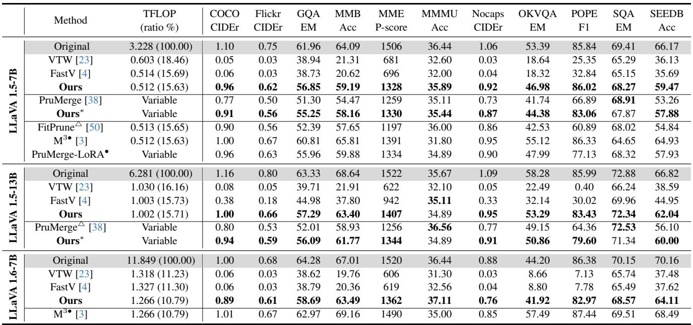
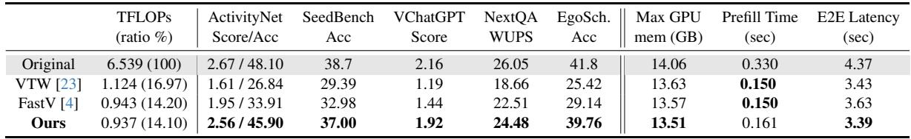
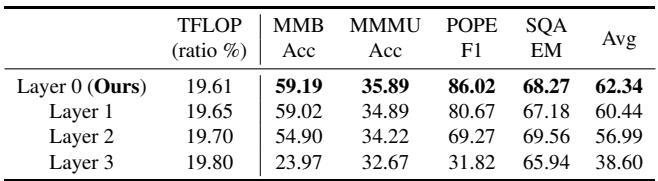
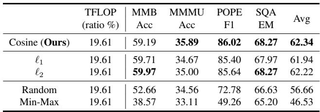

[← 返回 README](../README.md)

# 4. Experiments

## 📌 预览
实验部分包含：设置说明、可视化 insights、图像理解对比、视频理解对比、效率分析、消融实验。DivPrune 在 16 个数据集上全面超越 plug-and-play baseline。

---

In this section, we present a comprehensive analysis comparing the performance of our method and previous works across various settings, tasks, and datasets. Insights into the proposed method are also provided through illustrative examples. Moreover, the efficiency of DivPrune along with ablation study are provided.

---

## 4.1. Experimental Settings

> 💡 **4.1 要点预览**: 5 个 baseline、4 个 LMM、16 个数据集、TFLOP ratio 作为计算量度量。

**Baselines and Models:** We consider five baselines, namely, FastV [4], PruMerge [38], VTW [23], FitPrune [50] and M³ [3]. Among these, we consider FastV, PruMerge, and VTW as our main competitors as they are plug-and-play and do not rely on any further costly finetuning or calibration process. However, for the sake of completeness, we also report performance comparison with respect to one finetuning-based (M³) and one calibration-based (FitPrune) methods. Note that, VTW, by default, requires calibration to determine the best layer for a given task. However, doing that does not allow us to set a specific TFLOP ratio, complicating the comparison. Hence, whenever required we disable the calibration of VTW to select the layer that matches the FLOP requirement of a particular experiment.

We test DivPrune and the baselines with popular LMMs namely LLaVA 1.5-7B [24], LLaVA 1.5-13B [24], LLaVA 1.6-7B (also known as LLaVA-NeXT [25]), and LLaVA-NeXT-Video-7B [55] to demonstrate the generality of DivPrune. For each tested model and task, we report only the relevant subset of baseline that is applicable to that specific model and task, alongside our results.

> 💡 **批注**: Baseline 分类：
> - **Plug-and-play**（主要对比）: FastV, PruMerge, VTW
> - **Calibration-based**: FitPrune
> - **Fine-tuning-based**: M³
>
> 测试了 4 个不同规模和架构的 LMM，展示泛化性。

---

All the tested LMMs used CLIP vision encoder [36]. LLaVA 1.5 model uses 576 visual tokens to represent images. LLaVA 1.6 converts each image into a varying number of patches, resulting in 3-5 times more visual tokens compared to LLaVA 1.5. LLaVA-NeXT-Video uses 144 tokens to process each frame. For all the experiments with LLaVA-NeXT-Video we used a total of 8 frames resulting in 1152 tokens for the processed frames.

**Datasets, Tasks, and Metrics:** We selected a comprehensive set of common tasks and datasets aimed at multimodal reasoning and understanding. Specifically, we chose 11 image-language and 5 video-language datasets.

These datasets encompass a wide range of tasks, including captioning, multiple-choice Question Answering (QA), and open-ended QA based on text and image/video inputs. Consistent with prior works, CIDEr score [45] is used for evaluating captioning tasks, and Exact Match (EM), Accuracy (Acc), F1, Perception Score (P-score) [9] and GPT-assisted [10] score are used for QA tasks. Furthermore, Wu-Palmer similarity (WUPS) score [46] and GPT-assisted score [10] is used for open-ended QA. For all task performance metrics used in this paper, higher values indicate better performance. For the reported time and memory, lower values indicate better results. Further details regarding the datasets, tasks, and metrics are provided in the supplementary material.

Following the earlier works in [4, 23, 50], we report the computational requirement, measured in TFLOPs, for DivPrune and the baselines. Various configurations including different pruning ratios at different layers are examined to obtain different working TFLOPs for our method and the baselines. The reported TFLOP ratio is the TFLOP of the model with pruned tokens relative to the original model's TFLOP with no pruning. This ratio is estimated as [4]:

> 💡 **批注**: TFLOP ratio 是衡量压缩效果的统一指标：压缩后的 TFLOP / 原始 TFLOP。比如 15% 意味着只用了原来 15% 的计算量。这比直接报告 pruning ratio 更准确，因为不同方法在不同层剪枝，实际计算量节省不同。

---

where $T$ is the total transformer-based decoder layers. $\mu = N + M$ is the total sequence length before pruning, $\tilde{\mu} = N + \tilde{M}$ is the sequence length after pruning, $d$ is the hidden state size of the layer, and $m$ is the intermediate size of feed-forward network module. Depending on the TFLOP ratio requirement set by a particular experiment, we adjust the pruning hyperparameters of all baselines to match that requirement. However, some baselines do not support fine-grained adjustments like our approach does. In these cases, we choose the smallest available TFLOP ratio that exceeds the requirement set by an experiment, which might give these baselines a slight advantage over our method.

We used 8×V100 GPUs with 32GB VRAM for all the experiments in this paper. Additionally, we used the lmms-evals package [54] for running these benchmarks for all the baselines and models. All results are obtained with a batch size of 1. For the metrics that require ChatGPT API access, the model is set to "gpt-4o-mini".

---

## 4.2. Insights

> 💡 **4.2 要点预览**: t-SNE 可视化直观展示 DivPrune vs FastV 的选择差异：DivPrune 选的 token 分布更均匀。

We provide visualizations comparing DivPrune with importance-based token pruning methods using LLaVA 1.5-7B and the SeedBench dataset [18]. Detailed analysis across different models and datasets is provided in the following subsections.

The visual tokens in LLaVa 1.5 model are 4096-dimensional vectors. The t-SNE method [44] is utilized to project the visual tokens in $E_v$ from a high dimensional to a 2D space. The corresponding visualization for a sample input data is shown in Fig. 3-(a) using light purple points. Then, DivPrune is applied to select 10% of the visual tokens (i.e., pruning 90%). Additionally, FastV, as an importance-based token pruning method, which utilizes attention scores, is employed to prune with the same ratio. The selected subsets using DivPrune and FastV are shown with different markers in Fig. 3-(a). More examples are provided in the supplementary materials.

As the example in Fig. 3-(a) shows, the proposed method selects points from all the clusters that appeared in the projected space whereas FastV does not choose any samples from the upper cluster. So, our method achieves a better representation of the original points by including samples from all clusters. In addition, the FastV method selects many tokens that are very close to each other which increases redundancy among the selected set. On the other hand, our method reduces redundancy by pruning the closely similar tokens.

*Figure 3. (a) t-SNE visualization of visual tokens for the original model, our method, and FastV. (b) Histogram of the Max-Min distance between the selected tokens over the SeedBench dataset.*

> 💡 **Figure 3 批读**:
> - **(a) t-SNE 可视化**: DivPrune 选的 token（红色）均匀分布在所有 cluster 中；FastV 选的 token（蓝色）集中在某些 cluster，忽略了上方的 cluster
> - **(b) Max-Min 距离直方图**: DivPrune 的 max-min distance 分布明显偏右（更高），说明选出的 token 之间最小距离更大 = 更少冗余
> - 这两张图直观地解释了为什么 DivPrune 在高压缩比下更好：它保证了覆盖全面性

---

In addition, the max-min distance (Eq. 3) for the selected subset of tokens is computed using 1000 randomly data samples from the SeedBench dataset and the histogram of the computed values is shown in Fig. 3-(b). As the plot indicates, the proposed method selects a subset where samples have a higher minimum pair-wise distance compared to the FastV method. Hence, our method achieves higher diversity among the selected tokens that have less redundancy compared to the ones chosen using FastV. We analyze the effect of the reduced diversity on task performance in the following sections.

---

## 4.3. Image-Language Understanding

> 💡 **4.3 要点预览**: 在 ~15% TFLOP ratio 下，DivPrune 在 11 个图像数据集上全面超越 plug-and-play baseline，部分数据集差距巨大（如 COCO CIDEr：0.96 vs 0.06）。

In this section, we compare DivPrune against baselines across various image-language understanding tasks, including open- and closed-ended QA, visual reasoning, and image captioning. Specifically, ScienceQA-IMG (SQA) [27], POPE [20], MME [9], MMB [26], GQA [16], MMMU [53], Flicker30k [33], SeedBench (SEEDB) [18], Nocaps [2], OKVQA [30], and COCO-2017 [22] are used.

In the first experiment, summarized in Tab. 1, we analyze an extreme compression scenario for three image-based LMMs by fixing the TFLOP ratio at approximately 15%, wherever the baseline allows configuration to a fixed TFLOP ratio. Since PruMerge does not allow fixing the TFLOP ratio, we configure our approach (Ours*) to match the variable pruning corresponding to PruMerge for a fair comparison. In the top section of the table, we compare the results of various baselines for LLaVa 1.5-7B. Specifically, the baselines supporting LLaVA 1.5 are grouped into three categories: plug-and-play methods, those with a variable TFLOP ratio, and those requiring a calibration dataset or involving fine-tuning the LMMs. Among the plug-and-play methods, which are the focus of this work, our approach significantly outperforms both the VTW and FastV baselines across all datasets. This result holds despite using lower TFLOPs, clearly demonstrating the advantage of our method in this scenario. For instance, when DivPrune is used, the performance of LLaVA 1.5-7b decreases by 5.1% on the GQA dataset and 4.9% on the MMB dataset. In contrast, the VTW and FastV methods result in performance drops of at least 23.0% and 42.8% on these datasets, respectively. The performance gap between DivPrune and the baseline methods is even more pronounced in image captioning tasks. For example, the CIDEr score on the COCO dataset drops by approximately 95% with VTW and FastV, but only by 12.7% with DivPrune. Additionally, DivPrune, compared to the original model, shows less than a 2% performance drop on the MMMU and SQA datasets and slightly enhances the original model's performance on the POPE dataset while reducing the TLOP ratio by 84.4%. It is shown that removing redundant tokens in some datasets can improve the original model's performance [4].

*Table 1. Comparison results of our method and different baselines on image-language understanding datasets. •: Finetuning is used, △: Calibration dataset is used. Ours*: Our method matching the PruMerge selection ratio.*

> 💡 **Table 1 批读**:
> - **LLaVA 1.5-7B (上部)**:
>   - DivPrune (15.63% TFLOP) vs FastV (15.69%): COCO CIDEr 0.96 vs 0.06（16倍差距！）
>   - POPE F1: DivPrune 86.02 甚至**超过**原模型的 85.84
>   - 与 M³（需要微调）相比，DivPrune 不需要训练但性能接近
> - **LLaVA 1.5-13B (中部)**: 同样的趋势，DivPrune 优于所有 plug-and-play 方法
> - **LLaVA 1.6-7B (下部)**: TFLOP ratio 更低（~10.8%）因为 visual token 更多，但 DivPrune 仍保持强劲性能
> - **核心发现**: captioning 任务受压缩影响最大，但 DivPrune 的影响远小于 baseline

---

Next, in the variable scenario, the pruning ratio is determined dynamically. To ensure a fair comparison, we matched the pruning ratio with that of the PruMerge baseline, assuming the average sequence length for calculating the average TFLOPs across each dataset. As indicated by the results, our approach consistently outperforms PruMerge across all benchmarks, except one. Further, for the baseline with calibration, we observe that our approach outperforms the FitPrune approach on nearly all datasets by up to 25.1%, despite not using any calibration dataset. Finally, compared to baselines involving fine-tuning, our method achieves comparable or superior performance without requiring any fine-tuning.

> 💡 **批注**: 即使与需要校准的 FitPrune 和需要微调的 M³ 相比，DivPrune 也具有竞争力——这说明「多样性最大化」是一个非常强的代理目标。

---

The above experiment is repeated with LLaVa 1.5-13B model and the results are shown in the middle part of Tab. 1. The baselines that support this model are FastV, VTW, and PruMerge. As shown in the table, DivPrune outperforms the corresponding baselines in both plug-and-play and variable scenarios almost on all the tested datasets. For example, on the POPE dataset, DivPrune outperforms VTW, FastV, and PruMerge with F1 score improvements of 83%, 53.4%, and 15.2%, respectively. Additionally, on the MMB dataset, DivPrune achieves higher accuracy rates of 41.5%, 25.6%, and 2.8% compared to VTW, FastV, and PruMerge, respectively. This demonstrates that DivPrune generalizes effectively across models with varying numbers of parameters.

In the bottom part of Tab. 1, the results corresponding to LLaVA 1.6-7B model are shown. We used the same pruning ratio as for LLava 1.5. However, the lower TFLOP ratio is due to the large number of visual tokens in LLaVA 1.6. The results indicate that the performance of the model drops significantly when baseline pruning methods are applied. For example, the F1 score on the POPE dataset drops by 79% with the baselines as compared to the original model, whereas the drop with DivPrune is only 3.4%. DivPrune also maintains competitive performance compared to the original model across various datasets. Specifically, DivPrune shows only 3.5%, 2.3%, 3.4%, 1.6% drop in accuracy compared to the original model on the MMB, OKVQA, POPE, and SQA datasets, respectively, while reducing the TFLOP by 89%. The results also demonstrate that pruning visual tokens with DivPrune enhances the original model's performance on the MMMU task. These results show that DivPrune generalizes across different models. Qualitative examples as well as results with additional datasets are provided in the supplementary materials.

Furthermore, we show the comparison of different baselines and our method across various TFLOP ratios. We plot the results in Fig. 1 where the y-axis represents average performance on four datasets, namely, COCO (CIDEr), OKVQA (Acc), POPE (F1), and MMBench (Acc). The range of the performance metric for all datasets is between 0 and 1, except for the CIDEr metric, which has a maximum reported value of 1.10. On the x-axis, we only show the high compression scenario (TFLOP ratio ≤ 45%). As shown in the figure, our method significantly outperforms all the baselines, particularly in high compression scenarios (TFLOP ≤ 25%). Further, we notice a steep drop in performance of all baselines as the TFLOP ratio < 10%, while our method falls more gracefully. This results in an increasing performance gap between our approach and the baselines at extreme compression levels. For higher TFLOP ratios almost all converge toward the original performance, with FitPrune slightly outperforming our approach by an insignificant margin. It is important to note that, unlike our method, FitPrune relies on a calibration dataset to prune tokens.

---

## 4.4. Video-Language Understanding

> 💡 **4.4 要点预览**: 在 LLaVA-NeXT-Video 上，DivPrune 仅用 14.1% TFLOP 就接近原模型性能，远超 FastV 和 VTW。

In this section, LLaVA-NeXT-Video-7B [25], a video-based LMM is used to analyze the performance of the proposed method on various video-language understanding tasks. Specifically, we evaluate DivPrune using five datasets, namely, ActivityNet [51], SeedBench [18], VideoChatGPT (temporal) [28], NextQA [47], and EgoSchema [29]. FastV and VTW methods are chosen as the baselines. We tested DivPrune using the same pruning ratio as in the image understanding experiments. However, due to the higher number of visual tokens in the LLaVA-NeXT-Video model, this pruning ratio results in lower TFLOPs ratio. For the baselines, we match their TFLOPs with ours by selecting the smallest available TFLOP ratio that exceeds the TFLOPs of our method. The results for the original model, DivPrune, and the baselines are given in Tab. 2. As shown in the table, DivPrune outperforms both FastV and VTW by a significant margin. Specifically, DivPrune achieves upto 12% higher accuracy than FastV and upto 19% better than VTW on Video QA datasets including ActivityNet, SeedBench, and EgoSchema. DivPrune also outperforms both baselines on open-ended QA such as VideoChatGPT and NextQA by achieving higher GPT-assisted and WUPS scores.

*Table 2. Comparison results of our method and baselines on LLaVA-NeXT-Video-7B across video-language understanding datasets.*

> 💡 **Table 2 批读**:
> - DivPrune (14.10% TFLOP) vs 原模型: ActivityNet 分数几乎无损（2.56/45.90 vs 2.67/48.10）
> - 与 FastV 对比：EgoSchema 准确率 39.76% vs 29.14%（+10.6%）
> - **效率数据**（右侧列）:
>   - GPU 显存: 13.51GB vs 14.06GB（减少 ~400MB）
>   - E2E 延迟: 3.39s vs 4.37s（减少 22%）
>   - Prefill 时间: 0.161s vs 0.330s（减少 51%）
> - DivPrune 的 prefill 时间比 baseline 略长（0.161 vs 0.150），但 E2E 更短——因为 DivPrune 只需要在 prefill 阶段计算一次距离矩阵，而 baseline 每个 decoding step 都要做 pruning 计算

---

Furthermore, our method achieves performance that is highly competitive compared to the original model without pruning despite using only 14.1% of the original model's TFLOPs. This demonstrates the robustness of DivPrune, as it effectively generalizes to video LMMs. Notably, the performance gap between DivPrune and the original model without pruning narrows as the number of visual tokens increases, indicating that DivPrune is more effective for the models with larger visual contexts.

> 💡 **批注**: 重要观察——visual token 越多，DivPrune 的优势越大。因为 token 越多 → 冗余越多 → 多样性选择的收益越高。这对 video LMM 和高分辨率 image LMM 特别有利。

---

## 4.5. Efficiency Analysis

In this section, we analyze the efficiency of the proposed method using memory usage (i.e., max allocated memory), prefill time, and end-to-end latency (E2E). For this experiment, VideoChatGPT dataset with 499 samples is used to obtain the average time and memory usage for LLaVA-NeXT-Video-7B model. The results are summarized on the right side of Tab. 2. The obtained results are compared against the original model, as well as the FastV and VTW baselines. As shown in the table, our approach requires approximately 400MB less memory than the original model, with memory usage comparable to the baselines. In terms of prefill and E2E time, our approach is about 55% and 22% faster, respectively, compared to the original model. When compared to the baselines, our prefill time is approximately 6-7% longer, while the E2E time is 1-7% shorter. The slight increase in prefill time for our method compared to the baselines is due to the distance calculations (See Section 3.3), which are performed only once during the prefill stage. In contrast, for baselines, the corresponding calculations for token pruning need to be done at each decoding step, resulting in longer E2E time.

> 💡 **批注**: DivPrune 的效率优势：
> - Prefill 阶段略慢（+6-7%）因为要算距离矩阵
> - 但 E2E 更快（-1~7%）因为 baseline 每步解码都要重新计算 pruning
> - 这说明 DivPrune 的「一次性计算」策略在实际推理中更高效

---

## 4.6. Ablation Study

> 💡 **4.6 要点预览**: 消融实验验证：(1) Layer 0 剪枝最优；(2) Cosine distance 略优于 L1/L2；(3) Max-Min 策略远优于 Random 和 Min-Max。

In this section, we conduct an ablation study to analyze the impact of modifying various core components of our method. The ablation experiments are conducted with the LLaVA 1.5-7B model. First, we show the effect of pruning tokens inside the LLM in Tab. 3 using 5 datasets. By default, in our method, visual tokens are pruned before being passed to the first decoder layer in the LLM, which we refer to as 'Layer 0'. We also tested 'Layer 1' where the first layer is processed without pruning and the pruning is performed afterward. We further extended this approach by allowing tokens to pass through the first few layers unpruned and then pruning them after specific layers. As shown in the table, for a fixed TFLOP ratio of 19.61%, pruning done by our method at layer 0 achieves higher task accuracies compared to pruning at layers 1, 2, and 3 of the LLM.

*Table 3. Ablation study on applying DivPrune at different layers.*

> 💡 **Table 3 批读**:
> - Layer 0 (默认) 平均 62.34% → Layer 3 降到 38.60%
> - 越往后层剪枝效果越差，说明**早期剪枝**（在 LLM 处理之前）是最佳策略
> - 这也符合直觉：token 进入 LLM 后会被 attention 混合，此时再按原始多样性剪枝不再合理

---

Furthermore, in Tab. 4, we provide an analysis of using alternative diversity measures for token pruning. The first three rows show the impact of choosing different distance measures to quantify the similarity among tokens. It can be seen that all three similarity measures, cosine, $\ell_1$, and $\ell_2$ perform comparably, with cosine (default setting) performing slightly better. This suggests that the choice of similarity measure does not significantly impact DivPrune's overall performance.

*Table 4. Ablation on using various diversity measures.*

> 💡 **Table 4 批读**:
> - **距离度量**: Cosine (62.34) ≈ L2 (62.22) ≈ L1 (61.94)，差异不大
> - **Random**: 56.66%，比 Max-Min 低 5.6%——说明随机也有一定多样性，但不够
> - **Min-Max（最小化多样性）**: 46.53%，性能最差——这是最强的反面验证！
>   - Min-Max 故意选最相似的 token，结果灾难性的差，**证明了多样性确实是关键因素**
> - 这组消融实验非常有说服力地支持了论文的核心假设

---

The last two rows in Tab. 4 show the effect of choosing alternative strategies of token selection other than the proposed Max-Min diversity-based solution (3). We tested random pruning as well as the Min-Max strategy where the maximum distance between the selected samples is minimized. The Min-Max strategy enforces high redundancy among the selected samples, resulting in reduced diversity. As results in the bottom part of Tab. 4 reveal that any deviation from our proposed selection strategy results in suboptimal performance. Specifically, the Min-Max strategy performs the worst, showing approximately 15.8% lower performance compared to ours. This decline is due to the Min-Max approach selecting tokens that are highly similar to each other, resulting in less diversity among the selected visual tokens. Random selection provides some degree of diversity, but it performs 5.6% worse than the proposed method because it cannot guarantee maximum diversity. This proves that redundancy of visual tokens leads to poor performance and diversity maximization is needed for optimal performance, corroborating the utility and need of the proposed diversity maximization in Eq. (3).

---

## 🔖 Section 总结

### 关键数字速查
| 指标 | 数值 |
|------|------|
| 测试模型 | LLaVA 1.5-7B/13B, LLaVA 1.6-7B, LLaVA-NeXT-Video-7B |
| 图像数据集数 | 11 |
| 视频数据集数 | 5 |
| 极端压缩 TFLOP ratio | ~15% (image), ~14% (video) |
| 显存节省 | ~400MB |
| E2E 加速 | ~22% |
| DivPrune 默认 pruning ratio | 90.2% |

### 核心洞察
1. DivPrune 在 plug-and-play 方法中全面 SOTA，尤其在高压缩比（≥80%）下优势巨大
2. 即使与需要微调的 M³ 和需要校准的 FitPrune 相比也具竞争力
3. 视觉 token 越多（如 video、高分辨率 image），DivPrune 的优势越明显
4. 消融实验证明：多样性最大化是性能的关键因素，不是距离度量的选择
