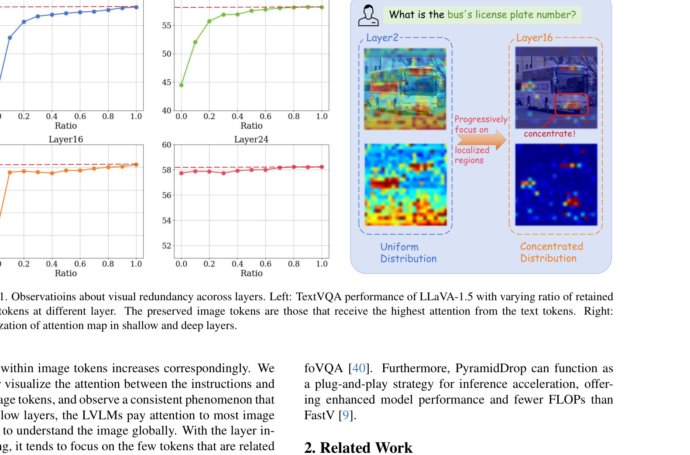

[← 返回 README](../README.md)

# 1. Introduction

## 📌 预览
Introduction 阐述 LVLM 视觉 token 冗余问题的背景、现有方法的不足，以及 PyramidDrop 的核心观察和贡献。

---

In recent years, Large Vision-Language Models (LVLMs) have emerged as a central focus in deep learning research [2, 6, 12, 31, 53]. Remarkable progress have been witnessed across various application domains, including image and video understanding [16, 41]. The rapid development of LVLMs is gradually paving the way for artificial intelligence to integrate into daily life [24, 35, 52, 56].

> 💡 **批注**: 开篇点出 LVLM 是当前深度学习研究的核心方向，应用涵盖图像和视频理解。

---

Despite the advancements of LVLMs, a significant challenge lies the escalating computational costs. Images or videos, as continuous and information-rich signals, exhibit substantial spatial redundancy but are difficult to compress losslessly. It results in excessive vision tokens and a steep increase in training and inference costs, which becomes particularly pronounced with higher image resolutions [20, 46, 53] and longer videos [8, 27, 37]. The number of vision tokens increases quadratically with the resolution or the frame numbers, driving the sequence length into the tens of thousands [23]. Given that the computational complexity of transformers scales with sequence length, the associated computational costs become prohibitively high [32, 49]. Consequently, there is a pressing need to reduce the redundancy and concentrate more on valuable visual information for efficient deployment.

> 💡 **批注**: 核心痛点 — 图像/视频 token 数量随分辨率/帧数**二次增长**，序列长度可达数万，Transformer 计算成本难以承受。这是 token 压缩研究的根本动机。

---

Previous exploration of reducing image tokens could be roughly divided into two categories: One is to compress the vision tokens before passing them into the base LLM of LVLMs [1, 25, 42, 50]. The other is to partially drop the vision tokens at the very shallow layer of the LVLMs [9]. However, both ideas inevitably hurt the performance of LVLMs: the former suffers from the information loss introduced by their compression, and the latter drops part of the information before the LVLMs fully understand them.

> 💡 **批注**: 现有两类方案及其缺陷：
> 1. **LLM 之前压缩**（如 Q-Former、LLaVA-PruMerge）→ 压缩引入信息损失
> 2. **浅层丢弃**（如 FastV 在第 2 层丢弃）→ LLM 还没充分理解图像就丢了
> 
> 两者的共同问题：**过早压缩**。

---

To break through these limitations, we explore the nature of LVLMs in understanding images from an intuitive question: Are all image tokens necessary for all LVLM layers? We conduct an empirical study by removing different ratios of image tokens at different layers of the LVLM at inference time and observing the benchmark performance change. As shown in Figure 1, the LVLMs are sensitive toward token dropping on shallow layers, regardless of the dropping ratio. However, in deeper layers, image tokens gradually become less critical to the final results. The results indicate that the LVLMs understand the image layer-by-layer and the redundancy within image tokens increases correspondingly. We further visualize the attention between the instructions and the image tokens, and observe a consistent phenomenon that in shallow layers, the LVLMs pay attention to most image tokens to understand the image globally. With the layer increasing, it tends to focus on the few tokens that are related to the instruction and the rest are unnecessary.

> 💡 **批注**: **核心发现** — 视觉 token 冗余度随层数递增：
> - **浅层**：所有 token 都重要，注意力均匀分布（全局理解阶段）
> - **深层**：大部分 token 冗余，注意力集中在与 instruction 相关的少数 token 上
> 
> 这个 observation 是整篇论文的理论基础。

---

*Figure 1. Observations about visual redundancy across layers. Left: TextVQA performance of LLaVA-1.5 with varying ratio of retained image tokens at different layer. The preserved image tokens are those that receive the highest attention from the text tokens. Right: Visualization of attention map in shallow and deep layers.*

> 💡 **Figure 1 批读**:
> - **左侧 4 图**：在 layer 2/8/16/24 分别丢弃不同比例 token 后的 TextVQA 性能
>   - Layer 2：丢弃任何比例都严重掉点 → 浅层 token 全都重要
>   - Layer 16：保留仅 10% token 性能几乎不降 → 深层 token 高度冗余
>   - Layer 24：性能几乎与 token 数无关 → 图像信息已被完全吸收
> - **右侧**：注意力可视化
>   - 浅层注意力均匀分布在所有 token 上
>   - 深层注意力集中在与问题相关的局部区域

---

Based on the observation, we introduce PyramidDrop, a simple yet effective image token reduction strategy for LVLMs to accelerate both inference and training without performance loss. PyramidDrop divides the LVLM into several stages, dropping a portion of the image tokens at the end of each stage according to a predefined ratio. We employ a lightweight attention module to rank the image tokens and finally keep important visual concentration, which incurs negligible overhead. With this design, we retain all image tokens in the shallow layers to avoid information loss, while progressively reducing the number of tokens as the layers deepen to maximize training and inference efficiency.

> 💡 **批注**: PyramidDrop 方法概述 — 将 LLM 分成多个 stage，每个 stage 末尾丢弃部分 token。浅层保留全部，深层大幅减少。名字来源于 token 数量呈金字塔状递减。

---

Extensive experiments verify the effectiveness and efficiency of our PyramidDrop. For example, applying PyramidDrop to LLaVA-NeXT-7B [30] could achieve 40% training time reduction without sacrificing performance across 16 Vision-Language tasks. Moreover, PyramidDrop enables the LLaVA-NeXT model to be trained with doubled input resolution with only 70% training time of the vanilla LLaVA-NeXT, and reaches a better performance on high-resolution benchmarks like DocVQA [39] and InfoVQA [40]. Furthermore, PyramidDrop can function as a plug-and-play strategy for inference acceleration, offering enhanced model performance and fewer FLOPs than FastV [9].

> 💡 **批注**: 三大贡献总结：
> 1. **训练加速**：LLaVA-NeXT-7B 训练时间减少 40%，16 个任务性能不降
> 2. **更高分辨率更低成本**：双倍分辨率只需 70% 训练时间，高分辨率 benchmark 更好
> 3. **Plug-and-play 推理加速**：无需重新训练，直接用于推理，优于 FastV

---

## 🔖 Section 总结

### 核心洞察
1. LVLM 对视觉 token 的理解是**逐层递进**的：浅层全局理解，深层聚焦关键区域
2. 现有压缩方案的共同缺陷是**过早压缩**，PyramidDrop 通过**渐进式丢弃**解决
3. 方法同时适用于训练和推理加速，还可作为 plug-and-play 推理策略
