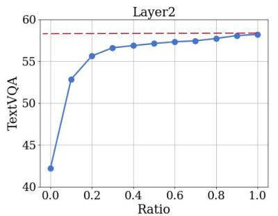

# 1. Introduction

> 来源: PyramidDrop (CVPR 2025)

---

## 📄 原文

> 💡 **Section 概览**: 核心问题 → 实证发现 → 方案

---

### 核心问题

图像 token 数量随分辨率**二次方增长**，计算成本禁止性地高。

### 现有方法的局限

```
方向 1: 进 LLM 前压缩 (Q-Former 等)
  └── 问题: 压缩导致信息丢失

方向 2: 浅层就剪 (FastV 等)
  └── 问题: LLM 还没理解图像就剪了，丢失关键信息
```

### 🔑 核心实证发现

> 💡 **这是全文最重要的 insight**:


*Figure 1: TextVQA 上 LLaVA-1.5 在不同层保留不同比例 image tokens 的性能变化*

> 💡 **Figure 1 批读**:
> ```
> Layer 2:  保留 10% token → 性能暴跌 (浅层 token 全部重要!)
> Layer 8:  保留 10% token → 性能开始下降
> Layer 16: 保留 10% token → 性能几乎不变!
> Layer 24: 保留 10% token → 性能完全不变!!
>
> 结论: 
> ├── 浅层: LLM 在全局理解图像，所有 token 都参与
> ├── 中层: attention 变稀疏，集中在与问题相关的区域
> └── 深层: 图像信息已被吸收，visual token 几乎没用了
> ```
> 这个发现和 FastV 的 "Layer 2 之后就不需要" 形成对比 — PyramidDrop 认为不应该一开始就剪，而是渐进式。

### 方案: PyramidDrop

将 LLM 分成多个 stage，每个 stage 结束时按比例丢弃 image tokens → 形成金字塔结构。

---

## 💡 Section 总结

### 核心洞察
1. **浅层全保留是关键** — FastV 在 Layer 2 就剪是太激进了
2. **深层可以几乎全剪** — Layer 24 时 token 已经冗余
3. **渐进式 > 一刀切** — 这是 PyramidDrop 的核心思想
