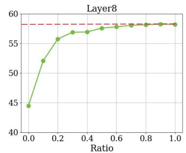

# 4. Experiments

> 来源: PyramidDrop (CVPR 2025)

---

## 📄 原文

> 💡 **Section 概览**: 推理加速 + 训练加速 + 视频 + 消融实验

---

### 4.2 Inference Acceleration

#### Table 1: Inference-only 策略对比

> 💡 **Table 1 批读**:
> ```
> LLaVA-NeXT-7B:
>   Vanilla:  20.8T FLOPs, Avg 70.9
>   FastV:    10.6T FLOPs, Avg 70.1
>   PDrop:     9.5T FLOPs, Avg 70.5 ⭐ (更少 FLOPs + 更高性能)
>
> LLaVA-1.5-7B:
>   Vanilla:  3.82T FLOPs, Avg 67.5
>   FastV:    2.01T FLOPs, Avg 66.4
>   PDrop:    1.78T FLOPs, Avg 67.1 ⭐
> ```
> PDrop 在两个模型上都比 FastV **更快且更准**。

#### Table 2: 不同压缩比对比 (vs ToMe, FastV, SparseVLM)

> 💡 **Table 2 批读**:
> ```
> 576 → 192 tokens:
>   PDrop:     96.8% ⭐
>   SparseVLM: 95.5%
>   FastV:     90.6%
>   ToMe:      89.9%
>
> 576 → 128 tokens:
>   PDrop:     95.6% ⭐
>   SparseVLM: 93.0%
>   FastV:     83.9%
>   ToMe:      81.1%
>
> 576 → 64 tokens:
>   PDrop:     87.6% ⭐
>   SparseVLM: 85.9%
>   FastV:     73.7%
>   ToMe:      70.5%
> ```
> **PDrop 在所有压缩比上都是最好的!** 特别是在高压缩比时优势更大。

> 💡 **注意**: 这里的数字和 SparseVLM 论文的不太一样（SparseVLM 论文里自己的结果更高）。可能是评测协议或实现细节的差异。论文间交叉比较要注意这点。

---

### 4.3 Training Acceleration

#### Table 3-4: 训练加速

> 💡 **关键结果**:
> ```
> LLaVA-NeXT-7B (5 patches):
>   Vanilla: 366 GPU hours
>   PDrop:   218 GPU hours → 40.4% 省时 ⭐
>   性能:    16 个 benchmark 几乎无损
>
> LLaVA-NeXT-7B (9 patches, 更高分辨率):
>   Vanilla: 483 GPU hours
>   PDrop:   269 GPU hours → 44.3% 省时
>   性能:    甚至略高于原始模型! (因为减少了冗余信息的干扰)
> ```

> 💡 **重要发现**: 9 patches 的 PDrop 训练时间 (269h) 比 5 patches vanilla (366h) 还少，但性能更好。这说明**更高分辨率 + 冗余减少 > 低分辨率 + 保留全部 token**。

#### Table 5: 与其他训练策略对比

> 💡 **Table 5 批读**:
> ```
> LLaVA-1.5-7B 训练策略对比:
>   Q-Former:  84.6% 时间, Avg 差很多 (41.3% GQA!)
>   FastV:     78.0% 时间, Avg 66.4
>   LLaVolta:  89.4% 时间, Avg ~原始
>   PDrop:     76.0% 时间, Avg 最好 ⭐ (最快且最好)
> ```

#### PyramidDrop 训练鼓励紧凑理解


*Figure 3: PDrop 训练的模型 vs vanilla 模型在不同层保留不同比例 token 的对比*

> 💡 **Figure 3 批读**:
> ```
> PDrop 训练的模型曲线始终高于 vanilla:
>   → 同样保留 50% token, PDrop 模型性能更好
>   → 说明 PDrop 训练让模型学会了把重要信息压缩到更少的 token 里
> ```
> 这是一个很酷的副产品：训练时的渐进式剪枝迫使模型学会更高效的信息编码。

---

### 消融实验

#### Table 7: λ 的影响

| λ | GPU hours | FLOPs | 性能 |
|---|-----------|-------|------|
| 0.4 | 204h (44.3%) | 8.22T | 略降 (DocVQA 掉 3.4%) |
| **0.5** | **218h (40.4%)** | **9.46T** | **最佳平衡** |
| 0.6 | 240h (34.4%) | 11.0T | 接近原始 |

> 💡 **批注**: λ=0.5 是默认选择，在大多数 benchmark 上很鲁棒。只有高分辨率文档理解 (DocVQA) 对 λ 较敏感。

---

## 💡 Section 总结

### 关键数字速查
| 场景 | 加速 | 性能 |
|------|------|------|
| LLaVA-NeXT 推理 | 55% FLOPs↓ | 几乎无损 |
| LLaVA-NeXT 训练 | 40% 时间↓ | 无损 |
| LLaVA-NeXT 高分辨率训练 | 44% 时间↓ | 反而更好 |
| Video-LLaVA 训练 | 28% 时间↓ | 无损 |

### 核心洞察
1. **训练加速是独特优势** — FastV 和 SparseVLM 都不能加速训练
2. **高分辨率场景收益更大** — token 越多，PDrop 节省越多
3. **训练 + 推理双重加速** — 训练出来的模型推理也更快
4. **紧凑表示学习** — 训练副产品，模型学会了更高效的信息编码
