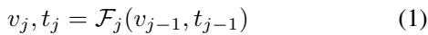
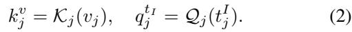
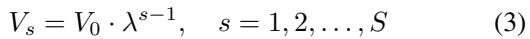
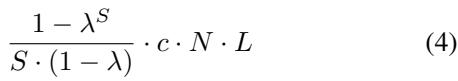

[← 返回 README](../README.md)

# 3. Method

## 📌 预览
Method 分两部分：3.1 通过实验研究 LVLM 中视觉 token 冗余的层级特性；3.2 基于此提出 PyramidDrop 的具体设计，包括公式化、渐进式丢弃机制和效率分析。

---

## 3.1. Study of Visual Token Redundancy in LVLMs

> 💡 **3.1 要点预览**: 通过双变量实验（丢弃比例 × 丢弃层数）揭示 LVLM 中视觉 token 冗余的层级规律。

The fundamental design of PyramidDrop stems from an intuitive question: are all image tokens necessary for all LVLM layers? To explore it and reveal the nature of LVLMs, we conduct a two-variable experiment by removing different ratios of image tokens at different layers of the LVLM at inference time and observing the benchmark performance change.

> 💡 **批注**: 核心问题 — "所有图像 token 对 LVLM 的所有层都是必要的吗？" 实验设计：在不同层丢弃不同比例的 token，观察性能变化。

---

In detail, we select LLaVA-v1.5-7B [31] as the base model, and employ a popular LVLM benchmark, TextVQA [44], as the evaluation data. TextVQA consists of a substantial number of images that contain fine-grained information like text. The questions in TextVQA focus on the textual elements within images, requiring LVLMs to capture the global image information while mining the great detailed visual clues. This characteristic increases the model's sensitivity to image token compression, enabling a more precise evaluation of redundancy.

> 💡 **批注**: 选择 TextVQA 的原因很聪明 — 它需要**细粒度理解**（图中文字），对 token 压缩最敏感，能更精确地评估冗余度。

---

Considering LLaVA-v1.5-7B consists of 32 layers, we drop varying proportions of image tokens during inference at layer 2, 8, 16, and 24 to assess redundancy at different layers. The ranking of tokens is based on the attention values of text tokens towards image tokens, with the retained image tokens corresponding to those with the highest attention values. As illustrated in Figure 1 (left), at layer 2, the LVLMs are sensitive toward token dropping on shallow layers, regardless of the dropping ratio. This indicates most of the image tokens in shallow layers play an important role in providing information for answering the instruction. With the layer increases, the redundancy of image tokens increases rapidly. At layer 16, even preserving only 10% of image tokens will not cause an obvious performance decline. Notably, at layer 24, the model performance is nearly irrelevant to the image tokens, indicating that the model has already captured the necessary image information and the image tokens are redundant for the model now.

> 💡 **批注**: 关键实验结果：
> - **Layer 2**：丢弃任何比例都掉点严重 → 浅层 token 全都重要
> - **Layer 16**：保留 10% 性能几乎不降 → 冗余急剧增加
> - **Layer 24**：性能与 token 数几乎无关 → 图像信息已被完全吸收到 hidden states 中
> 
> 这说明 LVLM 是**逐层理解图像**的，冗余度随层数单调递增。

---

We further validate our hypothesis with an attention map comparison between different layers. As shown in Figure 1 (right), the LVLM pays attention to most of the image tokens at shallow layers and the attention to different tokens shows a uniform pattern. On the contrary, at the middle of the LVLMs, the attention shows a sparse pattern and mainly focuses on the question related image local parts.

> 💡 **批注**: 注意力可视化验证了定量实验结论：浅层注意力均匀 → 全局理解；深层注意力稀疏 → 聚焦关键区域。

---

## 3.2. PyramidDrop

> 💡 **3.2 要点预览**: 基于上述观察，提出 PyramidDrop：将 LLM 分为多个 stage，每个 stage 末尾丢弃部分 token，实现金字塔式递减。

Previous research on image token compression drops image tokens before passing them to the language model or uses a fixed compression ratio across all language model layers. However, as we analyzed in Sec 3.1, redundancy is not consistent across different layers. Redundancy of image tokens is relatively minimal in the shallow layers and becomes progressively larger in deeper layers. Thus, uniformly compressing image tokens across layers may lead to the loss of valuable information in the shallow layers while retaining unnecessary redundancy in the deeper layers.

> 💡 **批注**: 指出现有方法的根本问题：**均匀压缩**忽略了冗余度的层级差异。浅层压缩太多 → 丢信息；深层压缩太少 → 浪费计算。

---

Inspired by this observation, we propose PyramidDrop, which fully leverages layer-wise redundancy to compress image tokens and finally keep important visual concentration. The pipeline of the proposed PyramidDrop is illustrated in Figure 2. To maximize training efficiency while preserving the essential information of the image tokens, we choose to divide the forward pass of the LLM into multiple stages. In the shallow layers, we retain a higher proportion of image tokens to preserve the entire vision information. At the end of each stage, we partially drop the image tokens, until nearly all the image tokens being eliminated in the deeper layers. This approach allows us to optimize training efficiency while maintaining critical information.

> 💡 **批注**: PyramidDrop 的核心设计思想：**浅层保留多、深层保留少**，token 数量呈金字塔状递减。这完美匹配了 3.1 中发现的冗余度变化规律。

---

*Figure 2. Overview of PyramidDrop. We divide the forward pass of the LLM into multiple stages, and drop part of the image tokens at the end of each stage with a pre-defined ratio. The dropping is based on a lightweight attention calculation with a negligible time overhead, and according to this criterion, the LLM accurately selects important image tokens related to instruction. Due to the efficient redundancy reduction strategy, the average sequence length decreases rapidly.*

> 💡 **Figure 2 批读**:
> - 输入序列包含 image tokens（蓝色）和 text tokens
> - LLM 被分成 4 个 stage（对于 32 层模型，每 8 层一个 stage）
> - 每个 stage 末尾，根据 text-image attention 丢弃一半 image tokens
> - Token 数量呈指数递减：V → V/2 → V/4 → V/8
> - 丢弃依据：计算 last instruction token 与所有 image token 的 attention score

---

**LVLM Pre-fill Formulation.** We denote the vision encoder as $\nu$, the vision-language projector as $\mathcal{P}$, the language model as $\mathcal{L}$, a pretrained LVLM as $\mathcal{M} = (\mathcal{L}, \mathcal{V}, \mathcal{P})$, where $\mathcal{L} = (\mathcal{L}_0, \mathcal{F})$. The language model consists of tokenizer $\mathcal{L}_0$ and $J$-layer transformer decoder $\mathcal{F}$. We formulate an image-text pair as $(\nu, \tau)$, where the text is composed with an instruction and an answer $\mathcal{T} = \{T_i; T_a\}$. The input of the transformer $\mathcal{F}$ contains both the image tokens $v_0 = \mathcal{P}(\mathcal{V}(v))$ and the text tokens $t_0 = \mathcal{L}_0(T)$.

> 💡 **批注**: 标准 LVLM 流程公式化：图像 → Vision Encoder → Projector → image tokens；文本 → Tokenizer → text tokens。两者拼接后送入 Transformer decoder。

---

During the forward pass of tokens, we can obtain the hidden states $v_j, t_j$ of vision tokens and text tokens in layer $j$, formally:

> 💡 **批注**: 标准 Transformer 逐层前向传播公式，每层输出视觉和文本的 hidden states。

---

**Progressive Visual Redundancy Reduction.** We partition the language into $S = \{s_n\}_{n=0}^{S}$ stages, and remove the image tokens $v$ with a pre-defined ratio $\lambda$ at the end of each stage. Formally, with the image tokens $v_{s_n}$ as the input of stage $s_n$, we remove $\lceil (1 - \lambda) \cdot |v_{s_n}| \rceil$ tokens from the $v_{s_n}$ and treat the rest image tokens as the next stage input $v_{s_{n+1}}$.

> 💡 **批注**: 核心机制 — 每个 stage 末尾保留比例 λ 的 token。例如 λ=0.5 时，每个 stage 丢一半。

---

Following our observation in Sec 3.1, the attention value between image and text tokens could reflect the image token importance properly, so we based on it to realize the drop operation. With the concern of calculation efficiency and training-inference consistency, we calculate the attention between all the image tokens and the last token of the instruction (we denote it as $t_j^I$, the last-instruction token in the following).

> 💡 **批注**: Token 重要性排名方式：用 **last instruction token** 对所有 image token 的 attention score。选择 last instruction token 是因为它聚合了完整的指令信息，且只需计算一个 query vs N 个 key，复杂度为 O(N)。

---

Formally, we denote the last layer of stage $s_n$ as $F_j$, we obtain key states of the image tokens as $k_j^v$ and the query state of last instruction token $q_j^{t_I}$ with the following operation:

where $Q_j$, $K_j$ are the query matrix and the key matrix reused from the self-attention block of $F_j$.

> 💡 **批注**: 直接复用 self-attention 层中的 Q/K 矩阵，无需额外参数。计算 query（last instruction token）和 key（所有 image tokens）的相似度来排名。

---

We calculate the similarity with $q_j^{t_I} \times (k_j^v)^T$ and drop part of the image tokens based on the drop ratio $\lambda$. The image token number decreases exponentially stage by stage, and close to zero in the deeper layers. We denote the image token number of $v_0$ as $V = |v_0|$, and the image token number at each stage $V_s$ could be calculated as:

> 💡 **批注**: Token 数量呈**指数递减**。以 λ=0.5、S=4 为例：
> - Stage 1: V (576)
> - Stage 2: V/2 (288)
> - Stage 3: V/4 (144)
> - Stage 4: V/8 (72)

---

**Efficiency Analysis of PyramidDrop** Here we analyze the efficiency from two parts: the computation overhead introduced by PyramidDrop, and the input sequence computation cost economized by PyramidDrop.

The extra computation cost introduced by PyramidDrop mainly lay in the similarity computing for image token ranking. Benefiting from our design, the calculation is only between a query token and $V_s$ image tokens, so its computation complexity is $O(n)$ and only $S-1$ times in the forward process. Further, we notice the importance of FlashAttention in practice, so we keep using it during training and extract the query and key token from the original forward to calculate our lightweight similarity matrix.

> 💡 **批注**: PyramidDrop 引入的额外开销极小：
> - 每次只需计算 1 个 query vs N 个 key 的点积 → O(N)
> - 整个 forward 只做 S-1 次（默认 3 次）
> - 与 FlashAttention 兼容，不需要输出完整 attention map

---

When it comes to the computation cost economized by PyramidDrop. With the consideration of FlashAttn [13], we roughly define the forward inference cost of a layer with $N$ image tokens as a linear function with a constant factor c that $c \cdot L$, so the overall computation cost of an LVLM with $L$ layers is $c \cdot N \cdot L$. When using PyramidDrop with S stages and the ratio $\lambda$, the overall computation cost is:

For example, if $\lambda = 0.5$ and we reduce the redundancy with 4 stages, it could save nearly 53.2% computation cost theoretically, and we find this setting has a neglectable performance influence for models in practice.

> 💡 **批注**: 理论加速比计算：λ=0.5, S=4 时节省 53.2% 计算量。实际效果：
> - 训练加速约 40%（因还有其他开销如数据加载等）
> - 推理 FLOPs 减少 55%+

---

## 🔖 Section 总结

### 关键数字速查
| 指标 | 数值 |
|------|------|
| 默认 λ | 0.5 |
| 默认 Stage 数 S | 4 |
| 理论计算节省 | 53.2% |
| Token 丢弃依据 | last instruction token 与 image token 的 attention |
| 额外开销 | O(N)，可忽略 |

### 核心洞察
1. 视觉 token 冗余度随 LLM 层数**单调递增**，浅层全需要，深层大部分冗余
2. PyramidDrop 利用 attention score 排名 token 重要性，复用 self-attention 的 Q/K，零额外参数
3. Token 数量呈指数递减，与冗余度增长规律完美匹配
