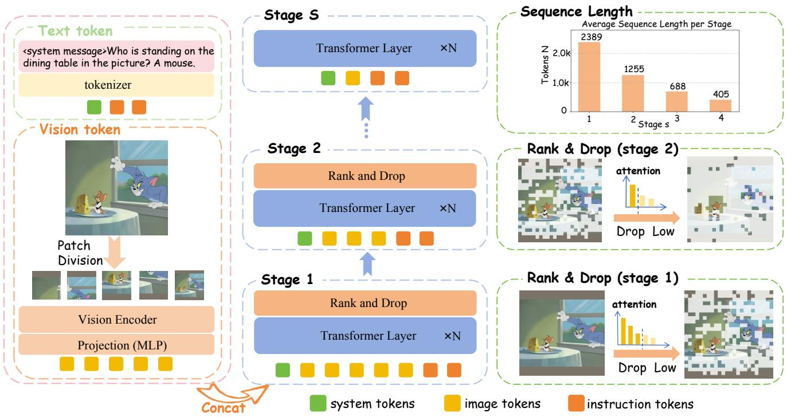

# 3. Method

> 来源: PyramidDrop (CVPR 2025)

---

## 📄 原文

### 3.1 Study of Visual Token Redundancy in LVLMs

> 💡 **3.1 要点预览**: 通过控制变量实验证明"浅层 token 全需要，深层大量冗余"。

The fundamental design of PyramidDrop stems from an intuitive question: are all image tokens necessary for all LVLM layers? To explore it and reveal the nature of LVLMs, we conduct a two-variable experiment by removing different ratios of image tokens at different layers of the LVLM at inference time and observing the benchmark performance change.

> 💡 **批注**: 实验设计很聪明——两个变量：(1) 在哪一层砍；(2) 砍多少比例。交叉实验看性能变化。

In detail, we select LLaVA-v1.5-7B as the base model, and employ a popular LVLM benchmark, TextVQA, as the evaluation data. TextVQA consists of a substantial number of images that contain fine-grained information like text. The questions in TextVQA focus on the textual elements within images, requiring LVLMs to capture the global image information while mining the great detailed visual clues. This characteristic increases the model's sensitivity to image token compression, enabling a more precise evaluation of redundancy.

> 💡 **批注**: 为什么选 TextVQA？因为它对细粒度信息（图里的文字）要求高，如果在 TextVQA 上砍 token 还行，说明这些 token 确实冗余。选择这个 benchmark 提高了实验的说服力。

Considering LLaVA-v1.5-7B consists of 32 layers, we drop varying proportions of image tokens during inference at layer 2, 8, 16, and 24 to assess redundancy at different layers. The ranking of tokens is based on the attention values of text tokens towards image tokens, with the retained image tokens corresponding to those with the highest attention values.

> 💡 **批注**: Token 重要性度量 = 文本 token 对图像 token 的 attention 值。大白话：**文本越关注的图像区域，越重要**。

As illustrated in Figure 1 (left), at layer 2, the LVLMs are sensitive toward token dropping on shallow layers, regardless of the dropping ratio. This indicates most of the image tokens in shallow layers play an important role in providing information for answering the instruction. With the layer increases, the redundancy of image tokens increases rapidly. At layer 16, even preserving only 10% of image tokens will not cause an obvious performance decline. Notably, at layer 24, the model performance is nearly irrelevant to the image tokens, indicating that the model has already captured the necessary image information and the image tokens are redundant for the model now.

> 💡 **批注**: 关键数据点：
> ```
> Layer 2:  保留 50% → 性能大幅下降
> Layer 16: 保留 10% → 几乎不掉
> Layer 24: 保留多少都无所谓
> ```
> 结论：LLM 大约在前半段（layer 1-16）完成图像理解，后半段图像 token 纯属浪费算力。

We further validate our hypothesis with an attention map comparison between different layers. As shown in Figure 1 (right), the LVLM pays attention to most of the image tokens at shallow layers and the attention to different tokens shows a uniform pattern. On the contrary, at the middle of the LVLMs, the attention shows a sparse pattern and mainly focuses on the question related image local parts.

> 💡 **3.1 小结**:
> - 浅层（1-8）：所有 token 都重要，attention 均匀分布
> - 中层（9-16）：冗余开始增加，attention 变稀疏
> - 深层（17+）：绝大多数 token 冗余，attention 高度集中
> - 这个发现为 PyramidDrop 的"渐进式丢弃"提供了理论依据

---

### 3.2 PyramidDrop

> 💡 **3.2 要点预览**: 核心方法——分阶段、渐进式丢弃图像 token，用 attention 评分排名。

Previous research on image token compression drops image tokens before passing them to the language model or uses a fixed compression ratio across all language model layers. However, as we analyzed in Sec 3.1, redundancy is not consistent across different layers. Redundancy of image tokens is relatively minimal in the shallow layers and becomes progressively larger in deeper layers. Thus, uniformly compressing image tokens across layers may lead to the loss of valuable information in the shallow layers while retaining unnecessary redundancy in the deeper layers.

> 💡 **批注**: 一刀切压缩的问题：浅层砍多了丢信息，深层砍少了浪费算力。需要"因层制宜"。

Inspired by this observation, we propose PyramidDrop, which fully leverages layer-wise redundancy to compress image tokens and finally keep important visual concentration.


*Figure 2: PyramidDrop 整体流程图。LLM 分成多阶段，每阶段末丢弃部分图像 token，序列长度快速递减。*

> 💡 **Figure 2 批读**:
> ```
> 输入: Image tokens (V个) + Text tokens
>   │
>   ▼ Stage 1 (Layer 1-8)
>   │ 保留全部 V 个 image tokens
>   │ → 用 attention(last_instruction_token, image_tokens) 排名
>   │ → 丢弃 (1-λ) 比例的低分 token
>   ▼ Stage 2 (Layer 9-16)
>   │ 保留 V×λ 个 token
>   │ → 再次排名 + 丢弃
>   ▼ Stage 3 (Layer 17-24)
>   │ 保留 V×λ² 个 token
>   │ → 再次排名 + 丢弃
>   ▼ Stage 4 (Layer 25-32)
>   │ 保留 V×λ³ 个 token（很少了）
>   ▼
>   输出
> ```
> λ=0.5 时，token 数量: V → V/2 → V/4 → V/8，**金字塔形状**。

---

#### LVLM Pre-fill Formulation

We denote the vision encoder as $\mathcal{V}$, the vision-language projector as $\mathcal{P}$, the language model as $\mathcal{L}$, a pretrained LVLM as $\mathcal{M} = (\mathcal{L}, \mathcal{V}, \mathcal{P})$, where $\mathcal{L} = (\mathcal{L}_0, \mathcal{F})$. The language model consists of tokenizer $\mathcal{L}_0$ and $J$-layer transformer decoder $\mathcal{F}$.

The input of the transformer $\mathcal{F}$ contains both the image tokens $v_0 = \mathcal{P}(\mathcal{V}(v))$ and the text tokens $t_0 = \mathcal{L}_0(T)$.

> 💡 **批注**: 标准 LVLM 流水线：Image → ViT → Projector → image tokens；Text → Tokenizer → text tokens。两者拼接送入 LLM。

During the forward pass of tokens, we can obtain the hidden states $v_j, t_j$ of vision tokens and text tokens in layer $j$:

$$v_j, t_j = \mathcal{F}_j(v_{j-1}, t_{j-1})$$

---

#### Progressive Visual Redundancy Reduction

We partition the language into $\mathcal{S} = \{s_n\}_{n=0}^{S}$ stages, and remove the image tokens $v$ with a pre-defined ratio $\lambda$ at the end of each stage. Formally, with the image tokens $v_{s_n}$ as the input of stage $s_n$, we remove $\lceil(1-\lambda) \cdot |v_{s_n}|\rceil$ tokens from the $v_{s_n}$ and treat the rest image tokens as the next stage input $v_{s_{n+1}}$.

> 💡 **批注**: 大白话——每个阶段结束时，丢掉 $(1-\lambda)$ 比例的 token。λ=0.5 就是每次砍一半。

Following our observation in Sec 3.1, the attention value between image and text tokens could reflect the image token importance properly, so we based on it to realize the drop operation. With the concern of calculation efficiency and training-inference consistency, we calculate the attention between all the image tokens and the **last token of the instruction** (we denote it as $t_j^I$).

> 💡 **批注**: 为什么只用 instruction 的**最后一个 token**？
> 1. **效率**: 只需计算一个 query 和所有 image key 的相似度，复杂度 O(V)
> 2. **有效性**: 最后一个 token 已经通过 causal attention 聚合了整个 instruction 的信息
> 3. **一致性**: 训练和推理用相同的策略
>
> 这个设计很巧妙——用一个 token 代表整个问题的"注意力需求"。

Formally, we denote the last layer of stage $s_n$ as $F_j$, we obtain key states of the image tokens as $k_j^v$ and the query state of last instruction token $q_j^{t_I}$ with the following operation:

$$k_j^v = \mathcal{K}_j(v_j), \quad q_j^{t_I} = \mathcal{Q}_j(t_j^I)$$

where $\mathcal{Q}_j$, $\mathcal{K}_j$ are the query matrix and the key matrix **reused from the self-attention block** of $F_j$.

> 💡 **批注**: 关键细节——Q 和 K 矩阵是**复用**自注意力模块的，不需要额外参数！这意味着：
> - 零额外参数
> - 极小的计算开销（只是从已有的计算中提取 Q、K）

We calculate the similarity with $q_j^{t_I} \times (k_j^v)^T$ and drop part of the image tokens based on the drop ratio $\lambda$. The image token number decreases exponentially stage by stage:

$$V_s = V_0 \cdot \lambda^{s-1}, \quad s = 1, 2, \dots, S$$

> 💡 **批注**: Token 数量指数衰减！λ=0.5、S=4 时：
> ```
> Stage 1: 576 tokens (100%)
> Stage 2: 288 tokens (50%)
> Stage 3: 144 tokens (25%)
> Stage 4: 72 tokens  (12.5%)
> 平均: ~270 tokens（原来的 47%）
> ```

---

#### Efficiency Analysis

> 💡 **效率分析要点预览**: 额外开销极小，节省的计算量很大。

The extra computation cost introduced by PyramidDrop mainly lay in the similarity computing for image token ranking. Benefiting from our design, the calculation is only between a query token and $V_s$ image tokens, so its computation complexity is $O(n)$ and only $S-1$ times in the forward process. Further, we notice the importance of FlashAttention in practice, so we keep using it during training and extract the query and key token from the original forward to calculate our lightweight similarity matrix.

> 💡 **批注**: 额外开销分析：
> - 每次 drop 只需要 1 个 query × V_s 个 key 的内积，O(V_s)
> - 整个前向过程只做 S-1=3 次
> - 相比原来 O(V²) 的 self-attention，这点开销可以忽略

When it comes to the computation cost economized by PyramidDrop. With the consideration of FlashAttn, we roughly define the forward inference cost of a layer with $N$ image tokens as a linear function with a constant factor $c$ that $c \cdot L$, so the overall computation cost of an LVLM with $L$ layers is $c \cdot N \cdot L$. When using PyramidDrop with $S$ stages and the ratio $\lambda$, the overall computation cost is:

$$\frac{1-\lambda^S}{S \cdot (1-\lambda)} \cdot c \cdot N \cdot L$$

For example, if $\lambda = 0.5$ and we reduce the redundancy with 4 stages, it could save nearly **53.2%** computation cost theoretically, and we find this setting has a neglectable performance influence for models in practice.

> 💡 **批注**: λ=0.5, S=4 理论上节省 53.2% 计算量。实际实验也验证了这一点：LLaVA-NeXT 的推理 FLOPs 从 20.8T 降到 9.5T（节省 54%）。

> 💡 **3.2 小结**:
> - **分阶段**: LLM 均分为 S=4 段
> - **渐进丢弃**: 每段结束砍 (1-λ) 比例，token 数指数衰减
> - **排名依据**: instruction 最后 token 的 query 与 image tokens 的 key 的相似度
> - **零额外参数**: Q、K 矩阵复用自注意力模块
> - **兼容 FlashAttention**: 不需要输出完整 attention map

---

## 💡 Method 总结

### 核心算法一览
| 组件 | 设计 |
|------|------|
| 阶段数 S | 4（均分 32 层） |
| 丢弃比例 λ | 0.5（每次砍一半） |
| 重要性度量 | attention(last_instruction_token, image_tokens) |
| 额外参数 | 0（复用 QK 矩阵） |
| 理论加速 | 53.2% FLOPs 减少 |

### 方法优势
1. **简单**: 不需要任何额外模块或训练
2. **高效**: 额外开销 O(V)，可忽略
3. **灵活**: λ 和 S 可调，适应不同需求
4. **通用**: 训练和推理都能用
