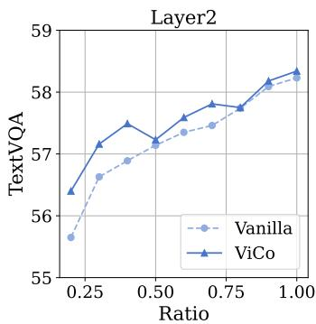
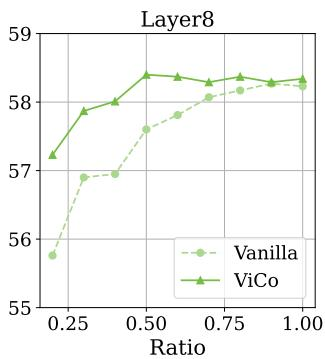
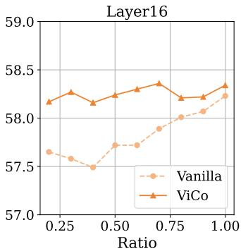
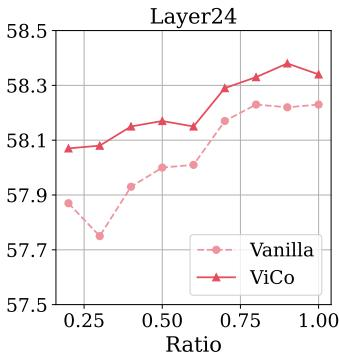

# 4. Experiments

> 来源: PyramidDrop (CVPR 2025)

---

## 📄 原文

### 4.1 Setup

> 💡 **4.1 要点预览**: 两个模型 × 16 个 benchmark × 训练和推理两种场景。

**Models:** LLaVA-1.5-Vicuna-7B (576 image tokens) 和 LLaVA-NeXT-Vicuna-7B (最多 2880 image tokens)。

> 💡 **批注**: 选这两个模型很合理——LLaVA-1.5 是低分辨率基线，LLaVA-NeXT 是高分辨率版本。高分辨率下 token 更多，加速效果更明显。

**Benchmarks:** 16 个评测集，覆盖通用能力（MME, MMBench, SEED）、VQA（VQA-v2, GQA）、高分辨率理解（DocVQA, ChartQA, TextVQA, InfoVQA）等。

**Efficiency Evaluation:**
- 训练效率：真实 GPU 小时数
- 推理效率：图像 token 部分的 FLOPs

> 💡 **批注**: FLOPs 计算公式 = $4nd^2 + 2n^2d + 3ndm$（LLaMA FFN 有 3 个线性层所以是 3ndm）。PyramidDrop 每阶段 token 数不同，所以按阶段累加。

**Implementation:** S=4, λ=0.5, 8×A100 80GB，使用 FlashAttention，基于 Open-LLaVA-NeXT 开源代码。

---

### 4.2 Efficiency of PyramidDrop in Inference

> 💡 **4.2 要点预览**: 纯推理加速，无需重训，PyramidDrop 全面优于 FastV。

#### 对比 FastV（Table 1）

| Model | Strategy | TFLOPS | MME | GQA | TextVQA | SEED^I | Avg |
|-------|----------|--------|-----|-----|---------|--------|-----|
| LLaVA-NeXT-7B | vanilla | 20.8 | 1534 | 64.2 | 67.2 | 71.1 | 70.9 |
| | FastV | 10.6 | 1504 | 63.5 | 66.5 | 69.3 | 70.1 |
| | **PDrop** | **9.5** | **1533** | **63.9** | **67.0** | **70.0** | **70.5** |
| LLaVA-1.5-7B | vanilla | 3.82 | 1511 | 62.0 | 58.2 | 66.1 | 67.5 |
| | FastV | 2.01 | 1474 | 59.4 | 57.2 | 64.0 | 66.4 |
| | **PDrop** | **1.78** | **1501** | **60.1** | **57.6** | **64.3** | **67.1** |

> 💡 **Table 1 批读**:
> ```
> LLaVA-NeXT 推理加速排行:
> ├── PDrop:  9.5T FLOPs, Avg 70.5  ⭐ 最佳性价比
> ├── FastV: 10.6T FLOPs, Avg 70.1
> └── vanilla: 20.8T FLOPs, Avg 70.9
> ```
> **关键发现**:
> - PDrop FLOPs 比 FastV 更低（9.5 vs 10.6），性能还更好（70.5 vs 70.1）
> - PDrop 在 MME 上几乎无损（1533 vs 1534），FastV 掉了 30 分
> - TextVQA 这种需要细粒度理解的 benchmark，PDrop 优势更明显

---

#### 不同压缩率对比（Table 2）

| Method | Avg tokens | MME | Average | Ratio |
|--------|-----------|-----|---------|-------|
| LLaVA-1.5-7B | 576 | 1862 | 69.4 | 100% |
| PDrop | 192 | 1797 | **67.2** | **96.8%** |
| SparseVLM | 192 | 1721 | 66.3 | 95.5% |
| FastV | 192 | 1612 | 62.9 | 90.6% |
| ToMe | 192 | 1563 | 62.0 | 89.9% |
| PDrop | 128 | 1761 | **66.4** | **95.6%** |
| PDrop | 64 | 1561 | **60.8** | **87.6%** |

> 💡 **Table 2 批读**:
> ```
> 192 tokens 时性能保持率排行:
> ├── PDrop:     96.8% ⭐
> ├── SparseVLM: 95.5%
> ├── FastV:     90.6%
> └── ToMe:      89.9%
>
> 压缩到 64 tokens（仅 11% 保留）:
> ├── PDrop:     87.6% ⭐
> ├── SparseVLM: 85.9%
> ├── FastV:     73.7%
> └── ToMe:      70.5%
> ```
> **关键发现**: 压缩越狠，PDrop 的优势越大！64 tokens 时 PDrop 比 FastV 高出 14 个百分点。这说明渐进式丢弃在极端压缩下比一次性丢弃更鲁棒。

---

#### Video LLM 推理加速（Table 6）

| Model | TFLOPS | Avg Acc | Avg Score |
|-------|--------|---------|-----------|
| Video-LLaVA | 14.4 | 58.1 | 3.57 |
| w/ FastV | 7.4 | 58.4 | 3.58 |
| w/ PDrop | **6.6** | 57.9 | 3.56 |

> 💡 **Table 6 批读**: 视频任务上三者差距很小，说明视频帧间冗余很大，随便砍都行。PDrop FLOPs 最低（6.6T vs 7.4T）。

---

#### 可视化分析


*Figure 4: PyramidDrop 各阶段保留 token 的可视化。LLM 逐步聚焦到与 instruction 相关的图像区域。*

> 💡 **Figure 4 批读**:
> ```
> 示例: 问"图片里小物体是什么？"
> Stage 1: 保留全图 token ──── 全局理解
> Stage 2: 砍掉背景区域 ──── 开始聚焦
> Stage 3: 聚焦到物体区域 ── 精准定位
> Stage 4: 只剩核心 patch ── 回答问题
> ```
> 验证了 PyramidDrop 不是随机砍，而是**精准地保留了与问题相关的视觉信息**。

---

### 4.3 Efficiency of PyramidDrop in Training

> 💡 **4.3 要点预览**: 训练也能大幅加速，高分辨率场景提速更多。

#### 训练加速（Table 3 & 4）

| Model | Strategy | #Patch | GPU hours | Reduced | Avg (General) | Avg (HR) |
|-------|----------|--------|-----------|---------|---------------|----------|
| LLaVA-NeXT-7B | vanilla | 5 | 366 | 0% | 67.6 | 63.0 |
| | PDrop | 5 | 218 | **40.4%** | 67.5 | 62.6 |
| | vanilla | 9 | 483 | 0% | 66.8 | 63.5 |
| | PDrop | 9 | 269 | **44.3%** | 67.4 | **64.4** |
| LLaVA-1.5-7B | vanilla | 1 | 104 | 0% | 63.2 | - |
| | PDrop | 1 | 79 | **24.0%** | 63.9 | - |

> 💡 **Table 3&4 批读**:
> ```
> 训练加速排行:
> ├── LLaVA-NeXT-p9 + PDrop: 44.3% 加速 ⭐ (图越大加速越多)
> ├── LLaVA-NeXT-p5 + PDrop: 40.4% 加速
> └── LLaVA-1.5 + PDrop:     24.0% 加速 (图小加速少)
> ```
> **惊人发现**: LLaVA-NeXT-p9 + PDrop 只用 269 GPU hours，比 vanilla p5 的 366 hours 还少！但性能更好（64.4 vs 63.0 on HR benchmarks）。
> 
> 大白话：**用 PyramidDrop，花更少的钱训更高分辨率的模型，还能获得更好的效果。**

---

#### 对比其他训练加速方法（Table 5）

| Method | Avg tokens | GPU hours | TextVQA | POPE | SQA | MMB |
|--------|-----------|-----------|---------|------|-----|-----|
| LLaVA-1.5-7B | 576 | 104 (100%) | 58.2 | 85.9 | 66.8 | 64.3 |
| Q-Former | 288 | 88 (84.6%) | 44.4 | 67.2 | 66.9 | 53.8 |
| FastV | 306 | 81 (78.0%) | 58.4 | 85.2 | 69.5 | 65.6 |
| LLaVolta | 339 | 93 (89.4%) | 58.3 | 85.6 | 69.6 | 63.6 |
| **PDrop** | **270** | **79 (76.0%)** | **58.5** | **86.0** | **71.0** | **66.1** |

> 💡 **Table 5 批读**:
> ```
> 训练效率 vs 性能排行:
> ├── PDrop:   79h, 性能最佳 ⭐⭐
> ├── FastV:   81h, 性能接近
> ├── Q-Former: 88h, 性能暴跌（尤其 POPE 67.2）
> └── LLaVolta: 93h, 性能中等
> ```
> **Q-Former 为什么这么差？** 因为它在 LLM 之前就把 576 tokens 压到 288，丢失了大量细粒度信息（TextVQA 44.4 vs 58.5）。

---

#### PyramidDrop 训练鼓励紧凑表示（Figure 3）





*Figure 3: PDrop 训练的模型能把关键信息压缩到更少的 token 中。蓝线 = vanilla，橙线 = PDrop。*

> 💡 **Figure 3 批读**:
> ```
> 在相同保留比例下，PDrop 训练的模型性能始终高于 vanilla:
> ├── Layer 2:  差距小（浅层都差不多）
> ├── Layer 8:  PDrop 开始领先
> ├── Layer 16: PDrop 明显领先
> └── Layer 24: PDrop 优势更大
> ```
> **深层含义**: PDrop 训练迫使模型学会把重要信息"压缩"到少数 token 中，形成更紧凑的表示。这是一种有益的"正则化"效果。

---

#### Video LLM 训练加速（Table 8）

| Model | GPU hours | Avg Acc | Avg Score |
|-------|-----------|---------|-----------|
| Video-LLaVA | 183 | 58.1 | 3.57 |
| w/ PDrop | 132 | 57.9 | 3.56 |

> 💡 **批注**: 视频训练减少 27.8% 时间，性能几乎不变。视频帧间冗余大，PDrop 效果显著。

---

### Ablation Studies

#### λ 的影响（Table 7）

| Model | λ | GPU hours | Reduced | DocVQA | InfoVQA | Avg |
|-------|---|-----------|---------|--------|---------|-----|
| LLaVA-NeXT | vanilla | 366 | 0% | 70.0 | 33.3 | 63.5 |
| | 0.4 | 204 | 44.3% | 66.6 | 31.8 | 62.6 |
| | **0.5** | **218** | **40.4%** | **69.0** | **31.7** | **62.8** |
| | 0.6 | 240 | 34.4% | 69.8 | 33.0 | 63.1 |

> 💡 **Table 7 批读**:
> ```
> λ 选择指南:
> ├── λ=0.4: 最快（44.3%加速），但 DocVQA 掉 3.4 分
> ├── λ=0.5: 平衡之选 ⭐（40.4%加速，一般 benchmark 几乎不掉）
> └── λ=0.6: 最稳（34.4%加速），高分辨率 benchmark 最好
> ```
> 一般任务对 λ 不敏感，但细粒度文档理解（DocVQA）在 λ=0.4 时明显下降。推荐 λ=0.5。

#### Stage S 的影响（Table 9，附录）

| S | GPU hours | GQA | SEED^I | TextVQA |
|---|-----------|-----|--------|---------|
| vanilla | 104 (100%) | 62.0 | 66.1 | 58.2 |
| 3 | 85 (62.2%) | 62.0 | 66.1 | 58.4 |
| **4** | **79 (76.0%)** | **61.9** | **65.5** | **58.5** |
| 5 | 75 (78.9%) | 61.4 | 65.5 | 57.8 |

> 💡 **批注**: S=3 和 S=4 差距极小，S=5 开始掉分。选 S=4 是最优平衡点。S=32（极端情况）意味着第 1 层后就开始砍，等于回到了 FastV。

---

## 💡 Experiments 总结

### 核心结论
1. **推理加速**: PDrop 比 FastV FLOPs 更低、性能更好，压缩越狠优势越大
2. **训练加速**: 40%+ 训练时间减少，性能不降
3. **高分辨率红利**: token 越多加速效果越明显，甚至"更快+更好"
4. **超参鲁棒**: λ∈[0.4,0.6], S∈[3,5] 都能工作，推荐 λ=0.5, S=4
5. **紧凑表示**: PDrop 训练的模型学会把信息压到更少 token 中

### 对我们研究的启示
- 高分辨率 LVLM 几乎"免费"地获得 40% 加速，值得在 STAR-Pro 等项目中尝试
- "渐进式丢弃"思路可以推广到其他 token 压缩场景
- λ=0.5, S=4 是开箱即用的好配置
