[← 返回 README](../README.md)

# 4. Experiment

## 📌 预览
实验分三大部分：Setup（模型/Benchmark/效率评估指标）、推理加速效果（4.2）和训练加速效果（4.3），涵盖 16 个 benchmark，验证 PyramidDrop 在不同模型和场景下的有效性。

---

## 4.1. Setup

> 💡 **4.1 要点预览**: 实验设置概览 — 模型、Benchmark 和效率评估方法。

**Models** We verify the effectiveness and generalization of the proposed PyramidDrop by experiment on LVLMs with different architectures and input resolution. In detail, we study LLaVA-1.5-Vicuna-7B [31], LLaVA-NeXT-Vicuna-7B [30]. LLaVA-1.5 is the most widely used open-source LVLM backbone for research, which is designed with a simple yet effective architecture that maps the 576 image features from the CLIP encoder as the LLM input with a projector. LLaVA-NeXT is the high-resolution extension of LLaVA-1.5, which supports at most 2880 image tokens and has better high-resolution capability.

> 💡 **批注**: 两个基准模型：
> - **LLaVA-1.5**：576 image tokens（标准分辨率）
> - **LLaVA-NeXT**：最多 2880 image tokens（高分辨率，最多 4 个 local patch + 1 个 global patch）
> 
> 覆盖了标准和高分辨率两种场景。

---

**Benchmarks** To thoroughly evaluate our image token compression strategy, we conduct experiments across 16 benchmarks. The MME Benchmark [14] assesses the perception and cognitive abilities of LMMs. MMBench and MMBench-CN [33] are benchmarks that manually craft questions to evaluate vision-related reasoning and perception in both English and Chinese, respectively. SEED [22], generated with the aid of GPT-4, comprises a dataset of approximately 19,000 questions pertaining to images and videos. MM-Vet [51] leverages GPT-4 for a six-dimensional evaluation of LMM capabilities. In the realm of traditional VQA benchmarks, such as VQA-v2 [17] and VizWiz [18], are also utilized. Additionally, several benchmarks featuring higher-resolution visual content, including DocVQA [39], ChartQA [38], InfographicVQA [40], and TextVQA [44]. Finally, MMStar [7] presents tasks with strong visual dependency, minimal data leakage, and requires sophisticated multimodal capabilities.

> 💡 **批注**: 16 个 benchmark 分类：
> - **通用能力**：MME, MMBench, MMBench-CN, SEED, MM-Vet, MMStar, AI2D, POPE, ScienceQA
> - **高分辨率/OCR**：DocVQA, ChartQA, InfoVQA, TextVQA, OCRVQA
> - **传统 VQA**：VQA-v2, VizWiz, GQA

---

**Efficientness Evaluation** We consider both the training time efficiency evaluation and inference time throughout. For training efficiency, we report the real training GPU hours with the same devices. For inference throughout, we follow the FastV[9] and report the FLOPs of the image token part. In detail, we consider the FLOPs of the multihead attention and the feed-forward network modules as $4nd^2 + 2n^2d + 2ndm$, where $n$ is the number of tokens, $d$ is the hidden state size, and $m$ is the intermediate size of the FFN. Considering there are three linear layers in FFN of LLaMA, the FLOPs is modified as $4nd^2 + 2n^2d + 3ndm$. Our PyramidDrop has different image token numbers at different stages and the FLOPS could be calculated by:

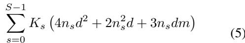

s.t. $n_s = \lambda^s n, \quad s = 0, 1, 2, \ldots, S-1$

> 💡 **批注**: FLOPs 计算考虑了每个 stage 不同的 token 数量。LLaMA 的 FFN 有 3 个线性层（gate/up/down），所以是 3ndm 而非 2ndm。

---

**Implementation details** Given that the LLM within the LVLM used in our experiments consists of 32 layers, we employ a straightforward approach by fixing $S$ to 4, effectively dividing the LLM into four equal parts. This segmentation allows the forward pass to be divided into four stages, with the number of image tokens decreasing exponentially at each stage. During accelerated training, we can adjust the value of $\lambda$ to control the proportion of image tokens that are pruned, and by default, $\lambda = 0.5$. We conduct all the experiments on 8 NVIDIA A100 80GB GPUs.

It is important to note that, we apply FlashAttn [13] during both training and inference as we don't need to output full attention map. And since the LLaVA-NeXT model's data and training code are not open-source, we conduct training based on the open-source project Open-LLaVA-NeXT [28]. Due to differences in a portion of the training data, the benchmark performance may vary compared to that of LLaVA-NeXT [30] blog.

> 💡 **批注**: 实现细节要点：
> - S=4, λ=0.5（默认配置）
> - 8×A100 80GB
> - 使用 FlashAttn，不需要输出完整 attention map
> - LLaVA-NeXT 基于 Open-LLaVA-NeXT 复现（数据有差异）

---

## 4.2. Efficiency of PyramidDrop in Inference

> 💡 **4.2 要点预览**: PyramidDrop 作为 plug-and-play 推理加速策略，在多个模型和 benchmark 上优于 FastV。

**PyramidDrop outperforms SOTA methods as a inference-only strategy.** As illustrated in Table 1, we directly apply the multi-stage compression strategy during the inference phase of the vanilla model, comparing it with the inference acceleration approach, FastV. The results on LLaVA-Next demonstrate that our method outperforms FastV across various critical benchmarks. Specifically, we achieve an impressive score of 1533.0 on MME, surpassing FastV by 1.5%, while also exceeding it by 0.4% on GQA. Notably, the advantages of our method is also pronounced in high-resolution benchmarks. For instance, on the relatively challenging TextVQA, our approach outperforms FastV by 0.5%, and on SEED-Bench (Image), we achieve improvements of 0.7%.

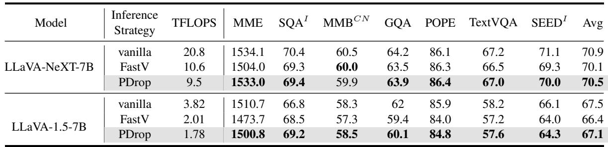
*Table 1. Inference acceleration performance. We compare PyramidDrop, FastV and vanilla model, and find PyramidDrop outperforms FastV on almost all benchmarks. PyramidDrop here is as an inference-only strategy for LVLMs. The highest score is denoted in bold.*

> 💡 **Table 1 批读**:
> - **LLaVA-NeXT-7B**: PDrop (9.5T FLOPs) vs FastV (10.6T) — PDrop 更快且性能更好
>   - MME: 1533 vs 1504, TextVQA: 67.0 vs 66.5, SEED: 70.0 vs 69.3
> - **LLaVA-1.5-7B**: PDrop (1.78T) vs FastV (2.01T) — 同样更快更好
> - 关键：PDrop 不仅 FLOPs 更低，性能也更好 → 渐进式丢弃优于一次性丢弃

---

Results from LLaVA-1.5 reveal similar trends across multiple benchmarks, including MME, ScienceQA, and MMBenchCN, where our method not only demonstrates superior performance but also achieves a greater reduction in FLOPs. When compared to the baseline, our approach consistently reaches comparable performance levels across most benchmarks, while effectively mitigating information loss in high-resolution benchmarks. These findings indicate that FastV's premature compression of image tokens leads to inevitably image information loss and significant performance declines in many benchmarks, whereas our multi-stage compression strategy preserves critical information from image tokens while maximizing the elimination of redundancy. The observation is also consistent with our finding in Sec 3.1 that in shallow layers, most image tokens are critical for LVLMs to understand the image properly, while in deep layers, most of them are redundant for LVLMs. We also compare PyramidDrop with three baseline methods: ToMe[3], FastV, and SparseVLM [54] in Table 2 with different image tokens.

> 💡 **批注**: FastV 在第 2 层就丢弃 token → 过早压缩 → 信息丢失。PyramidDrop 渐进式压缩 → 保留关键信息 → 性能更好、FLOPs 更低。

---

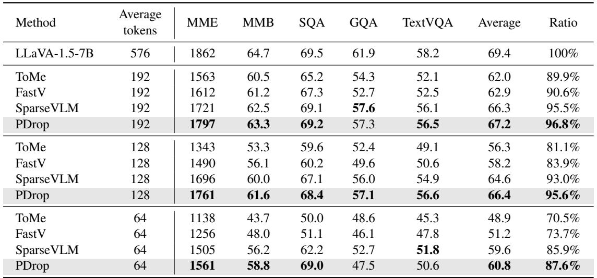
*Table 2. Compare PyramidDrop with other efficient inference strategies with different image tokens. By retaining an average of 192, 128, and 64 image tokens, PyramidDrop achieves SOTA results, demonstrating its ability to deliver optimal performance at lower compression ratios.*

> 💡 **Table 2 批读**:
> - 在不同压缩程度下（192/128/64 平均 token），PyramidDrop 均为 SOTA
> - **192 tokens**: PDrop 96.8% vs SparseVLM 95.5% vs FastV 90.6% vs ToMe 89.9%
> - **64 tokens**（极端压缩）: PDrop 87.6% vs SparseVLM 85.9% vs FastV 73.7%
> - PyramidDrop 在极端压缩下优势更明显 → 渐进式丢弃的鲁棒性

---

**Efficient inference on Video LLMs.** Table 6 shows the results of using PyramidDrop as an inference-only strategy to accelerate LVLM inference. We perform zero-shot question answering on TGIF, MSVD, and MSRVTT, and the results indicate that both accuracy and score are comparable to those of the vanilla Video-LLaVA model. This demonstrates that our strategy, along with FastV, can achieve performance on par with the vanilla model. Notably, PyramidDrop achieves lower inference FLOPs by progressively eliminating redundant elements, which contributes to its efficiency. This result also suggests that the video understanding task is relatively simple, with substantial redundancy between frames. Thus, even an aggressive token-pruning strategy does not significantly impact performance, and final accuracy remains largely unaffected. In the future, further exploration is needed to improve the efficiency of video models in handling more complex visual question-answering tasks. The redundancy between frames differs significantly from that between individual images, necessitating specialized designs to effectively compress this redundancy.

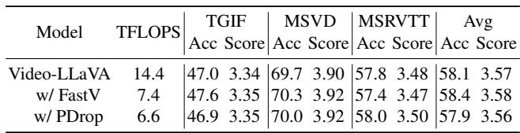
*Table 6. Inference acceleration on video-LLMs. GPT-Evaluation Results on Video Question Answering Tasks are reported. We apply PyramidDrop as an inference-only strategy to vanilla Video-LLaVA.*

> 💡 **Table 6 批读**:
> - Video-LLaVA: 14.4T → PDrop 6.6T（54% 减少），性能几乎不变
> - 视频任务帧间冗余很大，token 压缩效果显著
> - 但作者指出：简单视频 QA 的冗余大，复杂任务可能需要专门设计

---

**LVLM with PyramidDrop effectively preserves image tokens related to instruction.** As shown in Figure 4, we visualize the image tokens retained by LLaVA-1.5 with PyramidDrop in different stages. It is evident that when the user asks about a small object in the image, the LLM accurately identifies the region containing the relevant information based on the instructions and provides the correct answer. This demonstrates that PyramidDrop effectively leverages the LLM's nature to understand images. The token dropping applied during inference in PyramidDrop does not lead to a loss of valuable information; on the contrary, PyramidDrop gradually selects the core patches in the image, concentrating on the most important regions. As presented in the picture, PyramidDrop helps to accurately locate big or little objects in image.

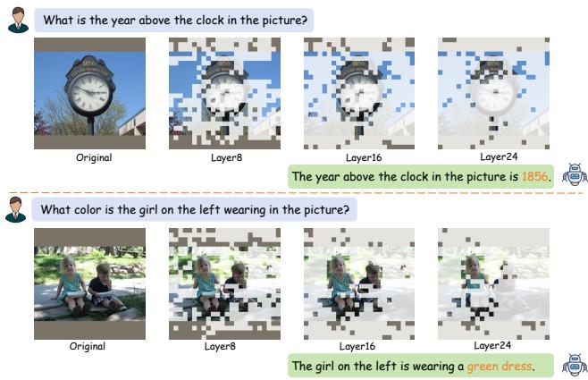
*Figure 4. Visualization of token dropping in LLM of LLaVA-1.5 with PyramidDrop. PyramidDrop helps to accurately retain image tokens according to instruction and gradually concentrate on important image patches without information loss.*

> 💡 **Figure 4 批读**:
> - 可视化展示了 PyramidDrop 在各 stage 保留的 token 对应的图像区域
> - 随着 stage 推进，保留的 token 越来越集中在与问题相关的区域（如小物体）
> - 说明 LLM 利用 instruction 信息准确选择了重要的视觉 token

---

## 4.3. Efficiency of PyramidDrop in Training

> 💡 **4.3 要点预览**: PyramidDrop 训练加速实验 — 多种模型配置、与其他训练策略对比、更高分辨率、视频模型、以及消融实验。

**Effective for diverse settings.** We first study the PyramidDrop on both LLaVA-1.5 and LLaVA-Next. To further validate the effectiveness of our method, we conduct comparisons using the identical training recipe as LLaVA-1.5-7B [29] with three other baselines: Q-Former [25], FastV [9], and LLaVolta [5]. As shown in Table 3, PyramidDrop reduces the training time (including both pretraining and fine-tuning stages) of the LLaVA-Next from 366 to 218 GPU hours, resulting in an impressive 40% reduction in overall time. Besides the promising efficiency improvement, the model's performance remains comparable to the original on 16 different benchmarks. Notably, for fine-grained benchmarks like TextVQA, DocVQA, and OCRVQA, images contain a large amount of text and even documents, which request a dense and fine-grained understanding of the image. Even in this case, our approach still maintain performance at the original level. This indicates that our method successfully compresses redundant information while preserving the most critical image content.

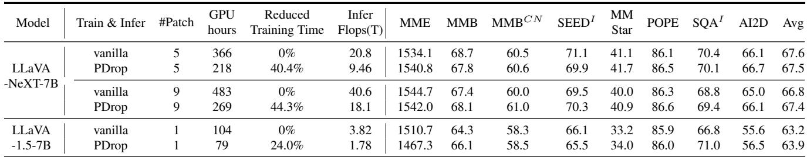
*Table 3. PyramidDrop greatly accelerate LVLM training while keeping the general multimodal abilities on 8 popular LVLM benchmarks.*

> 💡 **Table 3 批读**:
> - **LLaVA-NeXT-7B (p5)**: 366→218 GPU hours（-40.4%），Avg 67.6→67.5（几乎无损）
> - **LLaVA-NeXT-7B (p9)**: 483→269 GPU hours（-44.3%），Avg 66.8→67.4（反而更好！）
> - **LLaVA-1.5-7B**: 104→79 GPU hours（-24%），Avg 63.2→63.9（也更好）
> - p9（更高分辨率）加速比更大，因为 image/text token 比例更高

---

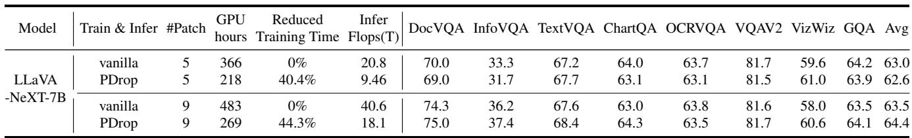
*Table 4. PyramidDrop greatly accelerate LVLM training while keeping abilities on other 8 high-resolution benchmarks.*

> 💡 **Table 4 批读**:
> - 高分辨率 benchmark 上的详细结果
> - LLaVA-NeXT p9 + PDrop：DocVQA 75.0 vs vanilla 74.3，InfoVQA 37.4 vs 36.2 → **更好**
> - 说明过多冗余 token 反而会干扰模型，PyramidDrop 去冗余后反而提升性能

---

In the case of LLaVA-1.5, which processes fewer image tokens per sample, the acceleration is not as pronounced as with LLaVA-NeXT. However, it still offers a nearly 20% improvement in speed with comparable performance. This underscores the potential of our method to enhance training efficiency across different model configurations.

> 💡 **批注**: 加速比与 image/text token 比例正相关。LLaVA-1.5（576 tokens）加速 ~24%，LLaVA-NeXT-p9（5184 tokens）加速 ~44%。

---

**Higher resolution at a lower cost.** The PyramidDrop is proposed to reduce the redundancy within image tokens, and as we observed above, it enjoys higher speedup with the increase of the image/text token ratio. In this part, we explore its performance with higher image/text token ratio. In detail, LLaVA-NeXT is designed with a flexible image processing strategy in which an image is divided into a maximum of four local patches and a global patch, leading to at most 2880 image tokens. We denote it as LLaVA-NeXT-p5 and experiment on the LLaVA-NeXT-p9 by increasing the maximum local patches into 8 patches.

As shown in Table 4, with the increased image/text ratio, PyramidDrop reaches a higher speedup that only 269 GPU hours is used for training, which is only 55% of the vanilla LLaVA-Next-p9. Besides the superb speedup, the model trained with PyramidDrop achieves a slightly higher average performance across the 16 benchmarks. We argue too many image tokens with redundant information may confuse the LVLMs and hinder their performance, while our PyramidDrop efficiently reduce the image tokens number and helps the LVLM to focus on the critical information. Furthermore, it is worth noting that the training time is even 70% of the original LLaVA-Next-p5 but achieves better performance on diverse tasks, showcasing the superb efficiency and effectiveness of PyramidDrop.

> 💡 **批注**: 重要发现 — **更高分辨率 + PyramidDrop < 原始分辨率的训练成本**。LLaVA-NeXT-p9 + PDrop 训练只需 269h，比原始 p5 的 366h 还少，但性能更好。这是非常有实用价值的结论。

---

**PyramidDrop training encourages compact image understanding.** Then we dive into the properties of the model trained with PyramidDrop and conduct experiments to investigate the changes in image token redundancy. Two models are employed for this exploration: the vanilla LLaVA-1.5 and the LLaVA-1.5 trained with our approach. As illustrated in Figure 3, we plot the TextVQA scores against the retained image tokens at layers 2, 8, 16, and 24, maintaining the same experimental settings as Sec 3.1. We find that the curve of models trained with PyramidDrop keeps higher than the vanilla one. The phenomenon suggests that, for a given proportion of retained image tokens, model trained with PyramidDrop preserves more image information and achieves better performance. Alternatively, at equivalent performance levels, our method allows for a higher ratio of image tokens to compress. This improvement can primarily be attributed to the multi-stage training strategy, which progressively prunes image tokens, encouraging the model to consolidate essential information into a smaller set of tokens, resulting in more densely informative representations.

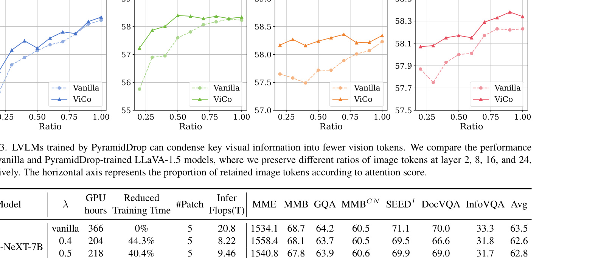
*Figure 3. LVLMs trained by PyramidDrop can condense key visual information into fewer vision tokens. We compare the performance of the vanilla and PyramidDrop-trained LLaVA-1.5 models, where we preserve different ratios of image tokens at layer 2, 8, 16, and 24, respectively.*

> 💡 **Figure 3 批读**:
> - PyramidDrop 训练的模型（橙色曲线）在所有层、所有保留比例下都比 vanilla（蓝色）性能更高
> - 说明 PyramidDrop 训练迫使模型学会**将关键信息压缩到更少的 token 中**
> - 这是一个额外的好处：不仅训练更快，还让模型学到了更紧凑的表示

---

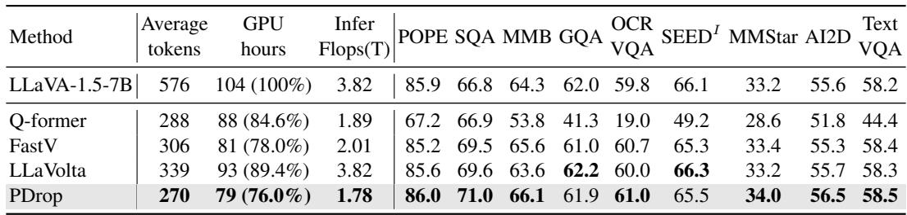
*Table 5. Compare PyramidDrop with other efficient training strategies. Our method achieves the best performance on nearly all benchmarks while also being the most cost-effective strategy.*

> 💡 **Table 5 批读**:
> - PDrop vs Q-Former vs FastV vs LLaVolta（都在 LLaVA-1.5 上）
> - **PDrop**: 79h (76%), 1.78T FLOPs — 训练最快，推理最快
> - **性能**: PDrop 在 POPE (86.0), SQA (71.0), MMB (66.1) 上均最高
> - Q-Former 性能严重下降（POPE 67.2, OCRVQA 19.0）→ 过度压缩
> - LLaVolta 训练慢但推理 FLOPs 未减少（3.82T vs PDrop 1.78T）

---

**Efficient training on Video LLMs.** Despite its success in image understanding tasks, we further investigate the efficiency of PyramidDrop in video understanding tasks. As shown in Table 8, applying our acceleration method on Video-LLaVA reduces the training time from 183 GPU hours to 132 GPU hours, achieving a 27.8% reduction in training time while obtaining comparable results on the video benchmark. We perform zero-shot question answering on TGIF, MSVD, and MSRVTT, yielding relatively similar results. This outcome further underscores that our method is not only suitable for high-resolution models but also applicable to video-based vision-language models, demonstrating the broad applicability of our acceleration approach.

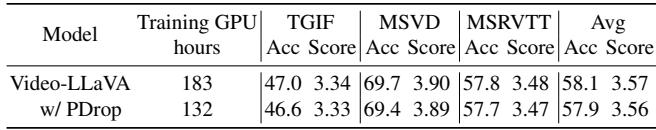
*Table 8. GPT-Evaluation results on zero-shot video question answering Tasks. We apply PyramidDrop to accelerate the training process of vanilla Video-LLaVA model.*

> 💡 **Table 8 批读**:
> - Video-LLaVA: 183→132 GPU hours（-27.8%）
> - 性能几乎无变化（Avg Score 3.57→3.56）
> - 验证了 PyramidDrop 对视频模型同样有效

---

**Ablation Studies** In this part, we mainly study the influence of $\lambda$ on both LLaVA-1.5 and LLaVA-NeXT. Ablation studies about the number of stages S can be found in Appendix. $\lambda$ balances the performance and efficiency of PyramidDrop, a larger $\lambda$ preserves more image information but slows down the training, and a smaller $\lambda$ has higher speedup while may influence the model performance.

As shown in Table 7, we vary the $\lambda$ from 0.4 to 0.6 and report the model performance on both general and high-resolution benchmarks. For the general benchmarks, we observe a relative robust performance among different $\lambda$, this indicates that for most visual questions answering scenarios, our method is relatively robust to different hyperparameter choices, reducing the need for extensive trial and error to identify well-performing hyperparameter. When it comes to the DocVQA, which requires a fine-grained understanding on high-resolution images, the model performance shows a clear decline when the $\lambda$ decreases to 0.4. It is reasonable due to the loss of critical image information and we could anticipate a more pronounced performance decline with the $\lambda$ keeps decreasing. Therefore, we opt for $\lambda = 0.5$, which maintains comparable performance while also yielding a significant reduction in processing time.

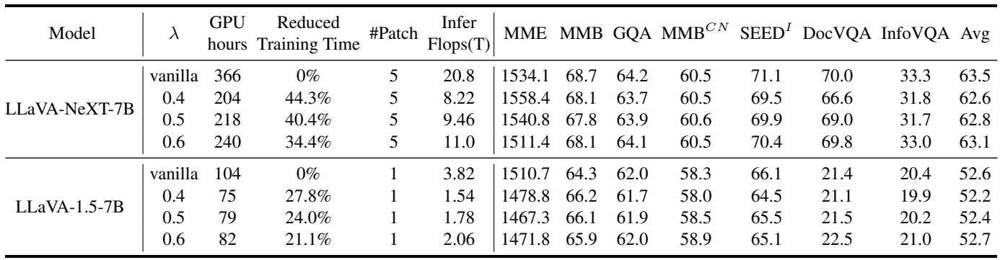
*Table 7. Ablation study results about λ. λ balances the performance and efficiency of PyramidDrop.*

> 💡 **Table 7 批读**:
> - λ=0.4/0.5/0.6 三组实验
> - **通用 benchmark**：λ 变化对性能影响很小 → 方法鲁棒
> - **DocVQA**（细粒度）：λ=0.4 时 66.6 vs vanilla 70.0 → 细粒度任务对压缩更敏感
> - **最佳选择**: λ=0.5（平衡性能和效率）

---

## 🔖 Section 总结

### 关键数字速查
| 指标 | 数值 |
|------|------|
| LLaVA-NeXT-7B 训练加速 | 40.4%（366→218h） |
| LLaVA-NeXT-p9 训练加速 | 44.3%（483→269h） |
| LLaVA-1.5-7B 训练加速 | 24%（104→79h） |
| 推理 FLOPs 减少（NeXT） | 54%（20.8→9.46T） |
| 推理 FLOPs 减少（1.5） | 53%（3.82→1.78T） |
| Video-LLaVA 训练加速 | 27.8%（183→132h） |

### 核心洞察
1. PyramidDrop 作为推理策略，在所有压缩程度下均优于 FastV、ToMe、SparseVLM
2. 训练时 PyramidDrop 不仅加速，还能让模型学到更紧凑的视觉表示
3. 更高分辨率 + PyramidDrop 的训练成本甚至低于原始分辨率，但性能更好
4. 方法对超参数 λ 比较鲁棒，通用任务上 0.4-0.6 差异不大
