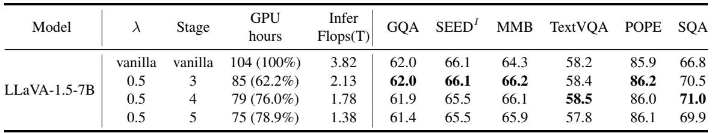

[← 返回 README](../README.md)

# Appendix

## 📌 预览
附录包含关于 Stage 数 S 的消融实验。

---

## B. Ablation Study about Stage S

In this section, we primarily discuss the ablation study of stages $S$. In these experiments, we set $\lambda$ to 0.5, consistent with the previous experiments, and continue to follow the principle of evenly distributing layers within the LLM. If the entire LLM forward process is divided into more stages, the model will remove more image tokens at earlier layers, leaving fewer image tokens in the later layers of the LLM. Conversely, if fewer stages are used, the number of token compression steps during the forward process decreases, resulting in greater redundancy. This parameter is utilized to balance the performance and efficiency of PyramidDrop.

> 💡 **批注**: Stage 数 S 的权衡：S 越大 → 更早开始丢弃 → 更快但可能丢信息；S 越小 → 保留更多冗余 → 更慢但更安全。

---

### B.1. Results Analysis

As shown in Table 9, we vary the number of stages from 3 to 5. Overall, the model's performance remains robust across these changes, demonstrating that our compression strategy is relatively well-designed and not overly sensitive to hyperparameters.

However, on more challenging benchmarks such as SEED Bench and TextVQA, a noticeable performance decline occurs when the number of stages is increased to 5. If stages are further increased, the model's performance clearly deteriorates. This is reasonable because, at the maximum stage setting of 32, PyramidDrop would begin removing half of the image tokens right after the first layer, leaving only 2 image tokens by 8 layer, inevitably discarding critical image information.

Meanwhile, with stages set to 3 or 4, there is no significant performance drop. Therefore, we ultimately select $S = 4$, which strikes a balance between preserving performance and effectively pruning redundancy by concentrating the limited image tokens on the important regions of the image.

> 💡 **批注**: S 的消融结果：
> - S=3/4：性能几乎不降
> - S=5：SEED 和 TextVQA 有明显下降
> - S=32（极端）：第 1 层就开始丢，第 8 层只剩 2 个 token → 性能崩溃
> - **最优选择**: S=4

---

*Table 9. Ablation study results about stages S. This parameter serves to balance the trade-off between the performance and efficiency of PyramidDrop.*

> 💡 **Table 9 批读**:
> - S=3: 85h, 2.13T FLOPs, SEED 66.1, TextVQA 58.4
> - S=4: 79h, 1.78T FLOPs, SEED 65.5, TextVQA 58.5 ← **最佳平衡**
> - S=5: 75h, 1.38T FLOPs, SEED 65.5, TextVQA 57.8 ← 开始下降
> - S=4 相比 S=3 更快（79h vs 85h）但性能几乎不变，是最优选择
