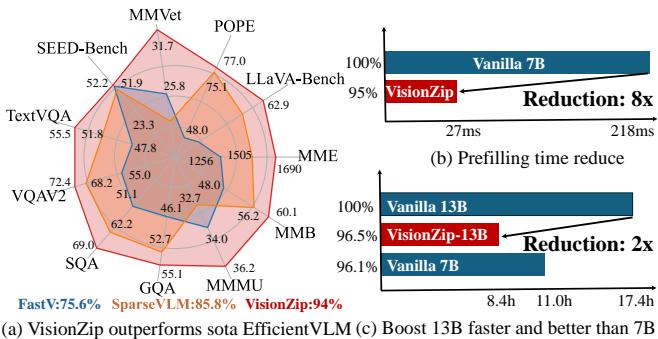
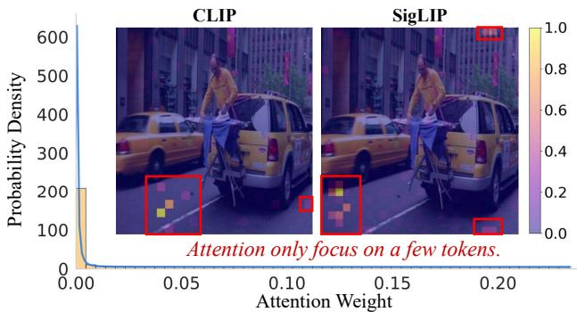

[← 返回 README](../README.md)

# 1. Introduction

## 📌 预览
Introduction 做了三件事：(1) 指出 VLM 视觉 token 过长的问题；(2) 通过 pilot study 揭示冗余现象；(3) 提出 VisionZip 方法概览。

---

Recently, the advancement of Large Language Models (LLMs) [1, 2, 49, 71] has led to significant progress in Vision Language Models (VLMs) [3, 5, 26, 30, 32, 55]. To integrate visual signals with textual semantics, existing VLMs typically utilize sequential visual representation, where images are converted into vision tokens and processed by an LLM decoder. Through modal alignment and instruction tuning, these VLMs adapt LLMs for the vision domain, leveraging their perception and reasoning capabilities.

> 💡 **批注**: VLM 的标准范式：Image → Vision Encoder → Visual Tokens → Projector → LLM。关键问题在于 visual tokens 的数量。

---

However, the promising performance of VLMs largely relies on the large amount of visual tokens. For example, in LLaVA-1.5 [32], the number of visual tokens is 576, and in LLaVA-NeXT [33], a 672x672 image yield more than 576×5 = 2880 tokens, while the text tokens number only in the dozens to just over a hundred. These excessively long visual tokens consume a significant amount of memory and computation in the entire VLM, limiting the model's development in practical application scenarios such as edge computing, autonomous driving, and robotics [22, 35, 40, 56, 58, 59]. Furthermore, based on many previous studies [1, 4, 10, 21], we know that the information contained in images is much sparser than in text. In contrast, the existing state-of-the-art VLMs have far more visual tokens than text tokens. Hence, a natural question arises: "Are all visual tokens necessary?"

> 💡 **批注**: 核心矛盾——图像信息比文本稀疏得多，但视觉 token 数量却远超文本 token（2880 vs ~100）。这就是 VisionZip 的动机。

---

*Figure 1. VisionZip Performance and Efficiency. (a) Our VisionZip significantly outperforms the current SOTA EfficientVLM model, like FastV, SparseVLM, achieving nearly 95% of the performance with only 10% of the tokens across 11 benchmarks on LLaVA-1.5. (b) VisionZip could reduce 8× prefilling time for LLaVA-NeXT 7B. (c) VisionZip reduces GPU inference time by 2× across 11 benchmarks, enabling the LLaVA-NeXT 13B model to infer faster than the 7B model while achieving better results.*

> 💡 **Figure 1 批读**:
> - **(a)** 横轴是保留 token 比例，纵轴是 11 个 benchmark 平均性能。VisionZip 在所有压缩率下都大幅优于 FastV 和 SparseVLM
> - **(b)** Prefilling time 从 ~220ms 降到 ~28ms，加速 7.8×
> - **(c)** 13B+VisionZip 比 vanilla 7B 更快（inference time 更短）且性能更好——这是非常有说服力的

---

To explore this, we conduct a pilot study on the visual tokens generated by the widely used vision encoders, CLIP [41] and SigLIP [63]. As shown in Fig. 2, statistical and visual analysis reveal that only a few tokens receive high attention and contain a large amount of information, while most visual tokens receive minimal attention and aggregate limited information. Based on the observation, we can answer the question that there is a significant amount of redundancy in the visual tokens. Details of this phenomenon's observation and the reasons behind it are provided in Sec. 2.2 and Sec. 4.1, respectively.

> 💡 **批注**: Pilot study 的核心发现——attention 高度集中于少数 token。这为 VisionZip 的 dominant token selection 策略提供了直接依据。

---

*Figure 2. Redundancy Visualization. The visualization and distribution statistics of attention scores show attention concentrated on only a few tokens, while many tokens display very low attention scores, indicating significant redundancy in the visual tokens.*

> 💡 **Figure 2 批读**:
> - 左侧热力图：CLIP 和 SigLIP 的 attention 可视化，红色（高注意力）只集中在极少数位置
> - 右侧直方图：attention 权重分布极度长尾，绝大多数 token 的 attention 接近零
> - 关键洞察：这不是个例，是在 TextVQA validation set 上统计验证的普遍现象

---

Based on this observation, we explore a solution to reduce visual token redundancy, aiming to improve efficiency without sacrificing performance. Specifically, we develop a text-agnostic method named VisionZip to extract more informative visual tokens for the LLM. Our method can be used in training-free, fine-tuning, or training from scratch. Specifically, in training-free mode, we first select the dominant tokens, which receive significant attention and aggregate most of the image information. Then, to avoid missing small but potentially important details, we employ a token merging strategy, merging retained tokens based on their similarity to further extract informative contextual tokens. In fine-tuning mode (in Sec. 2.4), after selecting tokens to replace all raw visual tokens, the input token count decreases significantly, leading to a slight misalignment between the current visual input space and the LLM space. To enhance results and improve alignment, we fine-tune the projector layer for 30 minutes with minimal data, enabling the model to adapt to the reduced token count.

> 💡 **批注**: VisionZip 的两步策略：
> 1. **Dominant Token Selection**: 基于 vision encoder attention 选最重要的 token
> 2. **Contextual Token Merging**: 剩余 token 按相似度合并，避免丢失细节
> 
> 三种使用模式：training-free / fine-tuning (30min) / training from scratch

---

To demonstrate the effectiveness of our method, we apply the proposed VisionZip to popular VLM models and evaluate it on several benchmarks in Sec. 3. As shown in Fig. 1, the results indicate that even in a training-free scenario, our method significantly outperforms previous state-of-the-art methods in both speed and performance. Furthermore, VisionZip can reduce pre-filling time by 8 times while retaining 95% performance in LLaVA-NeXT 7B. The proposed VisionZip also enables LLaVA-NeXT 13B to achieve better performance and faster inference than the LLaVA-NeXT 7B model. Finally, we analyze the causes of the redundancy and explain why the simple, text-agnostic VisionZip achieves better performance than previous methods, highlighting its advantages in real-world deployment like multi-turn conversations in Sec. 4.

> 💡 **批注**: Introduction 的最后一段是 contribution summary。注意"text-agnostic"反复被强调——这是论文最大的卖点之一。

---

## 🔖 Section 总结

### 核心洞察
1. **视觉 token 冗余是普遍现象**：CLIP 和 SigLIP 都存在，不是特定模型的问题
2. **Text-agnostic 是关键差异**：FastV/SparseVLM 依赖 LLM 层的 text-visual attention 来选 token，VisionZip 在 vision encoder 层面直接选
3. **三种使用模式灵活度高**：training-free 已经很强，fine-tuning 30min 可进一步提升

### 关键数字
| 指标 | 数值 |
|------|------|
| LLaVA-1.5 visual tokens | 576 |
| LLaVA-NeXT visual tokens | 2880 |
| Prefilling 加速 | 8× |
| 10% tokens 保留的性能 | ~95% |
