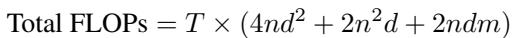
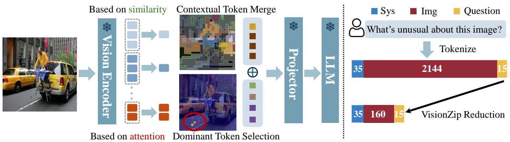
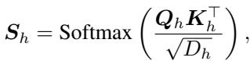
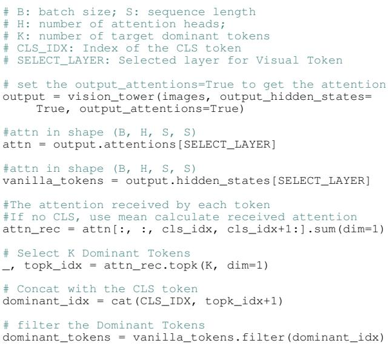

[← 返回 README](../README.md)

# 2. VisionZip

## 📌 预览
Method section 包含五个部分：VLM 架构与计算复杂度分析 → 冗余观测 → Dominant Token Selection + Contextual Token Merging → Efficient Tuning → 应用场景。

---

In this section, we first explain the importance of reducing the number of visual tokens to improve model efficiency in Sec. 2.1, and then present our observation of redundancy in Sec. 2.2. After that, we detail the training-free method in Sec. 2.3. Additionally, to help the model better adapt to variations in visual token length, we introduce Efficient Tuning in Sec. 2.4. Finally, we briefly discuss the widespread usage of VisionZip. The overall architecture is shown in Fig. 3.

> 💡 **Section 概览**: 这段是 Section 2 的路线图。核心贡献在 2.3（token selection + merging），2.4 的 efficient tuning 是锦上添花。

---

## 2.1. Preliminary

> 💡 **2.1 要点预览**: 建立 VLM 计算复杂度的数学框架，论证为什么减少视觉 token 数是关键。

**Architecture of VLM.** The VLM architectures generally consist of three components: a visual encoder, a modality projector, and a LLM. The visual encoder, typically a pre-trained image encoder like CLIP's vision model, converts input images into visual tokens. The projector module aligns these visual tokens with the LLM's word embedding space, enabling the LLM to process visual data effectively. The LLM then integrates the aligned visual and textual information to generate responses.

> 💡 **批注**: 标准 VLM 三件套：Vision Encoder + Projector + LLM。VisionZip 作用在 Encoder 和 Projector 之间。

---

**Computation Complexity.** Evaluating the computational complexity of VLMs requires examining key components such as the self-attention mechanism and the feed-forward network (FFN). The total floating-point operations (FLOPs) can be expressed as:



where $T$ is the number of transformer layers, $n$ is the sequence length, $d$ is the hidden dimension size, and $m$ represents the intermediate size of the FFN.

> 💡 **批注**: FLOPs 公式中，$4nd^2$ 是 FFN 项（与 $n$ 线性），$2n^2d$ 是 self-attention 项（与 $n$ 二次方）。当 $n$ 很大时，二次项主导——这就是为什么减少 $n_{img}$ 如此重要。

---


*Figure 3. Framework of VisionZip. VisionZip selects dominant tokens that aggregate substantial information based on visual token attention scores. Remaining tokens are merged based on semantic similarity to produce contextual tokens. VisionZip is a training-free method significantly reduces the number of image tokens, accelerating inference while maintaining performance. With efficient fine-tuning of the projector, even better results can be achieved with minimal performance loss compared to using the full token.*

> 💡 **Figure 3 批读**:
> - 左侧：Vision Encoder 输出的 attention map，红色高亮区域是 dominant tokens
> - 中间：两步流程——(1) Select dominant tokens (2) Merge remaining → contextual tokens
> - 右侧：dominant + contextual tokens 拼接后送入 Projector → LLM
> - 关键：整个过程发生在 LLM **之前**，所以 LLM 收到的 token 数大幅减少

---

This equation shows that computational complexity is strongly influenced by the sequence length $n$. In typical VLM tasks, the sequence length is defined as $n = n_{sys} + n_{img} + n_{question}$, with $n_{img}$ often being much larger than the other two, sometimes by a factor of 20. Thus, reducing $n_{img}$ is essential for improving the efficiency of VLMs.

> 💡 **批注**: $n_{img}$ 占序列长度的绝对大头（20倍于文本）。减少 $n_{img}$ 是效率优化的最大杠杆。

> 💡 **2.1 小结**:
> - VLM 计算量与序列长度 $n$ 强相关（attention 部分是二次方）
> - $n_{img}$ 远大于 $n_{sys}$ 和 $n_{question}$，是优化重点

---

## 2.2. Redundancy Observation

> 💡 **2.2 要点预览**: 用实验证明视觉 token 冗余的普遍性——大部分 token 几乎不被关注。

In popular Vision Language Models like LLaVA and MiniGemini, the number of vision tokens far exceeds that of text tokens, consuming substantial computational resources. To assess whether all these tokens are necessary, we conducted a pilot study on the visual tokens generated by commonly used vision encoders, CLIP and SigLIP.

Specifically, we randomly sampled one image and visualized the attention of each token from the Vision Encoder's -2 layer, which is the selected layer for obtaining input visual tokens in most VLMs, such as the LLaVA. As shown in Fig. 2, both CLIP and SigLIP exhibit an attention pattern concentrated on a limited number of tokens, while the majority of visual tokens receive minimal attention. Furthermore, to demonstrate that the attention focusing on only a few tokens is a normal phenomenon, we analyze the distribution of attention weights on the TextVQA validation set. As shown in Fig. 2, most visual tokens receive very low attention, with weights close to zero, while only a few tokens hold higher attention weights. To show this phenomenon's prevalence, we include more visualizations in Appendix D.1.

> 💡 **批注**: 为什么用 -2 层？因为大多数 VLM（如 LLaVA）取的就是 vision encoder 倒数第二层的输出作为 visual tokens。最后一层因为要和 CLIP text branch 对齐（contrastive loss），反而不是最好的视觉表示。

---

Based on this observation, we find that most visual tokens with low attention weights contribute little information and add significant redundancy. Only a few visual tokens aggregate a substantial amount of information and merit focused attention; we refer to these as the **dominant visual tokens**. Therefore, to reduce redundancy, we focus on selecting the most informative tokens—such as the dominant visual tokens—while discarding less informative ones to reduce the overall token count.

> 💡 **批注**: "Dominant visual tokens"是本文的核心概念——少数聚集了大量信息的 token。

> 💡 **2.2 小结**:
> - Vision encoder 的 attention 呈极度长尾分布
> - 绝大多数 token 的 attention 接近零，是冗余的
> - 少数 dominant tokens 聚集了几乎所有信息

---

## 2.3. Informative Visual Token Zip

> 💡 **2.3 要点预览**: VisionZip 的核心算法——两步走：(1) 选 dominant tokens (2) 合并剩余 tokens 为 contextual tokens。

### Dominant Token Selection

To reduce redundancy by retaining only the most informative visual tokens and discarding less significant ones, the main challenge is identifying which tokens contribute most to the model's performance. We evaluate the importance of each visual token by examining its attention scores within the vision encoder. Specifically, we calculate the attention score as Eq. 1,



where $S_h$ is the attention score of each head, $D_h$ is the head dimension, and $Q_h$ and $K_h$ represent query and key, respectively. Averaging across the head dimension, yields an aggregated attention matrix Savg ∈ RB×SeqLen×SeqLen, reflecting how each token attends to others.

> 💡 **批注**: 标准的 scaled dot-product attention。关键操作是跨 head 维度求平均得到 Savg。

---

For models with a CLS token, such as CLIP, which aggregates information from the entire image, we leverage the CLS token's attention scores to identify key visual tokens. As shown in Algorithm 1, we select the tokens most attended to by the CLS token, as these typically contain the most relevant information. For models without a CLS token, such as SigLIP, we calculate the average attention each token receives from all others in the sequence. Tokens with higher average attention are considered more significant and retained. We provide the details of it in Appendix A.2.

> 💡 **批注**: 两种策略：
> - **有 CLS token (CLIP)**: 用 CLS 对其他 token 的 attention 排序 → 选 top-K
> - **无 CLS token (SigLIP)**: 用所有 token 对每个 token 的平均 attention → 选 top-K

---


*Algorithm 1: Pseudocode for Dominant Token Selection. cat: concatenation; filter: select the tokens based on the index.*

> 💡 **Algorithm 1 批读**:
> - 输入：vision_tower 的 attention 输出（来自 SELECT_LAYER，通常是 -2 层）
> - 核心步骤：从 CLS token 的 attention 行中取 top-K index → 用 index 筛选 token
> - 非常简洁的实现，几行代码搞定

---

This process allows us to efficiently identify and retain the dominant visual tokens, as shown in Fig. 3, these tokens contain almost all attention and aggregate substantial information of the total tokens.

### Contextual Tokens Merging

Although we have selected dominant tokens by evaluating their significance, and these dominant tokens contain most visual information, we merge the remaining tokens to avoid losing any small but potentially important information. Specifically, during self-attention calculation, the keys (K) already summarize the information contained in each token. Therefore, as shown in Algorithm 2, we first uniformly split the non-dominant tokens into target and merge tokens. We then use a similarity metric, such as the dot product, to identify the keys containing similar information. Finally, we merge the tokens that contain the most similar information, creating contextual tokens. As shown in Fig. 3, these contextual tokens serve as highly informative tokens, containing the figure's semantic similarity information.

> 💡 **批注**: Contextual Token Merging 的核心思路：
> 1. 从剩余 token 中均匀采样 M 个作为 target
> 2. 用 Key 向量的相似度把其他 token 分配到最近的 target
> 3. 按分配关系做平均合并
> 
> 这类似 ToMe (Token Merging) 的思想，但这里用在 VLM 的 vision encoder 输出上。

---

**Algorithm 2: Pseudocode for Contextual Tokens Merging.**

```
# Remove dominant tokens
remaining = vanilla_tokens.mask(dominant_tokens)
# Split into target and merge tokens
# M represents the desired number of contextual tokens
targets, merge = uniform_split(remaining, M)
# Compute similarity based on the key values
similarity = bmm(to_merge.K, targets.K.transpose(1, 2))
# Assign each merge token to the most similar target
assign_idx = similarity.argmax(dim=2)
# Merge by averaging
context_tokens = avg_merge(assign_idx, targets, merge)
```

*uniform_split: Uniformly sample the target tokens, and the rest are the merge tokens; avg_merge: Average merge the tokens based on the assigned indices.*

> 💡 **Algorithm 2 批读**:
> - 用 Key 向量做相似度计算（不用 Value），因为 Key 天然编码了 token 的信息摘要
> - 合并方式是简单的平均，计算开销极低
> - 最终：dominant_tokens + context_tokens 拼接成最终的 visual tokens

> 💡 **2.3 小结**:
> - **Dominant Token Selection**: 基于 attention score 选最重要的 token（CLS attention 或 mean attention）
> - **Contextual Token Merging**: 基于 Key 相似度合并剩余 token，保留细节信息
> - 整个过程在 vision encoder 层面完成，LLM **之前**，因此直接减少 LLM 的输入长度

---

## 2.4. Efficient Tuning

> 💡 **2.4 要点预览**: 可选的 30 分钟 projector fine-tuning，弥补 token 数量骤降带来的 misalignment。

The Informative Visual Token Zip extracts highly informative tokens from the visual encoder and drops other tokens, thereby significantly reducing the token length input to the LLM, potentially by up to tenfold. However, this reduction in visual tokens can lead to a degree of misalignment, as the VLM model, originally trained on all full visual tokens, may struggle to adapt to the sudden decrease.

To bridge the gap between the visual and LLM spaces, we use minimal instruction tuning data to efficiently fine-tune the multimodal projector while keeping other components frozen, enhancing alignment between the vision and language spaces. Notably, the instruction tuning requires only 1/10 of the LLaVA-1.5 dataset and can be completed in just 30 minutes on 8 Nvidia A800 for LLaVA 1.5 7B. Notably, this process can also be implemented on 3090 GPUs, which is both resource-efficient and effective.

> 💡 **批注**: Efficient Tuning 的关键设计：
> - **只 tune projector**，其他组件冻结
> - **数据量极少**：1/10 LLaVA-1.5 数据
> - **时间极短**：30 min on 8×A800，3090 也能跑
> - 本质上是让 projector 适应"更少但更精的" visual tokens

---

## 2.5. Usage of VisionZip

The VisionZip can adapt to multiple tasks, not only for image and video understanding in Vision-Language Models but also for multi-turn conversations that previous efficient VLMs could not handle. Additionally, VisionZip is easy to implement as it is text-agnostic, enabling compatibility with all existing LLM algorithms for acceleration. Furthermore, VisionZip can be seen as a plug-and-play method for vision encoders, which preserves over 90% of the original model's performance while saving 3 times runtime and memory. It can even allow a 13B VLM to achieve greater efficiency than a 7B VLM while maintaining superior performance. We will show more details in Sec. 4.3.

> 💡 **批注**: VisionZip 的三大优势总结：
> 1. **Multi-turn friendly**: text-agnostic → KV cache 中的 visual tokens 不依赖特定 question
> 2. **兼容性强**: 可与量化、KV cache 压缩等所有 LLM 加速技术叠加
> 3. **Plug-and-play**: 不改模型架构，直接插在 vision encoder 后面

---

## 🔖 Section 总结

### 关键数字速查
| 指标 | 数值 |
|------|------|
| LLaVA-1.5 配置 | 54 dominant + 10 contextual = 64 tokens |
| Token 压缩比 | 最高 10× (576→64 或 2880→160) |
| Efficient Tuning 数据 | 1/10 LLaVA-1.5 |
| Efficient Tuning 时间 | 30 min (8×A800) |

### 核心洞察
1. VisionZip 在 LLM **之前**减少 token——这是与 FastV/SparseVLM 最根本的区别
2. Dominant tokens 选取基于 vision encoder 的 attention，而非 LLM 的 text-visual attention
3. Contextual token merging 用 Key 向量相似度，计算开销极低
4. Efficient tuning 只需极少资源即可弥补 misalignment
