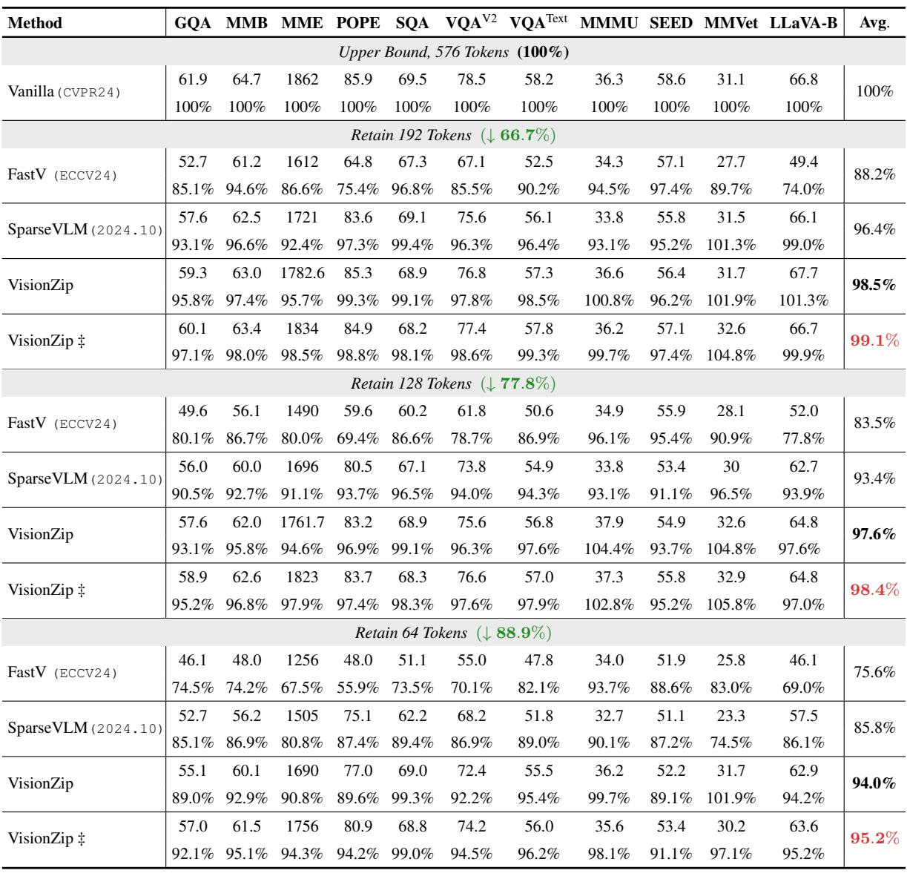
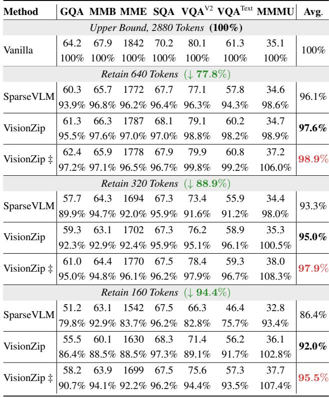
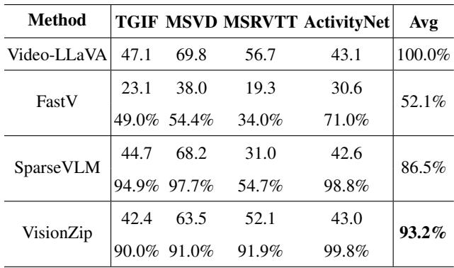
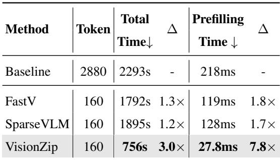

[← 返回 README](../README.md)

# 3. Experiments

## 📌 预览
实验分三部分：(1) 图像理解——LLaVA-1.5/NeXT/Mini-Gemini 上 11 个 benchmark；(2) 视频理解——Video-LLaVA 上 4 个 benchmark；(3) 效率分析——prefilling time 和总时间。

---

## 3.1. Effectiveness on Image Understanding

> 💡 **3.1 要点预览**: 在 LLaVA-1.5、LLaVA-NeXT、Mini-Gemini 三个模型家族上验证，VisionZip 在所有压缩率下全面超越 FastV 和 SparseVLM。

### Evaluation Tasks

To show the effectiveness of our method on image understanding tasks, we conduct experiments on eleven widely used benchmarks [11, 13, 19, 25, 28, 32, 36, 38, 45, 60, 62] and compare our method with the existing sota methods, FastV [6] and SparseVLM [65], which progressively reduce the number of visual tokens in the LLM forward process based on attention weights. To further validate the generalizability of our method, we conduct experiments on various VLM with different architectures and resolutions. Due to space limitations, we present only a subset of results for LLaVA-1.5 [32], LLaVA-NeXT [33], and Mini-Gemini [30] in the main text and all results and implementation details can be found in Appendix B.

> 💡 **批注**: 对比方法是 FastV (ECCV24) 和 SparseVLM (2024.10)——两者都是在 LLM forward 过程中基于 text-visual attention 逐步剪枝的 text-relevant 方法。

---

### Results on LLaVA 1.5

As shown in Table 1, we deploy the proposed VisionZip on LLaVA-1.5 and demonstrate its performance on image understanding tasks. VisionZip represents our method being directly applied during the inference stage without additional training. VisionZip‡ denotes an efficient tuning for the cross-modality projector, requiring approximately 30 minutes on 8 A800 GPUs. This tuning can also be implemented on 3090 GPUs, making it both resource-efficient and effective. To comprehensively assess performance, we present the results in percentage format for comparative analysis, with the vanilla model's accuracy serving as the 100% upper limit. Following the setup in [6, 65], we use three vision token count configurations (192, 128, and 64) to evaluate the advantages of our proposed VisionZip. When the visual tokens are reduced from 576 to 192, VisionZip only decreases the average accuracy by 1.5% without additional training, surpassing FastV [6] by 10.3% and SparseVLM [65] by 2.1%, respectively. Furthermore, when only 64 tokens remain, our method outperforms FastV [6] and SparseVLM [65] by a significant margin of 18.4% and 8.2%, respectively. Additionally, VisionZip‡, which efficiently tunes the cross-modality projector, provides further performance improvements. As shown in Table 1, even with only 64 visual tokens retained, this efficient tuning boosts performance to 95.2%, representing only a 4.8% decrease compared to the vanilla method using 10 times the visual tokens.

*Table 1. Performance of VisionZip on LLaVA 1.5. The vanilla number of visual tokens is 576. The first line of each method shows the raw benchmark accuracy, and the second line is the proportion relative to the upper limit. The last column is the average value. VisionZip‡ indicates that fine-tuning the multimodal projector with 1/10 LLaVA-1.5 datasets, which takes 30 minutes for 8A800 GPU.*

> 💡 **Table 1 批读**:
> - **576→192 tokens (↓66.7%)**: VisionZip 98.5%, FastV 88.2%, SparseVLM 96.4%
> - **576→128 tokens (↓77.8%)**: VisionZip 97.6%, FastV 77.8%, SparseVLM 93.4%
> - **576→64 tokens (↓88.9%)**: VisionZip 94.0%, VisionZip‡ 95.2%, FastV 69.0%, SparseVLM 85.8%
> - 亮点：MMMU 和 MMVeT 上压缩后反而**性能提升**！说明冗余 token 可能是噪声
> - VisionZip‡ 的 efficient tuning 在极端压缩下提升显著（94.0% → 95.2%）

---

An interesting phenomenon is that in certain benchmarks, such as MMVeT and MMMU, using VisionZip to reduce the token count not only prevents performance degradation but also improves performance. We believe the reason is that the visual tokens are overly redundant, and this redundant information not only fails to improve model performance but may also act as noise, impacting the model's judgment and leading to performance degradation. We analyze this phenomenon in Sec. 4.

> 💡 **批注**: 这个现象很有意思——冗余 token 不仅没用，还可能是有害噪声。这与 NLP 中的"less is more"现象类似。

---

### Results on LLaVA-NeXT

To further demonstrate the effectiveness of our proposed VisionZip, we apply it to the more advanced, high-resolution-capable VLM, LLaVA-NeXT. Compared to LLaVA 1.5, LLaVA-NeXT divides the image into four parts, resizes the original image, and converts it into five separate images. Each of these images is processed through the visual encoder to obtain visual tokens, which are then combined. While this approach further improves model performance, it significantly increases the number of visual tokens. Therefore, to enhance efficiency, we aim to use our method to reduce the number of visual tokens as much as possible without compromising model performance. And we set the three vision token count configurations (640, 320, and 160) to evaluate the advantages of our proposed VisionZip. As shown in Table 2, our proposed VisionZip consistently maintains strong performance across three settings. Specifically, using only 640 tokens, our method achieves 97.6% accuracy without any additional training cost. With minimal data used to tune the projector, VisionZip's performance reaches 98.9%, which is very close to that of the vanilla model. Additionally, when the visual token count is reduced to only about 5%, our method still achieves 92.0% performance without any additional training and reaches 95.2% after tuning, surpassing the previous state-of-the-art method, SparseVLM [65], by 5.8% and 9%, respectively. And the full experiment results can be found in Appendix B.

*Table 2. Performance of VisionZip on LLaVA-NeXT. The vanilla number of visual tokens is 2880. For VisionZip‡, we use 1/10 LLaVA-1.5 datasets to fine-tune the multimodal projector.*

> 💡 **Table 2 批读**:
> - LLaVA-NeXT 的 baseline 是 2880 tokens（5×576），压缩空间更大
> - **2880→640 (↓77.8%)**: VisionZip 97.6%, VisionZip‡ 98.9%
> - **2880→160 (↓94.4%)**: VisionZip 92.0%, VisionZip‡ 95.5%, SparseVLM 86.4%
> - 压缩到 5% 的 token 仍保留 92% 性能——说明 LLaVA-NeXT 的冗余更严重

---

### Results on Mini-Gemini

We have verified the effectiveness of our method on the LLaVA Family VLMs, and we further validate our proposed VisionZip on Mini-Gemini, which introduces a LAION-pretrained ConvNeXt-L [37] for high-resolution refinement, to demonstrate VisionZip's effectiveness across different architectures. As shown in Fig. 4, we visualize the performance change across different visual token counts on POPE, TextVQA, and GQA. It can be observed that as the number of tokens decreases, the gap between our method and the previous sota method increases sharply. These results further verify the effectiveness of our method across various model architectures and demonstrate the presence of visual token redundancy across multiple architectures. We discuss in Section 4 why our straightforward and easy-to-implement method VisionZip outperforms previous approaches.

*Figure 4. Performance of VisionZip on the Mini-Gemini.*

> 💡 **Figure 4 批读**:
> - 三个 benchmark 的趋势一致：token 越少，VisionZip 与 baseline 方法的差距越大
> - 说明 VisionZip 在极端压缩下的鲁棒性远好于 text-relevant 方法
> - Mini-Gemini 用的是不同的 encoder 架构（ConvNeXt-L），验证了方法的通用性

---

## 3.2. Effectiveness on Video Understanding

> 💡 **3.2 要点预览**: 视频理解场景下 token 更多（8帧×256=2048），VisionZip 压缩到 136 仍保留 93.2% 性能。

### Evaluation Tasks

We evaluate our method on four common video question-answering benchmarks: TGIF-QA [20], MSVD-QA [54], MSRVTT-QA [54], and ActivityNet-QA [61], where video-question pairs exhibit significant length disparities. We follow the evaluation framework proposed by Video-LLaVA [31], utilizing ChatGPT score as key performance metrics. Further details are provided in Appendix B.

### Results on Video-LLaVA

The vanilla Video-LLaVA [31] uses the Language-bind as vision encoder to encode 8 frames, with each frame containing 256 visual tokens, resulting in a total of 2048 visual tokens. Hence, we set the Video-LLaVA with 2048 video tokens as the upper bound, achieving an overall average accuracy of 100.0% and a score of 0.00. To make a fair comparison, we follow the original settings for the baseline methods FastV [6] and SparseVLM [65], pruning the visual tokens to 135. For each frame, we zip the visual tokens from 256 to 17, resulting in a total of 136 visual tokens for the entire video. As shown in Table 3, our VisionZip in training-free mode achieves 93.2% accuracy across four benchmarks, outperforming the previous state-of-the-art method, SparseVLM, by 6.7%. Moreover, on the largest benchmarks, MSRVTT, our method shows a significant improvement over SparseVLM by 37.2%. Additionally, our method consistently exceeds 90% performance across all benchmarks, further demonstrating VisionZip's effectiveness and robustness.

*Table 3. Performance of VisionZip on Video-LLaVA. The original Video-LLaVA's video token number is 2048, while our VisionZip only retains the 136 tokens.*

> 💡 **Table 3 批读**:
> - **FastV 在视频上崩了**：52.1% 平均，MSRVTT 只有 34%
> - **SparseVLM**: 86.5%，但 MSRVTT 只有 54.7%
> - **VisionZip**: 93.2%，所有 benchmark 都 >90%
> - MSRVTT 上 VisionZip vs SparseVLM: 91.9% vs 54.7%，差距 37.2%——说明 text-relevant 方法在视频场景下严重失效

---

## 3.3. Efficiency Analysis

> 💡 **3.3 要点预览**: VisionZip 不仅性能好，速度也快——因为它在 LLM 之前减少 token，避免了 LLM 浅层的无谓计算。

Our proposed VisionZip reduces the number of visual tokens input to the Large Language Model, resulting in significant efficiency and CUDA memory gains during inference. We conduct a comparative analysis of CUDA memory usage, and pre-filling time on LLaVA NeXT-7B, comparing our method with FastV [6], and SparseVLM [65].

*Table 4. Efficiency analysis of VisionZip on LLaVA-NeXT 7B. The detailed metrics include practical total time for one A800 GPU on POPE, Prefilling time (latency). Δ denotes the reduction ratio.*

> 💡 **Table 4 批读**:
> | Method | Token | Total Time | Prefilling |
> |--------|-------|-----------|-----------|
> | Baseline | 2880 | 2293s | 218ms |
> | FastV | 160 | 1792s (1.3×) | 119ms (1.8×) |
> | SparseVLM | 160 | 1895s (1.2×) | 128ms (1.7×) |
> | **VisionZip** | **160** | **756s (3.0×)** | **27.8ms (7.8×)** |
> 
> - FastV/SparseVLM 的加速有限（1.2-1.3×），因为它们要在 LLM 中 forward 所有 token 的前几层
> - VisionZip 直接从 2880 降到 160 再送入 LLM，prefilling 加速 7.8×

---

As shown in Table 4, we perform an inference efficiency analysis on a single NVIDIA A800-80GB, using POPE [28] dataset a fair comparison. "Prefilling time" refers to the latency required to generate the first token. The results show that our method not only surpasses previous approaches in performance but also maintains a substantial advantage over previous sota methods when reduced to the same number of tokens. On the POPE dataset, our method achieves a 3× improvement in overall time efficiency and a 7.8× improvement in prefilling time compared to the vanilla model.

> 💡 **批注**: "Prefilling time"是第一个 token 的延迟——这对实时应用最关键。VisionZip 在这个指标上的优势是压倒性的。

---

## 🔖 Section 总结

### 关键数字速查
| 实验 | 配置 | VisionZip 性能 | vs SOTA |
|------|------|---------------|---------|
| LLaVA-1.5 | 576→64 | 95.2% (‡) | +9.4% vs SparseVLM |
| LLaVA-NeXT | 2880→160 | 95.5% (‡) | +9.1% vs SparseVLM |
| Video-LLaVA | 2048→136 | 93.2% | +6.7% vs SparseVLM |
| Prefilling | 2880→160 | 27.8ms | 7.8× faster |

### 核心洞察
1. VisionZip 在所有模型、所有压缩率下全面超越 FastV 和 SparseVLM
2. 压缩率越高，VisionZip 的优势越大——text-relevant 方法在极端压缩下崩溃
3. 视频场景下优势尤其明显（MSRVTT 37% gap）
4. 效率优势的根源：VisionZip 在 LLM 之前减少 token，避免浅层无谓计算
