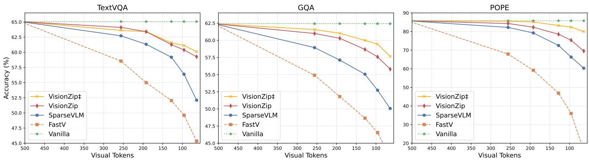

# 3. Experiments

> 来源: VisionZip (CVPR 2025)

---

## 📄 原文

> 💡 **Section 概览**: 实验部分覆盖三大方面——图像理解（3.1）、视频理解（3.2）、效率分析（3.3）。在多种 VLM 架构（LLaVA-1.5, LLaVA-NeXT, Mini-Gemini, Video-LLaVA）上验证。

---

### 3.1 Effectiveness on Image Understanding

> 💡 **3.1 要点预览**: 在 11 个 benchmark 上对比 FastV 和 SparseVLM，三种 token 保留配置（192/128/64），VisionZip 全面领先。

**Evaluation Tasks**: 11 个 benchmark，对比 FastV (ECCV24) 和 SparseVLM (2024.10)。

- FastV/SparseVLM 都是 **text-relevant** 方法：在 LLM forward 过程中根据 text-visual attention 逐步减少 token
- VisionZip 是 **text-agnostic** 方法：在 vision encoder 端一次性压缩

#### Results on LLaVA-1.5

**Table 1: VisionZip on LLaVA 1.5 (vanilla 576 tokens)**

| 方法 | 保留 Token | Avg 性能 |
|------|-----------|---------|
| Vanilla | 576 (100%) | 100% |
| **保留 192 tokens (↓66.7%)** | | |
| FastV | 192 | 88.2% |
| SparseVLM | 192 | 96.4% |
| **VisionZip** | **192** | **98.5%** |
| VisionZip‡ | 192 | 99.1% |
| **保留 128 tokens (↓77.8%)** | | |
| FastV | 128 | 83.5% |
| SparseVLM | 128 | 93.4% |
| **VisionZip** | **128** | **97.6%** |
| VisionZip‡ | 128 | 98.4% |
| **保留 64 tokens (↓88.9%)** | | |
| FastV | 64 | 75.6% |
| SparseVLM | 64 | 85.8% |
| **VisionZip** | **64** | **94.0%** |
| VisionZip‡ | 64 | 95.2% |

> 💡 **Table 1 批读**:
> ```
> 性能排行 (保留 64 tokens):
> ├── VisionZip‡:  95.2% ⭐ (仅丢 4.8% 性能，省 89% token)
> ├── VisionZip:   94.0%
> ├── SparseVLM:   85.8%  (差 VisionZip 8.2%)
> └── FastV:       75.6%  (差 VisionZip 18.4%)
>
> Token 越少，VisionZip 优势越大！
> └── 192 tokens: 领先 SparseVLM 2.1%
> └── 128 tokens: 领先 SparseVLM 4.2%
> └── 64 tokens:  领先 SparseVLM 8.2% ⭐
> ```
>
> **有趣现象**: 在 MMVeT 和 MMMU 上，VisionZip 减少 token 后反而性能 **提升**！
> → 说明冗余 token 不仅没用，还可能是 **噪声**，干扰模型判断。

#### Results on LLaVA-NeXT

**Table 2: VisionZip on LLaVA-NeXT (vanilla 2880 tokens)**

| 方法 | 保留 Token | Avg 性能 |
|------|-----------|---------|
| Vanilla | 2880 (100%) | 100% |
| **保留 640 tokens (↓77.8%)** | | |
| SparseVLM | 640 | 96.1% |
| **VisionZip** | **640** | **97.6%** |
| VisionZip‡ | 640 | 98.9% |
| **保留 160 tokens (↓94.4%)** | | |
| SparseVLM | 160 | 86.4% |
| **VisionZip** | **160** | **92.0%** |
| VisionZip‡ | 160 | 95.5% |

> 💡 **Table 2 批读**:
> ```
> LLaVA-NeXT 的 token 更多 (2880)，压缩空间更大：
> ├── 保留 640 (22%): VisionZip 97.6% → 几乎无损！
> ├── 保留 160 (5.6%): VisionZip 92.0% → 仍超过 90%
> └── VisionZip‡ 160: 95.5% → 比 SparseVLM 高 9%
>
> 结论: 越是高分辨率模型（token 越多），VisionZip 的优势越大
> ```

#### Results on Mini-Gemini


*Figure 4: VisionZip 在 Mini-Gemini 上的表现。随着 token 数减少，VisionZip 和 baseline 的差距急剧增大。*

> 💡 **Figure 4 批读**: 三个 benchmark (POPE, TextVQA, GQA) 一致表明——token 数越少，VisionZip 优势越大。这验证了方法的跨架构泛化性（Mini-Gemini 用 ConvNeXt-L 做高分辨率 refinement，架构不同于 LLaVA）。

> 💡 **3.1 小结**:
> - VisionZip 在 3 种 VLM 架构、11 个 benchmark 上全面优于 FastV 和 SparseVLM
> - token 越少，优势越大（64 tokens 时领先 SparseVLM 8.2%）
> - 冗余 token 可能是噪声，减掉反而提升某些 benchmark 性能

---

### 3.2 Effectiveness on Video Understanding

> 💡 **3.2 要点预览**: 视频任务上 VisionZip 也大幅领先，尤其在 MSRVTT 上比 SparseVLM 高 37.2%。

**Table 3: VisionZip on Video-LLaVA (vanilla 2048 tokens → 136 tokens)**

| 方法 | TGIF | MSVD | MSRVTT | ActivityNet | Avg |
|------|------|------|--------|-------------|-----|
| Video-LLaVA | 47.1 | 69.8 | 56.7 | 43.1 | 100% |
| FastV | 23.1 | 38.0 | 19.3 | 30.6 | 52.1% |
| SparseVLM | 44.7 | 68.2 | 31.0 | 42.6 | 86.5% |
| **VisionZip** | **42.4** | **63.5** | **52.1** | **43.0** | **93.2%** |

> 💡 **Table 3 批读**:
> ```
> 性能排行 (2048 → 136 tokens, 压缩 93.4%):
> ├── VisionZip:   93.2% ⭐ (4 个 benchmark 都 >90%)
> ├── SparseVLM:   86.5%
> └── FastV:       52.1%  (几乎不可用)
>
> 亮点: MSRVTT 上 VisionZip 52.1 vs SparseVLM 31.0
> → 差距 37.2%！说明 text-relevant 方法在视频上严重失效
> ```
>
> **为什么 FastV 在视频上崩了？**
> → FastV 依赖 LLM 中 text-visual attention 来剪 token
> → 视频有 8 帧 × 256 = 2048 个 token，text-visual attention 更稀疏
> → 很容易剪错重要 token

> 💡 **3.2 小结**: 视频场景下 VisionZip 优势更突出，因为视频 token 更多、text-relevant 方法更容易失效。

---

### 3.3 Efficiency Analysis

> 💡 **3.3 要点预览**: VisionZip 不仅性能好，效率提升也远超 FastV/SparseVLM——因为它在 LLM 之前就减少了 token。

**Table 4: Efficiency on LLaVA-NeXT 7B (POPE dataset, single A800)**

| 方法 | Token | Total Time | ↓ | Prefilling | ↓ |
|------|-------|-----------|---|-----------|---|
| Baseline | 2880 | 2293s | - | 218ms | - |
| FastV | 160 | 1792s | 1.3× | 119ms | 1.8× |
| SparseVLM | 160 | 1895s | 1.2× | 128ms | 1.7× |
| **VisionZip** | **160** | **756s** | **3.0×** | **27.8ms** | **7.8×** |

> 💡 **Table 4 批读**:
> ```
> 效率排行 (同样压缩到 160 tokens):
>
> Total Time:
> ├── VisionZip:   756s  (3.0×) ⭐
> ├── FastV:       1792s (1.3×)
> └── SparseVLM:   1895s (1.2×)
>
> Prefilling Time:
> ├── VisionZip:   27.8ms (7.8×) ⭐
> ├── FastV:       119ms  (1.8×)
> └── SparseVLM:   128ms  (1.7×)
> ```
>
> **为什么差距这么大？**
> ```
> FastV/SparseVLM:
> ├── 所有 2880 个 token 先进入 LLM 浅层
> ├── 经过若干层后才开始剪 token
> └── 浅层的计算完全没省！
>
> VisionZip:
> ├── 在 vision encoder 端就压缩到 160
> ├── LLM 所有层都只处理 160 个 token
> └── 全程省计算 ⭐
> ```


*Figure 5: 不同层的 attention 分布变化。浅层分散，中间层开始集中，23 层（-2 层）达到峰值。*

> 💡 **3.3 小结**: VisionZip 在效率上碾压 text-relevant 方法，核心原因是压缩发生在 LLM 之前，避免了 LLM 浅层的无效计算。

---

## 💡 Section 总结

### 关键数字速查
| 实验 | 模型 | Token 压缩 | VisionZip 性能 | vs SparseVLM |
|------|------|-----------|---------------|-------------|
| 图像 | LLaVA-1.5 | 576→64 | 94.0% | +8.2% |
| 图像 | LLaVA-NeXT | 2880→160 | 92.0% | +5.6% |
| 图像 | Mini-Gemini | 576→64 | 92.2% | 大幅领先 |
| 视频 | Video-LLaVA | 2048→136 | 93.2% | +6.7% |
| 效率 | LLaVA-NeXT 7B | 2880→160 | 3.0×总时间 | 远超 1.2× |

### 核心洞察
1. VisionZip 在所有实验设置中全面领先
2. 压缩越激进（token 越少），VisionZip 优势越大
3. 效率提升不仅来自 token 数减少，更来自 **压缩位置在 LLM 之前**
4. 部分 benchmark 上减少 token 反而提升性能（冗余=噪声）
