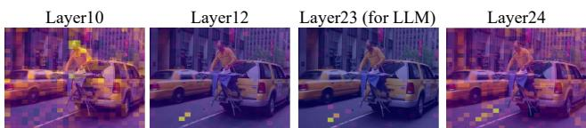
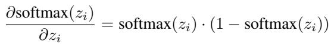
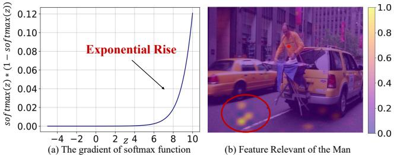
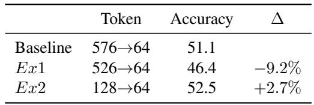
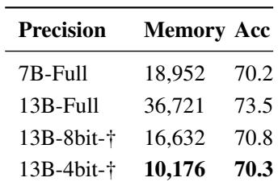
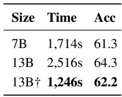
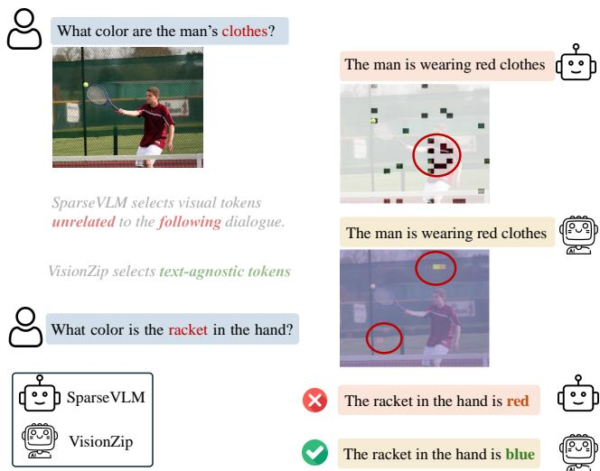

[← 返回 README](../README.md)

# 4. Analysis and Discussion

## 📌 预览
分析部分回答三个问题：(1) 视觉 token 冗余的根本原因是什么？(2) 为什么 text-agnostic 的 VisionZip 反而优于 text-relevant 方法？(3) VisionZip 在实际部署中有什么优势？

---

## 4.1. Reasons of Redundancy in Visual Tokens

> 💡 **4.1 要点预览**: 冗余的根源在于 Transformer 的 self-attention + softmax 机制——随着层深加深，信息自然"shortcut"聚集到少数 proxy tokens。

### Visualization of the Redundancy

Firstly, as shown in Fig. 5, we illustrate attention changes across layers. In early layers, attention is broadly distributed across the image, but by the middle layers, it suddenly converges onto a few tokens. With deeper layers, attention and information concentrate on a small set of dominant tokens, reaching peak concentration by the 23rd layer—used for visual token extraction for the LLM. Notably, attention is more dispersed in the final layer, as these tokens align with the CLIP text branch via contrastive loss, potentially limiting their representation of the original image. This is why VLM selects the second-to-last layer (-2 layer). Additional visualization results are in Appendix D.

*Figure 5. Visualization of attention distribution across layers*

> 💡 **Figure 5 批读**:
> - 从浅层到深层，attention 从均匀分布逐渐聚集到少数 token
> - 第 23 层（-2 层）达到最大集中度——这正是 VLM 取 visual tokens 的层
> - 最后一层 attention 反而分散——因为 contrastive loss 要求与 text branch 对齐
> - 这解释了为什么 VLM 不用最后一层

---

### Explanation

Current vision encoders are based on a transformer architecture that aggregates information between tokens through self-attention. We think that as the layer depth increases, instead of aggregating knowledge from all tokens, the model tends to "shortcut" by concentrating information into a few proxy tokens. If a CLS token is present, the knowledge may further concentrate from these proxy tokens into the CLS token. Moreover, using the function softmax to compute the model's loss can intensify this effect. The derivative of this formula is as:

> 💡 **批注**: softmax 的梯度特性：
> - 当 $z$ 大时，梯度 softmax(z)·(1-softmax(z)) 先增后减
> - 当 $z$ 小时，梯度几乎为零——"穷者愈穷"
> - 这形成正反馈循环：高 attention 的 token 获得更多梯度更新 → attention 更高 → ...
> - 结果：信息不可避免地聚集到少数 token

---

We illustrated this function in Fig. 6 (a), when $z$ is large, the gradient becomes substantial in exponential rise, and when $z$ is small, the gradient is almost negligible. This function makes regions of low attention even lower and high-attention areas even more prominent, ultimately concentrating information into a few tokens. [52] identified a similar phenomenon in LLM inference, naming it "Attention Sink." [43] also observed a comparable effect in semantic segmentation, referring to it as the "global token."

*Figure 6. Reason of redundancy and feature misalignment*

> 💡 **Figure 6 批读**:
> - **(a)** Softmax 梯度曲线：中间区域梯度最大，两端趋近零。这导致 attention 的"马太效应"
> - **(b)** Feature misalignment 示例：与"person"最相关的 visual token 不在人身上，而在路面上（proxy token）
> - 这个 misalignment 正是 text-relevant 方法失效的原因

> 💡 **4.1 小结**:
> - 冗余是 Transformer + softmax 的固有属性，类似 LLM 中的 "Attention Sink"
> - 信息聚集到 proxy tokens，这些 token 可能不在语义上对应的位置

---

## 4.2. Why VisionZip Outperforms Previous Work?

> 💡 **4.2 要点预览**: Text-relevant 方法（FastV/SparseVLM）选的 token 看似与问题相关，但实际信息量不足——因为真正的信息在 proxy tokens 里。

### Text-Relevant Efficient VLM

Existing sota methods for reducing visual redundancy to accelerate VLMs, such as FastV [6] and SparseVLM [65], primarily rely on the LLM to identify text-relevant visual token. Specifically, they feed all visual tokens into the LLM and use attention between text and visual tokens across LLM layers for selection.

### Misalignment Due to the Pre-group Knowledge

While the text-relevant method appears promising, the visual tokens it selects often lack sufficient information. This limitation arises because the visual encoder aggregates visual information into a limited subset of high-attention tokens, leaving the remaining tokens with minimal informational content. As a result, tokens that should represent specific details are instead grouped into proxy tokens, losing their original in-context information. Furthermore, these proxy tokens tend to appear in peripheral or background areas rather than being positioned near the main subjects of the image. For instance, in Fig. 6 (b), the visual tokens most relevant to the person are not located on the person but are instead assigned to a proxy token situated on the road. This indicates that text-relevant methods often select tokens from elements like the man or the taxi, which actually contain significantly less informative content.

> 💡 **批注**: 这是本文最精彩的分析！
> - Vision encoder 的 attention 机制把信息"聚"到少数 proxy token
> - 这些 proxy token 位置往往在边缘/背景区域，不在主体上
> - Text-relevant 方法选的是位置上与 text query 相关的 token → 但这些 token 信息已被抽走
> - VisionZip 选的是 attention 最高的 token → 信息最密集的 token

---

To further verify this, we performed two experiments on the TextVQA benchmark with SparseVLM, retaining 64 tokens, as shown in Table 5. In Ex1, we first masked 50 out of 576 total tokens, selecting the 50 tokens with the highest attention according to the vision encoder. From the remaining 526 tokens, SparseVLM was used to select the final set. This approach reduced performance from 51.1 to 46.4, a drop of approximately 9%. In Ex2, instead of providing all 576 tokens, we only supplied the top 128 tokens selected by VisionZip to SparseVLM, which then filtered down to the final 64 tokens. This approach improved performance to 52.5, an increase of about 2.6%. These results further verify that the text-relevant visual tokens are misaligned with the tokens where the Vision Encoder aggregates knowledge.

*Table 5. Quantitative analysis for the feature misalignment*

> 💡 **Table 5 批读**:
> - **Ex1**: 先去掉 50 个 dominant tokens → SparseVLM 选剩下的 → 性能降 9%
> - **Ex2**: 先用 VisionZip 选 128 个 → SparseVLM 从中选 64 → 性能升 2.7%
> - 结论：如果把信息最密集的 token 去掉，text-relevant 方法选的其余 token 几乎没用
> - 这是对 "feature misalignment" 最有力的实验证明

---

## 4.3. The Advantage of the VisionZip

> 💡 **4.3 要点预览**: VisionZip 的三大部署优势：兼容量化、让 13B 比 7B 更快、支持多轮对话。

### Easy to deployment

Due to VisionZip directly reducing the visual tokens before projecting them into the LLM, rather than gradually reducing them during the LLM forward process, it avoids extensive computation and memory consumption in the LLM's shallow layers. As shown in Table 6, our method is compatible with existing quantization techniques, maintaining performance while minimizing memory usage. Furthermore, our method enables the 13B model to be faster and perform better than the 7B model. As shown in Table 7, our method significantly reduces the inference time of the 13B model, making it twice as fast as the vanilla 13B model and outperforming the vanilla 7B model in both performance and efficiency. Full results across 11 evaluation benchmarks are provided in Appendix B. Additionally, VisionZip is well-suited for integration with LLM acceleration optimization algorithms.

*Table 6. Compatibility of VisionZip on various quantization levels for ScienceQA. † represents use of VisionZip.*

*Table 7. VisionZip boosts the 13B model's performance and efficiency over the 7B model on TextVQA. † represents use of VisionZip.*

> 💡 **Table 6 & 7 批读**:
> - **Table 6**: 13B + VisionZip + 4bit 量化 → 只需 10176MB 显存（vs 7B-Full 的 18952MB），性能相当
> - **Table 7**: 13B + VisionZip 用 1246s（vs 7B vanilla 1714s），更快且 TextVQA 精度更高
> - 实际意义：用 VisionZip 可以在相同硬件上部署更大的模型

---

### Advantage on multi-turn conversations

To better support real-world applications, current VLMs store the previous answer in the KV cache to enable multi-turn conversations, reducing the need to reprocess prior dialogue. However, as shown in Figure 7, prior text-relevant methods are unsuitable for multi-turn conversations. This is because the visual tokens selected and stored in the KV cache are closely related to the previous question but lack relevance to the current dialogue, leading to poor performance in multi-turn scenarios. In contrast, our VisionZip selects the most informative visual tokens in a text-agnostic manner, making it more effective for multi-turn conversations.

*Figure 7. Example comparison of VisionZip and previous text-relevant method in multi-turn conversation*

> 💡 **Figure 7 批读**:
> - **Text-relevant 方法的问题**: 第一轮对话选的 visual tokens 是与 Q1 相关的 → 存入 KV cache
> - 第二轮问不同问题 Q2 → KV cache 里的 visual tokens 与 Q2 无关 → 回答质量骤降
> - **VisionZip 的优势**: 选的 token 是全局信息最丰富的 → 对任何问题都有用 → 多轮对话稳定
> - 这是 text-agnostic 设计的最大实际价值

---

## 🔖 Section 总结

### 核心洞察
1. **冗余的根源**: Transformer self-attention + softmax 梯度特性 → 信息聚集到 proxy tokens（类似 Attention Sink）
2. **Feature Misalignment**: Proxy tokens 位置在边缘/背景，不在语义主体上 → text-relevant 方法选错 token
3. **VisionZip 的实际优势**: 兼容量化 / 13B 比 7B 快 / 多轮对话稳定
4. **方法论启示**: 与其在 LLM 层面做 token pruning，不如在 vision encoder 层面选好 token
