[← 返回 README](../README.md)

# Appendix

## 📌 预览
附录包含：(A) VisionZip 与 text-relevant 方法的详细对比 + Non-CLS encoder 适配；(B) 更多实验（13B、训练模式、Mini-Gemini 完整结果、视频、效率）；(C) 扩展 Related Work；(D) 更多可视化。

---

## A. Further Discussion

### A.1. Comparison with Text-relevant Efficient VLM

We observe that most recent Efficient VLMs [6, 16, 53, 65] utilize attention mechanisms between text tokens and visual tokens to determine which visual tokens should be retained, processing them during the LLM forward. However, our method, VisionZip, removes visual token redundancy before inputting them into the LLM. We will demonstrate our advantages from the following perspectives.

**Better Performance.** As shown in Table 1, 2, 3 of the main paper, our VisionZip achieves better performance in the training-free mode. This is because the Vision Encoder pre-groups the visual information into a few tokens, which often appear in the background or less prominent areas. However, when tokens are selected based on the semantic information of the text, the chosen tokens are often not the dominant tokens and carry less information, resulting in lower performance compared to VisionZip. Additionally, to better demonstrate the misalignment caused by the Vision Encoder's pre-grouping of information, we have created an interactive demo. As shown in Fig. 15, the code for this demo will be published soon.

**More Efficient.** Our method reduces the redundancy of visual tokens before inputting them into the LLM, avoiding the heavy attention computation in the early layers of the LLM (Sec. B.3). Additionally, we observe that previous text-relevant Efficient VLMs require significant intermediate computations to determine which tokens need to be dropped during the LLM forward process. This leads to a noticeable increase in memory usage, sometimes exceeding that of the vanilla model. This issue is particularly evident in models like LLaVA-NeXT, where the number of visual tokens is substantial.

**More Application Scenarios.** VisionZip operates outside the LLM, making it compatible with any existing LLM and applicable to all acceleration algorithms designed for LLMs. Furthermore, VisionZip is better suited for practical applications such as multi-turn conversations and other real-world scenarios.

> 💡 **A.1 批读**: 三个维度全面碾压 text-relevant 方法：
> 1. **性能更好**: 因为选的是信息最密集的 token，不受 feature misalignment 影响
> 2. **效率更高**: 避免 LLM 浅层的无谓计算；text-relevant 方法甚至可能比 vanilla 更费内存
> 3. **场景更广**: 兼容所有 LLM 加速算法 + 多轮对话

---

### A.2. VisionZip for Non-CLS Vision Encoders

Although most popular vision encoders, such as CLIP [41], OpenCLIP, and LanguageBind [70], use the CLS token to aggregate information, a recently introduced vision encoder, SigLIP, does not include the CLS token. To demonstrate the generalization of our proposed VisionZip, we explain how to apply it to Non-CLS Vision Encoders in this section.

Specifically, for the Dominant Token Selection, we first calculate the attention score as shown in Eq. 3,

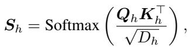

where $S_h$ is the attention score of each head, and $D_h$ is the head dimension, $Q_h$ and $K_h$ represent query and key, respectively. By averaging across the head dimension, we obtain an aggregated attention matrix $S_{avg} \in \mathbb{R}^{B \times SeqLen \times SeqLen}$, which reflects how each token attends to every other token. The above process is similar to that of vision encoders with a CLS token, as described in the main text.

To identify key visual tokens, we calculate the average attention each token receives from all others in the sequence. Specifically, we compute the average along dim=1 of $S_{avg}$ to determine the degree to which each token is attended to by others, representing its importance. Tokens with higher average attention are considered more significant and are retained. We provide the pseudocode in Algorithm 3.

> 💡 **A.2 批读**:
> - **有 CLS (CLIP)**: 用 CLS 行的 attention → top-K
> - **无 CLS (SigLIP)**: 对 attention 矩阵沿 dim=1 求均值 → 得到每个 token 被其他 token 关注的平均程度 → top-K
> - 核心思想一样：选被关注最多的 token

---

## B. Additional Experiments

### B.1. Image Understanding

#### Implementation Details

- **推理**: 单张 NVIDIA A800-80G
- **Fine-tuning**: 8×A800-80G；也可在 8×3090-24G 上完成
- **Token 配置**: 见下表

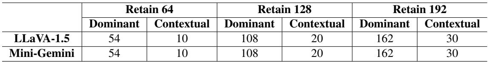
*Table 8. Token number settings for VisionZip in LLaVA-1.5 and Mini-Gemini*

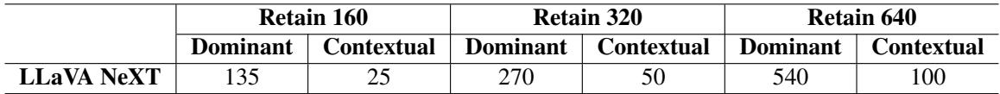
*Table 9. Token number settings for VisionZip in LLaVA-NeXT*

> 💡 **Table 8 & 9 批读**:
> - Dominant : Contextual 的比例大约是 5.4 : 1（如 54:10, 108:20, 162:30）
> - 说明绝大部分保留的 token 是 dominant，contextual 只占一小部分
> - LLaVA-NeXT 每个子图的配置和 LLaVA-1.5 类似

---

#### LLaVA-1.5 13B Results

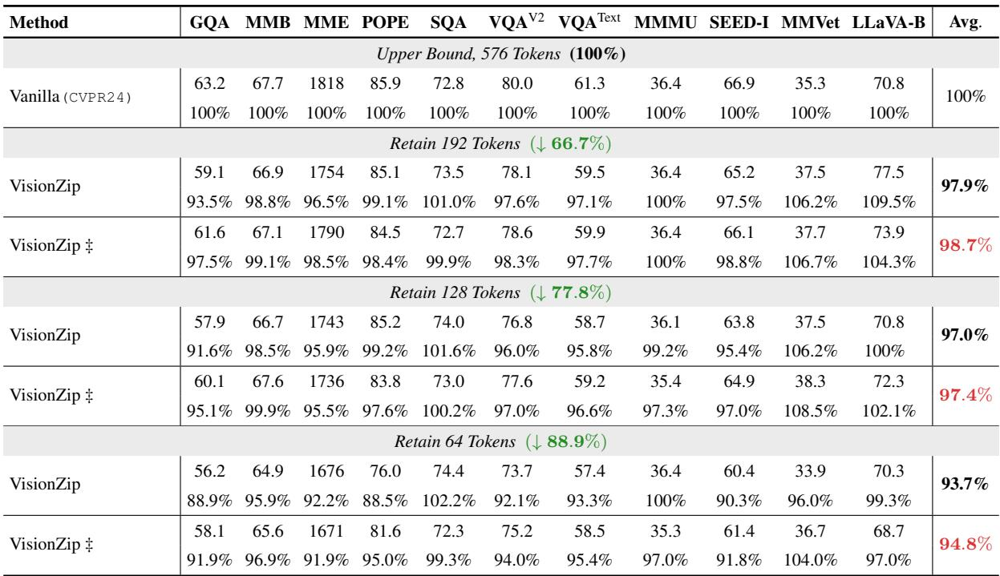
*Table 10. Performance of VisionZip on LLaVA 1.5 13B.*

> 💡 **Table 10 批读**: 13B 模型上效果更好——64 tokens 保留 93.7% (training-free), 94.8% (tuned)。192 tokens 几乎无损。

---

#### Training Stage Results

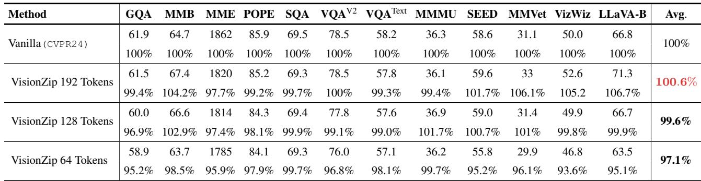
*Table 11. Using VisionZip train the LLaVA 1.5 7B.*

> 💡 **Table 11 批读**: 
> - 192 tokens 训练：性能 100.6%——**超过了** full token 训练！
> - 128 tokens 训练：99.6%
> - 64 tokens 训练：97.1%
> - 说明减少冗余 token 不仅不影响训练，反而可能帮助模型聚焦有用信息

---

#### LLaVA-NeXT Full Results

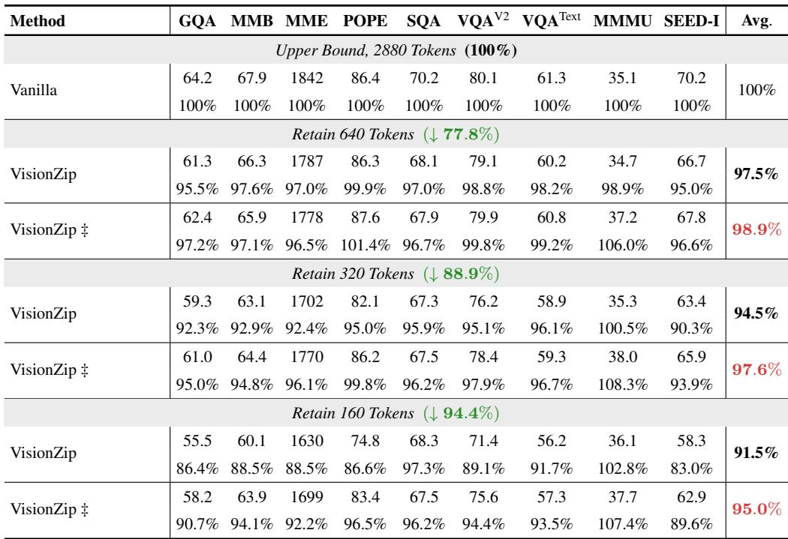
*Table 12. Full performance of VisionZip on LLaVA-NeXT 7B.*

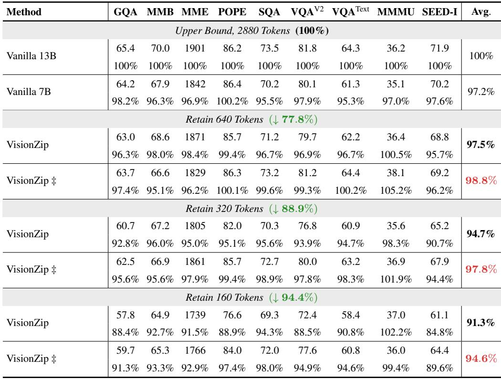
*Table 13. Performance of VisionZip on LLaVA NeXT 13B.*

> 💡 **Table 13 批读**: 13B + VisionZip (640 tokens) 在 training-free 模式下已超过 vanilla 7B (2880 tokens) 的性能。这是"用更大模型+更少 token"策略的有力验证。

---

#### Mini-Gemini Full Results

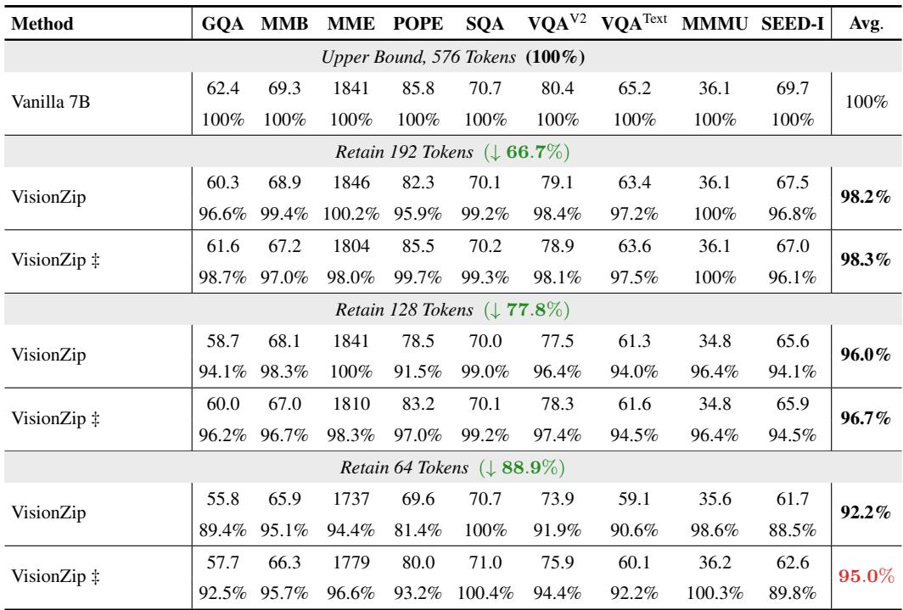
*Table 14. Performance of VisionZip on Mini-Gemini 7B.*

> 💡 **Table 14 批读**: 去掉 88.9% token 后仍保留 92.2% 性能（training-free），fine-tuned 达 95%。

---

#### Ablation: Fine-Tuning Dataset Compatibility

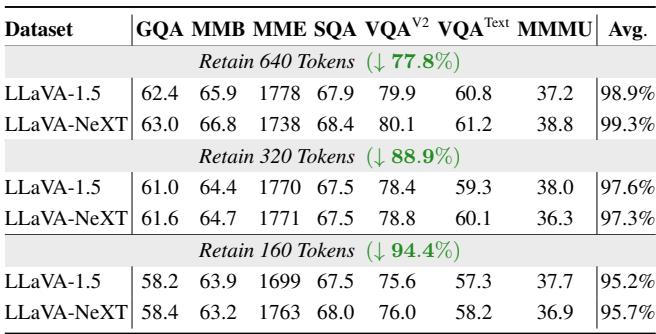
*Table 15. Impact of Fine-Tuning Dataset Compatibility.*

> 💡 **Table 15 批读**: 用 LLaVA-1.5 还是 LLaVA-NeXT 的 1/10 数据来 fine-tune projector，差别不到 0.5%。说明 efficient tuning 的效果来自适应 token 数量变化，而非获取新知识。

---

### B.2. Video Understanding

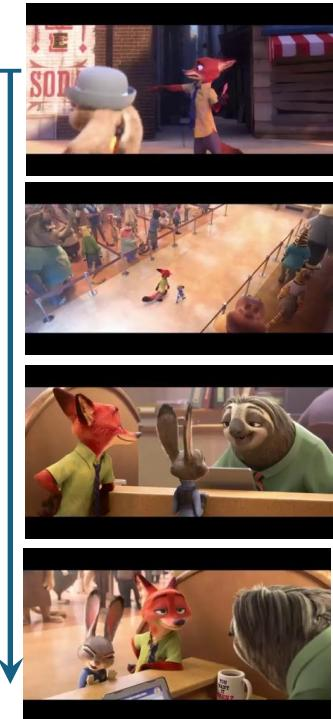

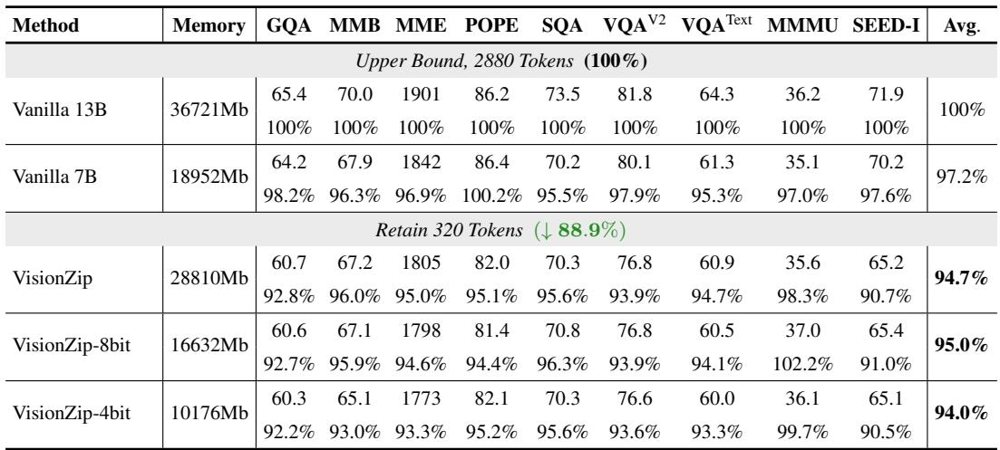
*Figure 8. Advantage of VisionZip in video understanding task. With the same visual token length, using VisionZip allows encoding more frames, significantly enhancing the model's capacity to understand longer video sequences and capture more detailed information.*

> 💡 **Figure 8 批读**:
> - Video-LLaVA 只能编码 8 帧 → 描述笼统
> - VisionZip 同样的 token 预算可编码 10× 帧 → 描述详细（识别出 fox, rabbit, sloth 等细节）
> - 对长视频理解的意义重大：从 1 小时 → 5-10 小时

---

### B.3. Efficiency Analysis

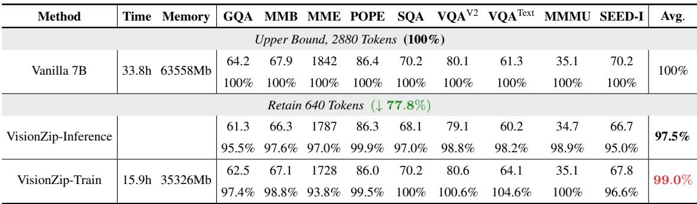
*Table 16 & 17. Performance and Memory/Training Time of VisionZip on LLaVA NeXT.*

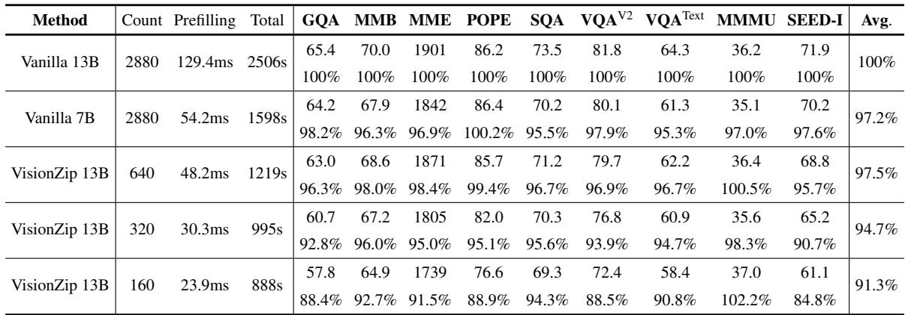
*Table 18. Performance of VisionZip on LLaVA NeXT 13B with inference time.*

> 💡 **Efficiency 批读**:
> - 13B + VisionZip + 8bit → 16632MB（vs 7B-Full 18952MB），可在单卡 A800 上跑
> - VisionZip 训练时间减半（2×），因为 LLM 处理的 token 更少
> - 13B + VisionZip (640 tokens) prefilling 比 vanilla 7B 快

---

## D. Visualization

### D.1. Visualization of Redundancy

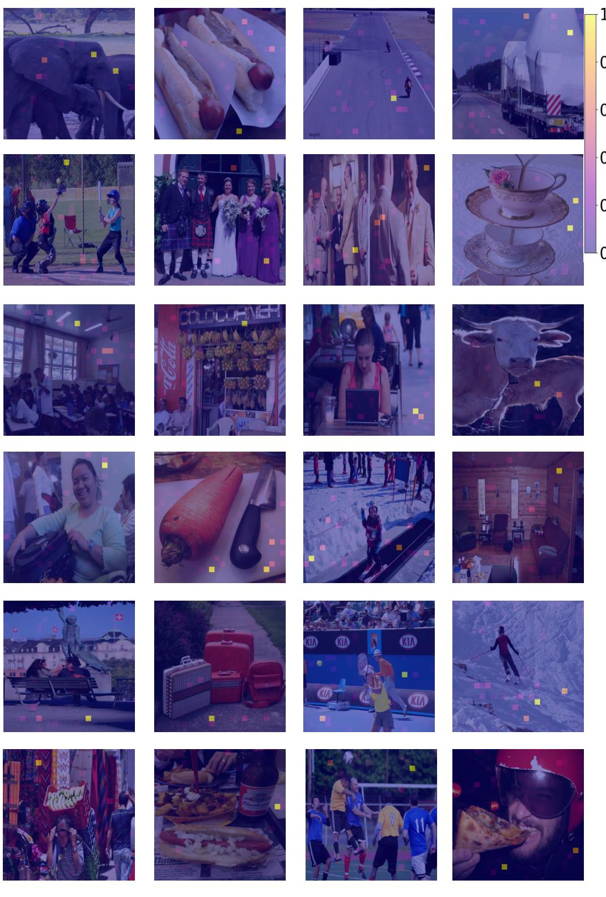
*Figure 9. Visualization of Redundancy in the CLIP Model*

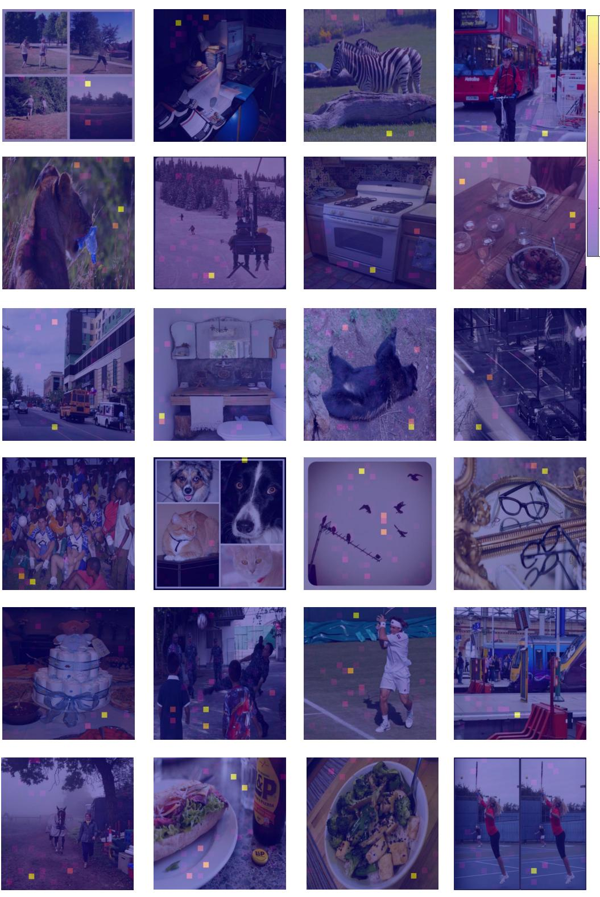
*Figure 10. Visualization of Redundancy in the CLIP Model*

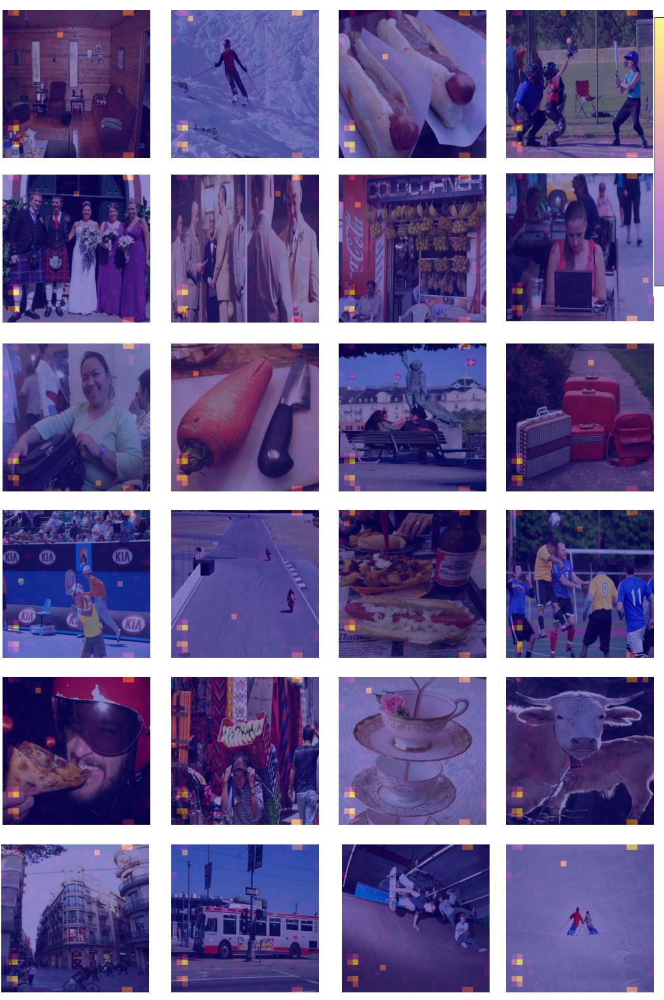
*Figure 11. Visualization of Redundancy in the SigLIP Model*

> 💡 **Figure 9-11 批读**: 多样化的图像上都表现出相同的 attention 集中模式。CLIP 和 SigLIP 都存在，不是特定模型的问题。

---

### D.2. Visualization of Attention Distribution Change

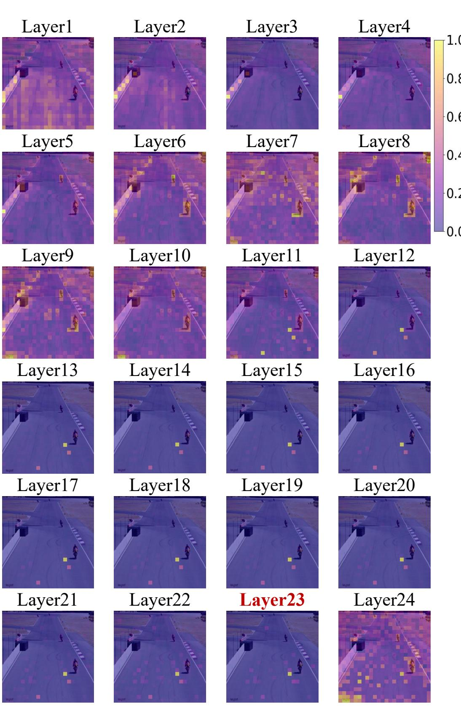
*Figure 12. Visualization of Attention Distribution Change*

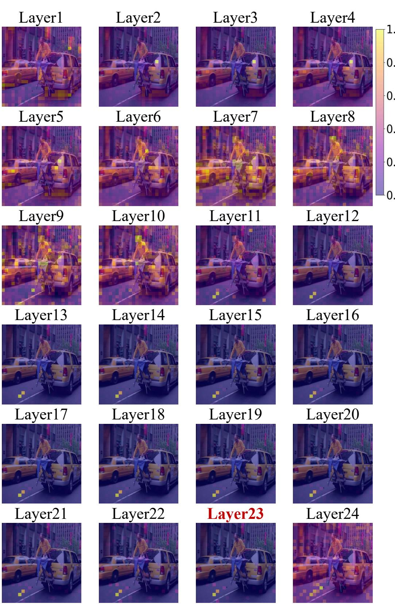
*Figure 13. Visualization of Attention Distribution Change*

> 💡 **Figure 12-13 批读**: 不同图像上 attention 的逐层变化趋势高度一致——浅层分散、中层开始聚集、-2 层最集中。

---

### D.3. Visualization of Feature Misalignment

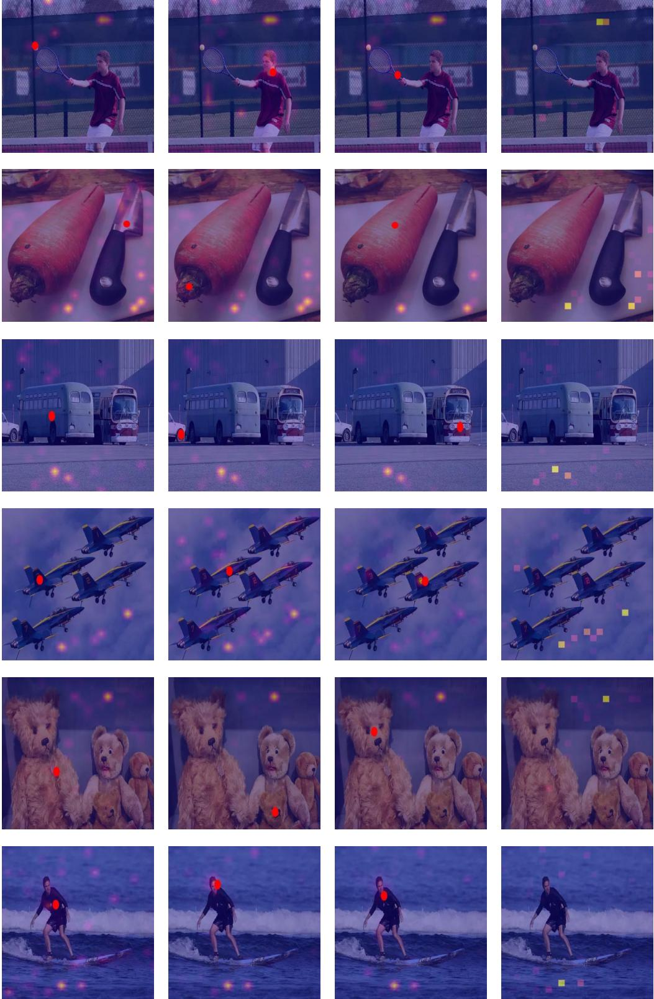
*Figure 14. Visualization of Feature Misalignment. The red point represents the dominant token selected by VisionZip.*

> 💡 **Figure 14 批读**: Dominant tokens（红点）往往不在图像主体上，而在边缘/背景区域——这就是 proxy tokens。但它们聚集了最多的信息，选它们比选"看起来与问题相关的"token 更有效。

---

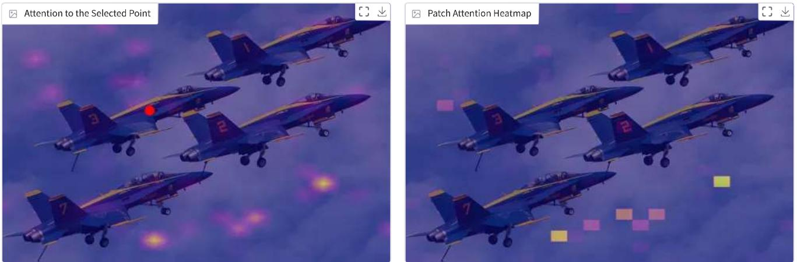
*Figure 15. Gradio demo to analyze the visual redundancy and the feature misalignment.*

> 💡 **Figure 15 批读**: 作者提供了交互式 demo，可以直观地看到 attention 分布和 feature misalignment。

---

## 🔖 Appendix 总结

### 核心洞察
1. VisionZip 对 Non-CLS encoder (SigLIP) 同样有效，只需把 CLS attention 改成 mean attention
2. Training-stage 使用 VisionZip 甚至能提升性能（192 tokens → 100.6%）
3. 13B + VisionZip 在性能和速度上都优于 vanilla 7B——改变了"小模型更快"的传统认知
4. Fine-tuning 的效果来自适应 token 数量变化，而非新知识——1/10 数据足够
5. 冗余现象在 CLIP/SigLIP、不同图像、不同层深上都高度一致
