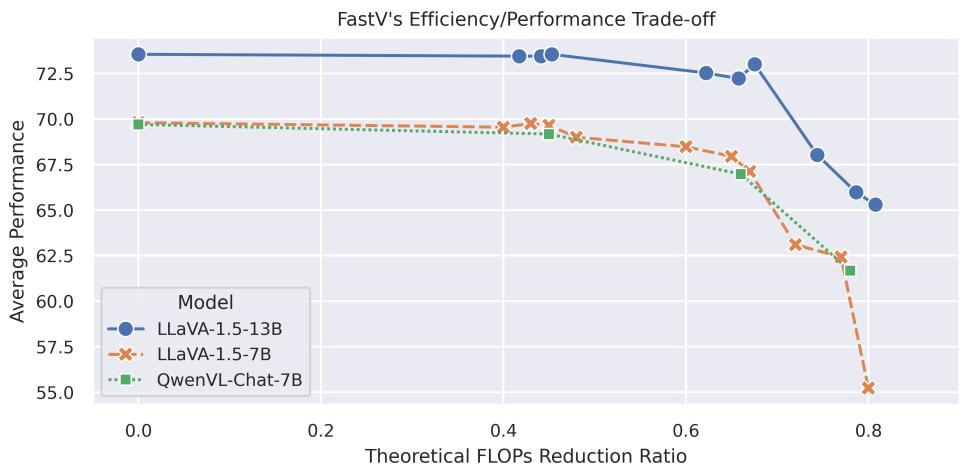

[← 返回 README](../README.md)

# 1 Introduction

## 📌 预览
Introduction 阐述动机（LVLM 处理图像 token 的方式低效）、核心发现（深层 image token 注意力极低）、FastV 方法概述、实验验证、以及三大贡献。

---

Large Vision-Language Models (LVLMs) have become a hit in both computer vision and natural language processing studies. We have witnessed tremendous creative research and applications that are built upon powerful LVLMs Liu et al. (2023c; 2024a); Team et al. (2023); Bai et al. (2023). From describing the given picture to navigating the internet Zheng et al. (2024), using smartphones Wang et al. (2024) and making decisions in the real world Driess et al. (2023); Chen et al. (2024), large language models with vision abilities are reshaping how we interact with AI systems, which cannot be achieved solely by language or vision uni-modal models.

> 💡 **开篇批注**: 开门见山点出 LVLM 的重要性和广泛应用场景（图像描述、网页导航、手机操控、现实决策）。

---

Currently, a majority of popular LVLMs rely on sequential visual representation, where images are transformed into hundreds or thousands of tokens when feeding them to LLM along with language prompts OpenAI (2023); Zhu et al. (2023); Liu et al. (2023c); Zhao et al. (2023); Bai et al. (2023). As LVLMs leverage the advanced emergent capabilities inherent in their language components, they concurrently face a surge in computational complexity, correlating with cost increments. This complexity stems from the principle that the proficiency of Large Language Models (LLMs) is predominantly influenced by their scale. Two critical areas remain under-explored in this context: 1) How do language models process and interpret images? and 2) While the efficient training and inference of LLMs have attracted considerable attention, these dimensions within LVLMs are yet to be thoroughly examined and understood.

> 💡 **问题引出**: 
> - 图像被转化为数百甚至数千个 token → 计算复杂度飙升
> - 两个未充分探索的问题：(1) LLM 如何处理图像？(2) LVLM 的高效推理研究不足

---

In this paper, we uncover the fact that current LVLMs actually apply an inefficient way while processing image information. Specifically, the image tokens receive strikingly lower attention scores compared to their textual counterparts within the token-based LVLMs like LLaVA. The degree of imbalance also varies between the shallow and deep layers. In the image captioning tasks, we observed that within the deep layers (after layer 2) of renowned LVLMs such as LLaVA 1.5, image tokens garner an average attention score that amounts to only 0.21% of the score attributed to system prompts. In contrast, this figure reaches 50% in the initial two layers. These observations raise questions upon the optimal utilization of visual information within LVLMs.

> 💡 **核心发现**:
> - 深层中 image token 的平均注意力分数仅为 system prompt 的 **0.21%**
> - 但在前 2 层中这个比例是 **50%**
> - 说明浅层和深层处理视觉信息的方式完全不同

---

To address the problem, we assume a plausible explanation is that the high redundancy in visual signals leads to the aggregation of image-related, instruction-specific features onto certain "anchor" tokens through the self-attention mechanism in the shallow layers. Notably, these anchor tokens are not image tokens. In deep layers, attentions are focused on those anchor tokens, leading to significantly reduced attention on the image tokens themselves.

> 💡 **解释机制**: 
> - 浅层：视觉信号的冗余信息通过 self-attention 被聚合到某些 "anchor token" 上
> - 这些 anchor token **不是** image token（是 system prompt 等文本 token）
> - 深层：模型主要关注这些 anchor token，不再需要原始 image token

---

The phenomena inspires to propose FastV, a dynamic image tokens pruning method to reduce the inference cost of LVLMs. Our findings suggest an intriguing possibility: Given that image tokens contribute minimally to output generation in deeper layers due to diminished attention, why not consider removing them at these stages? FastV implements an image token pruning strategy at one specific layer of LLM. Prior to this layer, computations proceed as usual. Beyond this selected layer, image tokens are re-evaluated based on their average received attention scores. Tokens falling below a predefined attention score threshold are then selectively discarded in subsequent layers, streamlining the process by focusing on the most impactful tokens.

> 💡 **FastV 核心思路**: 
> - 在第 K 层之前正常计算
> - 在第 K 层根据 attention score 对 image token 排序
> - 剪掉排名靠后的 R% image token
> - 后续层只处理保留的 token

---

Compared to other attention-based methods for accelerating inference, such as sparse attention, FastV's most notable distinction lies in its direct elimination of tokens. This approach not only bypasses the computational demand of the self-attention module but also the Feed-Forward Network (FFN) module in deeper layers. As a result, FastV achieves a great theoretical reduction in FLOPs while maintaining relatively high performance as shown in Figure 1's experiment on LLaVA and Qwen-VL-Chat models. Our experiment on LLaVA-1.5-13B model shows that we can filter out 50% image tokens after layer 2 without sacrificing the average performance on a combination of Vision-Language tasks including captioning tasks like Nocaps Agrawal et al. (2019), Flickr30K Plummer et al. (2015), multimple choice tasks like A-OKVQA Schwenk et al. (2022), MMMU Yue et al. (2023), complex embodied reasoning task like PCA-Bench Chen et al. (2024; 2023), tasks requiring detailed OCR ablitily like OCR-VQA Mishra et al. (2019), more challenging video understanding tasks Jang et al. (2017); Xu et al. (2017a;b) and more fine-grained evaluation like MME Fu et al. (2023), MMVet Yu et al. (2023) and SeedBench Li et al. (2023a). Our latency test experiment on A-OKVQA showed that LLaVA-13B model with FastV could achieve a lower latency than LLaVA-7B model while maintaining superior performance. This result highlights the effectiveness of FastV in balancing the trade-off between speed and accuracy in LVLMs.

> 💡 **FastV vs sparse attention 的关键区别**:
> - Sparse attention 只减少 attention 模块计算
> - FastV **直接删除 token** → 同时减少 attention 和 FFN 的计算
> - LLaVA-1.5-13B: 删 50% image token after layer 2，性能不降
> - 13B + FastV 延迟 < 7B 原始模型

---

*Figure 1: The Efficiency/Performance trade-off curve of FastV. The x-axis stands for the theoretical FLOPs reduction ratio under different FastV configurations. The y-axis stands for performance under different settings, we report the average scores of {Nocaps (Cider), Flickr30k (Cider), A-OKVQA (Acc), MMMU (Acc)}. We can see that FastV can achieve 45% FLOPs reduction with nearly no performance loss for different models.*

> 💡 **Figure 1 批读**:
> - 三条曲线分别对应 LLaVA-7B、LLaVA-13B、QwenVL-Chat-7B
> - 关键拐点：约 45% FLOPs reduction 处，性能几乎无损
> - 超过 45% 后性能开始明显下降
> - Pareto-efficient: 每个模型都有一个"甜蜜点"

---

Researches Liu et al. (2023c); Li et al. (2023e) underscore the significance of enhancing image resolution for the performance of LVLMs. However, it's equally important to note that increased resolution comes with its own challenges, including a rise in the computational costs such as longer image token sequence and inference latency. We also conduct experiments on training LVLM in different image feature resolution by setting pooling layer of different strides. Specifically, with an equal number of image tokens, models equipped with FastV can process higher resolution images, leading to better performance than models limited to lower resolution features. This finding highlights the potential to enhance downstream performance by increasing image resolution without incurring additional inference costs.

> 💡 **分辨率实验启示**: 
> - 高分辨率 + FastV 剪枝 = token 数量不变但信息更丰富
> - 这意味着 FastV 可以"免费"提升分辨率

---

In summary, the contribution of the work are three-folds:

1. Identify and analyze the inefficient visual attention phenomena in prevailing LVLMs.
2. Propose FastV, a plug-and-play method to significantly reduce inference cost for LVLMs without sacrificing performance inspired by our observation.
3. Validate the effectiveness of FastV on a wide range of vision-language tasks across different LVLMs with thorough ablations.

> 💡 **三大贡献总结**:
> 1. 发现问题：LVLM 深层视觉注意力低效
> 2. 提出方案：FastV plug-and-play 剪枝
> 3. 实验验证：多任务、多模型、充分消融

---

## 🔖 Section 总结

### 关键数字速查
| 指标 | 数值 |
|------|------|
| 深层 image token 注意力 vs system prompt | 0.21% |
| 浅层 image token 注意力 vs system prompt | 50% |
| LLaVA-1.5-13B FLOPs 减少 | 45% |
| Image token 剪枝比例 (最佳) | 50% after layer 2 |

### 核心洞察
1. Image token 在深层几乎"无用" → 浅层已将信息聚合到 anchor token
2. FastV 直接删 token（不仅省 attention，还省 FFN）
3. 13B + FastV 比 7B 更快且更强
