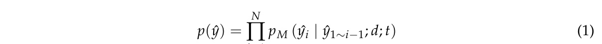
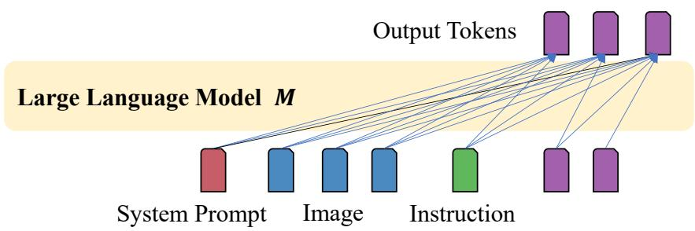
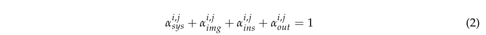
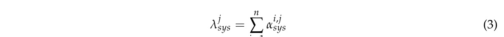
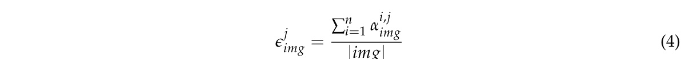
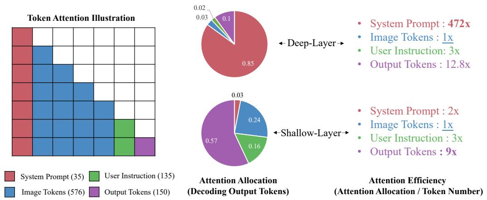
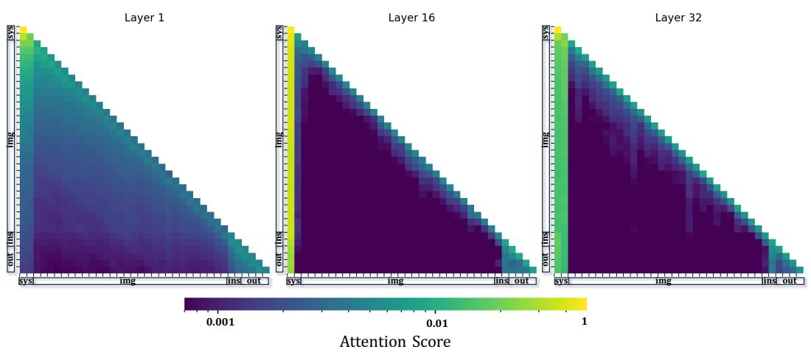

[← 返回 README](../README.md)

# 3 Inefficient Visual Attention in VLLMs

## 📌 预览
本 Section 是 FastV 的理论基础。通过实验发现：(1) image token 在深层的注意力效率极低（仅为 system prompt 的 1/472），(2) 存在 "anchor token" 现象——浅层聚合信息到少量锚点 token，深层主要关注这些锚点。

---

## 3.1 Preliminaries

In this section, we delve into how LVLMs process visual tokens during output generation from the perspective of self-attention module. For an image-question pair $(d, t)$, the given LVLM $M$, usually in the structure of transformer Vaswani et al. (2017) decoder, predicts the answer $\hat{y} = M(\bar{d}, t)$ in an auto-regressive manner:

> 💡 **Eq.1 批读**: 标准的自回归生成公式。每个输出 token 的概率依赖于：之前的所有输出 token + 图像 d + 文本 t。

---

Multimodal information, encompassing both images and text, is transformed into sequential embeddings prior to being processed by the transformer model. For images, a commonly used approach is to employ a pretrained encoder, such as CLIP-VIT Radford et al. (2021), to extract visual features. These features are then linearized by eliminating the spatial dimension. Additional linear transformations Zhu et al. (2023); Liu et al. (2023b) or crossattention Li et al. (2023c); Bai et al. (2023) modules are utilized to adjust the size of the visual features to match the embedding size of the Large Language Model (LLM) and to achieve semantic alignment. Regarding text, a tokenizer breaks down the natural language into discrete tokens and then performs an embedding lookup to form text embeddings. In the rest of the paper, we refer to 'visual tokens' and 'text tokens' not merely as the discrete units of visual and textual data but as the embeddings derived from these units.

> 💡 **多模态处理流程**:
> 1. 图像 → CLIP-ViT → 视觉特征 → 去掉空间维度（线性化）→ 线性变换/cross-attention → 对齐到 LLM embedding 维度
> 2. 文本 → tokenizer → embedding lookup
> 3. 论文中的 "visual token" 和 "text token" 指的是 **embedding**，不是离散单元

---

*Figure 2: Classic network architecture of LVLM. Image tokens and different types of text tokens are sent to the LLM as input. LLM generates output tokens conditioned on the input tokens and preceding output in an auto-regressive manner.*

> 💡 **Figure 2 批读**:
> - 输入 token 分 4 类：system prompt (sys), image tokens (img), user instruction (ins), output tokens (out)
> - Image token 占输入的大部分（~64%）
> - 这个架构图是理解后续注意力分析的基础

---

As illustrated in Figure 2, after preprocessing the image and text token to a unified embedding space, they are fed to the transformer decoder to generate output tokens. The input tokens at each decoding step can be categorized into four distinct types: system prompt (sys), image tokens (img), user instruction (ins), and output tokens (out). The system prompts for LVLMs usually inherit the backbone LLM, used as a general message to control the LLM's behavior, which is decided during the instruction tuning stage of LLM. Image tokens are the linearized image features transformed by a pretrained vision encoder. User instruction specifies the query question for the given image. Output tokens are generated step by step conditioned on the preceding tokens.

> 💡 **四类 token 说明**:
> | 类型 | 说明 | 典型占比 |
> |------|------|---------|
> | sys | 系统提示词，控制 LLM 行为 | 很少 |
> | img | 图像特征，线性化后的 | ~64% |
> | ins | 用户提问 | 少量 |
> | out | 自回归生成的输出 | 逐步增加 |

---

## 3.2 Experiment Settings

To explore how LVLMs process image tokens, we first randomly sample $N$ image-text pairs $D = \{(d^1, t^1), ..., (d^N, t^N)\}$ from a combination of vision langauge tasks including image caption (Flickr30K), embodied reasoning (PCA-Bench), visual question answering (A-OKVQA), multimodal understanding and reasoning (MMMU) and then prompt the LVLM to generate $N$ responses $\hat{Y} = \{\hat{y}^1, ..., \hat{y}^N\}$.

> 💡 **实验设置**: N=1000, 模型=LLaVA1.5-7B, 数据来自 4 个不同类型的任务（caption, reasoning, VQA, MMMU）

---

During the decoding process of one response, we collect each output tokens' attention score distribution $\alpha$ in different layers and sum up for different type of input tokens. That is, for the i-th token, in the j-th layer, we compute $\alpha_{sys}^{i,j}$, $\alpha_{img}^{i,j}$, $\alpha_{ins}^{i,j}$, $\alpha_{out}^{i,j}$ to denote the total attention score current token attends to the system prompt, image tokens, user instruction and output tokens. We have:

> 💡 **Eq.2 批读**: 四类 token 的注意力分数之和为 1。这是 softmax 归一化的直接结果。

---

We compute the total attention allocation $\lambda$ to denote the total attention score one type of tokens received in one layer. For example, the total attention of system prompt in layer $j$ is:

where $n$ is the number of tokens in the response. Final attention allocation is averaged over all attention heads in the $N$ image-text pairs we sampled.

> 💡 **Eq.3 批读**: Attention allocation $\lambda$ = 某类 token 在某层收到的总注意力。把所有输出 token 对该类的注意力加起来。

---

Next, we define metric attention efficiency $\epsilon$ to denote the average attention score per type's token received in one layer during the decoding process of one response. For example, the attention efficiency of image tokens in layer $j$ is:

where $|img|$ is the number of image tokens, $n$ is the number of tokens in the response. Final attention efficiency is averaged over all attention heads in the $N$ image-text pairs we sampled.

> 💡 **Eq.4 批读**: Attention efficiency $\epsilon$ = **每个 token 平均收到的注意力**。
> - $\lambda$ 是总量，$\epsilon$ 是人均
> - 因为 image token 数量多（~64%），即使 $\lambda$ 不低，$\epsilon$ 也可能很低
> - 这个指标更能反映单个 token 的"价值"

---

In our experiment, $N$ is set to 1000 and we use LLaVA1.5-7B as the LVLM. We follow the same generation configuration as the original paper Liu et al. (2023c).

---

## 3.3 Results

We have two major findings in the attention pattern statistics regrading attention allocation $\lambda$ and attention efficiency $\epsilon$ for different type of input tokens. We define the first 2 layers as shallow layer and the rest 30 layers as deep layers.

1. Both attention allocation and attention efficiency show different degree of imbalance, which is related to the layer depth. The average attention allocation and efficiency in different layer is shown in Figure 3. In shallow layer the attention allocation is relatively more balanced than in deep layers. In shallow layer, the output tokens tends to attend to the previous output tokens while in deep layers, they tend to attend to the system prompt.
2. Image tokens have the lowest attention efficiency in both shallow and deep layers. System prompt is of extremely high attention efficiency in deep layers, which is 472 times that of image tokens, taking up 85% total attention scores.

> 💡 **两大发现**:
> 1. 浅层注意力相对均匀 → 深层极度不均衡
> 2. Image token 注意力效率最低！System prompt 在深层的效率是 image token 的 **472 倍**，占 **85%** 总注意力

---

*Figure 3: Illustration of inefficient visual attention phenomena. The left part shows the relative position and average number of different type of input tokens, tokens could only attend to preceding tokens in the self-attention module. In average, image tokens take up most of the input tokens (64%). The middle and right part show the average attention allocation λ and attention efficiency ε in shallow and deep layers. Image tokens receive far less attention relative to their number in the deep layers.*

> 💡 **Figure 3 批读**:
> - **左图**: Token 排列顺序和占比 — image token 占 64%
> - **中图** (λ, attention allocation): 深层中 sys 占绝大部分总注意力
> - **右图** (ε, attention efficiency): 深层中 img token 的人均注意力极低
> - 核心矛盾：占 64% 位置的 image token 只得到极少注意力

---

## 3.4 Insights

The statistics reveal a surprising trend in the decoding process of LVLMs: despite accounting for the majority of tokens in the input, image tokens receive significantly less attention. Conversely, system prompts, which provides the minimal semantic information, attract the most of the attention scores. To delve deeper into this phenomenon, we analyze the attention maps of the first, middle, and last layers during during the decoding process of a model response as shown in Figure 4. The attention maps for all layers are provided in figure-7 of the supplement material.

> 💡 **反直觉现象**: 语义信息最少的 system prompt 却收到最多注意力！这暗示 system prompt token 充当了"信息中转站"的角色。

---

From the attention visualization results, we can see that in shallow layer, the attention scores distribute more smoothly across different tokens. While in deep layer, there are vertical strong lines (in the system prompt) that takes up most of attention scores. The existence of vertical strong line shows that there are some input tokens that consistently received high attention during the whole decoding process. This also explains the highly imbalanced attention efficiencies in our statistics: A small portion of anchor tokens aggregate the information from all input tokens and the model much favors to attend to those anchor tokens in deep layers. Our findings also align with the information flow of Large Language Model found in Wang et al. (2023).

> 💡 **Anchor Token 机制**:
> - 注意力可视化中的"竖直亮线" = anchor token（持续收到高注意力）
> - 浅层：注意力分布平滑，信息从各处（包括 image token）流向 anchor token
> - 深层：模型只关注 anchor token，不再看原始 image token
> - 这与 Wang et al. (2023) 发现的 LLM 信息流一致（"Label Words are Anchors"）

---

*Figure 4: The attention maps during the decoding process of one model response for LLaVA1.5-7B. We can see that in the bottom layer, attention distributes relatively smooth across different type of tokens. In the the deep layers, above from local attention, the attention scores are aggregated to system prompt, instruction and output tokens and attention over image tokens is rather sparse.*

> 💡 **Figure 4 批读**:
> - **Layer 0** (浅层): 注意力分布较均匀，image token 区域有明显注意力
> - **Layer 16** (中间): 开始出现竖直亮线，image 区域变暗
> - **Layer 31** (深层): system prompt 区域出现强烈竖直亮线，image token 区域几乎全黑
> - 这就是为什么深层可以安全删除 image token 的视觉证据

---

## 🔖 Section 总结

### 关键数字速查
| 指标 | 数值 |
|------|------|
| Image token 平均占比 | 64% |
| 深层 system prompt 注意力效率 vs image token | 472x |
| System prompt 占深层总注意力 | 85% |
| 浅层定义 | 前 2 层 |
| 深层定义 | 后 30 层 |
| 采样数据量 | N=1000 |

### 核心洞察
1. Image token "数量多但价值低"（深层）— 典型的冗余
2. Anchor token 机制：浅层信息聚合 → 深层只看 anchor
3. 这为 FastV 提供了理论依据：深层删除 image token 是安全的
