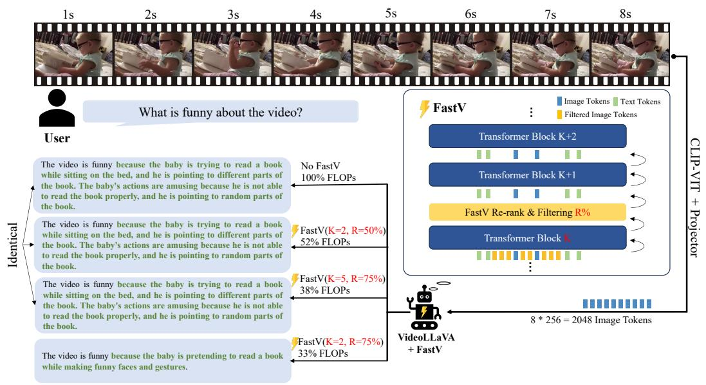
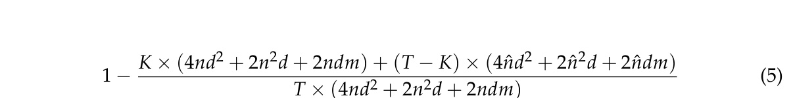
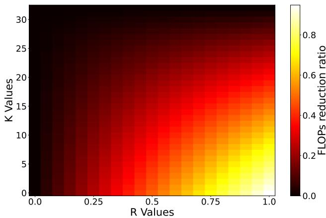

[← 返回 README](../README.md)

# 4 FastV

## 📌 预览
FastV 方法详解：在第 K 层根据 attention score 排序并剪枝 R% 的 image token。本 Section 还包括 FLOPs 计算公式和与"训练时减少 token"的对比。

---

With insights from the validated phenomena and explanation, we propose FastV as a solution to reduce the inference costs of LVLMs without sacrificing the performance.

---

## 4.1 Dynamically Prune Vision Tokens

> 💡 **4.1 要点预览**: FastV 的核心算法——在第 K 层用 attention score 排序 image token，剪掉最不重要的 R%。

Figure 5 illustrates the general idea of FastV. The key is the image token re-rank and filtering module. It consists of one ranking function $f_\phi$ and two parameters: filtering layer $K$ and filtering ratio $R\%$. At layer $K$ of the LVLM, the ranking function $f$ takes a sequence of input tokens and rank them by certain importance criteria $\phi$. The last $R\%$ tokens after ranking would be pruned out in successive layers. We simply compute the average attention-score one token received from all other tokens as the criteria $\phi_{attn}$ in our experiment. In extreme condition, K could be also set to 0, that image tokens are pruned before sending to the language model, we use random ranking as the criteria $\phi_{rand}$ where image tokens are randomly dropped.

> 💡 **FastV 三要素**:
> | 要素 | 说明 |
> |------|------|
> | 排序函数 $f_\phi$ | 按重要性排序 image token |
> | 过滤层 K | 在哪一层做剪枝 |
> | 过滤比例 R% | 剪掉多少比例 |
>
> - 重要性标准 $\phi_{attn}$: 每个 token 从所有其他 token 收到的**平均注意力分数**
> - 特殊情况 K=0: 在进入 LLM 之前就剪枝，用随机排序

---

*Figure 5: Illustration of FastV. For image or video input (multiple image frames), they are first transformed to visual tokens with a pretrained image encoder like CLIP-VIT and then processed by the LLM decoder. FastV dynamically prunes R% image tokens after layer K in the forward process of input tokens. We can tell from the output that FastV does not influence the correctness while reducing significant FLOPs. The correct facts in the outputs are marked green. The first three outputs are completely identical.*

> 💡 **Figure 5 批读**:
> - 上方：标准 LVLM 推理流程（图像 → CLIP-ViT → visual tokens → LLM）
> - 中间：FastV 在 Layer K 处插入一个 re-rank & filter 模块
> - 下方：不同配置的输出对比 — K=2,R=50% 时输出与 baseline 完全一致
> - 视频场景（Video-LLaVA）: 多帧 = 更多 visual token → FastV 效果更显著

---

FastV is plug-and-play to different token-based LVLMs for various vision language tasks without the need of training the model. We take video understanding tasks with VideoLLaVA Lin et al. (2023) as example as shown in Figure 5.

> 💡 **Plug-and-play 优势**: 不需要训练，直接修改推理代码即可。适用于任何基于 token 的 LVLM。

---

## 4.2 Computing Cost Estimation

> 💡 **4.2 要点预览**: 推导 FastV 的 FLOPs 减少公式，展示 K 和 R 如何影响计算量。

We consider the computation of multi-head attention (MHA) and feed-forward network (FFN) module in the FLOPs estimation. For one transformer layer, assume $n$ is the token number, $d$ is the hidden state size, $m$ is the intermediate size of FFN, the total FLOPs can be estimated by $4nd^2 + 2n^2d + 2ndm$. For the whole model, assume FastV prunes tokens from $n$ to $\hat{n} = (1 - R\%) \cdot n$ after layer $K$ and there are T layers at all. The theoretical FLOPs reduction ratio related to image tokens is computed as:

> 💡 **Eq.5 批读**: FLOPs 减少比例公式。
> - 分子：前 K 层用完整 n token + 后 (T-K) 层用剪枝后的 $\hat{n}$ token
> - 分母：所有 T 层都用完整 n token
> - 关键变量：K（越小 → 越早剪枝 → 省更多）、R（越大 → 剪越多 → 省更多）
> - 单层 FLOPs = $4nd^2$ (QKV projection) + $2n^2d$ (attention) + $2ndm$ (FFN)

---

We plot a 3D graph to show how the FLOPs reduction ratio changes with FastV's parameter $K$ and $R$ in Figure 6.

*Figure 6: The heat map of theoretical FLOPs reduction ratio. The color in the figure represents the reduction ratio in different K and R in FastV.*

> 💡 **Figure 6 批读**:
> - X 轴: 过滤层 K (0-30), Y 轴: 过滤比例 R (0-100%)
> - 颜色越深 = FLOPs 减少越多
> - 最佳区域：K 小 (≤5) + R 大 (≥50%) → 减少 40-80% FLOPs
> - K=2, R=50% 大约减少 45% FLOPs（论文推荐配置）

---

## 4.3 Comparison: Training With Less Visual Tokens

FastV achieves computation reduction through eliminating redundant visual tokens during inference stage. An alternative method to reduce visual tokens is directly training with less visual tokens. This could be simply done by conducting pooling on the output of visual encoder during LVLM's training process. We compare FastV and this method in our ablation studies (sec. 5.4).

> 💡 **训练时减少 vs 推理时剪枝**:
> - 训练时减少：在 visual encoder 输出后加 pooling → token 数减少 → 但信息永久丢失
> - FastV：训练时保持完整信息，推理时根据 attention 动态选择重要 token
> - 结论（在 5.4 节验证）：FastV 更好，因为它保留了"选择"的能力

---

## 🔖 Section 总结

### 关键数字速查
| 指标 | 数值 |
|------|------|
| 推荐配置 | K=2, R=50% |
| FLOPs 减少 (推荐配置) | ~45% |
| 单层 FLOPs 公式 | $4nd^2 + 2n^2d + 2ndm$ |

### 核心洞察
1. FastV 只有 2 个超参数 (K, R)，简洁优雅
2. 排序标准是 attention score — 利用模型自身信号，不需要额外模块
3. 既减少 attention 计算又减少 FFN 计算（因为直接删 token）
4. Plug-and-play，无需训练
