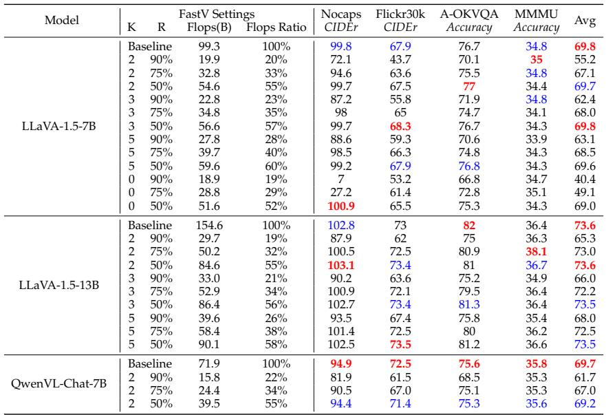
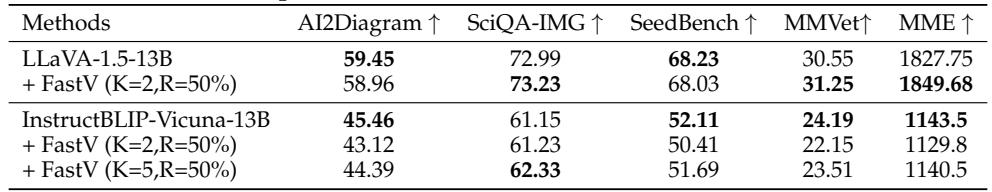
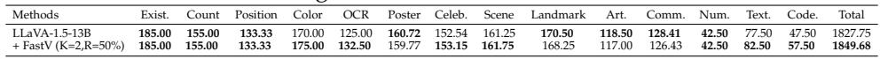
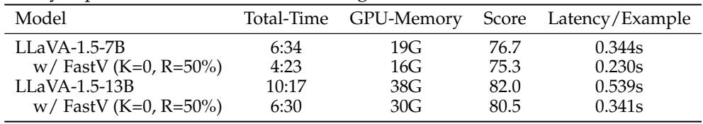
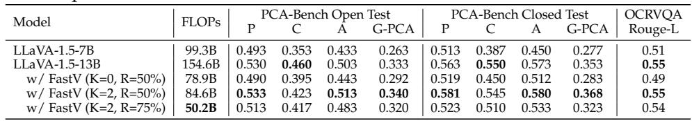
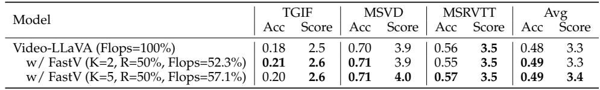
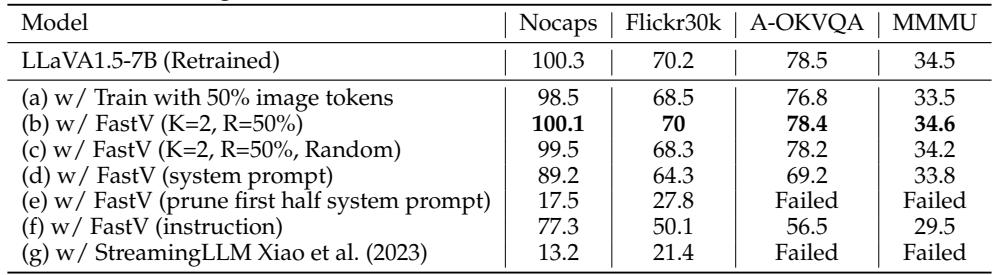
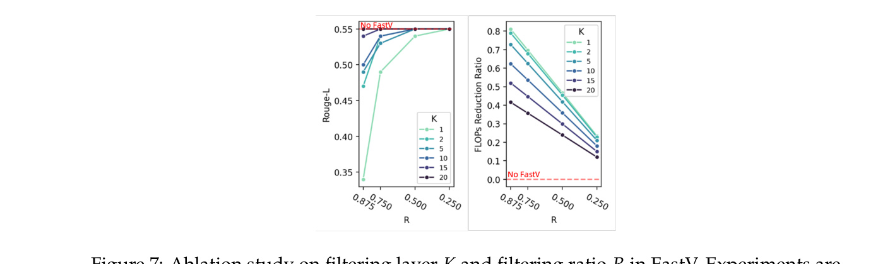
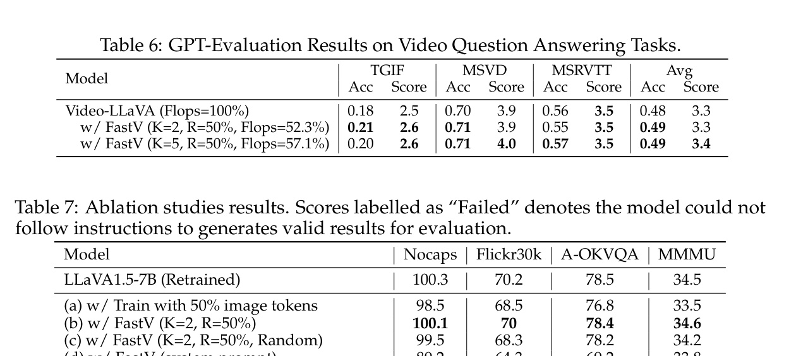

[← 返回 README](../README.md)

# 5 Experiment

## 📌 预览
全面的实验验证：多模型（LLaVA-7B/13B, QwenVL, InstructBLIP, VideoLLaVA）、多任务（caption, VQA, reasoning, video-QA, 细粒度 benchmark）、详细消融实验。核心结论：K=2, R=50% 是最佳平衡点。

---

## 5.1 Evaluation Tasks

We conduct a wide range of evaluation including image captioning, VQA, multimodal reasoning, video QA and fine-grained benchmarks like MME Fu et al. (2023) to examine the influence of FastV on the performance of LVLMs. We use greedy search for all experiments and provide details for each task in section A in the supplement material.

> 💡 **评测任务覆盖**:
> | 类型 | 任务 |
> |------|------|
> | Image Captioning | Nocaps, Flickr30K |
> | VQA | A-OKVQA, OCR-VQA |
> | Multimodal Reasoning | MMMU, PCA-Bench |
> | Video QA | TGIF, MSVD, MSRVTT |
> | Fine-grained | MME, SeedBench, MMVet, SciQA-IMG, AI2Diagram |

---

## 5.2 Model Settings

We test FastV with various open source models. For image understanding tasks, we conduct experiments on LLaVA1.5-7B, 13B Liu et al. (2023b), and Qwen-VL Bai et al. (2023). When it comes to video understanding tasks, our baseline model is VideoLLaVA Lin et al. (2023). We adopt the settings as reported in their paper for the baseline models.

---

## 5.3 Main Results

**Image Understanding.** The performance on tasks under different FastV settings are shown in Table 1 (Nocaps, Flickr30k, A-OKVQA, MMMU) and Table 5 (PCA-Bench, OCR-VQA). The result of latency test is shown in Table 4.

---

*Table 1: Performance/Computation Balance of FastV under different configurations (K for filtering layer, R for filtering ratio).*

> 💡 **Table 1 批读**:
> - **LLaVA-1.5-7B**: K=2, R=50% → 55% FLOPs, Avg 69.7 (vs baseline 69.8) — 几乎无损！
> - **LLaVA-1.5-13B**: K=2, R=50% → 55% FLOPs, Avg 73.6 (vs baseline 73.6) — 完全无损！
> - **QwenVL-Chat-7B**: K=2, R=50% → 55% FLOPs, Avg 69.2 (vs baseline 69.7) — 微降 0.5
> - K=0 (random pruning) 性能下降明显 → attention-based ranking 很关键
> - R=90% 时性能下降严重 → 不能剪太多

---

In Table 1, we present the performance trend with FLOPs ratio ranging from 19% to 100% by FastV, for different type and size of models. We also plot the relation between FLOPs Reduction ratio (1-FLOPs Ratio) and average performance in Figure 1. The results indicate that FastV (K=2, R=50%) could achieve about 45% FLOPs reduction for different LVLMs without sacrificing the performance. The FLOPs-Performance trade-off is is also highly adjustable by lowering K and increasing R if we want to pursue an ultimate speed up. As shown in the latency test (Table 4), an 13B model with FastV could inference as fast as a 7B model with superior performance.

---

*Table 4: Real inference budget comparison between FastV and vanilla decoding. With FastV, a 13B model could inference as fast as a 7B model while maintaining its superior performance.*

> 💡 **Table 4 批读 — 实际延迟测试**:
> | 模型 | 延迟/样本 | GPU 显存 | Score |
> |------|----------|---------|-------|
> | LLaVA-7B | 0.344s | 19G | 76.7 |
> | LLaVA-7B + FastV(K=0,R=50%) | 0.230s | 16G | 75.3 |
> | LLaVA-13B | 0.539s | 38G | 82.0 |
> | LLaVA-13B + FastV(K=0,R=50%) | **0.341s** | **30G** | 80.5 |
>
> 关键：13B+FastV (0.341s) ≈ 7B (0.344s)，但 score 更高 (80.5 > 76.7)!

---

In PCA-Bench and OCR-VQA, (Table 5), which runs finegrained analysis on perception, cognition, action and OCR abilities, we find that FastV (K=2, R=50%) could maintain the sub-scores while significantly decreasing the FLOPs.

*Table 5: Finegrained Results on PCA-Bench and OCR-VQA.*

> 💡 **Table 5 批读**:
> - PCA-Bench 测三个维度：Perception, Cognition, Action
> - K=2, R=50%: 各维度均保持或略提升（P: 0.533 vs 0.530, A: 0.513 vs 0.503）
> - OCR-VQA: Rouge-L 0.55 不变
> - 说明 FastV 不影响细粒度感知和认知能力

---

**Video Understanding.** The results of FastV on different video question answering tasks in shown in table 6 (TGIF, MSVD, MSRVTT). To our surprise, we find FastV could generally improves the Video-QA tasks performance while saving 40%+ computations especially for the TGIF task. We think the main reason is that the redundancy information problem is more severe for video understanding as multiple images from the video are transformed to tokens when sending to the LLM. For example, an image costs 576 tokens in LLaVA1.5 model, while a video costs 2048 tokens in Video-LLaVA. As shown in the case from Figure 5, setting suitable FastV parameters could lead to much FLOPs reduction for Video-LLaVA while the outputs are nearly identical.

*Table 6: GPT-Evaluation Results on Video Question Answering Tasks.*

> 💡 **Table 6 批读 — Video-QA 结果**:
> - **惊喜发现**：FastV 在视频任务上不仅不降反升！
> - TGIF: Acc 0.18 → 0.21 (+0.03), Score 2.5 → 2.6
> - MSVD/MSRVTT: 基本持平或微升
> - 原因：视频有 2048 token（vs 图像 576），冗余更严重 → 剪枝效果更好
> - 这说明 FastV 对高冗余场景特别有效

---

**Fine-grained Benchmarks and More Models** We conduct additional experiments with InstructBLIP and also with more fine-grained LVLM benchmarks such as SciQA-IMG Lu et al. (2022), SeedBench Li et al. (2023a), MMVet Yu et al. (2023), and MME Fu et al. (2023), together with benchmarks requiring more visual processing such as AI2Diagram. The results and fine-grained scores of MME are shown in Table 2 and Table 3. FastV works well on different LVLM benchmarks with competitive performance. We find that InstructBLIP shows slightly more performance degradation than LLaVA with same FastV config. The gap soon closes when we just set K to 5. We think it's because Q-Former initially reduces image tokens, resulting in direct information loss. Consequently, it requires adjusting the FastV parameters to avoid too much information loss.

*Table 2: Experiments with more models and benchmarks.*

*Table 3: Fine-grained results on MME benchmark.*

> 💡 **Table 2 & 3 批读**:
> - LLaVA-13B + FastV: 所有 benchmark 基本持平
> - InstructBLIP + FastV(K=2,R=50%): 有一定下降（AI2D: 45.46→43.12）
> - InstructBLIP + FastV(K=5,R=50%): 下降减小（AI2D: 44.39）
> - 原因：Q-Former 已经做了一次 token 压缩 → 再剪枝信息损失更大
> - **启示**: 对已有 token 压缩的模型，需要调大 K

---

## 5.4 Ablation Studies

**Balance between Cost and Performance.** We conduct an ablation experiment on how the parameters (K and R) influence the acceleration and downstream task's performance. We select OCR-VQA as the task, which necessitates a through understanding of the image. The result is shown in Figure 7. When K is small, lowering R would improve the performance with a smaller FLOPs reduction ratio. In contrast, when K is large, adjusting R has minimal impact on the overall performance. This observation further proves that in deep layers, there is high redundancy in image tokens.

*Figure 7: Ablation study on filtering layer K and filtering ratio R in FastV. Experiments are conducted with LLaVA1.5-13B on OCR-VQA task. When K is small, lowering R would improve the performance with a smaller FLOPs reduction ratio. In contrast, when K is large, changing R has minimal impact on the overall performance.*

> 💡 **Figure 7 批读**:
> - **K 小 (如 K=2)**: R 的影响大 — R 从 50% 增到 90%，性能显著下降
> - **K 大 (如 K=20)**: R 几乎不影响性能 — 因为到第 20 层时信息早已被聚合完毕
> - 再次验证：深层 image token 确实是冗余的

---

**Training with Less Tokens.** FastV reduces computational requirements (FLOPs) by pruning tokens during the inference stage. An alternative approach for token reduction involves training the LVLM at a lower resolution. To facilitate a fair comparison, we retrained two LLaVA1.5-7B models, adhering to the original pretraining and supervised finetuning protocols. The sole modification in the second model's training process was the incorporation of an average pooling layer (with a stride of 2) following the Clip encoder, leading to a 50% reduction in image tokens during training. A comparison between lines (a) and (b) in Table 7 reveals that reducing the input resolution directly during training results in diminished performance. Conversely, FastV manages to decrease the number of image tokens without compromising performance, showcasing its efficiency in balancing computational savings with model efficacy.

---

**Pruning Token Strategy.** FastV strategically reduces the number of image tokens during the inference phase of LVLMs, motivated by our observation that image tokens exhibit the lowest attention efficiency relative to other types of input tokens. In experiments detailed in lines (d) and (f) of the study, we specifically pruned tokens that were not related to images, such as system prompts and instruction tokens. This selective pruning resulted in significant performance declines, even when only a minimal number of non-image tokens were removed. We also compare randomly drop visual tokens instead of dropping by attention rank, as shown in line (c). It resulted in declined results compared with origin FastV (b). These findings underscore the distinct roles that visual and textual tokens play within LVLMs. It highlights FastV's effectiveness in precisely targeting image tokens for reduction, thereby optimizing performance without compromising the model's overall functionality.

In our previous observation about attention efficiency, we find out that the system prompt takes up of most attention even if they carry the least semantic information in the context. We conduct another experiment by directly prune the first half tokens of the system prompt. Comparing line (d) and (e), we can find that the head tokens in the system prompt have dominant effect on the model performance. Our findings also align with StreamingLLM Xiao et al. (2023) where they find that the first 4 tokens in LLM play the most important role during inference. However, direcly applying the same sparse attention pattern as StreamingLLM would lead to a substantial degradation in LVLM's performance as shown in line (g) of Table 7. This suggests a fundamental difference in how image tokens, as opposed to text tokens, contribute to the information processing within LLMs.

*Table 7: Ablation studies results.*

> 💡 **消融实验总结 (Table 7)**:
> | 实验 | 结论 |
> |------|------|
> | (a) 训练时 50% token | 性能下降 → 训练时减少 token 不如推理时剪枝 |
> | (b) FastV K=2,R=50% | 性能保持 ✅ |
> | (c) 随机剪枝 | 比 attention 排序差 → ranking 很重要 |
> | (d) 剪 system prompt | 性能显著下降 → system prompt 不能动 |
> | (e) 剪 system prompt 前半 | 模型崩溃 (Failed) → 首部 token 是关键 |
> | (f) 剪 instruction | 性能大幅下降 → instruction 不能动 |
> | (g) StreamingLLM | 模型崩溃 → LLM 的稀疏注意力不适用于 LVLM |

---

## 🔖 Section 总结

### 关键数字速查
| 指标 | 数值 |
|------|------|
| 推荐配置 | K=2, R=50% |
| FLOPs 保留比例 | ~55% |
| LLaVA-13B+FastV 延迟 | 0.341s (≈7B 的 0.344s) |
| Video token 数 (Video-LLaVA) | 2048 |
| Image token 数 (LLaVA) | 576 |

### 核心洞察
1. K=2, R=50% 是普适最优配置（多模型、多任务验证）
2. 视频场景效果更好（冗余更多）
3. Attention-based ranking > random pruning
4. 只有 image token 可以安全剪枝，text token 不行
5. StreamingLLM 等 LLM 方法不能直接用于 LVLM
