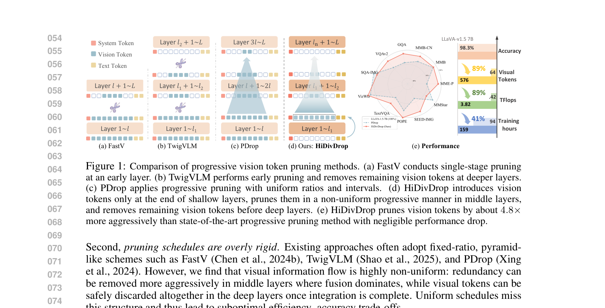

[← 返回 README](../README.md)

# 1. Introduction

## 📌 预览
Introduction揭示了现有progressive pruning的两个根本误解：浅层不是融合器而是传播者；pruning schedule不应该是均匀的。基于此提出HiDivDrop框架。

---

Multimodal Large Language Models (MLLMs) have attracted growing attention for their ability to integrate vision and language, enabling progress in tasks such as visual question answering and embodied AI (OpenAI, 2023; 2024; Bai et al., 2025). The dominant paradigm adopts a connector-based architecture that leverages powerful pre-trained Large Language Models (LLMs) (Liu et al., 2023b;a; 2024a; Bai et al., 2023; Wang et al., 2024; Bai et al., 2025). In this design, a lightweight connector projects visual features into the LLM's embedding space, allowing a purely text-trained backbone to process multimodal inputs without retraining from scratch. However, visual encoders typically generate substantially more tokens than text due to their higher information density. As the number of tokens scales quadratically with image resolution, and self-attention complexity is also quadratic, the overall computational cost quickly becomes prohibitive.

> 💡 **背景**: 标准MLLM架构：vision encoder → connector → LLM。问题是visual tokens数量远超text tokens，self-attention的O(N²)复杂度使计算成本随分辨率急剧增长。

---

To alleviate this issue, researchers have proposed progressive vision token pruning, a technique that gradually removes less informative vision tokens as they flow through the model. Early layers retain more tokens to preserve fine-grained details, while deeper layers operate on a reduced set of tokens that concentrate on semantically important content. This strategy effectively reduces the number of tokens involved in later computations without sacrificing much accuracy, and has become a widely adopted and popular approach for lowering the inference cost of MLLMs. Yet, through a deeper analysis of these models' internal dynamics, we find that current pruning methods are hindered by two fundamental misconceptions about how MLLMs process visual information across layers.

> 💡 **Progressive pruning的问题**: 虽然逐层减少vision tokens的思路是对的，但现有方法对MLLM内部动态的理解是**错误的**，导致pruning策略次优。

---

First, shallow layers are misinterpreted. Prior work observes that removing early layers degrades performance and thus concludes that these layers are critical for multimodal integration (Xing et al., 2024; Zhang et al., 2025; Wu et al., 2025). Our analysis shows otherwise: vision tokens, already deeply processed by the vision encoder, undergo almost no transformation in the initial LLM layers. Both intra-modal evolution and cross-modal influence are negligible. These layers primarily act as propagators and attention sinks, not true integrators.

> 💡 **误解1 — 浅层的角色**:
> - **传统观点**: 浅层对多模态融合很重要，不能剪
> - **本文发现**: 浅层只是"传播者"（propagator），vision tokens几乎不变化，跨模态影响也可以忽略
> - **关键洞察**: vision tokens已经被vision encoder深度处理过了，进入LLM后的前几层基本是在"传递"而非"融合"
> - **与PDrop的对比**: PDrop从第1层就开始处理visual tokens，浪费了浅层的计算

---

Second, pruning schedules are overly rigid. Existing approaches often adopt fixed-ratio, pyramid-like schemes such as FastV (Chen et al., 2024b), TwigVLM (Shao et al., 2025), and PDrop (Xing et al., 2024). However, we find that visual information flow is highly non-uniform: redundancy can be removed more aggressively in middle layers where fusion dominates, while visual tokens can be safely discarded altogether in the deep layers once integration is complete. Uniform schedules miss this structure and thus lead to suboptimal efficiency–accuracy trade-offs.

> 💡 **误解2 — Pruning schedule**:
> - **传统做法**: 等间隔、等比例地剪（如PDrop的uniform pyramid）
> - **本文发现**: visual信息流高度不均匀——中层冗余最大（可以猛剪），深层可以完全丢弃
> - **这和STAR-Pro的发现互补**: STAR-Pro发现不同token的重要性不同（WHAT），HiDivDrop发现不同层的功能不同（WHERE）

---

Motivated by these findings, we propose HiDivDrop (Hierarchical Division-based Vision Token Dropping), a framework that adapts pruning to the actual hierarchical dynamics of MLLMs.

To address the shallow-layer misconception, a straightforward solution might be to aggressively prune visual tokens within these early layers. However, this is problematic: any token discarded early is permanently lost and cannot participate in the crucial fusion that occurs in deeper, more meaningful layers. Instead, we adopt a Late Injection strategy: rather than pruning in shallow layers, we bypass them altogether and inject the full set of vision tokens only at the onset of the true fusion stage. This approach perfectly reflects the functional redundancy of the early layers without prematurely discarding potentially valuable information, marking the first attempt to deliberately delay, rather than simply prune, visual input for greater efficiency in MLLMs.

> 💡 **Late Injection的精妙之处**:
> - **不是在浅层剪vision tokens，而是干脆不给浅层vision tokens！**
> - 这比aggressive early pruning更好，因为后者会永久丢失信息
> - 浅层只处理text tokens（更快），到第9层再注入全部vision tokens
> - 这是**首次**提出"延迟注入"（而非"提前剪枝"）的策略

---

To address the limitations of rigid schedules, we propose a Concave Pyramid Pruning scheme, which accelerates token reduction early in the fusion stage and slows it later, together with an Early Exit mechanism that fully discards vision tokens before the language-dominant layers. When applying this schedule, we identify reliable pruning layers using an Inter-Layer Visual Attention Similarity (ILVAS) measure, and select the most informative tokens with a learnable differentiable top-k operator. These mechanisms jointly enable precise and end-to-end optimized pruning decisions.

> 💡 **Concave Pyramid + Early Exit**:
> - **Concave（凹形）**: 前面剪得快，后面剪得慢（与传统的convex/linear相反）
> - 直觉：fusion刚开始时冗余最大，越往深层剩下的都是"精华"
> - **Early Exit**: 到第25层后，vision tokens完全丢弃，后续层纯做language reasoning
> - **ILVAS**: 用注意力分布的层间相似度来找最适合剪枝的层
> - **Differentiable Top-K**: 让token选择可微分，端到端训练

---

Finally, we develop practical strategies to ensure compatibility with efficient implementations such as FlashAttention and to resolve issues like position ID mismatches from dynamic token management, ensuring that theoretical pruning gains translate into real-world acceleration.

> 💡 **工程细节也很重要**: 动态token管理会导致position ID错位（类似streaming LLM的问题），需要persistent position encoding来解决。同时要保证与FlashAttention兼容才能真正加速。

---

Extensive experiments on LLaVA-1.5-7B show that HiDivDrop compresses ∼90% of visual tokens while matching the original performance, accelerating training by up to 1.72× and substantially improving inference throughput. Our contributions are threefold: (1) we diagnose two fundamental weaknesses of existing pruning methods related to shallow-layer interpretation and pruning schedules; (2) we introduce HiDivDrop, featuring the novel Late Injection strategy, Concave Pyramid Pruning with Early Exit, and optimized layer- and token-selection mechanisms; and (3) we empirically demonstrate that HiDivDrop achieves state-of-the-art efficiency–accuracy trade-offs.

> 💡 **三大贡献**:
> 1. **诊断**: 发现现有方法的两个根本误解
> 2. **方法**: Late Injection + Concave Pyramid + Early Exit + ILVAS + DTop-K
> 3. **实验**: SOTA效率-精度权衡

---

*Figure 1: Comparison of progressive vision token pruning methods. (a) FastV conducts single-stage pruning at an early layer. (b) TwigVLM performs early pruning and removes remaining vision tokens at deeper layers. (c) PDrop applies progressive pruning with uniform ratios and intervals. (d) HiDivDrop introduces vision tokens only at the end of shallow layers, prunes them in a non-uniform progressive manner in middle layers, and removes remaining vision tokens before deep layers. (e) HiDivDrop prunes vision tokens by about 4.8× more aggressively than state-of-the-art progressive pruning method with negligible performance drop.*

> 💡 **Figure 1 批读**:
> - 这张图是理解HiDivDrop与现有方法区别的关键
> - **(a) FastV**: 单次剪枝，简单但不够好
> - **(b) TwigVLM**: 两阶段——早期剪一次，深层全丢
> - **(c) PDrop**: 均匀progressive pruning（等间隔等比例）
> - **(d) HiDivDrop**: 三段式——浅层无vision tokens → 中层concave pyramid剪 → 深层完全丢弃
> - **(e) 效率对比**: HiDivDrop比PDrop激进4.8×（576→64 vs 576→270），但性能几乎无损（98.6% vs 100.2%）
> - 训练时间: 94 vs 107 vs 159 GPU hours

---

## 🔖 Section 总结

### 核心洞察
1. **浅层是传播者**: vision tokens进入LLM后在前~9层几乎不变化
2. **不要在浅层剪枝，而要延迟注入**: 避免永久丢失信息
3. **Pruning schedule要与层级功能对齐**: 中层猛剪，深层全丢
4. **可微分选择+层间相似度**: 端到端优化剪枝决策
