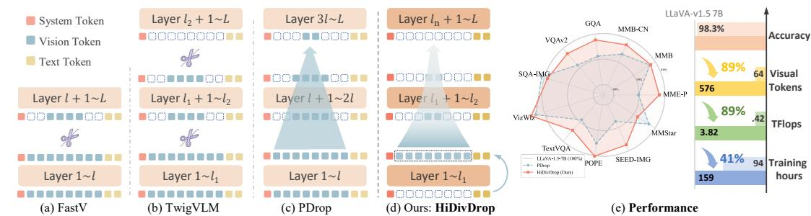

[← 返回 README](../README.md)

# 1 Introduction

## 📌 预览
Introduction 阐述 MLLM 视觉 token 的计算瓶颈、现有 progressive pruning 的两大误区（浅层误解 + 刚性调度）、HiDivDrop 的核心思路（Late Injection + Concave Pyramid Pruning + Early Exit）、以及三大贡献。

---

Multimodal Large Language Models (MLLMs) have attracted growing attention for their ability to integrate vision and language, enabling progress in tasks such as visual question answering and embodied AI (OpenAI, 2023; 2024; Bai et al., 2025). The dominant paradigm adopts a connectorbased architecture that leverages powerful pre-trained Large Language Models (LLMs) (Liu et al., 2023b;a; 2024a; Bai et al., 2023; Wang et al., 2024; Bai et al., 2025). In this design, a lightweight connector projects visual features into the LLM's embedding space, allowing a purely text-trained backbone to process multimodal inputs without retraining from scratch. However, visual encoders typically generate substantially more tokens than text due to their higher information density. As the number of tokens scales quadratically with image resolution, and self-attention complexity is also quadratic, the overall computational cost quickly becomes prohibitive.

> 💡 **开篇批注**:
> - 主流 MLLM 范式：预训练 LLM + 轻量 connector 投影视觉特征
> - 核心矛盾：视觉 token 数远多于文本 token，且 self-attention 复杂度是 token 数的**二次方**
> - 分辨率越高 → token 越多 → 计算成本**双重二次**增长

---

To alleviate this issue, researchers have proposed progressive vision token pruning, a technique that gradually removes less informative vision tokens as they flow through the model. Early layers retain more tokens to preserve fine-grained details, while deeper layers operate on a reduced set of tokens that concentrate on semantically important content. This strategy effectively reduces the number of tokens involved in later computations without sacrificing much accuracy, and has become a widely adopted and popular approach for lowering the inference cost of MLLMs. Yet, through a deeper analysis of these models' internal dynamics, we find that current pruning methods are hindered by two fundamental misconceptions about how MLLMs process visual information across layers.

> 💡 **Progressive pruning 现状与问题**:
> - 思路：浅层保留更多 token → 深层逐步减少
> - 已经很流行，但作者发现被**两个根本性误解**拖累

---

First, shallow layers are misinterpreted. Prior work observes that removing early layers degrades performance and thus concludes that these layers are critical for multimodal integration (Xing et al., 2024; Zhang et al., 2025; Wu et al., 2025). Our analysis shows otherwise: vision tokens, already deeply processed by the vision encoder, undergo almost no transformation in the initial LLM layers. Both intra-modal evolution and cross-modal influence are negligible. These layers primarily act as propagators and attention sinks, not true integrators.

> 💡 **误区一：浅层关键论**:
> - 先前工作（PDrop、LLaVA-Mini、VTW）观察到"删掉浅层性能下降" → 推断浅层对融合至关重要
> - HiDivDrop 的反驳：视觉 token 在 vision encoder 已充分处理，进入 LLM 浅层后**几乎不变**
> - 浅层是"传声筒 (propagator)"和"注意力沉没 (attention sink)"，不是"融合器 (integrator)"
> - **关键区别**：删浅层会掉性能 ≠ 浅层在做融合（可能只是位置编码对齐等基础功能）

---

*Figure 1: Comparison of progressive vision token pruning methods. (a) FastV conducts single-stage pruning at an early layer. (b) TwigVLM performs early pruning and removes remaining vision tokens at deeper layers. (c) PDrop applies progressive pruning with uniform ratios and intervals. (d) HiDivDrop introduces vision tokens only at the end of shallow layers, prunes them in a non-uniform progressive manner in middle layers, and removes remaining vision tokens before deep layers. (e) HiDivDrop prunes vision tokens by about 4.8× more aggressively than state-of-the-art progressive pruning method with negligible performance drop.*

> 💡 **Figure 1 批读**:
> - (a)-(c) 是三种现有方法的示意：FastV 单次剪枝、TwigVLM 两阶段、PDrop 均匀渐进
> - (d) HiDivDrop 的核心区别：**浅层完全不放视觉 token**（Late Injection），中间层非均匀剪枝，深层 Early Exit
> - (e) 效率-性能对比：HiDivDrop 比 PDrop 激进 4.8× 但性能仅降 1.6%
> - 这张图是全文的"一图总结"，清晰展示了方法的定位和优势

---

Second, pruning schedules are overly rigid. Existing approaches often adopt fixed-ratio, pyramid-like schemes such as FastV (Chen et al., 2024b), TwigVLM (Shao et al., 2025), and PDrop (Xing et al., 2024). However, we find that visual information flow is highly non-uniform: redundancy can be removed more aggressively in middle layers where fusion dominates, while visual tokens can be safely discarded altogether in the deep layers once integration is complete. Uniform schedules miss this structure and thus lead to suboptimal efficiency–accuracy trade-offs.

> 💡 **误区二：刚性调度**:
> - 现有方法用固定比例、等间距的金字塔式剪枝
> - 但实际上视觉信息流是**高度非均匀**的：
>   - 中间层（融合主战场）→ 可以激进剪
>   - 深层（融合已完成）→ 可以全部丢弃
> - 均匀调度无法捕捉这种结构 → 效率-精度 trade-off 次优

---

Motivated by these findings, we propose HiDivDrop (Hierarchical Division-based Vision Token Dropping), a framework that adapts pruning to the actual hierarchical dynamics of MLLMs.

To address the shallow-layer misconception, a straightforward solution might be to aggressively prune visual tokens within these early layers. However, this is problematic: any token discarded early is permanently lost and cannot participate in the crucial fusion that occurs in deeper, more meaningful layers. Instead, we adopt a Late Injection strategy: rather than pruning in shallow layers, we bypass them altogether and inject the full set of vision tokens only at the onset of the true fusion stage. This approach perfectly reflects the functional redundancy of the early layers without prematurely discarding potentially valuable information, marking the first attempt to deliberately delay, rather than simply prune, visual input for greater efficiency in MLLMs.

> 💡 **Late Injection 的巧妙之处**:
> - 简单方案：在浅层激进剪枝 → 问题：被剪的 token 永远丢失，无法参与深层融合
> - HiDivDrop 方案：浅层**完全不注入**视觉 token → 省掉浅层的视觉计算 → 中间层注入**完整**视觉 token
> - 这是**首次**在 MLLM 中采用"延迟注入"而非"提前剪枝"的策略
> - 哲学：与其在不懂的时候乱剪，不如在需要的时候才给

---

To address the limitations of rigid schedules, we propose a Concave Pyramid Pruning scheme, which accelerates token reduction early in the fusion stage and slows it later, together with an Early Exit mechanism that fully discards vision tokens before the language-dominant layers. When applying this schedule, we identify reliable pruning layers using an Inter-Layer Visual Attention Similarity (ILVAS) measure, and select the most informative tokens with a learnable differentiable top- $k$ operator. These mechanisms jointly enable precise and end-to-end optimized pruning decisions.

> 💡 **Concave Pyramid Pruning + Early Exit**:
> - "凹金字塔"：融合阶段初期快速削减（冗余最大），后期放缓（保留关键信息）
> - Early Exit：融合完成后（深层）直接丢弃所有视觉 token
> - ILVAS：通过层间视觉注意力相似度找到最佳剪枝层
> - Differentiable top-k：可微的 token 选择，端到端优化

---

Finally, we develop practical strategies to ensure compatibility with efficient implementations such as FlashAttention and to resolve issues like position ID mismatches from dynamic token management, ensuring that theoretical pruning gains translate into real-world acceleration.

> 💡 **工程细节也没放过**:
> - FlashAttention 兼容性
> - 位置编码不匹配问题（动态 token 管理带来的副作用）
> - 理论加速 → 实际加速的桥梁

---

Extensive experiments on LLaVA-1.5-7B show that HiDivDrop compresses ${ \sim } 9 0 \%$ of visual tokens while matching the original performance, accelerating training by up to $1 . 7 2 \times$ and substantially improving inference throughput. Our contributions are threefold: (1) we diagnose two fundamental weaknesses of existing pruning methods related to shallow-layer interpretation and pruning schedules; (2) we introduce HiDivDrop, featuring the novel Late Injection strategy, Concave Pyramid Pruning with Early Exit, and optimized layer- and token-selection mechanisms; and (3) we empirically demonstrate that HiDivDrop achieves state-of-the-art efficiency–accuracy trade-offs.

> 💡 **三大贡献**:
> 1. **诊断两个误区**：浅层误解 + 刚性调度
> 2. **提出 HiDivDrop**：Late Injection + Concave Pyramid Pruning + Early Exit + ILVAS + DTop-K
> 3. **SOTA 效率-精度 trade-off**：~90% 压缩，训练 1.72× 加速

---

## 🔖 Section 总结

### 关键数字速查
| 指标 | 数值 |
|------|------|
| Visual token 压缩率 | ~90% |
| 训练加速 | 1.72× |
| 与 PDrop 压缩率对比 | 4.8× 更激进 |
| 性能保持 | 98.6% of baseline |

### 核心洞察
1. 浅层是传声筒不是融合器 → Late Injection 跳过浅层
2. 视觉信息流高度非均匀 → Concave Pyramid 非均匀剪枝
3. 深层不需要视觉 token → Early Exit 全部丢弃
4. "延迟注入"比"提前剪枝"更优：不丢失任何可能有用的信息
