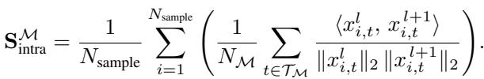
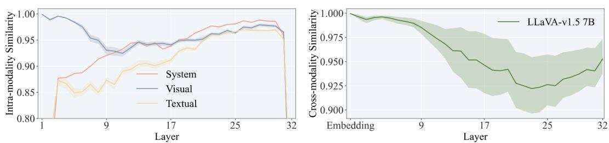
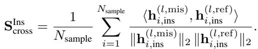
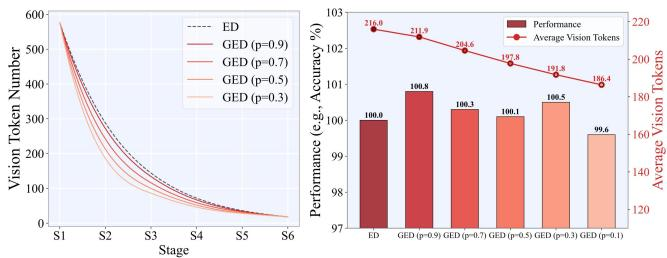
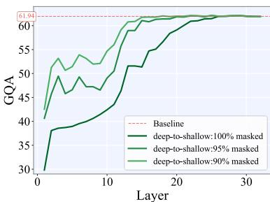

[← 返回 README](../README.md)

# 2 Unmasking the Processing Dynamics in MLLMs

## 📌 预览
Section 2 是全文的分析基石：通过 intra-modal similarity 和 cross-modal similarity 两个探针，揭示 MLLM 的三阶段层级结构——浅层(传声筒)、中间层(稀疏融合中枢)、深层(语言推理)。这些发现直接指导了 HiDivDrop 的设计。

---

A Multimodal Large Language Model (MLLM) processes a unified sequence of text and vision embeddings, $\mathbf h _ { 0 } = [ \mathbf E _ { v } : \mathbf E _ { t } ]$ , through its Transformer layers. The text embeddings $\mathbf { E } _ { t } \in \mathbb { R } ^ { N _ { t } \times d }$ come from a standard tokenizer, while the vision embeddings $\mathbf { E } _ { v } \in \mathbb { R } ^ { N _ { v } \times d }$ originate from a vision encoder that partitions an image into $N _ { v }$ patches and projects their features into the LLM's hidden dimension $d$ . The primary computational bottleneck in this architecture is self-attention, whose cost scales quadratically with the number of vision tokens, $\mathcal { O } ( N _ { v } ^ { 2 } d )$ , as typically $N _ { v } \gg N _ { t }$ .

> 💡 **形式化定义**:
> - 输入：$\mathbf{h}_0 = [\mathbf{E}_v : \mathbf{E}_t]$，视觉和文本嵌入拼接
> - 瓶颈：self-attention 复杂度 $\mathcal{O}(N_v^2 d)$，且通常 $N_v \gg N_t$（如 576 vs ~50）

---

To mitigate this computational burden, a common solution is progressive token pruning, which iteratively reduces the number of vision tokens across the model's layers. Most existing strategies, however, employ predetermined and static pruning schedules (e.g., linear or convex decay). These fixed approaches are applied uniformly, without considering the specific processing that occurs at different stages within the model.

This raises a critical question: what is an effective way to prune visual tokens? We contend that any sound strategy must be grounded in the model's actual behavior, rather than relying on a naive, hand-crafted heuristic. To move toward such a strategy, it is first crucial to understand how MLLMs process and integrate visual information internally. Therefore, this section presents an in-depth analysis of these internal dynamics. Our goal is to reveal that the different layers play fundamentally distinct roles in multimodal fusion, thereby informing a more principled approach to token pruning.

> 💡 **核心论点**:
> - 剪枝策略必须基于模型的**实际行为**，而非手工启发式
> - 需要先理解 MLLM 如何在内部处理和融合视觉信息

---

## Shallow Layers: Propagators

Shallow Layers: Propagators A prevalent assumption in progressive pruning is that shallow layers are essential for early cross-modal fusion and must be preserved (Xing et al., 2024; Zhang et al., 2025). To scrutinize this belief, we perform a training-free layer-wise probe on LLaVAv1.5-7B, feeding GQA image–question pairs through the network and recording hidden states at all layers. Our analysis, however, reveals that these layers function not as active integrators but as simple propagators. We demonstrate this by examining their contributions from two perspectives.

> 💡 **实验设置**:
> - Training-free 逐层探测（无需额外训练）
> - 模型：LLaVA-v1.5-7B
> - 数据：GQA image-question pairs
> - 记录所有层的 hidden states

---

First, we analyze intra-modal refinement by measuring how token representations evolve across layers for each modality $\mathcal { M } \in$ {System, Visual, Textual}. Concretely, we compute the modalityspecific cosine similarity $( \mathbf { S } _ { \mathrm { i n t r a } } ^ { \mathcal { M } } )$ ) between the outputs of consecutive layers:

where $l$ denotes the layer index, $N _ { \mathrm { s a m p l e } }$ is the number of samples, $\tau _ { \mathcal { M } }$ is the set of tokens belonging to modality $\mathcal { M }$ with $N _ { \mathcal { M } } = \vert \mathcal { T } _ { \mathcal { M } } \vert$ , and $\boldsymbol { x } _ { i , t } ^ { l }$ is the representation of token $t$ in sample $i$ at layer $l$ .

> 💡 **探针 1：Intra-modal Similarity**:
> - 衡量相邻层之间**同模态**内 token 表示的变化程度
> - cosine similarity 高 → 该层对该模态的 token 几乎没有修改
> - 分别对 System / Visual / Textual 三种模态计算

---

As shown in the left panel of Fig. 2, visual token representations in the shallow layers exhibit remarkably high self-similarity, undergoing only very minor changes across consecutive layers, indicating that the LLM backbone performs negligible processing on them in this stage.

*Figure 2: Layer-wise representational dynamics, with the left panel showing intra-modal refinement, and the right panel highlighting cross-modal interaction intensity.*

> 💡 **Figure 2 批读**:
> - **左图 (Intra-modal)**：浅层（约 layer 0-8）视觉 token 的相邻层相似度极高（~0.99），说明几乎没被处理
> - 中间层（~layer 9-24）相似度骤降，说明这里在积极变换视觉表示
> - 深层（~layer 25+）相似度回升，视觉 token 又趋于稳定
> - **右图 (Cross-modal)**：浅层中 text embedding 对不同图像的响应几乎不变（高相似度），说明跨模态影响可忽略
> - 中间层相似度下降，说明文本表示开始受图像影响 = 融合开始
> - **关键发现**：浅层既不改变视觉 token（intra），也不让视觉影响文本（cross）→ 纯传声筒

---

Second, we measure cross-modal influence by how much text embeddings for a fixed instruction change when paired with different images, and define the resulting cross-modal similarity as $\mathbf { S } _ { \mathrm { c r o s s } } ^ { \mathrm { I n s } }$ :

where h(l,mii,ins is the layer- $l$ instruction embedding for sample $i$ paired with a mismatched image, and h(l,refi,ins is the counterpart paired with a fixed reference image.

> 💡 **探针 2：Cross-modal Similarity**:
> - 固定同一条文本指令，配对不同图像
> - 比较浅层/深层中文本表示的变化
> - 高相似度 = 文本不受图像影响 = 没有发生融合
> - 低相似度 = 文本随图像变化 = 融合正在发生

---

Contrary to common belief, the right panel of Fig. 2 shows that, in shallow layers, text embeddings for a fixed instruction are nearly invariant to the accompanying image, indicating that cross-modal influence is still negligible and meaningful fusion has not yet occurred. Combined with the intramodal analysis above, these results suggest that shallow layers primarily act as passive conduits, simply passing visual information to deeper layers where substantive processing begins.

> 💡 **浅层结论**:
> - Intra-modal: 视觉 token 几乎不变
> - Cross-modal: 文本 token 不受图像影响
> - 双重证据 → 浅层 = 被动通道 (passive conduit)
> - **直接启示**：浅层不需要处理视觉 token → Late Injection 的理论基础

---

## Middle Layers: Sparse Fusion Hubs

Middle Layers: Sparse Fusion Hubs In stark contrast to the passive shallow layers, the middle layers emerge as the primary hubs for cross-modal fusion. At this stage, the model actively integrates visual information, causing textual representations to vary significantly in response to visual input (Fig. 2). This fusion, however, is highly sparse: a small subset of key visual tokens grounds the textual embeddings, rendering the vast majority of other visual tokens redundant. This dual characteristic, being both the center of fusion and the peak of redundancy, makes the middle layers the natural bottleneck for multimodal processing.

> 💡 **中间层的双重特征**:
> - **融合中心**：文本表示随视觉输入显著变化
> - **冗余巅峰**：只有少量关键视觉 token 驱动融合，大部分冗余
> - 这个矛盾恰恰说明中间层是**剪枝的最佳位置**：保留关键 token，丢弃冗余

---

We further substantiate this redundancy with training-based pruning experiments. On LLaVA-v1.5-7B, we applied an aggressive middlelayer schedules parameterized by exponential decay (ED) and generalized exponential decay (GED). In GED, an exponent $p$ controls the decay shape, and when $0 < p < 1$ the keep ratio drops much faster in early layers, enabling extremely early pruning. Under an extreme GED schedule that reduces visual tokens from 576 to just 1 across the middle layers, the model still retains $9 9 . 6 \%$ of its original GQA performance. Moreover, this robustness is not an artifact of a single schedule. As shown in Fig. 3, various alternative pruning strategies also maintain near-perfect accuracy. Such invariance demonstrates that high visual redundancy is a stable, inherent property of the middle layers, making them the ideal location for aggressive token compression.

*Figure 3: Left: Vision token reduction curves under different $p$ values, where lower $p$ enforces stronger pruning. Right: Model performance remains stable even under high compression rates, demonstrating robustness of our pruning strategy.*

> 💡 **Figure 3 批读**:
> - **左图**：不同 $p$ 值下的 token 保留曲线。$p<1$ 时前期削减更快（凹形）
> - **右图**：即使 576→1 的极端压缩，GQA 性能仍保持 99.6%！
> - 多种调度策略性能都很稳定 → 冗余是**内在属性**而非特定调度的产物
> - **启示**：中间层可以激进压缩，"凹金字塔"（前快后慢）是合理的

---

## Deep Layers: Language-Dominant Reasoning

Deep Layers: Language-Dominant Reasoning Once cross-modal fusion is completed in the middle layers, the network transitions into its final stage, which is dominated by abstract, language-centric reasoning. The direct influence of visual tokens steadily diminishes until their role becomes negligible, as seen in Fig. 2. We validate this with behavior on LLaVA-v1.5-7B with a training-free "early exit" experiment, where we discard all visual tokens at a specific layer and observe the impact on performance. As shown in Fig. 4, removing visual tokens in the shallow or middle layers causes a catastrophic performance drop. However, removing them after the main fusion stage (e.g., beyond layer 24) results in almost no degradation. This finding provides strong evidence that the deep layers can operate effectively without direct access to visual information, relying instead on the fused multimodal representations formed in the middle layers. At this point, the network transitions fully into a language-dominant regime to refine semantics and generate the final output.

*Figure 4: Early vision exit analysis under different masking ratios.*

> 💡 **Figure 4 批读**:
> - X 轴：在第几层丢弃所有视觉 token；Y 轴：GQA 性能
> - Layer 0-15 丢弃 → 性能崩溃
> - Layer 24+ 丢弃 → 性能几乎不变
> - 不同 masking ratio（50%, 75%, 100%）都显示相同趋势
> - **结论**：layer 25 之后视觉 token 不再贡献 → Early Exit 的理论基础
> - **与 FastV 的对比**：FastV 发现深层 attention 低（被动观察），HiDivDrop 进一步证明可以**直接删除**

---

## 🔖 Section 总结

### 三阶段层级结构
| 阶段 | 层范围 (7B) | 角色 | 视觉 token 状态 | HiDivDrop 策略 |
|------|-------------|------|-----------------|----------------|
| 浅层 | Layer 0-8 | 被动传声筒 | 几乎不变 | Late Injection（不注入） |
| 中间层 | Layer 9-24 | 稀疏融合中枢 | 关键少数 + 大量冗余 | Concave Pyramid Pruning |
| 深层 | Layer 25-31 | 语言推理 | 不再需要 | Early Exit（全部丢弃） |

### 核心洞察
1. 两个探针（intra-modal + cross-modal similarity）提供了互补的证据
2. 浅层的"重要性"是表象——删浅层会掉性能是因为后续层缺了输入，不是因为浅层在融合
3. 中间层的冗余是内在属性，对多种剪枝策略都鲁棒
4. 576→1 仍保 99.6% GQA → 视觉信息被极度压缩到少量关键 token
5. 深层不需要视觉 token → 融合信息已"编码"进文本表示中
