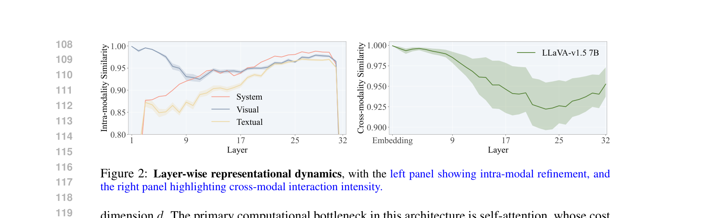
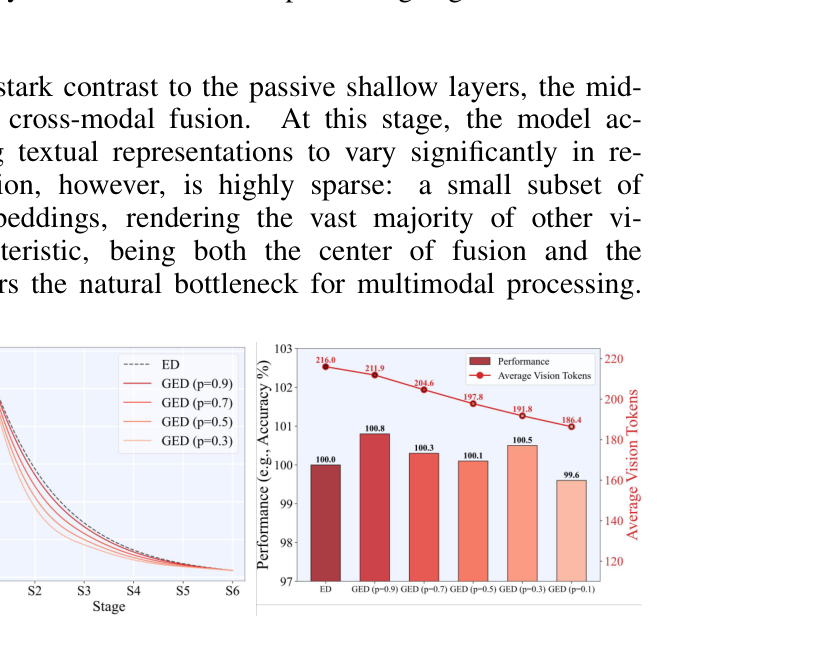
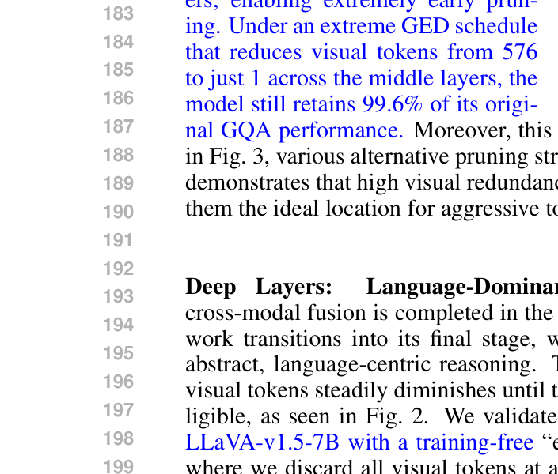

[← 返回 README](../README.md)

# 2. Unmasking the Processing Dynamics in MLLMs

## 📌 预览
这是本文最重要的分析Section。通过intra-modal similarity和cross-modal similarity两个指标，揭示MLLM的三层结构：浅层（传播者）→ 中层（稀疏融合中心）→ 深层（语言主导推理）。

---

A Multimodal Large Language Model (MLLM) processes a unified sequence of text and vision embeddings, h0 = [Ev : Et], through its Transformer layers. The text embeddings Et ∈ R^(Nt×d) come from a standard tokenizer, while the vision embeddings Ev ∈ R^(Nv×d) originate from a vision encoder that partitions an image into Nv patches and projects their features into the LLM's hidden dimension d. The primary computational bottleneck in this architecture is self-attention, whose cost scales quadratically with the number of vision tokens, O(Nv²d), as typically Nv ≫ Nt.

> 💡 **计算瓶颈**: self-attention复杂度是O(Nv²d)，而通常Nv远大于Nt（如LLaVA中Nv=576，而text可能只有几十个token）。这就是为什么压缩vision tokens这么重要。

---

To mitigate this computational burden, a common solution is progressive token pruning, which iteratively reduces the number of vision tokens across the model's layers. Most existing strategies, however, employ predetermined and static pruning schedules (e.g., linear or convex decay). These fixed approaches are applied uniformly, without considering the specific processing that occurs at different stages within the model.

This raises a critical question: what is an effective way to prune visual tokens? We contend that any sound strategy must be grounded in the model's actual behavior, rather than relying on a naive, hand-crafted heuristic. To move toward such a strategy, it is first crucial to understand how MLLMs process and integrate visual information internally. Therefore, this section presents an in-depth analysis of these internal dynamics. Our goal is to reveal that the different layers play fundamentally distinct roles in multimodal fusion, thereby informing a more principled approach to token pruning.

> 💡 **方法论**: 先理解模型内部动态，再设计pruning策略——这是data-driven的做法，比拍脑袋设计schedule更靠谱。这也是与STAR-Pro方法论相似的地方：都是先分析再设计。

---

## Shallow Layers: Propagators

A prevalent assumption in progressive pruning is that shallow layers are essential for early cross-modal fusion and must be preserved (Xing et al., 2024; Zhang et al., 2025). To scrutinize this belief, we perform a training-free layer-wise probe on LLaVA-v1.5-7B, feeding GQA image–question pairs through the network and recording hidden states at all layers. Our analysis, however, reveals that these layers function not as active integrators but as simple propagators. We demonstrate this by examining their contributions from two perspectives.

> 💡 **实验设计**: training-free probe——直接送GQA样本过网络，记录每层hidden states。不需要训练，纯分析。

---

First, we analyze intra-modal refinement by measuring how token representations evolve across layers for each modality M ∈ {System, Visual, Textual}. Concretely, we compute the modality-specific cosine similarity (S^M_intra) between the outputs of consecutive layers:

S^M_intra = (1/Nsample) Σᵢ (1/NM Σ_{t∈TM} ⟨x^l_{i,t}, x^{l+1}_{i,t}⟩ / (‖x^l_{i,t}‖₂ ‖x^{l+1}_{i,t}‖₂))

where l denotes the layer index, Nsample is the number of samples, TM is the set of tokens belonging to modality M with NM = |TM|, and x^l_{i,t} is the representation of token t in sample i at layer l.

> 💡 **Intra-modal similarity**: 计算相邻层同一modality的token表示的cosine similarity。如果similarity很高（接近1），说明这层几乎没有改变token的表示——即"传播"而非"处理"。

---

As shown in the left panel of Fig. 2, visual token representations in the shallow layers exhibit remarkably high self-similarity, undergoing only very minor changes across consecutive layers, indicating that the LLM backbone performs negligible processing on them in this stage.

---

Second, we measure cross-modal influence by how much text embeddings for a fixed instruction change when paired with different images, and define the resulting cross-modal similarity as S^Ins_cross:

S^Ins_cross = (1/Nsample) Σᵢ ⟨h^{(l,mis)}_{i,ins}, h^{(l,ref)}_{i,ins}⟩ / (‖h^{(l,mis)}_{i,ins}‖₂ ‖h^{(l,ref)}_{i,ins}‖₂)

where h^{(l,mis)}_{i,ins} is the layer-l instruction embedding for sample i paired with a mismatched image, and h^{(l,ref)}_{i,ins} is the counterpart paired with a fixed reference image.

> 💡 **Cross-modal similarity**: 固定instruction，换不同的image，看text embedding变化多少。如果cross-modal similarity高（接近1），说明text根本"不看"image——即没有发生跨模态融合。

---

Contrary to common belief, the right panel of Fig. 2 shows that, in shallow layers, text embeddings for a fixed instruction are nearly invariant to the accompanying image, indicating that cross-modal influence is still negligible and meaningful fusion has not yet occurred. Combined with the intra-modal analysis above, these results suggest that shallow layers primarily act as passive conduits, simply passing visual information to deeper layers where substantive processing begins.

> 💡 **浅层结论**: 两个证据都指向同一结论——浅层是passive conduits
> 1. **Intra-modal**: visual tokens几乎不变（similarity > 0.97）
> 2. **Cross-modal**: text embedding不受image影响（similarity > 0.98）
> - 这意味着在浅层处理vision tokens完全是浪费计算！

---

*Figure 2: Layer-wise representational dynamics, with the left panel showing intra-modal refinement, and the right panel highlighting cross-modal interaction intensity.*

> 💡 **Figure 2 批读**:
> - **左图 (Intra-modal)**:
>   - Visual tokens在Layer 1-9的similarity极高（>0.95），说明几乎不变
>   - 从Layer 9-10开始急剧下降，说明开始被真正处理
>   - System tokens在所有层都有高similarity（因为它们本来就不需要太多变化）
>   - Textual tokens从一开始就有较低similarity，说明LLM从第1层就开始处理text
> - **右图 (Cross-modal)**:
>   - Layer 1-9: cross-modal similarity接近1，说明没有融合
>   - Layer 9之后开始下降，到Layer 17左右最低——这就是fusion最活跃的区域
>   - Layer 25之后又开始回升，说明fusion已完成，进入language reasoning
> - **Layer 9是关键转折点**: 这就是HiDivDrop选择在Layer 9注入vision tokens的依据

---

## Middle Layers: Sparse Fusion Hubs

In stark contrast to the passive shallow layers, the middle layers emerge as the primary hubs for cross-modal fusion. At this stage, the model actively integrates visual information, causing textual representations to vary significantly in response to visual input (Fig. 2). This fusion, however, is highly sparse: a small subset of key visual tokens grounds the textual embeddings, rendering the vast majority of other visual tokens redundant. This dual characteristic, being both the center of fusion and the peak of redundancy, makes the middle layers the natural bottleneck for multimodal processing.

> 💡 **中层的双重特性**:
> 1. **融合中心**: text representation开始显著受image影响
> 2. **冗余高峰**: 只有少量关键vision tokens参与融合，大部分是冗余的
> - 这就是为什么可以在中层aggressive pruning——大部分vision tokens不参与fusion

---

We further substantiate this redundancy with training-based pruning experiments. On LLaVA-v1.5-7B, we applied an aggressive middle-layer schedules parameterized by exponential decay (ED) and generalized exponential decay (GED). In GED, an exponent p controls the decay shape, and when 0 < p < 1 the keep ratio drops much faster in early layers, enabling extremely early pruning. Under an extreme GED schedule that reduces visual tokens from 576 to just 1 across the middle layers, the model still retains 99.6% of its original GQA performance. Moreover, this robustness is not an artifact of a single schedule. As shown in Fig. 3, various alternative pruning strategies also maintain near-perfect accuracy. Such invariance demonstrates that high visual redundancy is a stable, inherent property of the middle layers, making them the ideal location for aggressive token compression.

> 💡 **中层冗余的实验验证**:
> - 576 → 1的极端压缩，仍保持99.6% GQA性能！
> - 多种不同的pruning schedule都能保持高精度
> - 说明中层的高冗余是**固有属性**，不是某种schedule的artifact

---

*Figure 3: Left: Vision token reduction curves under different p values, where lower p enforces stronger pruning. Right: Model performance remains stable even under high compression rates, demonstrating robustness of our pruning strategy.*

> 💡 **Figure 3 批读**:
> - **左图**: p值越小，pruning越激进（前面剪得越快）——这就是concave的意思
> - **右图**: 即使在极端压缩下（576→1），性能也只下降了不到0.5%
> - 这为Concave Pyramid Pruning提供了强有力的实验支撑

---

## Deep Layers: Language-Dominant Reasoning

Once cross-modal fusion is completed in the middle layers, the network transitions into its final stage, which is dominated by abstract, language-centric reasoning. The direct influence of visual tokens steadily diminishes until their role becomes negligible, as seen in Fig. 2. We validate this with behavior on LLaVA-v1.5-7B with a training-free "early exit" experiment, where we discard all visual tokens at a specific layer and observe the impact on performance. As shown in Fig. 4, removing visual tokens in the shallow or middle layers causes a catastrophic performance drop. However, removing them after the main fusion stage (e.g., beyond layer 24) results in almost no degradation. This finding provides strong evidence that the deep layers can operate effectively without direct access to visual information, relying instead on the fused multimodal representations formed in the middle layers. At this point, the network transitions fully into a language-dominant regime to refine semantics and generate the final output.

> 💡 **深层的角色**: 纯语言推理
> - Layer 24之后丢弃所有vision tokens，性能几乎无损
> - 说明到了深层，visual信息已经被完全"编码"到text representation中
> - 这为Early Exit策略提供了依据：Layer 25之后不需要vision tokens

---

*Figure 4: Early vision exit analysis under different masking ratios.*

> 💡 **Figure 4 批读**:
> - 从深层到浅层逐步masking vision tokens
> - Layer 24-25之后masking 100%，性能几乎不变
> - 但如果在Layer 20之前masking，性能急剧下降
> - 这清楚地划出了"fusion完成"的边界：约Layer 24-25

---

## 🔖 Section 总结

### MLLM三层结构
| 阶段 | 层级 (7B) | 角色 | 对vision tokens的处理 |
|------|----------|------|---------------------|
| 浅层 | Layer 1-9 | Propagators (传播者) | 几乎不变化，可以跳过 |
| 中层 | Layer 9-25 | Sparse Fusion Hubs | 积极融合但高度冗余，可以激进剪枝 |
| 深层 | Layer 25-32 | Language-Dominant Reasoning | 不需要vision tokens，可以完全丢弃 |

### 核心洞察
1. **Layer 9是fusion的起点**: intra-modal similarity在此急剧下降，cross-modal similarity开始偏离1
2. **中层冗余是固有属性**: 576→1仍保持99.6%性能
3. **Layer 25是fusion的终点**: 之后丢弃vision tokens无影响
4. **这个三层结构在不同backbone中是universal的**（见Appendix F.1）
