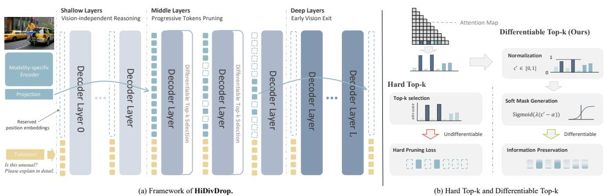
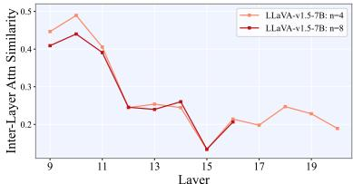

[← 返回 README](../README.md)

# 3 HiDivDrop

## 📌 预览
Section 3 详述 HiDivDrop 的三大组件：Late Injection + Early Exit（3.1）、Concave Pyramid Pruning with ILVAS + DTop-K（3.2）、以及工程实现细节（3.3：Persistent PE、FlashAttention 兼容、Parallel Decoupling）。

---

Building on the insights above, we propose HiDivDrop (Hierarchical Division-based Vision Token Dropping), a framework that adapts pruning to the hierarchical dynamics of MLLMs. As illustrated in Fig. 5, we exploit hierarchical redundancy by partitioning the LLM's layers into shallow, middle, and deep stages: we handle the shallow and deep stages with Late Injection and Early Exit, and apply Concave Pyramid Dropping in the middle stage to progressively reduce vision tokens.

*Figure 5: Overview of HiDivDrop. (a) Framework illustration, shallow layers focus on vision-independent reasoning, middle layers progressively prune redundant tokens through differentiable top-$k$ selection, and deep layers enable early vision exit. (b) Comparison between hard top-$k$ and our differentiable top-$k$, which achieves differentiable selection and better information preservation.*

> 💡 **Figure 5 批读**:
> - (a) 整体框架：清晰的三段式设计
>   - 浅层（灰色）：纯文本处理
>   - 中间层（蓝色渐变）：视觉 token 逐步减少
>   - 深层（灰色）：只剩文本
> - (b) Hard top-k vs DTop-K：
>   - Hard：不可微，选中=1、未选=0
>   - DTop-K：sigmoid 软掩码，梯度可以流过 → 端到端学习 token 重要性

---

## 3.1 Shallow and Deep: Joint Visual Layer Reduction

3.1 SHALLOW AND DEEP: JOINT VISUAL LAYER REDUCTION

As shown in Sec. 2, visual tokens are redundant in both shallow and deep stages. We therefore combine Late Vision Injection, which delays their introduction until fusion begins, with Early Vision Exit, which discards them once language-dominant reasoning takes over.

### Late Vision Injection

Late Vision Injection Knowing that shallow layers act as passive conduits (Sec. 2), our approach avoids wasteful computation by employing a Late Vision Injection strategy. Instead of processing visual tokens from the first layer, HiDivDrop bypasses the initial $L _ { \mathrm { i n j } } - 1$ layers for the visual stream entirely. The text-only forward pass proceeds until the injection layer $L _ { \mathrm { i n j } }$ , where the vision tokens are first introduced and concatenated with the text representations: $\mathbf { h } _ { L _ { \mathrm { i n j } } } = [ \mathbf { h } _ { L _ { \mathrm { i n j } } } ^ { v } : \mathbf { h } _ { L _ { \mathrm { i n j } } } ^ { t } ]$ . This injection point is strategically chosen at the onset of the active fusion stage, which we identify by a local minimum in the visual layer-wise similarity curve (layer 9 in our experiments, Fig. 2).

> 💡 **Late Injection 实现细节**:
> - Layer 0 ~ $L_\text{inj}-1$：只处理文本 token（视觉 token 完全不参与）
> - Layer $L_\text{inj}$：拼接视觉 token → $\mathbf{h}_{L_\text{inj}} = [\mathbf{h}^v : \mathbf{h}^t]$
> - 注入点选择：Fig. 2 中 visual intra-modal similarity 的局部最小值 = layer 9
> - **意义**：省掉 8 层 × 576 个视觉 token 的计算量

### Early Vision Exit

Early Vision Exit Our analysis in Sec. 2 shows that deep layers transition to a language-dominant regime where direct visual input is no longer required for reasoning. Therefore, HiDivDrop incorporates an Early Vision Exit strategy after a specific exit layer $L _ { \mathrm { e x i t } }$ , all remaining vision tokens are discarded, and the forward pass continues with only the text stream. We determine this exit point by identifying where model performance plateaus in our deep-to-shallow masking analysis, indicating that visual tokens are no longer contributing (layer 25, Fig. 4).

> 💡 **Early Exit 实现细节**:
> - Layer $L_\text{exit}$ 之后：丢弃所有剩余视觉 token，只保留文本
> - 退出点选择：Fig. 4 中性能持平的起始层 = layer 25
> - **视觉处理窗口**：Layer 9 → Layer 25（共 16 层，总 32 层的一半）

Together, Late Injection and Early Exit create a focused "vision processing window," restricting all vision tokens to only middle layers. This targeted approach significantly accelerates both training and inference, all while preserving the model's predictive accuracy.

> 💡 **"视觉处理窗口"概念**:
> - 传统方法：视觉 token 贯穿 32 层
> - HiDivDrop：视觉 token 只在 layer 9-25（16 层）中存在
> - 仅此一项就省下 50% 的视觉计算量（还没算中间层的 pruning）

---

## 3.2 Middle: Aggressive Concave Pyramid Pruning

# 3.2 MIDDLE: AGGRESSIVE CONCAVE PYRAMID PRUNING

Within the core vision processing window, we propose Concave Pyramid Pruning, an aggressive yet adaptive strategy to manage the high redundancy found in the middle layers (Sec. 2). This approach is designed to prune tokens rapidly at the start of the fusion stage and then more gradually, preserving essential information while maximizing computational savings. Implementing this strategy requires answering two key questions: (1) Where in the middle layers should pruning occur? and (2) Which specific tokens should be pruned at these locations?

> 💡 **两个核心问题**:
> 1. **Where**: 在中间层的哪些具体位置剪枝？
> 2. **Which**: 在这些位置剪掉哪些 token？

### Where to Prune: ILVAS

Where to Prune: Identifying Filtering Layers with ILVAS To determine the optimal layers for pruning, we introduce the Inter-Layer Visual Attention Similarity (ILVAS) metric. The core idea is to identify layers where the model has formed a stable assessment of token importance, making them ideal "filtering" points. ILVAS measures how consistently the most attended to visual tokens at one layer remain important in subsequent layers. Specifically, we compare the top- $K$ attention distributions for vision tokens between a layer $l$ and a future layer $l + n$ :

$$
\mathrm { I L V A S } ( l , l + n , K ) = \frac { 1 } { | \mathcal { V } _ { K } ^ { l } | } \sum _ { i \in \mathcal { V } _ { K } ^ { l } } \frac { \left. \tilde { \mathbf { A } } _ { i } ^ { l } , \tilde { \mathbf { A } } _ { i } ^ { l + n } \right. } { \left\| \tilde { \mathbf { A } } _ { i } ^ { l } \right\| \left\| \tilde { \mathbf { A } } _ { i } ^ { l + n } \right\| } ,
$$

where $\tilde { \mathbf { A } } _ { i } ^ { l }$ is the head-wise attention vector for vision token $i$ . A high ILVAS score indicates a stable filtering capacity. We compute its curve across the middle layers and select the local maxima to form our set of filtering layers $\mathcal { F }$ (e.g., layers $\{ 1 0 , 1 4 , 1 6 , 1 8 \}$ in Fig. 6).

*Figure 6: ILVAS curves for different window sizes, extended results in Appendix. G.5.*

> 💡 **ILVAS 的设计直觉**:
> - 核心思想：如果某层对 token 重要性的评估"稳定"（后续层也认同），那该层就是好的剪枝位置
> - 具体：比较 layer $l$ 和 layer $l+n$ 的 top-K 视觉 token 的注意力分布相似度
> - 高 ILVAS → token 重要性排序稳定 → 适合在此处剪枝
> - 选择 ILVAS 曲线的**局部最大值**作为 filtering layers
> - LLaVA-1.5-7B：$\mathcal{F} = \{10, 14, 16, 18\}$
> - **与 FastV 的对比**：FastV 用单层 attention score 做一次性剪枝，ILVAS 用**层间一致性**确保剪枝稳定性

### Which Tokens to Prune: DTop-K

Which Tokens to Prune: Learnable Selection with Differentiable Top-K Once the filtering layers are identified, the next challenge is to select which specific tokens to prune. Previous methods often rely on non-differentiable Hard Top- $K$ selection, which prevents the model from learning token importance directly. To overcome this, we employ a Differentiable Top- $K$ (DTop- $K$ ) operator (Liu et al., 2024b), which provides a continuous relaxation of the selection process.

normalized rank score c′ for each token: c′i = 1n Pnj=1 ⊮(ci ≥ cj ). This maps the scores to a [0, 1] $c \in \mathbb { R } ^ { N }$ range. Next, a soft mask is generated using a sigmoid function with a learnable pruning ratio $a$ :

$$
M a s k ( c , a ) = \mathrm { S i g m o i d } ( ( c - a ) \cdot \lambda ) = \frac { 1 } { 1 + e ^ { - \lambda ( c _ { i } ^ { \prime } - a ) } } .
$$

This soft mask allows gradients to flow during backpropagation, enabling the model to learn which tokens are important. For the forward pass, a hard threshold is applied to the mask to make a discrete token selection. By combining ILVAS to determine where to prune and DTop- $K$ to learn which tokens to prune, our method dynamically and efficiently compresses visual information. A detailed comparison with Hard Top- $K$ is provided in Sec. 4.3.

> 💡 **DTop-K 机制详解**:
> 1. 计算每个 token 的重要性分数 $c_i$
> 2. 归一化为排名分数 $c'_i \in [0, 1]$
> 3. Sigmoid 软掩码：$\text{Mask} = \sigma(\lambda(c'_i - a))$，其中 $a$ 是**可学习的剪枝阈值**
> 4. 前向：硬阈值（离散选择）；反向：sigmoid 梯度（连续梯度流）
> - 温度 $\lambda = N_v$（视觉 token 数）→ 越多 token 时 sigmoid 越尖锐
> - **优势**：模型可以端到端学习哪些 token 重要，而非依赖固定启发式
> - **与 Dynamic-LLaVA 的区别**：Dynamic-LLaVA 用 soft gating 只提供近似梯度，DTop-K 提供精确的连续松弛

---

## 3.3 Solutions to Implementation Challenges

# 3.3 SOLUTIONS TO IMPLEMENTATION CHALLENGES

### Persistent Position Encoding

Persistent Position Encoding HiDivDrop dynamically changes which visual tokens are active across layers because of late injection, progressive dropping, and early exit. Naively reindexing tokens under this dynamic behavior can misalign positional encodings. To avoid this, each visual token is assigned a persistent positional identifier at input: although the shallow layers contain no visual tokens, their indices are reserved, activated upon injection, and preserved through subsequent dropping or exit. For RoPE, queries and keys are always rotated using these fixed identifiers, ensuring consistent relative geometry across the model.

> 💡 **Persistent PE 的必要性**:
> - 问题：Late Injection + Progressive Dropping + Early Exit 导致 token 集合在不同层动态变化
> - 如果重新编号（reindex）→ 位置编码错乱，类似 streaming LLM 的 position-ID mismatch
> - 解决：输入时分配固定位置 ID，全程不变
> - 浅层虽然没有视觉 token，但**预留**了它们的位置索引
> - **消融实验证实**（Table 5）：Persistent PE > Group PE > Compacted PE

### Efficient Attention Compatibility

Efficient Attention Compatibility To remain compatible with efficient attention kernels such as FlashAttention, the original attention computation is left intact over the full sequence. Token selection is handled separately by a lightweight auxiliary attention pass, restricted to interactions between the final text token and visual tokens. Since this auxiliary step involves only a single query, its overhead is negligible, and the efficiency benefits of HiDivDrop are fully preserved.

> 💡 **FlashAttention 兼容设计**:
> - 挑战：FlashAttention 需要连续的 token 序列，不支持任意掩码
> - 解决：主 attention 不修改（FlashAttention 正常跑）；token 选择用单独的轻量 auxiliary attention（一个 query vs 视觉 tokens）
> - 开销可忽略：因为只有 1 个 query token

### Parallel Decoupling

Parallel Decoupling of Vision-related Operations Late injection theoretically allows us to shorten the critical-path prefill time by decoupling vision-related computation from the main attention stack. Before the injection layer, all transformer layers operate purely on text tokens, while in parallel we run the vision encoder once, apply the projector to obtain visual KV tensors, and cache them. At the injection layer, these cached visual KV tensors are concatenated with the text KV tensors, and subsequent layers attend over the combined set. During HiDivDrop's multi-stage pruning, we only update indices over the cached visual KV tensors instead of recomputing projections. This parallel decoupling removes visual KV projection from the prefill bottleneck and remains compatible with FlashAttention-style kernels.

> 💡 **Parallel Decoupling 的工程价值**:
> - Late Injection 的额外好处：浅层纯文本 → 可以**并行**运行 vision encoder + projector
> - 视觉 KV 缓存后直接在注入层拼接
> - Prefill 延迟：63.6ms → 31.8ms（解耦后）→ 28.8ms（减少 dropping stages）
> - 这是从架构设计到工程优化的完整闭环

---

## 🔖 Section 总结

### 方法组件总览
| 组件 | 解决问题 | 关键设计 |
|------|----------|----------|
| Late Injection | 浅层无用计算 | 跳过 layer 0-8，layer 9 注入 |
| Early Exit | 深层无用计算 | Layer 25 后丢弃所有视觉 token |
| Concave Pyramid Pruning | 中间层冗余 | 前快后慢的非均匀剪枝 |
| ILVAS | 在哪剪 | 层间注意力一致性选最大值 → {10,14,16,18} |
| DTop-K | 剪什么 | 可微 sigmoid 软掩码 + 可学习阈值 |
| Persistent PE | 位置编码错乱 | 固定位置 ID，全程不变 |
| FlashAttention 兼容 | 实际加速 | 辅助 attention pass（1 query） |
| Parallel Decoupling | prefill 延迟 | 视觉编码与浅层文本处理并行 |

### 核心洞察
1. Late Injection 比 early pruning 更优：不丢失信息 + 启用并行解耦
2. ILVAS 从数据驱动地选择剪枝层，比手工等间距更好
3. DTop-K 让 token 选择可训练，提升 2% 性能（97.7% → 99.7%）
4. 工程细节（PE、FlashAttention、并行）确保理论加速→实际加速
