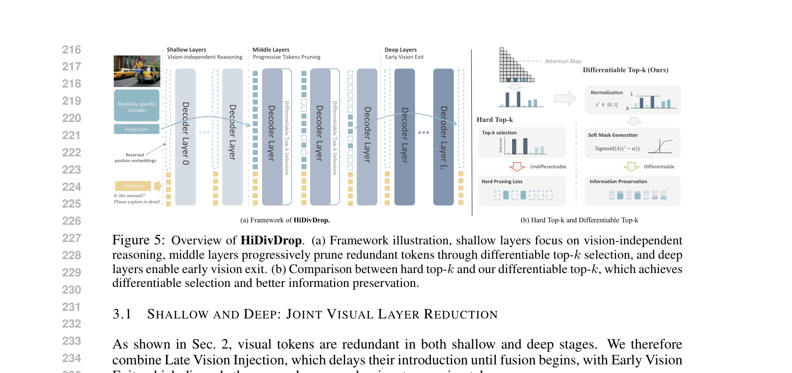
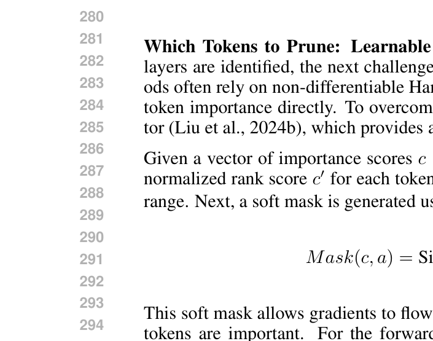

[← 返回 README](../README.md)

# 3. HiDivDrop

## 📌 预览
方法核心：将LLM层级划分为shallow-middle-deep三段，分别用Late Injection、Concave Pyramid Pruning、Early Exit处理。关键技术包括ILVAS（找最佳剪枝层）和Differentiable Top-K（可微token选择）。

---

Building on the insights above, we propose HiDivDrop (Hierarchical Division-based Vision Token Dropping), a framework that adapts pruning to the hierarchical dynamics of MLLMs. As illustrated in Fig. 5, we exploit hierarchical redundancy by partitioning the LLM's layers into shallow, middle, and deep stages: we handle the shallow and deep stages with Late Injection and Early Exit, and apply Concave Pyramid Dropping in the middle stage to progressively reduce vision tokens.

> 💡 **框架总览**: 三段式处理
> - **Shallow (Layer 1-8)**: 不含vision tokens → Late Injection
> - **Middle (Layer 9-25)**: progressive pruning → Concave Pyramid + DTop-K
> - **Deep (Layer 25-32)**: 无vision tokens → Early Exit

---


*Figure 5: Overview of HiDivDrop. (a) Framework illustration, shallow layers focus on vision-independent reasoning, middle layers progressively prune redundant tokens through differentiable top-k selection, and deep layers enable early vision exit. (b) Comparison between hard top-k and our differentiable top-k, which achieves differentiable selection and better information preservation.*

> 💡 **Figure 5 批读**:
> - **(a) 整体框架**: 清楚展示了vision tokens只存在于middle layers的"窗口"中
>   - 浅层只有text tokens（蓝色）
>   - 中层逐步减少vision tokens（黄色渐少）
>   - 深层只剩text tokens
> - **(b) Hard vs Differentiable Top-K**:
>   - Hard Top-K: 0/1选择，不可微分，梯度无法回传
>   - DTop-K: 通过sigmoid soft mask实现连续松弛，保留梯度流

---

## 3.1 Shallow and Deep: Joint Visual Layer Reduction

As shown in Sec. 2, visual tokens are redundant in both shallow and deep stages. We therefore combine Late Vision Injection, which delays their introduction until fusion begins, with Early Vision Exit, which discards them once language-dominant reasoning takes over.

### Late Vision Injection

Knowing that shallow layers act as passive conduits (Sec. 2), our approach avoids wasteful computation by employing a Late Vision Injection strategy. Instead of processing visual tokens from the first layer, HiDivDrop bypasses the initial Linj − 1 layers for the visual stream entirely. The text-only forward pass proceeds until the injection layer Linj, where the vision tokens are first introduced and concatenated with the text representations: h_Linj = [h^v_Linj : h^t_Linj]. This injection point is strategically chosen at the onset of the active fusion stage, which we identify by a local minimum in the visual layer-wise similarity curve (layer 9 in our experiments, Fig. 2).

> 💡 **Late Injection 细节**:
> - **Layer 1-8**: 只处理text tokens（大幅加速，因为序列长度从576+Nt缩短为Nt）
> - **Layer 9**: 将完整的576个vision tokens注入，与text representation拼接
> - **选择依据**: Fig. 2中visual intra-modal similarity的**局部最小值**在Layer 9
> - **关键优势**: 不丢失任何信息（所有576个token都在Layer 9注入），同时跳过了8层无用计算
> - **与early pruning的对比**: early pruning会永久丢失token，Late Injection保留全部

### Early Vision Exit

Our analysis in Sec. 2 shows that deep layers transition to a language-dominant regime where direct visual input is no longer required for reasoning. Therefore, HiDivDrop incorporates an Early Vision Exit strategy after a specific exit layer Lexit, all remaining vision tokens are discarded, and the forward pass continues with only the text stream. We determine this exit point by identifying where model performance plateaus in our deep-to-shallow masking analysis, indicating that visual tokens are no longer contributing (layer 25, Fig. 4).

> 💡 **Early Exit 细节**:
> - **Layer 25之后**: 丢弃所有剩余vision tokens
> - **选择依据**: Fig. 4中deep-to-shallow masking实验显示Layer 25后性能plateau
> - **实际效果**: Layer 25之后只剩text tokens，这7层的计算大幅减少

Together, Late Injection and Early Exit create a focused "vision processing window," restricting all vision tokens to only middle layers. This targeted approach significantly accelerates both training and inference, all while preserving the model's predictive accuracy.

> 💡 **Vision Processing Window**: Layer 9-25，共17层（32层中的53%）。这意味着vision tokens只在约一半的层中存在，直接减少了~47%的vision相关计算。

---

## 3.2 Middle: Aggressive Concave Pyramid Pruning

Within the core vision processing window, we propose Concave Pyramid Pruning, an aggressive yet adaptive strategy to manage the high redundancy found in the middle layers (Sec. 2). This approach is designed to prune tokens rapidly at the start of the fusion stage and then more gradually, preserving essential information while maximizing computational savings. Implementing this strategy requires answering two key questions: (1) Where in the middle layers should pruning occur? and (2) Which specific tokens should be pruned at these locations?

> 💡 **两个核心问题**:
> 1. **WHERE to prune**: 在哪些层做pruning？→ 用ILVAS找
> 2. **WHICH tokens to prune**: 选哪些token保留？→ 用DTop-K学

---

### Where to Prune: Identifying Filtering Layers with ILVAS

To determine the optimal layers for pruning, we introduce the Inter-Layer Visual Attention Similarity (ILVAS) metric. The core idea is to identify layers where the model has formed a stable assessment of token importance, making them ideal "filtering" points. ILVAS measures how consistently the most attended to visual tokens at one layer remain important in subsequent layers. Specifically, we compare the top-K attention distributions for vision tokens between a layer l and a future layer l + n:

ILVAS(l, l+n, K) = (1/|V^l_K|) Σ_{i∈V^l_K} ⟨Ã^l_i, Ã^{l+n}_i⟩ / (‖Ã^l_i‖ · ‖Ã^{l+n}_i‖)

where Ã^l_i is the head-wise attention vector for vision token i. A high ILVAS score indicates a stable filtering capacity. We compute its curve across the middle layers and select the local maxima to form our set of filtering layers F (e.g., layers {10, 14, 16, 18} in Fig. 6).

> 💡 **ILVAS 解读**:
> - **高ILVAS**: 当前层认为重要的token，在后续层也被认为重要 → 这层的判断是稳定的，适合做pruning
> - **低ILVAS**: token重要性在层间变化大 → 这层不适合做pruning决策
> - **选local maxima**: ILVAS曲线的峰值点就是最佳filtering layers
> - **LLaVA-1.5-7B的filtering layers**: {10, 14, 16, 18}
> - **Concave体现在哪里**: Layer 10和14之间间隔4层（前面快），16和18之间只隔2层（后面慢）

---


*Figure 6: ILVAS curves for different window sizes.*

> 💡 **Figure 6 批读**:
> - 两种window size (n=4, n=8) 显示一致的模式
> - Layer 10, 14, 16, 18处有local maxima → 这就是选定的filtering layers
> - Layer 12-13处ILVAS较低 → 不适合在这里做pruning决策

---

### Which Tokens to Prune: Learnable Selection with Differentiable Top-K

Once the filtering layers are identified, the next challenge is to select which specific tokens to prune. Previous methods often rely on non-differentiable Hard Top-K selection, which prevents the model from learning token importance directly. To overcome this, we employ a Differentiable Top-K (DTop-K) operator (Liu et al., 2024b), which provides a continuous relaxation of the selection process.

Given a vector of importance scores c ∈ R^N for N tokens, the DTop-K operator first computes a normalized rank score c' for each token: c'_i = (1/n) Σⱼ 𝟙(ci ≥ cj). This maps the scores to a [0, 1] range. Next, a soft mask is generated using a sigmoid function with a learnable pruning ratio a:

Mask(c, a) = Sigmoid((c' − a) · λ) = 1 / (1 + e^{−λ(c'_i − a)})

This soft mask allows gradients to flow during backpropagation, enabling the model to learn which tokens are important. For the forward pass, a hard threshold is applied to the mask to make a discrete token selection. By combining ILVAS to determine where to prune and DTop-K to learn which tokens to prune, our method dynamically and efficiently compresses visual information. A detailed comparison with Hard Top-K is provided in Sec. 4.3.

> 💡 **Differentiable Top-K 详解**:
> 1. **Importance score c**: 来自last text token对vision tokens的attention score
> 2. **Normalized rank c'**: 将importance映射到[0,1]（本质上是排名的百分位数）
> 3. **Soft mask**: sigmoid((c' - a) · λ)，其中a是可学习的pruning ratio
> 4. **Temperature λ = Nv**: 控制sigmoid的陡峭程度，λ越大越接近hard threshold
> 5. **训练时**: 用soft mask保持可微性
> 6. **推理时**: 用hard threshold做离散选择
> - **vs Hard Top-K**: Hard Top-K的性能在PT+FT设置下是97.7%，DTop-K是99.7%——提升2%
> - **在高压缩率下优势更明显**: 因为需要更精准地选择保留哪些token

---

## 3.3 Solutions to Implementation Challenges

### Persistent Position Encoding

HiDivDrop dynamically changes which visual tokens are active across layers because of late injection, progressive dropping, and early exit. Naively reindexing tokens under this dynamic behavior can misalign positional encodings. To avoid this, each visual token is assigned a persistent positional identifier at input: although the shallow layers contain no visual tokens, their indices are reserved, activated upon injection, and preserved through subsequent dropping or exit. For RoPE, queries and keys are always rotated using these fixed identifiers, ensuring consistent relative geometry across the model.

> 💡 **Position ID问题**:
> - **问题根源**: Late Injection（插入token）、Progressive Dropping（删除token）、Early Exit（删除token）都会改变token集合，如果naively重编号，position encoding就乱了
> - **解决方案**: Persistent PE——给每个vision token在最开始就分配固定的position ID，全程不变
> - **具体做法**: 浅层虽然没有vision tokens，但它们的position ID被"预留"了
> - **Ablation结果**: Persistent PE > Group PE > Compacted PE（PDrop的做法最差）
> - **这和streaming LLM中的position ID mismatch问题本质相似**

### Efficient Attention Compatibility

To remain compatible with efficient attention kernels such as FlashAttention, the original attention computation is left intact over the full sequence. Token selection is handled separately by a lightweight auxiliary attention pass, restricted to interactions between the final text token and visual tokens. Since this auxiliary step involves only a single query, its overhead is negligible, and the efficiency benefits of HiDivDrop are fully preserved.

> 💡 **FlashAttention兼容**: 
> - 不修改主attention计算，token selection通过一个轻量的辅助attention完成
> - 辅助attention只有1个query（last text token），开销可忽略

### Parallel Decoupling of Vision-related Operations

Late injection theoretically allows us to shorten the critical-path prefill time by decoupling vision-related computation from the main attention stack. Before the injection layer, all transformer layers operate purely on text tokens, while in parallel we run the vision encoder once, apply the projector to obtain visual KV tensors, and cache them. At the injection layer, these cached visual KV tensors are concatenated with the text KV tensors, and subsequent layers attend over the combined set. During HiDivDrop's multi-stage pruning, we only update indices over the cached visual KV tensors instead of recomputing projections. This parallel decoupling removes visual KV projection from the prefill bottleneck and remains compatible with FlashAttention-style kernels.

> 💡 **并行解耦**:
> - **思路**: 浅层处理text的同时，并行运行vision encoder + projector
> - **效果**: 进一步减少prefill latency（从32.6ms降到31.8ms，再到28.8ms）
> - **具体做法**: 
>   - Thread 1: Layer 1-8处理text tokens
>   - Thread 2: Vision encoder → Projector → 缓存visual KV tensors
>   - Layer 9: 合并两个thread的结果

---

## 🔖 Section 总结

### HiDivDrop完整流程（LLaVA-1.5-7B为例）
```
Input: 576 vision tokens + Nt text tokens
  │
  ├── Layer 1-8: 只处理text tokens (Late Injection)
  │              同时并行: vision encoder → projector → cache visual KV
  │
  ├── Layer 9:   注入576 vision tokens
  │
  ├── Layer 10:  DTop-K pruning → 保留约256 tokens (Filtering Layer 1)
  │
  ├── Layer 14:  DTop-K pruning → 保留约128 tokens (Filtering Layer 2)
  │
  ├── Layer 16:  DTop-K pruning → 保留约96 tokens  (Filtering Layer 3)
  │
  ├── Layer 18:  DTop-K pruning → 保留约64 tokens  (Filtering Layer 4)
  │
  ├── Layer 25:  Early Exit → 丢弃所有vision tokens
  │
  └── Layer 26-32: 只处理text tokens (Language-Dominant Reasoning)

Output: 平均64个vision tokens参与计算（88.9%压缩率）
```

### 关键技术总结
| 技术 | 作用 | 关键参数 |
|------|------|---------|
| Late Injection | 跳过浅层 | Linj = 9 |
| Early Exit | 跳过深层 | Lexit = 25 |
| ILVAS | 找最佳pruning层 | F = {10,14,16,18} |
| DTop-K | 可微token选择 | λ = Nv, learnable a |
| Persistent PE | 位置编码一致性 | 固定RoPE indices |
| Parallel Decoupling | 并行加速 | vision与text并行 |
