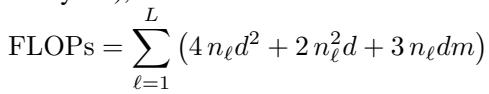
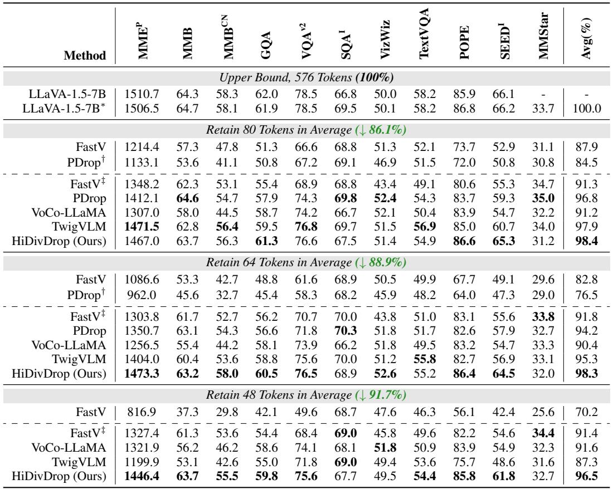
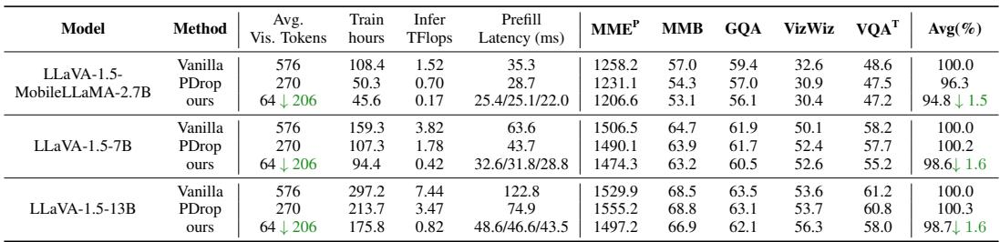
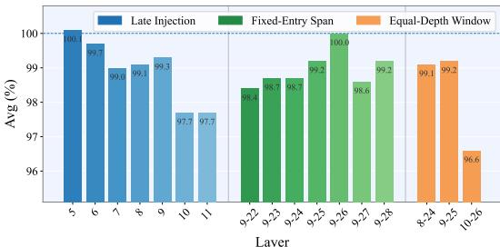
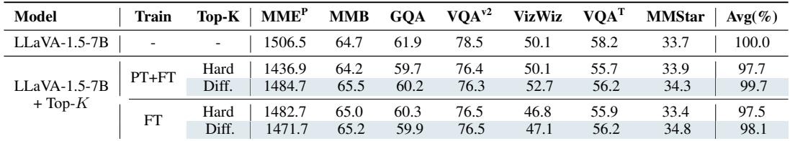
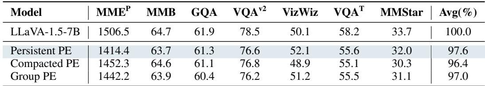
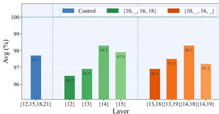

[← 返回 README](../README.md)

# 4 Experiment

## 📌 预览
实验部分覆盖三个模型骨干（2.7B/7B/13B）× 11 个 benchmark × 三种压缩率。HiDivDrop 在 88.9% 压缩率下保持 98.3% 性能，训练时间降 40.7%，推理 FLOPs 降 88.9%。消融实验验证了每个组件的贡献。

---

## 4.1 Experimental Settings

# 4.1 EXPERIMENTAL SETTINGS

Models Within the LLaVA-1.5 architecture (Liu et al., 2023a), we verify the effectiveness of the proposed HiDivDrop with three different LLM backbones: MobileLLaMA-2.7B (Wu et al., 2024), Vicuna-7B-v1.5, and Vicuna-13B-v1.5 (Zheng et al., 2023). The details are provided in Appendix C.

Benchmarks To thoroughly evaluate the HiDivDrop, we conduct experiments on 11 mainstream benchmarks, including ${ \bf M M E } ^ { \mathrm { P } }$ (Fu et al., 2023), MMB, MMBCN (Liu et al., 2025), GQA (Hudson & Manning, 2019), $\mathrm { V Q } \bar { \mathrm { A } } ^ { \mathrm { v } 2 }$ (Goyal et al., 2017), SQAI (Lu et al., 2022), VizWiz (Gurari et al., 2018), TextVQA (Singh et al., 2019), POPE (Li et al., 2023), SEEDI (Li et al., 2024a), and MMStar (Chen et al., 2024c). Notably, MMStar (Chen et al., 2024c) is a multimodal benchmark characterized by strong visual dependency and minimal data leakage. See Appendix D for details.

> 💡 **实验设计亮点**:
> - 3 个模型规模：2.7B / 7B / 13B → 验证可扩展性
> - 11 个 benchmark → 全面覆盖感知、推理、OCR、幻觉检测
> - MMStar：强视觉依赖 + 低数据泄漏 → 最能体现视觉压缩的影响

---

Efficiency Evaluation We consider the efficiency in both training and inference following PDrop (Xing et al., 2024). For training, we report real GPU hours on the same device; for inference, we report FLOPs for vision token part. Specifically, for a Transformer block, the FLOPs from MHA and FFN are $4 n d ^ { 2 } + 2 n ^ { 2 } d + 3 \dot { n } d m$ , where $n$ is the number of vision tokens, $d$ is the hidden size, and $m$ is the FFN intermediate dimension. Aggregating across layers (with $n _ { \ell }$ denoting the number of vision tokens at layer $\ell$ ), the total FLOPs are:

> 💡 **FLOPs 计算公式**:
> - 每层：MHA ($4nd^2 + 2n^2d$) + FFN ($3ndm$)
> - 关键：$n_\ell$ 是**每层实际的视觉 token 数**，HiDivDrop 让这个数逐层递减
> - 浅层 $n=0$、中间层递减、深层 $n=0$ → FLOPs 大幅缩减

---

Implementation Details For DTop- $\mathbf { \nabla } \cdot \mathbf { K }$ operation, we set the temperate $\lambda = N _ { v }$ , which means the number of the visual candidate vision tokens. For LLaVA-1.5-7B, we adopt late injection layer $L _ { \mathrm { i n j } } = 9$ , early exit layer $L _ { \mathrm { e x i t } } = 2 5$ , and filtering layers $\mathcal { F } = \{ 1 0 , 1 4 , 1 6 , 1 8 \}$ . For LLaVA-1.5- MobileLLaMA-2.7B, we ues $L _ { \mathrm { i n j } } = 1 5$ , $L _ { \mathrm { e x i t } } = 2 8$ , and $\mathcal { F } = \{ 1 6 , 1 9 , 2 2 , 2 5 \}$ . All experiments are conducted on 8 NVIDIA A100 40 GB GPUs. Unless otherwise stated, we follow LLaVA's default training (pretrain and instruction finetuning) and evaluation settings for benchmarks included in its suite. The evalution of the MMStar is done via LMMS-Eval (Zhang et al., 2024a) toolkit.

> 💡 **超参数速查**:
> | 模型 | $L_\text{inj}$ | $L_\text{exit}$ | $\mathcal{F}$ | 视觉处理窗口 |
> |------|:-:|:-:|:-:|:-:|
> | 7B (Vicuna) | 9 | 25 | {10,14,16,18} | 16 层 / 32 层 |
> | 2.7B (MobileLLaMA) | 15 | 28 | {16,19,22,25} | 13 层 / 32 层 |
> 
> - 不同模型需要不同的注入/退出点 → 需要 per-model 的分析
> - 温度 $\lambda = N_v$（576）→ sigmoid 接近阶跃函数

---

## 4.2 Main Results

# 4.2 MAIN RESULTS

### Performance Comparison (Table 1)

Comparison with State-of-the-art Methods To ensure a fair comparison, we conduct controlledbudget experiment under three different compression ratio. As shown in Table 1, using LLaVA1.5-7B as the base LMM, we compare HiDivDrop against state-of-the-art in-LLM vision token compression methods across eleven widely used benchmarks. HiDivDrop consistently and markedly outperforms all counterparts at all pruning ratios. Notably, it retains $9 8 . 3 \%$ and $9 6 . 5 \%$ of the baseline performance while pruning $8 8 . 9 \%$ and $9 1 . 7 \%$ of vision tokens, respectively. Compared with the most similar progressive token pruning approach, PDrop (Xing et al., 2024), HiDivDrop achieves higher performance on nearly all benchmarks under the $8 8 . 9 \%$ pruning ratio, with a gap of $4 . 1 \%$ average performance. At even more aggressive compression, HiDivDrop still retains $9 6 . 5 \%$ of the baseline at $9 1 . 7 \%$ pruning, whereas PDrop cannot reach this pruning level under the same protocol.

*Table 1: Performance comparisons with three pruning ratios on 11 benchmarks.*

> 💡 **Table 1 核心数字**:
> - 在 88.9% 压缩率下，HiDivDrop 比 PDrop 高 4.1%
> - 在 91.7% 压缩率下，PDrop 根本无法达到此压缩率
> - training-free 方法（FastV）在高压缩率下性能急剧下降
> - HiDivDrop 的优势在高压缩率下更加显著

---

### Efficiency (Table 2)

Efficiency of HiDivDrop in Training & Inference As shown in Table 2, HiDivDrop reduces the training time (including both pretraining and finetuning stages) of LLaVA-1.5-7B from 159.3 to 94.4 GPU hours, resulting in an impressive $4 0 . 7 \%$ reduction in overall time. In addition to the training efficiency improvement, HiDivDrop also reduces the inference FLOPs from $3 . 8 2 \mathrm { T }$ to $0 . 4 2 \mathrm { T } ,$ , achieving an $8 8 . 9 \%$ reduction. Moreover, HiDivDrop lowers the prefill latency from $6 3 . 6 \mathrm { m s }$ to $3 2 . 6 ~ \mathrm { m s } ,$ , and can be further reduced to $3 1 . 8 ~ \mathrm { { m s } }$ and $2 8 . 8 \mathrm { m s }$ through parallelly decoupled visual KV projection and fewer dropping stages. Notably, compared to PDrop's pruning ratio of $4 6 . 9 \%$ , HiDivDrop achieves a much higher pruning ratio of $8 9 . 0 \%$ , which is 4.8 times more aggressive, while the performance drop is only $1 . 6 \%$ , demonstrating HiDivDrop's superior efficiency and minimal accuracy trade-off. Similar trends are observed on LLaVA-1.5-MobileLLaMA-2.7B and LLaVA-1.5-13B: across both smaller and larger backbones, HiDivDrop consistently delivers substantial reductions in training time, FLOPs, and prefill latency under much stronger pruning ratios, while incurring only a slight degradation compared to the vanilla models.

*Table 2: Efficiency comparison across three LLM backbones within the LLaVA-1.5 framework.*

> 💡 **Table 2 效率对比（7B）**:
> - PDrop 仅压缩 46.9% 就接近 baseline → HiDivDrop 压缩 89% 仍只掉 1.6%
> - FLOPs 降了 **9.1×**（3.82T → 0.42T）
> - 三个模型规模趋势一致 → 方法的通用性
> - **PDrop Avg 100.2% > baseline**：可能是正则化效果，值得注意

---

## 4.3 Ablation Studies

# 4.3 ABLATION STUDIES

To better understand the proposed HiDivDrop, we conduct three group ablation studies to investigate the key attributes of several critical components: (1) Late injrection and early exit, assessed independently on the base model; (2) The effect of differentiable top- $k$ and token importance calculation, examined within the progressive dropping setup, where vision tokens are pruned in stages $( 5 7 6 \to 6 4 \to 8 \to 1 )$ ) at evenly spaced intervals; and (3) Position encoding and filter layer selection, analyzed within the complete shallow-middle-deep compression structure.

### Late Injection & Early Exit (Figure 7)

Late Injection and Early Exit Our late injection and early exit are guided by two diagnostics: layer 9 aligns with a local minimum in the visual layer-wise similarities (Fig. 2), and accuracy plateaus around layer 25 under deepto-shallow masking (Fig. 4). We validate these choices with three sweeps (Fig. 7). In the late entry sweep, varying the injection layer with the exit fixed shows a clear peak at layer 9; injecting earlier adds cost with little gain, and injecting later degrades accuracy. In the fixed entry span sweep, fixing injection at layer 9 and varying the exit peaks around layers 25 to 26; later exits add cost and earlier exits hurt accuracy. In the equal depth window sweep, sliding a constant-length window confirms 8–24 and 9–25 as near-optimal, while 10–26 underperforms. Notably, in the deep-to-shallow diagnostic, performance matches the baseline at layer 26 and is only slightly lower at layer 25; we therefore choose 25 as the exit, expecting training to recover the small gap, and the sweeps verify that the 9 to 25 window is a strong choice.

*Figure 7: Ablation across visual perception layers comparing Late Injection, Fixed-Entry Span, and Equal-Depth Window, confirming that our setting is the most efficient. The full per-benchmark results are provided in Appendix G.1, Table 8.*

> 💡 **Figure 7 批读**:
> - 三种 sweep 方式交叉验证注入/退出点
> - Layer 9 注入是 sweet spot：早了浪费，晚了掉精度
> - Layer 25 退出是 sweet spot：晚了浪费，早了掉精度
> - 等深度窗口 sweep 进一步确认 9-25 最优
> - **实验方法值得借鉴**：多角度 sweep 而非单点验证

---

### Differentiable Top-K (Table 3)

Differentiable Top-K We study hard top- $k$ and differentable top- $k$ under a progressive pruning schedule. As shown in Table 3, replacing hard top- $k$ with differentable top- $k$ lifts the average performance from $9 7 . 7 \%$ to $9 9 . 7 \%$ with two-stage training (pretraining then finetuning) and from $9 7 . 5 \%$ to $9 8 . 1 \%$ with one-stage training (finetuning only), indicating more faithful token selection under the same training setting. Since the gain is larger with two-stage training, we adopt this recipe as the default in our experiments. See Appendix G.2 for additional token decay schedules.

*Table 3: Performance comparison of LLaVA variants with Hard vs. Differentiable Top-K Operators.*

> 💡 **Table 3 DTop-K 消融**:
> - PT+FT 时 DTop-K 收益更大 → 两阶段训练让 DTop-K 有更多机会学习
> - 99.7% 接近 baseline → DTop-K 几乎完全消除了剪枝带来的性能损失

---

### Token Weighting (Table 4)

Token Weighting Strategies We compare training-time strategies for estimating the importance of vision tokens. As shown in Table 4, using attention from all text tokens to vision tokens with L2-norm weighting performs only on par with the multi-round last token variant. In fact, on the full set of 11 benchmarks (see Table 10 in the Appendix G.3), the latter is $0 . 3 \%$ lower on average. Given the extra cost from the eager attention used for importance calculation, we default to the multi-round last-token scheme.

> 💡 **Token 重要性估计策略**:
> - Last token (n-rounds)：多轮从最后一个文本 token 看视觉 token → **99.7%**
> - All token (L2 norm)：所有文本 token 聚合 → 99.6%
> - 性能差不多，但 all-token 需要 eager attention 额外开销
> - **选择依据**：性能相当时优先选低开销方案

---

### Position Encoding (Table 5)

Position Encoding Conceptually, similar to the "position-ID mismatch" in streaming LLMs (Tong et al., 2025), but distinct in cause: ours arises from cross-layer changes in the set of surviving vision tokens due to late injection (insertion), progressive dropping (pruning), and early exit (removal). We therefore compare three positional encoding (PE) schemes: (1) Persistent PE: assign fixed RoPE indices at input and never update them; (2) Compacted PE (PDrop-style): start with preset indices and, at pruning stages, reset indices to compact surviving tokens and fill gaps; and (3) Group PE: allocate disjoint RoPE index ranges for instruction and vision tokens, with no in-place updates during injection, pruning, or exit. As summarized in Table 5, Persistent PE achieves the best average performance, Group PE is close, and Compacted PE performs worst, consistent with the hypothesis that resetting indices exacerbates cross-layer position mismatch. Given its accuracy and zero overhead, we adopt Persistent PE by default. More benchmark results appear in Appendix G.4.

*Table 5: Effect of position encoding (PE) schemes under shallow–middle–deep compression.*

> 💡 **Table 5 PE 消融**:
> - 重编号最差 → 印证了 position-ID mismatch 假设
> - Persistent PE 最简单且最好 → 少即是多

---

### Filtering Layer Selection (Figure 8)

Filtering Layer Selection We first compute the ILVAS curve over the middle layers on a model configured with late injection and early exit, and select its local maxima as the filtering layers, yielding $\{ 1 0 , 1 4 , 1 6 , 1 8 \}$ (Fig. 6). To validate this choice, we fix a token–decay schedule that follows the concave pyramid dropping policy and sweep the filtering layers (Fig. 8). Compared with a control schedule $\{ 1 2 , 1 5 , 1 8 , 2 1 \}$ , the ILVAS-based set achieves higher average accuracy. Fixing $\{ 1 0 , 1 6 , 1 8 \}$ and sweeping the remaining slot produces a clear peak at 14, whereas 12 or 13 degrades performance. Jointly sweeping the middle pair further confirms $\{ 1 4 , 1 8 \}$ as the best combination; nearby alternatives $\{ 1 3 , \dot { 1 } 8 \}$ , $\{ 1 3 , 1 9 \}$ , and $\{ 1 4 , 1 9 \}$ underperform. We therefore adopt $\{ 1 0 , 1 4 , 1 6 , 1 8 \}$ in all main experiments.

*Figure 8: Ablation across filter layers, confirming that our setting is the most efficient. The full per-benchmark results are provided in Appendix G.5, Table 12.*

> 💡 **Figure 8 批读**:
> - ILVAS 指导的 {10,14,16,18} 优于手工等间距 {12,15,18,21}
> - 单因素 sweep 确认每个层的最优性
> - 双因素 sweep 确认 {14,18} 组合最优
> - **消融非常充分**：从数据驱动选择到逐个验证

---

### Training Data Scale (Table 6)

Training Data Scale The HiDivDrop variant evaluated in Table 6 retains only 48 visual tokens across all settings. We compare the base LLaVA-v1.5-7B and its HiDivDrop-equipped counterpart under two instruction fine-tuning data scales (665k vs. 1M). As the data scale increases, both the base model and HiDivDrop consistently improve on most benchmarks (e.g., MMB, MMB-CN, SEEDIMG, MMStar), indicating that HiDivDrop continues to benefit from additional instruction data rather than being bottlenecked by compression. At the same time, the compressed model remains close to the base model, with average performance drops of only $3 . 0 \%$ (665k) and $3 . 7 \%$ (1M) despite operating under a much more aggressive visual-token budget. These results show that HiDivDrop tracks the gains of the base model as data scale grows, supporting that our layer-wise compression design is compatible with stronger instruction tuning and that the observed improvements are not artifacts of under-training.

> 💡 **数据规模实验**:
> - 665k → 1M 时 base model 和 HiDivDrop 都提升
> - HiDivDrop 的性能差距保持稳定（3.0% vs 3.7%）
> - 说明压缩不是训练的瓶颈 → 可以继续从更多数据中受益
> - 排除了"HiDivDrop 好是因为训练不足被掩盖"的可能性

---

## 🔖 Section 总结

### 关键数字速查
| 指标 | 数值 |
|------|------|
| 88.9% 压缩下性能保持 | 98.3% |
| 91.7% 压缩下性能保持 | 96.5% |
| 训练时间减少 (7B) | 40.7% (159.3→94.4 GPU hrs) |
| 推理 FLOPs 减少 (7B) | 88.9% (3.82T→0.42T) |
| Prefill 延迟减少 (7B) | 54.7% (63.6→28.8 ms) |
| DTop-K vs Hard Top-K (PT+FT) | +2.0% (97.7→99.7) |
| vs PDrop 压缩激进倍数 | 4.8× |

### 核心洞察
1. HiDivDrop 在高压缩率下优势更大（91.7% 时甩开次优方法 5%+）
2. training-based > training-free（高压缩率下差距急剧拉大）
3. DTop-K 的收益在两阶段训练下最大
4. Persistent PE 最简单最好（KISS 原则）
5. ILVAS 指导的 filtering layer 优于手工选择
