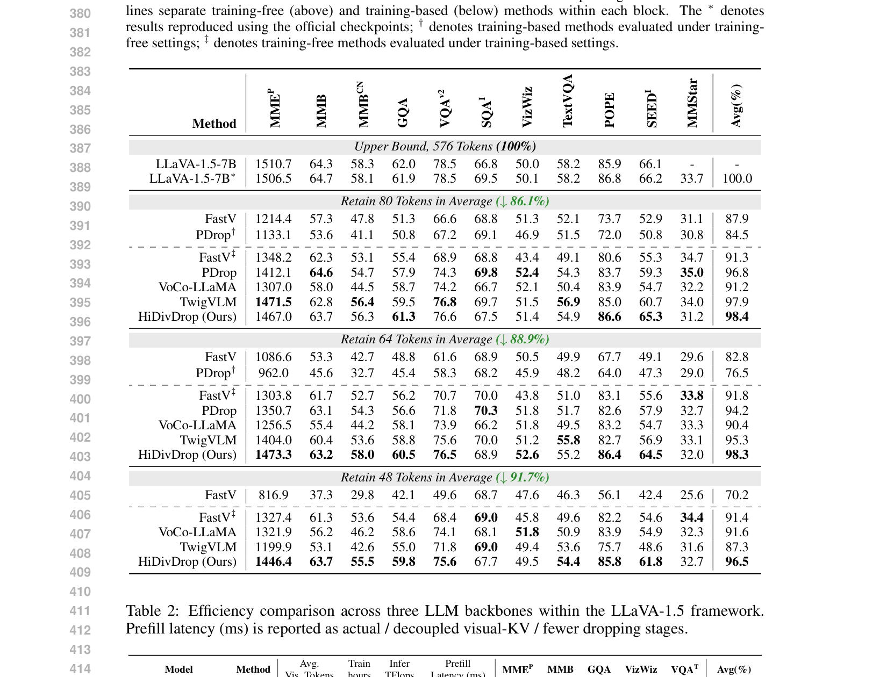
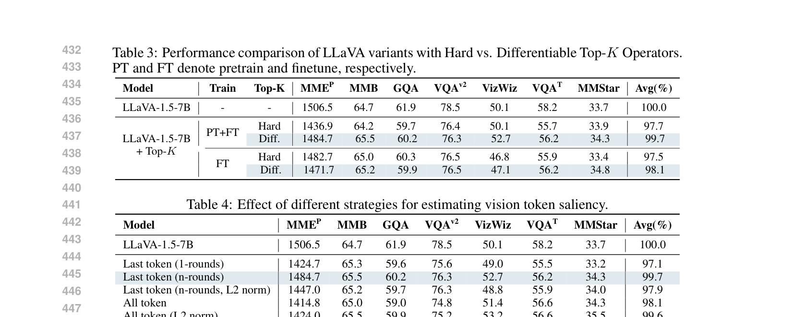
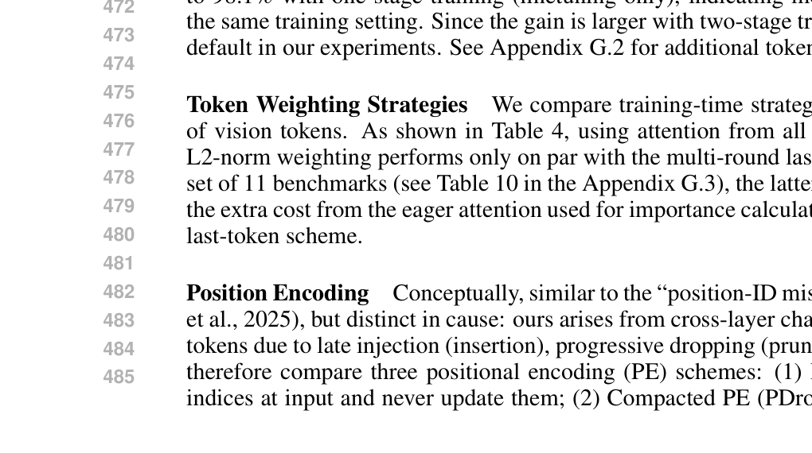
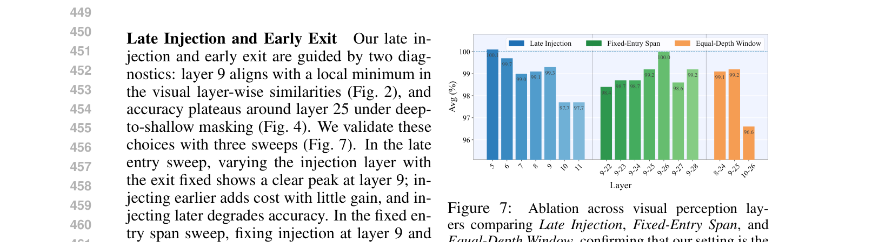
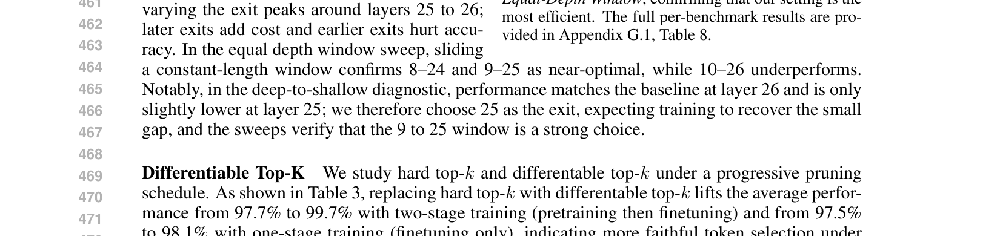
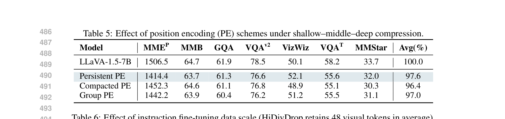
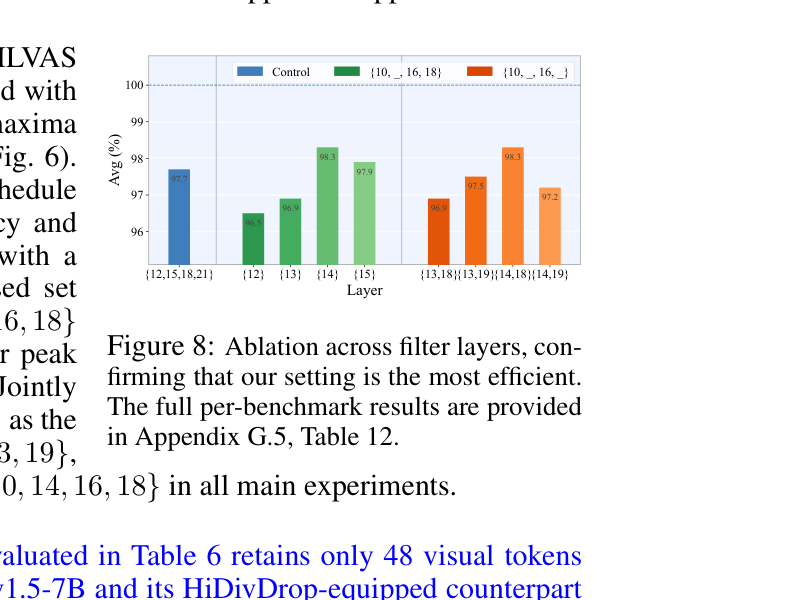
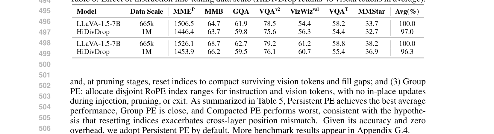

[← 返回 README](../README.md)

# 4. Experiment

## 📌 预览
在LLaVA-1.5框架下（2.7B/7B/13B三个backbone），11个benchmark上验证。HiDivDrop在88.9%压缩率下保持98.3%性能，训练加速1.72×。

---

## 4.1 Experimental Settings

**Models**: Within the LLaVA-1.5 architecture (Liu et al., 2023a), we verify the effectiveness of the proposed HiDivDrop with three different LLM backbones: MobileLLaMA-2.7B (Wu et al., 2024), Vicuna-7B-v1.5, and Vicuna-13B-v1.5 (Zheng et al., 2023).

**Benchmarks**: To thoroughly evaluate the HiDivDrop, we conduct experiments on 11 mainstream benchmarks, including MMEP (Fu et al., 2023), MMB, MMBCN (Liu et al., 2025), GQA (Hudson & Manning, 2019), VQAv2 (Goyal et al., 2017), SQAI (Lu et al., 2022), VizWiz (Gurari et al., 2018), TextVQA (Singh et al., 2019), POPE (Li et al., 2023), SEEDI (Li et al., 2024a), and MMStar (Chen et al., 2024c). Notably, MMStar is characterized by strong visual dependency and minimal data leakage.

**Efficiency Evaluation**: We consider the efficiency in both training and inference following PDrop. For training, we report real GPU hours on the same device; for inference, we report FLOPs for vision token part. Specifically, for a Transformer block, the FLOPs from MHA and FFN are 4nd² + 2n²d + 3ndm, where n is the number of vision tokens, d is the hidden size, and m is the FFN intermediate dimension.

**Implementation Details**: For DTop-K operation, we set the temperature λ = Nv. For LLaVA-1.5-7B, we adopt late injection layer Linj = 9, early exit layer Lexit = 25, and filtering layers F = {10, 14, 16, 18}. For LLaVA-1.5-MobileLLaMA-2.7B, we use Linj = 15, Lexit = 28, and F = {16, 19, 22, 25}. All experiments are conducted on 8 NVIDIA A100 40 GB GPUs.

> 💡 **实验设置要点**:
> - 不同backbone的参数配置不同（7B: Linj=9, 2.7B: Linj=15）——说明三层结构依赖于backbone
> - 11个benchmark覆盖面广：感知(MMEP)、推理(GQA)、OCR(TextVQA)、幻觉(POPE)等
> - 效率评估包含训练时间和推理FLOPs两个维度

---

## 4.2 Main Results

### Comparison with State-of-the-art Methods

*Table 1: Performance comparisons with three pruning ratios on 11 benchmarks. All methods are applied on the same base model LLaVA-1.5-7B.*

> 💡 **Table 1 批读 — 三个压缩率下的性能对比**:
> 
> **↓86.1% (保留80 tokens)**:
> - HiDivDrop: 98.4% avg → 最佳
> - TwigVLM: 97.9% → 次佳
> - PDrop: 96.8% → 训练后
> - FastV: 87.9% → training-free最差
> 
> **↓88.9% (保留64 tokens)**:
> - HiDivDrop: **98.3%** → 压缩率更高但性能几乎不变！
> - PDrop: 94.2% → 差距拉大到4.1%
> - TwigVLM: 95.3%
> 
> **↓91.7% (保留48 tokens)**:
> - HiDivDrop: **96.5%** → 仍然很强
> - TwigVLM: 87.3% → 急剧下降
> - PDrop: 无法达到这个压缩率
> 
> **关键观察**:
> 1. HiDivDrop在高压缩率下优势越明显（越激进越好）
> 2. Training-free方法（FastV†）在有训练的情况下反而更差
> 3. HiDivDrop的POPE分数特别高（86.4 vs 82.7），说明减少幻觉效果好

---

### Efficiency of HiDivDrop in Training & Inference

*Table 2: Efficiency comparison across three LLM backbones within the LLaVA-1.5 framework.*

> 💡 **Table 2 批读 — 效率对比**:
> 
> **LLaVA-1.5-7B**:
> | 指标 | Vanilla | PDrop | HiDivDrop |
> |------|---------|-------|-----------|
> | Avg Vision Tokens | 576 | 270 | **64** |
> | Train hours | 159.3 | 107.3 | **94.4** |
> | Infer TFLOPs | 3.82 | 1.78 | **0.42** |
> | Prefill latency | 63.6ms | 43.7ms | **32.6/31.8/28.8ms** |
> | Performance | 100% | 100.2% | **98.6%** |
> 
> - 训练加速: 159.3 → 94.4 = **1.69×**（接近论文claim的1.72×）
> - FLOPs减少: 3.82T → 0.42T = **9.1×**！
> - 性能下降仅1.4%，但效率提升惊人
> - Prefill latency还能通过parallel decoupling进一步降低
> 
> **跨backbone一致性**: 2.7B、7B、13B都显示类似趋势，说明方法是通用的

---

## 4.3 Ablation Studies

### Late Injection and Early Exit

*Figure 7: Ablation across visual perception layers comparing Late Injection, Fixed-Entry Span, and Equal-Depth Window.*

> 💡 **Figure 7 批读**:
> - **Late Injection sweep**: Layer 9最优（100.1% normalized），Layer 5也不错但浪费计算
> - **Fixed-Entry Span**: 固定注入Layer 9，exit在Layer 25-26最优
> - **Equal-Depth Window**: 9-25最优，10-26明显下降
> - 结论：**Layer 9-25是最佳vision processing window**

### Differentiable Top-K

*Table 3: Performance comparison of LLaVA variants with Hard vs. Differentiable Top-K Operators.*

> 💡 **Table 3 批读**:
> - **PT+FT (两阶段训练)**: Hard 97.7% → Diff 99.7% （提升2%）
> - **FT only (单阶段)**: Hard 97.5% → Diff 98.1% （提升0.6%）
> - 两阶段训练下DTop-K优势更大
> - 说明DTop-K在pretrain阶段就能学到更好的token importance分布

### Token Weighting Strategies

*Table 4: Effect of different strategies for estimating vision token saliency.*

> 💡 **Table 4 批读**:
> - **Last token (n-rounds)**: 99.7% — 最佳
> - **All token (L2 norm)**: 99.6% — 接近但计算成本更高
> - 结论：用last text token的multi-round attention就够了，不需要all token attention
> - 这和FastV等方法用CLS token或last token的做法类似

### Position Encoding

*Table 5: Effect of position encoding (PE) schemes under shallow–middle–deep compression.*

> 💡 **Table 5 批读**:
> - **Persistent PE**: 97.6% → 最佳
> - **Group PE**: 97.0%
> - **Compacted PE (PDrop风格)**: 96.4% → 最差
> - 重置position ID会加剧跨层position mismatch
> - Persistent PE零额外开销，简单有效

### Filtering Layer Selection

*Figure 8: Ablation across filter layers.*

> 💡 **Figure 8 批读**:
> - ILVAS选出的{10,14,16,18}确实是最优的(98.3%)
> - 对照组{12,15,18,21}: 97.7%
> - 把14替换成12或13都会下降
> - 说明ILVAS指标是有效的filtering layer选择工具

### Training Data Scale

*Table 6: Effect of instruction fine-tuning data scale.*

> 💡 **Table 6 批读**:
> - 数据从665k增加到1M时，HiDivDrop仍然受益
> - 性能差距稳定在3.0-3.7%，不随数据规模增大而恶化
> - 说明HiDivDrop的压缩设计与instruction tuning兼容

---

## 🔖 Section 总结

### 关键数字速查
| 指标 | 数值 |
|------|------|
| 压缩率 88.9% 下性能保持 | 98.3% |
| 压缩率 91.7% 下性能保持 | 96.5% |
| 训练加速 (7B) | 1.69× (159.3→94.4h) |
| 推理FLOPs减少 (7B) | 9.1× (3.82T→0.42T) |
| Prefill延迟降低 | 48.7% (63.6→32.6ms) |
| DTop-K vs Hard Top-K | +2.0% (PT+FT) |
| 最优injection layer | 9 |
| 最优exit layer | 25 |
| 最优filtering layers | {10, 14, 16, 18} |

### 核心洞察
1. HiDivDrop在高压缩率下优势越明显——说明层级分治是正确的方向
2. DTop-K在两阶段训练下效果最好
3. Persistent PE简单有效，PDrop的Compacted PE反而有害
4. 方法跨backbone通用（2.7B/7B/13B）
